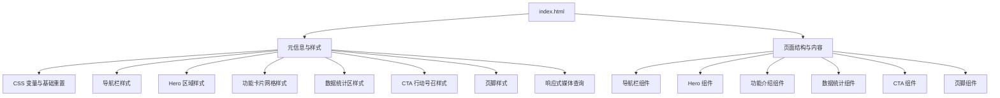
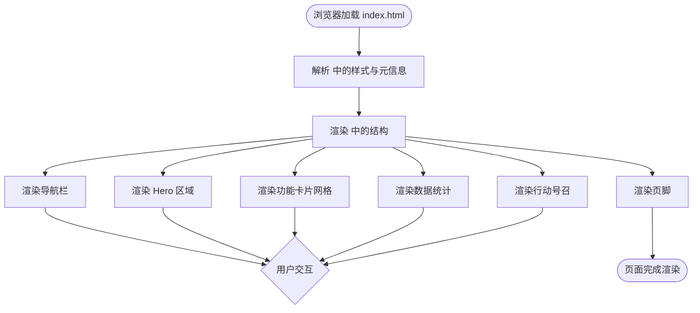
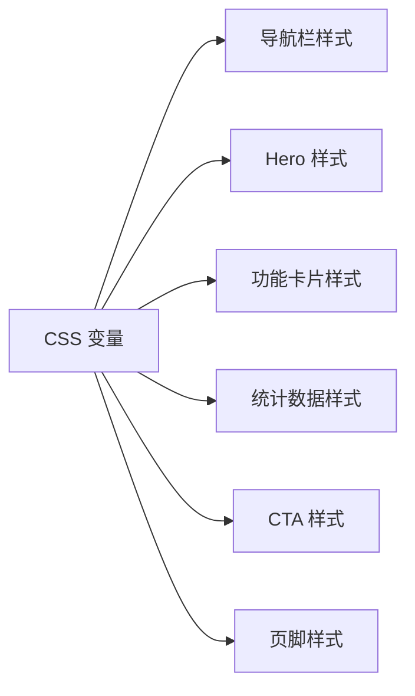

# 文件结构说明

<cite>
**本文引用的文件**
- [index.html](file://index.html)
</cite>

## 目录
1. [简介](#简介)
2. [项目结构](#项目结构)
3. [核心组件](#核心组件)
4. [架构总览](#架构总览)
5. [详细组件分析](#详细组件分析)
6. [依赖关系分析](#依赖关系分析)
7. [性能考量](#性能考量)
8. [故障排查指南](#故障排查指南)
9. [结论](#结论)
10. [附录](#附录)

## 简介
本项目采用单文件架构，所有页面结构、样式与内容均集中在一个 HTML 文件中。该方式便于快速原型、演示与分发，适合小型落地页、活动页或轻量营销页面。文档将围绕 index.html 的内部结构展开，解释其 HTML5 文档结构、内联 CSS 样式系统、页面组件布局与内容组织方式，并给出如何理解与修改该项目的实践建议。

## 项目结构
- 仓库根目录仅包含一个入口文件：index.html。
- 该文件同时承担“结构（HTML）+ 样式（CSS）”的职责，无外部资源依赖（如独立 CSS/JS 文件或图片），通过内联样式实现完整视觉呈现。

图表来源
- [index.html:1-287](file://index.html#L1-L287)

章节来源
- [index.html:1-287](file://index.html#L1-L287)

## 核心组件
- 导航栏（Navbar）：固定顶部、毛玻璃背景、品牌标识与导航链接、主按钮。
- Hero 区域：主标题、副标题、双按钮（主要与次要）。
- 功能介绍（Features）：网格化卡片展示，图标、标题与描述。
- 数据统计（Stats）：关键指标数字与说明。
- 行动号召（CTA）：高对比背景、引导注册/试用。
- 页脚（Footer）：多列链接与版权信息。

这些组件在视觉上形成自上而下的阅读流，符合常见的落地页布局范式。

章节来源
- [index.html:145-283](file://index.html#L145-L283)

## 架构总览
本项目的“架构”体现在单一文件内的职责划分：
- 文档头（<head>）：定义字符集、视口、标题与全部样式。
- 文档体（<body>）：按语义化标签组织页面区块，使用类名驱动样式。
- 样式系统：基于 CSS 自定义属性（变量）统一主题色、字号、圆角等；通过模块化注释分隔不同组件的样式块；使用现代布局（Flex/Grid）与媒体查询实现响应式。

图表来源
- [index.html:1-287](file://index.html#L1-L287)

## 详细组件分析

### 导航栏（Navbar）
- 结构：容器包裹品牌标识、导航链接与主按钮。
- 样式要点：粘性定位、半透明背景与模糊效果、边框分割；悬停变色；按钮样式复用。
- 可维护性：通过统一的 CSS 变量控制颜色与尺寸，便于全局换肤。

章节来源
- [index.html:27-50](file://index.html#L27-L50)
- [index.html:145-157](file://index.html#L145-L157)

### Hero 区域
- 结构：居中排版的主标题、副标题与两个操作按钮。
- 样式要点：渐变背景、大字号标题、间距与对齐；按钮组合用于主次行为区分。
- 交互提示：可通过锚点跳转至 CTA 或功能区域。

章节来源
- [index.html:51-60](file://index.html#L51-L60)
- [index.html:159-169](file://index.html#L159-L169)

### 功能介绍（Features）
- 结构：标题区 + 网格卡片列表，每张卡片含图标、标题与描述。
- 样式要点：Grid 自适应列数；卡片阴影与悬浮动效；图标容器配色与尺寸统一。
- 扩展建议：如需增加卡片，复制卡片结构并调整文案即可。

章节来源
- [index.html:62-87](file://index.html#L62-L87)
- [index.html:171-211](file://index.html#L171-L211)

### 数据统计（Stats）
- 结构：统计项网格，每项包含数值与说明。
- 样式要点：居中对齐、强调数值字体大小与颜色。
- 数据更新：直接修改文本节点即可。

章节来源
- [index.html:89-97](file://index.html#L89-L97)
- [index.html:213-235](file://index.html#L213-L235)

### 行动号召（CTA）
- 结构：标题、说明文字与主按钮。
- 样式要点：高对比背景与白色按钮，突出转化目标。
- 跳转逻辑：当前为锚点占位，可按需替换为实际链接。

章节来源
- [index.html:99-109](file://index.html#L99-L109)
- [index.html:237-244](file://index.html#L237-L244)

### 页脚（Footer）
- 结构：四列网格（品牌介绍 + 产品/资源/公司链接）+ 底部版权行。
- 样式要点：深色背景、浅色文字、链接悬停高亮；响应式下自动折行。
- 可维护性：链接列表以无序列表组织，易于增删。

章节来源
- [index.html:111-133](file://index.html#L111-L133)
- [index.html:246-283](file://index.html#L246-L283)

### 样式系统与主题
- 主题变量：集中定义主色、深色变体、文本色、背景色、边框色与圆角，便于全局一致性。
- 基础重置：统一边距、盒模型与默认样式，减少跨浏览器差异。
- 布局策略：大量使用 Flexbox 与 Grid，结合 minmax 与 auto-fit 实现自适应网格。
- 响应式：通过媒体查询在小屏隐藏导航菜单、调整网格列数与字号。

章节来源
- [index.html:8-19](file://index.html#L8-L19)
- [index.html:135-140](file://index.html#L135-L140)

## 依赖关系分析
- 内部依赖：各组件通过类名与 CSS 选择器耦合，样式模块之间通过 CSS 变量共享主题。
- 外部依赖：无外链样式或脚本；图标使用 Unicode 字符，无需额外资源。
- 潜在风险：单文件体积增长后会影响可读性与维护成本；未来若引入 JS 交互，需评估是否拆分文件。

图表来源
- [index.html:8-19](file://index.html#L8-L19)
- [index.html:27-133](file://index.html#L27-L133)

章节来源
- [index.html:8-19](file://index.html#L8-L19)
- [index.html:27-133](file://index.html#L27-L133)

## 性能考量
- 优点
  - 零网络开销：无外部资源请求，首屏加载极快。
  - 缓存友好：单文件易被浏览器缓存。
  - 简单部署：可直接静态托管。
- 注意事项
  - 可访问性：确保语义化标签与足够的对比度。
  - 可扩展性：随着功能增多，考虑拆分为独立 CSS/JS 以提升可维护性。
  - 图片与图标：当前使用 Unicode 图标，若后续引入图片，需优化压缩与懒加载。

[本节为通用指导，不直接分析具体代码]

## 故障排查指南
- 样式未生效
  - 检查类名是否与 CSS 中一致，避免拼写错误。
  - 确认 CSS 变量是否正确定义且未被覆盖。
- 布局错乱
  - 检查容器宽度与 padding 设置，确认栅格断点是否合适。
  - 在小屏幕下注意导航菜单隐藏逻辑与网格折行。
- 链接跳转异常
  - 核对锚点 id 与 href 是否匹配。
  - 确保目标元素存在且可见。
- 移动端显示问题
  - 检查媒体查询断点与字体大小缩放。
  - 验证触摸目标尺寸是否符合可点击要求。

章节来源
- [index.html:135-140](file://index.html#L135-L140)
- [index.html:145-283](file://index.html#L145-L283)

## 结论
该单文件项目以极简的方式实现了完整的落地页，具备快速交付与低运维成本的优势。通过清晰的组件划分与统一的样式系统，开发者可以高效地进行内容与样式的修改。对于更复杂的应用场景，建议在保持现有设计原则的基础上，逐步将样式与脚本拆分到独立文件，以提升可维护性与团队协作效率。

[本节为总结性内容，不直接分析具体代码]

## 附录

### 为什么选择单文件架构
- 优点
  - 快速原型与演示：无需构建流程，打开即用。
  - 部署简单：单个文件即可发布。
  - 学习成本低：结构直观，便于初学者理解。
- 缺点
  - 可维护性受限：文件变大后难以定位与复用。
  - 协作困难：多人同时编辑同一文件易冲突。
  - 扩展性不足：难以引入模块化与工程化工具链。
- 适用场景
  - 活动页、产品着陆页、个人作品集、临时演示页面。
  - 对 SEO 与首屏性能敏感但功能简单的页面。

[本节为概念性内容，不直接分析具体代码]

### 如何理解和修改该项目
- 定位结构
  - 在 <body> 中按区块查找对应 section，修改文案与链接。
- 调整样式
  - 在 <style> 中按注释分块定位样式，优先修改 CSS 变量以统一主题。
- 新增组件
  - 复制现有组件结构，赋予新类名并在 <style> 中添加对应样式。
- 响应式适配
  - 在媒体查询中调整布局与字号，确保小屏体验。

章节来源
- [index.html:8-19](file://index.html#L8-L19)
- [index.html:145-283](file://index.html#L145-L283)