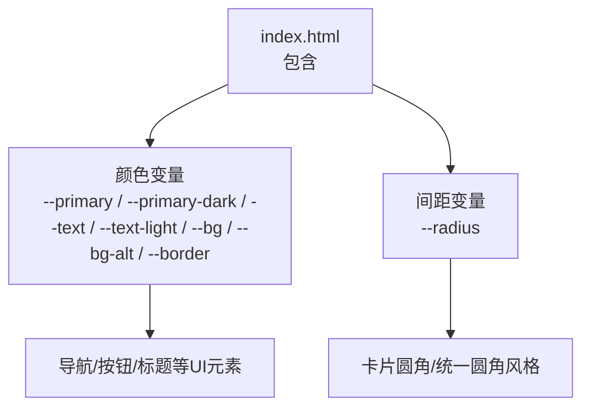
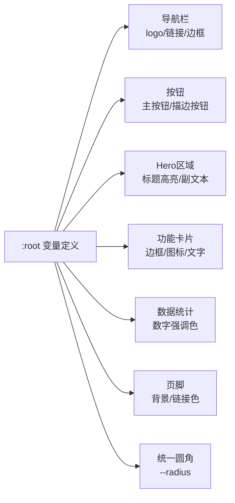
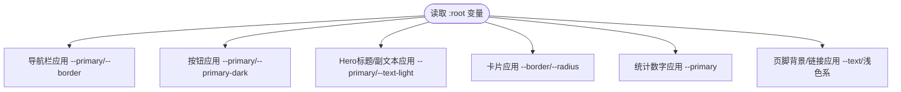
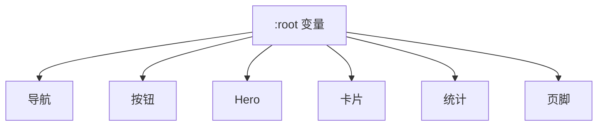

# CSS变量系统

<cite>
**本文引用的文件**
- [index.html](file://index.html)
</cite>

## 目录
1. [简介](#简介)
2. [项目结构](#项目结构)
3. [核心组件](#核心组件)
4. [架构总览](#架构总览)
5. [详细组件分析](#详细组件分析)
6. [依赖关系分析](#依赖关系分析)
7. [性能考量](#性能考量)
8. [故障排查指南](#故障排查指南)
9. [结论](#结论)
10. [附录：主题定制与扩展实践](#附录：主题定制与扩展实践)

## 简介
本文件系统化文档化当前项目中的CSS自定义属性（CSS变量）体系，聚焦于在:root中定义的颜色与间距变量，包括--primary、--primary-dark、--text、--text-light、--bg、--bg-alt、--border以及--radius。文档将解释每个变量的语义命名、设计原则、使用场景与扩展方法，并提供主题定制指南，帮助快速创建新的品牌配色方案。

## 项目结构
本项目为单页HTML文件，样式以<style>内联方式组织，所有CSS变量集中声明在:root选择器中，便于全局复用与主题切换。页面通过类名组织各模块（导航、Hero、功能卡片、统计、CTA、页脚），并在多处引用这些变量实现一致的品牌视觉。

图表来源
- [index.html:10-19](file://index.html#L10-L19)

章节来源
- [index.html:1-287](file://index.html#L1-L287)

## 核心组件
- 颜色变量
  - --primary：主色调，用于强调、链接悬停、关键按钮背景等
  - --primary-dark：主色深色变体，用于hover状态或需要更高对比度的强调
  - --text：正文文本色，保证可读性
  - --text-light：次要文本色，用于描述、辅助信息
  - --bg：主背景色，通常为浅色或白色
  - --bg-alt：次级背景色，用于区块区分、卡片底色等
  - --border：边框与分割线色，保持界面层次清晰
- 间距变量
  - --radius：统一圆角半径，提升整体一致性

这些变量在:root中集中声明，并通过var()在全局范围内引用，形成单一事实源，便于维护与主题替换。

章节来源
- [index.html:10-19](file://index.html#L10-L19)

## 架构总览
以下图展示了变量如何从根作用域流向具体UI组件，体现“集中定义、广泛复用”的设计。

图表来源
- [index.html:10-19](file://index.html#L10-L19)
- [index.html:27-49](file://index.html#L27-L49)
- [index.html:52-66](file://index.html#L52-L66)
- [index.html:67-87](file://index.html#L67-L87)
- [index.html:89-97](file://index.html#L89-L97)
- [index.html:112-126](file://index.html#L112-L126)

## 详细组件分析

### 颜色变量语义与设计原则
- 主色调族
  - --primary：品牌主色，用于强强调元素（如主要按钮、链接悬停、标题高亮）
  - --primary-dark：主色的深色态，常用于交互反馈（如hover）以提升可访问性与层次感
- 文本色族
  - --text：默认正文色，确保长文阅读舒适
  - --text-light：次要文本色，用于说明、注释、弱化信息
- 背景色族
  - --bg：主背景，提供干净的基础画布
  - --bg-alt：次级背景，用于分区、卡片底色，制造层级差异
- 边框色族
  - --border：用于分隔线与边框，维持视觉秩序

设计原则
- 语义化命名：以用途而非具体色值命名，便于主题替换
- 可访问性：文本与背景需满足对比度要求；强调色用于关键操作
- 一致性：全站点共用同一套变量，避免碎片化

章节来源
- [index.html:10-19](file://index.html#L10-L19)

### 间距变量：--radius
- 用途：统一卡片、按钮、图标容器等的圆角半径，塑造一致的视觉语言
- 建议：根据品牌调性调整大小，过大可能显得臃肿，过小则缺乏柔和感

章节来源
- [index.html:10-19](file://index.html#L10-L19)

### 变量在各模块的使用映射
- 导航栏
  - logo与链接悬停使用--primary
  - 底部边框使用--border
- 按钮
  - 主按钮背景使用--primary，hover使用--primary-dark
  - 描边按钮边框与文字使用--primary
- Hero区域
  - 标题高亮使用--primary
  - 副文本使用--text-light
- 功能卡片
  - 卡片边框使用--border，图标与强调使用--primary
  - 卡片圆角使用--radius
- 数据统计
  - 数字强调使用--primary
- 页脚
  - 背景使用--text（深底模式），链接与文案使用浅灰系（与--text-light理念一致）

章节来源
- [index.html:27-49](file://index.html#L27-L49)
- [index.html:52-66](file://index.html#L52-L66)
- [index.html:67-87](file://index.html#L67-L87)
- [index.html:89-97](file://index.html#L89-L97)
- [index.html:112-126](file://index.html#L112-L126)

### 使用流程图（变量到样式）

图表来源
- [index.html:10-19](file://index.html#L10-L19)
- [index.html:27-49](file://index.html#L27-L49)
- [index.html:52-66](file://index.html#L52-L66)
- [index.html:67-87](file://index.html#L67-L87)
- [index.html:89-97](file://index.html#L89-L97)
- [index.html:112-126](file://index.html#L112-L126)

## 依赖关系分析
- 变量是样式的最小依赖单元，所有组件均依赖:root定义的变量
- 组件之间无直接耦合，仅通过变量间接关联，降低修改成本
- 若需新增主题，只需覆盖:root中的变量即可，无需改动组件样式

图表来源
- [index.html:10-19](file://index.html#L10-L19)

章节来源
- [index.html:10-19](file://index.html#L10-L19)

## 性能考量
- 变量解析开销极低，浏览器会缓存计算后的最终值
- 集中管理减少重复色值，利于构建优化与缓存命中
- 合理分组变量有助于按需加载与主题切换时的最小重绘

## 故障排查指南
- 变量未生效
  - 检查是否在:root中正确定义
  - 确认引用处使用了正确的var(--name)语法
- 颜色对比度不足
  - 调整--text与--bg的明暗关系，确保可读性
  - 对强调色--primary进行深浅搭配，必要时引入--primary-dark
- 圆角不一致
  - 统一使用--radius，避免硬编码不同数值
- 主题切换异常
  - 确保新主题的变量覆盖了所有必要项，避免缺失导致回退到默认值

章节来源
- [index.html:10-19](file://index.html#L10-L19)

## 结论
该CSS变量系统通过语义化的命名与集中式定义，实现了跨组件的一致性与可维护性。颜色与间距变量清晰分工，既满足品牌表达，又兼顾可访问性与扩展性。基于此体系，可快速生成多套主题并保持一致的视觉体验。

## 附录：主题定制与扩展实践

### 主题定制步骤
- 在:root中覆盖变量值，例如更换--primary与--primary-dark以改变品牌主色
- 调整--text与--text-light以匹配新的文本对比策略
- 更新--bg与--bg-alt以适配新的背景层次
- 微调--border以强化或弱化分割线
- 根据需要调整--radius以获得更契合品牌的圆角风格

### 变量清单与用途速查
- --primary：主强调色（按钮、链接悬停、标题高亮）
- --primary-dark：主强调色深色态（hover、焦点态）
- --text：正文文本色
- --text-light：次要文本色
- --bg：主背景色
- --bg-alt：次级背景色
- --border：边框与分割线色
- --radius：统一圆角半径

### 实际使用示例（路径指引）
- 导航栏使用变量
  - 参考路径：[index.html:27-49](file://index.html#L27-L49)
- 按钮使用变量
  - 参考路径：[index.html:41-49](file://index.html#L41-L49)
- Hero区域使用变量
  - 参考路径：[index.html:52-66](file://index.html#L52-L66)
- 功能卡片使用变量
  - 参考路径：[index.html:67-87](file://index.html#L67-L87)
- 数据统计使用变量
  - 参考路径：[index.html:89-97](file://index.html#L89-L97)
- 页脚使用变量
  - 参考路径：[index.html:112-126](file://index.html#L112-L126)

### 最佳实践
- 始终通过var()引用变量，避免硬编码颜色
- 为新业务模块继续复用现有变量，保持视觉一致性
- 如需新增语义化变量（如--success、--warning），请在:root中统一定义并遵循命名约定

章节来源
- [index.html:10-19](file://index.html#L10-L19)
- [index.html:27-49](file://index.html#L27-L49)
- [index.html:52-66](file://index.html#L52-L66)
- [index.html:67-87](file://index.html#L67-L87)
- [index.html:89-97](file://index.html#L89-L97)
- [index.html:112-126](file://index.html#L112-L126)