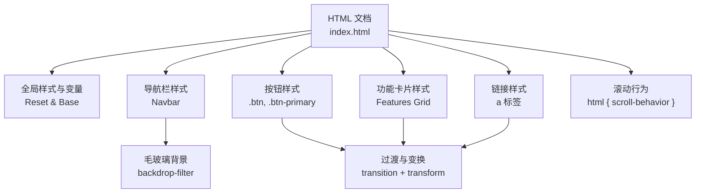
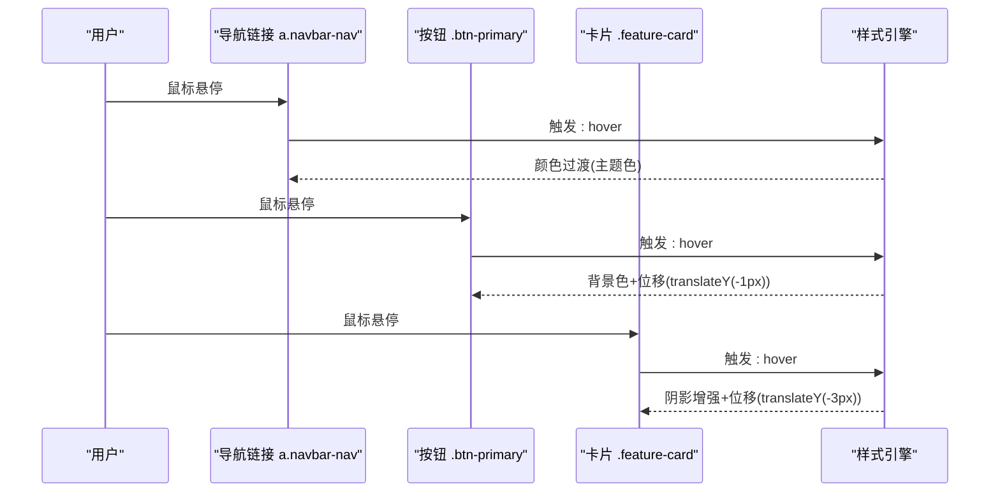
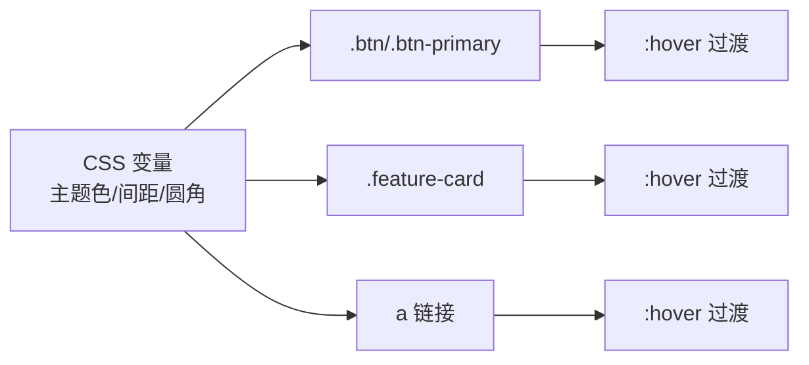

# 动画和交互效果

<cite>
**本文引用的文件**
- [index.html](file://index.html)
</cite>

## 目录
1. [简介](#简介)
2. [项目结构](#项目结构)
3. [核心组件](#核心组件)
4. [架构总览](#架构总览)
5. [详细组件分析](#详细组件分析)
6. [依赖关系分析](#依赖关系分析)
7. [性能注意事项](#性能注意事项)
8. [故障排查指南](#故障排查指南)
9. [结论](#结论)
10. [附录](#附录)

## 简介
本文件聚焦于页面中的动画与交互效果，系统性说明 CSS 过渡动画的实现方式与最佳实践。内容涵盖：
- 按钮悬停效果（.btn-primary:hover）
- 卡片悬停效果（.feature-card:hover）
- 链接颜色变化
- transform 微交互（translateY(-1px)、translateY(-3px)）
- transition 配置（时间函数与持续时间）
- backdrop-filter 毛玻璃效果的应用
- 平滑滚动（scroll-behavior: smooth）
- 避免重绘/重排的动画优化建议

## 项目结构
本项目为单页 HTML，所有样式内联在 <style> 中，通过类名组织不同区域的视觉与交互行为。关键区域包括导航栏、Hero、功能卡片网格、统计数据、行动号召区与页脚。

图表来源
- [index.html:7-141](file://index.html#L7-L141)

章节来源
- [index.html:7-141](file://index.html#L7-L141)

## 核心组件
- 按钮与主按钮
  - 基础按钮 .btn 定义了尺寸、圆角与通用过渡；主按钮 .btn-primary 使用主题色并在悬停时改变背景与位移。
  - 参考路径：[index.html:41-49](file://index.html#L41-L49)
- 功能卡片
  - .feature-card 定义卡片容器与默认阴影；悬停时提升阴影并轻微上移，形成“浮起”的反馈。
  - 参考路径：[index.html:72-79](file://index.html#L72-L79)
- 链接颜色变化
  - 导航与页脚链接在悬停时切换为主题色或高亮色，提供清晰的交互提示。
  - 参考路径：[index.html:39-40](file://index.html#L39-L40), [index.html:125-126](file://index.html#L125-L126)
- 毛玻璃导航栏
  - 导航栏背景半透明并使用 backdrop-filter 模糊，营造现代质感。
  - 参考路径：[index.html:27-32](file://index.html#L27-L32)
- 平滑滚动
  - 在 html 根元素启用平滑滚动，使锚点跳转更自然。
  - 参考路径：[index.html:20](file://index.html#L20)

章节来源
- [index.html:20-49](file://index.html#L20-L49)
- [index.html:72-79](file://index.html#L72-L79)
- [index.html:125-126](file://index.html#L125-L126)
- [index.html:27-32](file://index.html#L27-L32)

## 架构总览
从交互触发到视觉反馈的整体流程如下：

图表来源
- [index.html:39-40](file://index.html#L39-L40)
- [index.html:41-49](file://index.html#L41-L49)
- [index.html:72-79](file://index.html#L72-L79)

## 详细组件分析

### 按钮悬停效果（.btn-primary:hover）
- 交互目标：提升点击意图的可感知度，同时保持轻量反馈。
- 实现要点：
  - 使用 transition 对 background 与 transform 进行过渡，确保状态切换顺滑。
  - 悬停时背景色加深，并通过 translateY(-1px) 产生轻微抬升感。
  - 参考路径：[index.html:41-49](file://index.html#L41-L49)
- 复杂度与影响：
  - 仅对 background 与 transform 做过渡，避免触发昂贵属性（如 width/height），减少重排。
  - 小幅度位移（-1px）带来“可点击”的微反馈，不破坏布局。

章节来源
- [index.html:41-49](file://index.html#L41-L49)

### 卡片悬停效果（.feature-card:hover）
- 交互目标：突出当前卡片，提供“浮起”的立体感。
- 实现要点：
  - 使用 box-shadow 增强阴影，配合 translateY(-3px) 提升卡片。
  - 通过 transition 控制阴影与位移的过渡时长，保证流畅。
  - 参考路径：[index.html:72-79](file://index.html#L72-L79)
- 复杂度与影响：
  - 阴影与 transform 均为合成器友好属性，GPU 加速更顺畅。
  - 适度阴影强度避免过度绘制。

章节来源
- [index.html:72-79](file://index.html#L72-L79)

### 链接颜色变化
- 交互目标：明确指示可点击元素与当前焦点位置。
- 实现要点：
  - 导航与页脚链接在 :hover 时切换为主题色或高亮色，并设置短过渡。
  - 参考路径：[index.html:39-40](file://index.html#L39-L40), [index.html:125-126](file://index.html#L125-L126)
- 复杂度与影响：
  - 仅改变 color，几乎无重排开销，适合高频交互。

章节来源
- [index.html:39-40](file://index.html#L39-L40)
- [index.html:125-126](file://index.html#L125-L126)

### transform 微交互：translateY(-1px) 与 translateY(-3px)
- 设计意图：
  - 按钮使用 -1px 微位移，强调“可点击”而不显突兀。
  - 卡片使用 -3px 位移，强化“浮起”层级感。
- 技术要点：
  - 与 transition 配合，提供顺滑的状态切换。
  - 参考路径：[index.html:41-49](file://index.html#L41-L49), [index.html:72-79](file://index.html#L72-L79)
- 性能考量：
  - transform 由合成线程处理，通常不会触发重排，适合频繁动画。

章节来源
- [index.html:41-49](file://index.html#L41-L49)
- [index.html:72-79](file://index.html#L72-L79)

### transition 配置：时间函数与持续时间
- 当前实现：
  - 按钮与卡片均设置了较短的过渡时长（约 0.15s–0.25s），用于背景色、阴影与位移的平滑过渡。
  - 参考路径：[index.html:41-49](file://index.html#L41-L49), [index.html:72-79](file://index.html#L72-L79)
- 建议：
  - 使用 ease 或自定义 cubic-bezier 以获得自然的加速度曲线。
  - 将常用时长统一为设计令牌（如 0.15s/0.2s/0.25s），便于维护一致性。

章节来源
- [index.html:41-49](file://index.html#L41-L49)
- [index.html:72-79](file://index.html#L72-L79)

### backdrop-filter 毛玻璃效果
- 应用场景：
  - 导航栏使用半透明背景与 backdrop-filter: blur(12px)，在滚动内容经过时呈现磨砂质感。
  - 参考路径：[index.html:27-32](file://index.html#L27-L32)
- 注意事项：
  - 在低端设备上可能引起性能抖动，必要时可降级为纯色背景。
  - 与 sticky 定位结合使用时，注意 z-index 层级以避免遮挡。

章节来源
- [index.html:27-32](file://index.html#L27-L32)

### 平滑滚动（scroll-behavior: smooth）
- 作用：
  - 在 html 根元素启用后，锚点跳转（如 #features、#stats、#cta）将自动平滑滚动。
  - 参考路径：[index.html:20](file://index.html#L20)
- 兼容性：
  - 现代浏览器普遍支持；如需兼容旧版，可通过 JS 实现回退方案。

章节来源
- [index.html:20](file://index.html#L20)

## 依赖关系分析
- 样式耦合：
  - 按钮与卡片共享统一的 transition 风格，便于整体动效节奏一致。
  - 链接颜色变化与主题变量关联，确保品牌一致性。
- 外部依赖：
  - 未引入第三方库，全部为原生 CSS 实现，零运行时依赖。

图表来源
- [index.html:10-19](file://index.html#L10-L19)
- [index.html:39-49](file://index.html#L39-L49)
- [index.html:72-79](file://index.html#L72-L79)
- [index.html:125-126](file://index.html#L125-L126)

## 性能注意事项
- 优先使用 transform 与 opacity 进行动画，避免触发布局重排（如 width/height/top/left）。
- 控制阴影强度与范围，避免过度绘制导致卡顿。
- 合理设置 transition 时长与缓动函数，兼顾响应性与观感。
- backdrop-filter 在低端设备可能引发性能问题，可按需降级。
- 对于复杂动画，考虑使用 will-change 谨慎优化，但避免滥用。

## 故障排查指南
- 悬停无效果
  - 检查是否误覆盖了 :hover 规则或优先级冲突。
  - 确认 transition 属性作用于正确的属性（background、transform、box-shadow）。
- 动画卡顿
  - 检查是否存在大量重排属性（width/height/margin/padding）参与动画。
  - 评估 backdrop-filter 的性能影响，必要时降低模糊半径或移除。
- 滚动不平滑
  - 确认 html 层已设置 scroll-behavior: smooth。
  - 检查是否有 JS 拦截默认滚动行为。

## 结论
该页面通过简洁而一致的 CSS 过渡与变换，实现了高质量的交互体验：按钮与卡片的悬停反馈清晰自然，链接颜色变化直观易识别，导航栏的毛玻璃效果提升了现代感，平滑滚动增强了导航体验。遵循 transform/opacity 优先、控制阴影强度、统一过渡时长等最佳实践，可在大多数设备上获得稳定流畅的动画表现。

## 附录
- 相关代码片段路径
  - 按钮与主按钮过渡与变换：[index.html:41-49](file://index.html#L41-L49)
  - 功能卡片悬停阴影与位移：[index.html:72-79](file://index.html#L72-L79)
  - 导航与页脚链接颜色过渡：[index.html:39-40](file://index.html#L39-L40), [index.html:125-126](file://index.html#L125-L126)
  - 导航栏毛玻璃效果：[index.html:27-32](file://index.html#L27-L32)
  - 平滑滚动配置：[index.html:20](file://index.html#L20)