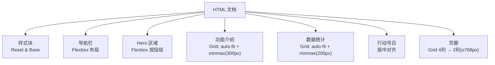
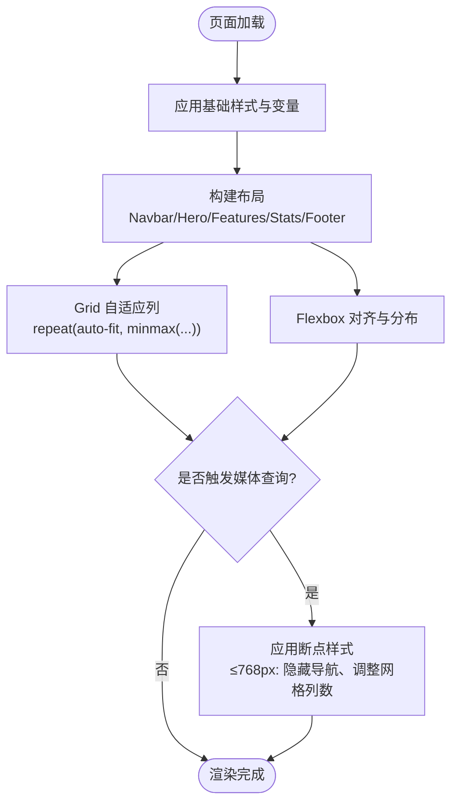
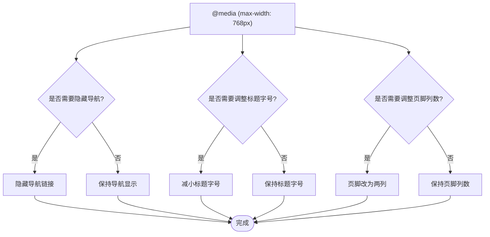
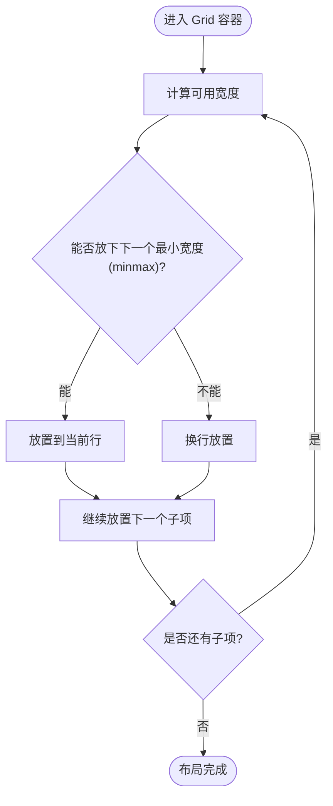
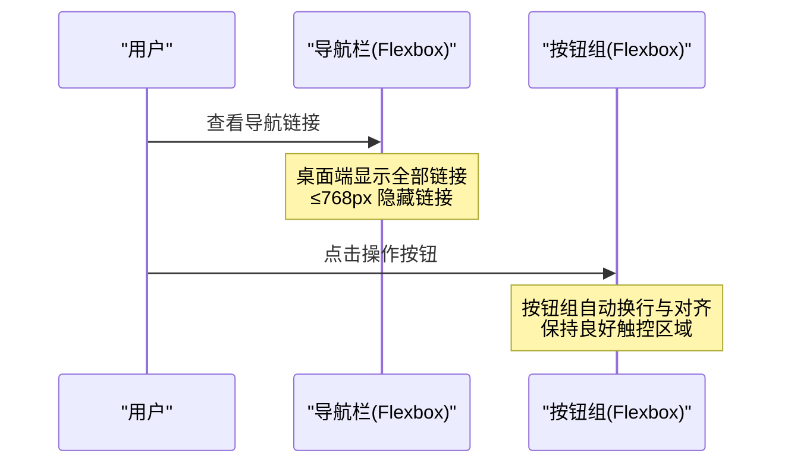
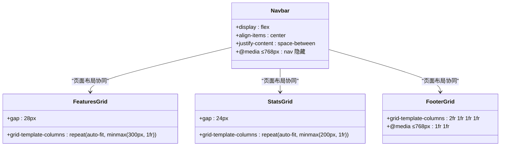
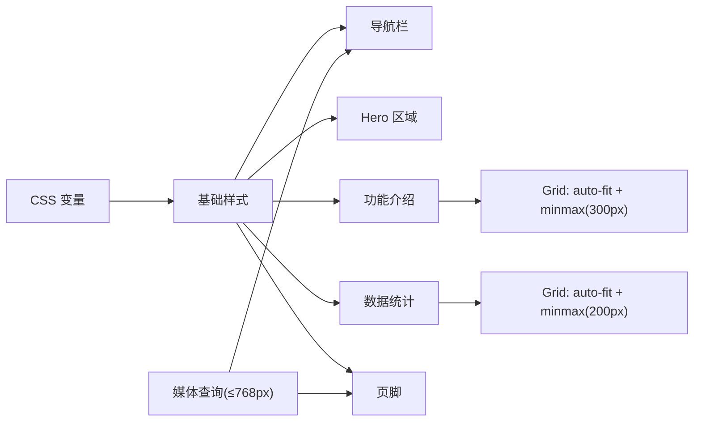

# 响应式设计实现

<cite>
**本文引用的文件**
- [index.html](file://index.html)
</cite>

## 目录
1. [简介](#简介)
2. [项目结构](#项目结构)
3. [核心组件](#核心组件)
4. [架构总览](#架构总览)
5. [详细组件分析](#详细组件分析)
6. [依赖关系分析](#依赖关系分析)
7. [性能考虑](#性能考虑)
8. [故障排查指南](#故障排查指南)
9. [结论](#结论)
10. [附录](#附录)

## 简介
本文件围绕移动优先的响应式设计策略，系统阐述媒体查询的使用方式、CSS Grid 与 Flexbox 在页面中的实践，以及断点（768px）下的样式调整。重点说明 features-grid 与 stats-grid 中 repeat(auto-fit, minmax()) 的自适应列布局，导航栏与按钮组的 Flexbox 应用，以及不同屏幕尺寸下的布局适配策略（如导航菜单隐藏、网格列数自适应）。文末提供最佳实践与性能优化建议，帮助在不同设备上获得一致且高效的体验。

## 项目结构
该页面为单页 HTML，所有样式内联于 <style> 块中，包含以下关键区域：
- 导航栏（navbar）：使用 Flexbox 进行水平排列与对齐
- Hero 区域：标题与操作按钮组采用 Flexbox 居中与换行
- 功能介绍（features）：使用 CSS Grid 的 repeat(auto-fit, minmax(300px, 1fr)) 实现自适应列
- 数据统计（stats）：使用 CSS Grid 的 repeat(auto-fit, minmax(200px, 1fr)) 实现自适应列
- 行动号召（cta）：文本与按钮居中对齐
- 页脚（footer）：桌面端四列网格，移动端通过媒体查询调整为两列

图表来源
- [index.html:27-50](file://index.html#L27-L50)
- [index.html:67-71](file://index.html#L67-L71)
- [index.html:91-95](file://index.html#L91-L95)
- [index.html:117-122](file://index.html#L117-L122)
- [index.html:136-140](file://index.html#L136-L140)

章节来源
- [index.html:1-287](file://index.html#L1-L287)

## 核心组件
- 导航栏（Navbar）
  - 使用 Flexbox 将 Logo、导航链接与主按钮横向排列并两端对齐
  - 在 ≤768px 时隐藏导航链接，为后续移动端菜单预留空间
- Hero 区域
  - 标题与描述文字居中，操作按钮组使用 Flexbox 支持自动换行与间距控制
- 功能介绍（Features Grid）
  - 使用 grid-template-columns: repeat(auto-fit, minmax(300px, 1fr)) 实现卡片列数随容器宽度自适应
- 数据统计（Stats Grid）
  - 使用 grid-template-columns: repeat(auto-fit, minmax(200px, 1fr)) 实现统计项列数自适应
- 页脚（Footer Grid）
  - 桌面端 4 列；在 ≤768px 时切换为 2 列，提升小屏可读性

章节来源
- [index.html:27-50](file://index.html#L27-L50)
- [index.html:67-71](file://index.html#L67-L71)
- [index.html:91-95](file://index.html#L91-L95)
- [index.html:117-122](file://index.html#L117-L122)
- [index.html:136-140](file://index.html#L136-L140)

## 架构总览
整体采用“移动优先”的渐进增强思路：
- 基础样式定义全局变量、重置与排版
- 默认样式针对移动端与小屏设备优化
- 通过媒体查询逐步增强至平板与桌面端
- 使用 CSS Grid 的 auto-fit + minmax 实现无断点的弹性列布局
- 使用 Flexbox 处理导航与按钮组的灵活排列

图表来源
- [index.html:67-71](file://index.html#L67-L71)
- [index.html:91-95](file://index.html#L91-L95)
- [index.html:136-140](file://index.html#L136-L140)

## 详细组件分析

### 移动优先与媒体查询（断点 768px）
- 设计策略
  - 以移动端为基准编写默认样式，确保在小屏上内容可阅读、交互可用
  - 通过 @media (max-width: 768px) 对特定元素进行增强或简化
- 具体调整
  - 标题字号缩小以提升信息密度
  - 导航链接在 ≤768px 时隐藏，避免拥挤
  - 页脚从 4 列切换为 2 列，改善小屏阅读体验

图表来源
- [index.html:136-140](file://index.html#L136-L140)

章节来源
- [index.html:136-140](file://index.html#L136-L140)

### CSS Grid 的响应式应用：features-grid 与 stats-grid
- 技术要点
  - features-grid 使用 repeat(auto-fit, minmax(300px, 1fr))，使卡片最小宽度为 300px，多余空间均分
  - stats-grid 使用 repeat(auto-fit, minmax(200px, 1fr))，使统计项最小宽度为 200px，自动换行与等宽分配
- 行为特征
  - 无需显式断点即可根据容器宽度自动增减列数
  - 当容器宽度不足以容纳下一列时，自动换行至新行

图表来源
- [index.html:67-71](file://index.html#L67-L71)
- [index.html:91-95](file://index.html#L91-L95)

章节来源
- [index.html:67-71](file://index.html#L67-L71)
- [index.html:91-95](file://index.html#L91-L95)

### Flexbox 在导航栏与按钮组中的应用
- 导航栏
  - 使用 Flexbox 将 Logo、导航链接与主按钮在同一行排列，并通过 justify-content 与 gap 控制间距与对齐
  - 在 ≤768px 时隐藏导航链接，减少小屏干扰
- 按钮组（Hero 区域）
  - 使用 Flexbox 将两个按钮并列展示，允许在小屏下自动换行并保持间距

图表来源
- [index.html:27-50](file://index.html#L27-L50)
- [index.html:60-61](file://index.html#L60-L61)
- [index.html:136-140](file://index.html#L136-L140)

章节来源
- [index.html:27-50](file://index.html#L27-L50)
- [index.html:60-61](file://index.html#L60-L61)
- [index.html:136-140](file://index.html#L136-L140)

### 不同屏幕尺寸下的布局适配策略
- 导航菜单隐藏逻辑
  - 在 ≤768px 时隐藏导航链接，避免在小屏上造成拥挤与误触
  - 建议后续扩展为汉堡菜单，保留导航可达性
- 网格列数的自适应调整
  - features-grid 与 stats-grid 通过 auto-fit + minmax 自动适应容器宽度，无需额外断点
  - 页脚在 ≤768px 时由 4 列切换为 2 列，提升信息密度与可读性

图表来源
- [index.html:27-50](file://index.html#L27-L50)
- [index.html:67-71](file://index.html#L67-L71)
- [index.html:91-95](file://index.html#L91-L95)
- [index.html:117-122](file://index.html#L117-L122)
- [index.html:136-140](file://index.html#L136-L140)

章节来源
- [index.html:27-50](file://index.html#L27-L50)
- [index.html:67-71](file://index.html#L67-L71)
- [index.html:91-95](file://index.html#L91-L95)
- [index.html:117-122](file://index.html#L117-L122)
- [index.html:136-140](file://index.html#L136-L140)

## 依赖关系分析
- 样式依赖
  - 全局变量（颜色、圆角等）被多处组件复用，保证视觉一致性
  - Reset 与基础排版影响所有组件的基础外观
- 布局依赖
  - Grid 与 Flexbox 共同协作：Grid 负责宏观列布局，Flexbox 负责局部对齐与分布
  - 媒体查询作为条件层，仅在需要时覆盖默认样式
- 组件耦合
  - 各区域相对独立，便于维护与扩展
  - 页脚网格与导航隐藏逻辑相互独立，互不影响

图表来源
- [index.html:10-24](file://index.html#L10-L24)
- [index.html:27-50](file://index.html#L27-L50)
- [index.html:67-71](file://index.html#L67-L71)
- [index.html:91-95](file://index.html#L91-L95)
- [index.html:117-122](file://index.html#L117-L122)
- [index.html:136-140](file://index.html#L136-L140)

章节来源
- [index.html:10-24](file://index.html#L10-L24)
- [index.html:27-50](file://index.html#L27-L50)
- [index.html:67-71](file://index.html#L67-L71)
- [index.html:91-95](file://index.html#L91-L95)
- [index.html:117-122](file://index.html#L117-L122)
- [index.html:136-140](file://index.html#L136-L140)

## 性能考虑
- 使用 CSS Grid 的 auto-fit + minmax 可减少媒体查询数量，降低样式复杂度与重排开销
- 媒体查询仅用于必要的状态切换（如隐藏导航、调整列数），避免过度拆分断点
- 合理使用 Flexbox 的对齐与分布能力，减少嵌套层级与复杂布局带来的性能损耗
- 保持样式集中与模块化，便于缓存与复用，提高首屏加载效率

[本节为通用指导，不直接分析具体文件]

## 故障排查指南
- 导航在小屏不可见
  - 检查是否在媒体查询中设置了 display: none 导致导航隐藏
  - 如需在小屏显示，需添加汉堡菜单或调整隐藏逻辑
- 网格列数异常
  - 确认 minmax 的最小值是否过大导致无法换行
  - 检查容器宽度与 gap 设置是否合理
- 按钮组在小屏换行异常
  - 检查 Flexbox 的 flex-wrap 与 gap 设置
  - 确保按钮最小宽度足够，避免挤压变形

章节来源
- [index.html:136-140](file://index.html#L136-L140)
- [index.html:67-71](file://index.html#L67-L71)
- [index.html:91-95](file://index.html#L91-L95)
- [index.html:60-61](file://index.html#L60-L61)

## 结论
本项目采用移动优先的响应式设计策略，结合 CSS Grid 的 auto-fit + minmax 与 Flexbox 的灵活布局，实现了在不同屏幕尺寸下的自适应表现。通过 768px 断点进行必要的样式增强（如隐藏导航、调整页脚列数），在保证小屏可用性的同时，充分利用大屏空间。遵循最佳实践与性能优化建议，可进一步提升用户体验与页面性能。

[本节为总结性内容，不直接分析具体文件]

## 附录
- 关键实现位置参考
  - 导航栏与按钮组：[index.html:27-50](file://index.html#L27-L50)
  - Hero 按钮组：[index.html:60-61](file://index.html#L60-L61)
  - 功能介绍网格：[index.html:67-71](file://index.html#L67-L71)
  - 数据统计网格：[index.html:91-95](file://index.html#L91-L95)
  - 页脚网格与断点：[index.html:117-122](file://index.html#L117-L122), [index.html:136-140](file://index.html#L136-L140)

[本节为索引性内容，不直接分析具体文件]