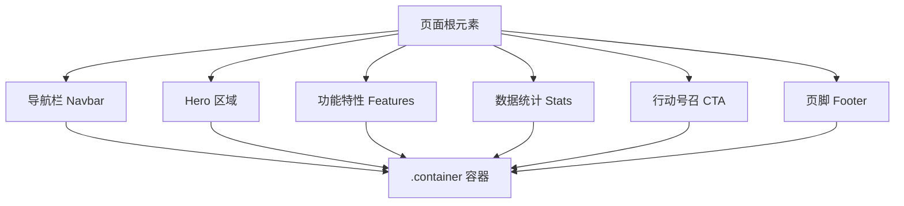
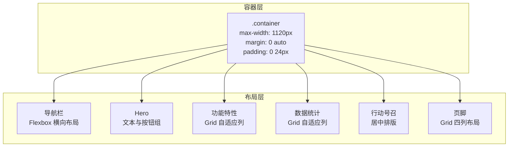
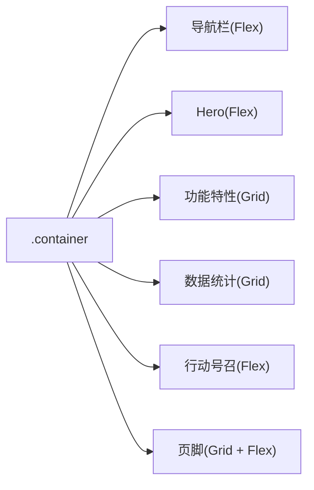

# 布局系统设计

<cite>
**本文引用的文件**
- [index.html](file://index.html)
</cite>

## 目录
1. [简介](#简介)
2. [项目结构](#项目结构)
3. [核心组件](#核心组件)
4. [架构总览](#架构总览)
5. [详细组件分析](#详细组件分析)
6. [依赖关系分析](#依赖关系分析)
7. [性能考量](#性能考量)
8. [故障排查指南](#故障排查指南)
9. [结论](#结论)
10. [附录](#附录)

## 简介
本文件面向“布局系统”的完整设计与实现，聚焦页面整体布局架构与现代化 CSS 布局技术。文档涵盖：
- 容器 .container 的固定宽度与居中策略
- CSS Grid 在现代布局中的应用（功能特性网格、数据统计网格、页脚网格）
- Flexbox 在组件内部布局中的作用（导航栏、按钮组、列表）
- 间距系统与留白策略，构建一致的视觉层次
- 通过具体代码片段路径展示各布局模式的实现方式

## 项目结构
该页面采用单文件内联样式组织，HTML 结构与 CSS 规则集中在同一文件中，便于快速迭代与阅读。整体结构自上而下包含：
- 导航栏（Navbar）
- Hero 区域
- 功能特性区（Features）
- 数据统计区（Stats）
- 行动号召区（CTA）
- 页脚（Footer）

所有主要内容均包裹在 .container 中，确保内容宽度一致且居中显示。

图表来源
- [index.html:145-157](file://index.html#L145-L157)
- [index.html:159-169](file://index.html#L159-L169)
- [index.html:171-211](file://index.html#L171-L211)
- [index.html:213-235](file://index.html#L213-L235)
- [index.html:237-244](file://index.html#L237-L244)
- [index.html:246-283](file://index.html#L246-L283)

章节来源
- [index.html:1-287](file://index.html#L1-L287)

## 核心组件
- 全局容器 .container：固定最大宽度与水平居中，统一左右内边距，保证内容在不同屏幕下的可读性与一致性。
- 导航栏 .navbar：使用 Flexbox 进行横向排列，Logo、导航链接与主按钮分布合理，支持粘性定位与毛玻璃背景。
- 功能特性 .features-grid：基于 CSS Grid 的自适应列数布局，卡片之间保持统一间距，悬停时提供微交互反馈。
- 数据统计 .stats-grid：Grid 自适应列，数字与说明文字居中对齐，强调关键指标。
- 页脚 .footer-grid：四列 Grid 布局，左侧品牌信息，右侧三列链接列表，底部版权行。
- 响应式适配：在小屏下隐藏导航菜单，页脚网格切换为两列，提升移动端体验。

章节来源
- [index.html:24-24](file://index.html#L24-L24)
- [index.html:27-40](file://index.html#L27-L40)
- [index.html:67-87](file://index.html#L67-L87)
- [index.html:91-97](file://index.html#L91-L97)
- [index.html:117-127](file://index.html#L117-L127)
- [index.html:136-140](file://index.html#L136-L140)

## 架构总览
下图展示了页面布局的整体架构与模块间的关系，体现容器约束、Grid/Flexbox 的使用位置以及响应式断点的影响。

图表来源
- [index.html:24-24](file://index.html#L24-L24)
- [index.html:27-40](file://index.html#L27-L40)
- [index.html:67-87](file://index.html#L67-L87)
- [index.html:91-97](file://index.html#L91-L97)
- [index.html:117-127](file://index.html#L117-L127)

## 详细组件分析

### 容器 .container：固定宽度与居中布局
- 设计要点
  - 最大宽度限制：确保在大屏上内容不过度拉伸，提升可读性。
  - 水平居中：通过 margin: 0 auto 实现。
  - 左右内边距：在窄屏下避免内容贴边，提升可点击区域与呼吸感。
- 适用场景
  - 全站通用内容容器，保证统一的版心宽度与对齐。
- 参考实现路径
  - [index.html:24-24](file://index.html#L24-L24)

章节来源
- [index.html:24-24](file://index.html#L24-L24)

### 导航栏 .navbar：Flexbox 横向布局
- 设计要点
  - 使用 Flexbox 将 Logo、导航链接与主按钮在同一行对齐。
  - 使用 gap 控制元素间距，避免多余 margin。
  - 粘性定位与毛玻璃背景提升滚动时的可见性与现代感。
- 交互与状态
  - 链接颜色过渡，悬停高亮；按钮悬停有轻微位移增强反馈。
- 参考实现路径
  - [index.html:27-40](file://index.html#L27-L40)
  - [index.html:145-157](file://index.html#L145-L157)

章节来源
- [index.html:27-40](file://index.html#L27-L40)
- [index.html:145-157](file://index.html#L145-L157)

### 功能特性网格 .features-grid：CSS Grid 自适应列
- 设计要点
  - 使用 grid-template-columns: repeat(auto-fit, minmax(300px, 1fr)) 实现自动换行与等宽分配。
  - 统一 gap 控制卡片间距，保持视觉节奏。
  - 卡片悬停阴影与位移，增强交互反馈。
- 复杂度与扩展性
  - 新增卡片无需修改布局代码，Grid 自动计算列数与尺寸。
- 参考实现路径
  - [index.html:67-87](file://index.html#L67-L87)
  - [index.html:171-211](file://index.html#L171-L211)

章节来源
- [index.html:67-87](file://index.html#L67-L87)
- [index.html:171-211](file://index.html#L171-L211)

### 数据统计网格 .stats-grid：CSS Grid 自适应列
- 设计要点
  - 使用 Grid 自适应列，确保在不同屏幕下数据项均匀分布。
  - 文本居中对齐，突出数值与描述。
- 参考实现路径
  - [index.html:91-97](file://index.html#L91-L97)
  - [index.html:213-235](file://index.html#L213-L235)

章节来源
- [index.html:91-97](file://index.html#L91-L97)
- [index.html:213-235](file://index.html#L213-L235)

### 页脚网格 .footer-grid：CSS Grid 多列布局
- 设计要点
  - 四列 Grid 布局，左侧品牌信息占较大比例，右侧三列链接列表等分。
  - 链接列表使用 Flexbox 纵向排列，统一间距。
  - 底部版权行独立区块，顶部边框分隔。
- 参考实现路径
  - [index.html:117-127](file://index.html#L117-L127)
  - [index.html:246-283](file://index.html#L246-L283)

章节来源
- [index.html:117-127](file://index.html#L117-L127)
- [index.html:246-283](file://index.html#L246-L283)

### 按钮组与列表：Flexbox 的应用
- 按钮组
  - 使用 Flexbox 的 gap 与 justify-content 控制按钮间距与对齐。
  - 参考实现路径：[index.html:60-60](file://index.html#L60-L60)
- 列表
  - 页脚链接列表使用 Flexbox 纵向排列，统一间距。
  - 参考实现路径：[index.html:127-127](file://index.html#L127-L127)

章节来源
- [index.html:60-60](file://index.html#L60-L60)
- [index.html:127-127](file://index.html#L127-L127)

### 响应式布局：断点与适配
- 小屏适配
  - 隐藏导航菜单，减少干扰。
  - 页脚网格由四列切换为两列，提升可读性。
- 参考实现路径
  - [index.html:136-140](file://index.html#L136-L140)

章节来源
- [index.html:136-140](file://index.html#L136-L140)

## 依赖关系分析
- 容器依赖
  - 所有主要区块都依赖 .container 提供的宽度与居中能力，形成统一的版心。
- 布局技术依赖
  - Grid 用于二维布局（功能特性、数据统计、页脚），实现自适应列与统一间距。
  - Flexbox 用于一维布局（导航栏、按钮组、列表），实现灵活的对齐与间距控制。
- 响应式依赖
  - 媒体查询影响导航与页脚网格的列数与可见性，确保跨设备一致性。

图表来源
- [index.html:24-24](file://index.html#L24-L24)
- [index.html:27-40](file://index.html#L27-L40)
- [index.html:67-87](file://index.html#L67-L87)
- [index.html:91-97](file://index.html#L91-L97)
- [index.html:117-127](file://index.html#L117-L127)

章节来源
- [index.html:24-24](file://index.html#L24-L24)
- [index.html:27-40](file://index.html#L27-L40)
- [index.html:67-87](file://index.html#L67-L87)
- [index.html:91-97](file://index.html#L91-L97)
- [index.html:117-127](file://index.html#L117-L127)

## 性能考量
- 使用 CSS Grid 的 auto-fit 与 minmax 可减少媒体查询数量，降低维护成本并提高渲染效率。
- 合理使用 gap 替代 margin 控制间距，避免盒模型复杂计算，提升布局性能。
- 大背景渐变与模糊效果需适度使用，避免在低端设备上造成卡顿。
- 图片与图标资源应优化尺寸与格式，减少首屏加载时间。

## 故障排查指南
- 内容溢出或错位
  - 检查是否误用 width 而非 max-width，导致容器无法自适应。
  - 确认 Grid 子项未设置固定宽度破坏自适应列。
- 导航在小屏不可见
  - 检查媒体查询是否正确隐藏导航，并确保移动端仍有入口（如汉堡菜单）。
- 页脚列数异常
  - 检查媒体查询中的 grid-template-columns 是否正确切换为两列。
- 间距不一致
  - 优先使用 gap 控制间距，避免混用 margin/padding 导致视觉不一致。

章节来源
- [index.html:136-140](file://index.html#L136-L140)
- [index.html:117-127](file://index.html#L117-L127)

## 结论
本布局系统以 .container 为核心约束，结合 CSS Grid 与 Flexbox 的优势，实现了响应式、可扩展且易于维护的现代页面布局。通过统一的间距与留白策略，构建了清晰的视觉层次与一致的用户体验。未来可在不破坏现有结构的前提下，轻松扩展新模块与交互。

## 附录
- 代码示例路径（按布局模式分类）
  - 容器与基础重置
    - [index.html:8-24](file://index.html#L8-L24)
  - 导航栏（Flexbox）
    - [index.html:27-40](file://index.html#L27-L40)
    - [index.html:145-157](file://index.html#L145-L157)
  - Hero 区域（Flexbox 按钮组）
    - [index.html:52-61](file://index.html#L52-L61)
  - 功能特性网格（Grid）
    - [index.html:67-87](file://index.html#L67-L87)
    - [index.html:171-211](file://index.html#L171-L211)
  - 数据统计网格（Grid）
    - [index.html:91-97](file://index.html#L91-L97)
    - [index.html:213-235](file://index.html#L213-L235)
  - 页脚网格（Grid + Flexbox）
    - [index.html:117-127](file://index.html#L117-L127)
    - [index.html:246-283](file://index.html#L246-L283)
  - 响应式适配
    - [index.html:136-140](file://index.html#L136-L140)