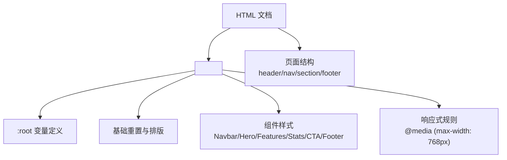
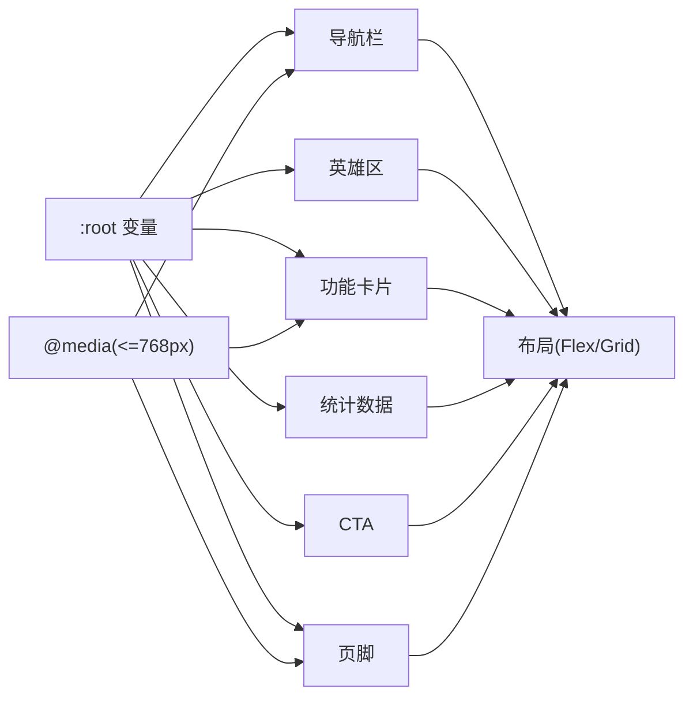
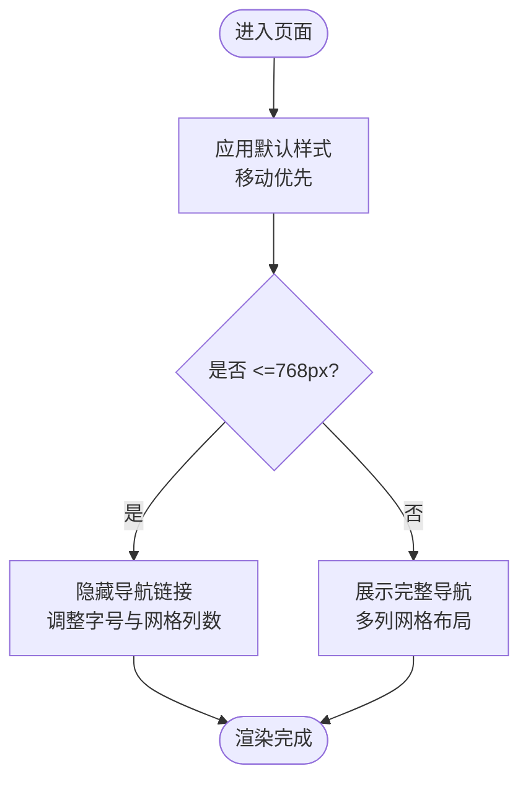
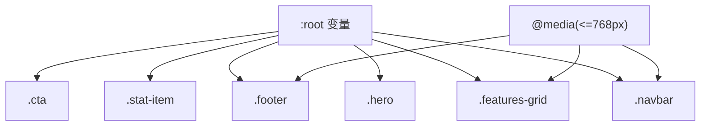

# 样式系统设计

<cite>
**本文引用的文件**
- [index.html](file://index.html)
</cite>

## 目录
1. [简介](#简介)
2. [项目结构](#项目结构)
3. [核心组件](#核心组件)
4. [架构总览](#架构总览)
5. [详细组件分析](#详细组件分析)
6. [依赖关系分析](#依赖关系分析)
7. [性能考量](#性能考量)
8. [故障排查指南](#故障排查指南)
9. [结论](#结论)
10. [附录](#附录)

## 简介
本样式系统基于单页 HTML 内联样式实现，采用现代 CSS 变量（CSS Custom Properties）构建可维护、可扩展的主题与布局体系。整体遵循移动优先的响应式策略，使用 Flexbox 与 CSS Grid 组织页面布局，并通过媒体查询适配不同屏幕尺寸。文档将围绕以下主题展开：
- CSS 变量系统：颜色主题、间距与圆角、字体栈配置
- 响应式设计：移动优先、媒体查询、弹性与网格布局
- 类名命名约定：BEM 风格的应用与实践
- 动画与交互：过渡、悬停反馈、微动效
- 自定义主题：如何替换配色、字体与布局参数
- 最佳实践：为设计师与开发者提供可落地的规范建议

## 项目结构
本项目为单文件实现，所有结构与样式集中在一个 HTML 文件中，便于快速原型与演示。样式以 <style> 标签置于 <head> 中，按区域划分（重置与基础、导航、英雄区、功能、统计、CTA、页脚、响应式）。

图表来源
- [index.html:7-141](file://index.html#L7-L141)
- [index.html:145-283](file://index.html#L145-L283)

章节来源
- [index.html:1-287](file://index.html#L1-L287)

## 核心组件
- CSS 变量（主题令牌）
  - 颜色：主色、深色变体、文本色、浅色文本、背景、次级背景、边框色
  - 形状：统一圆角半径
  - 作用域：通过 :root 全局可用，便于主题切换与一致性控制
- 基础排版与容器
  - 字体栈：系统字体优先，跨平台一致
  - 行高：提升可读性
  - 容器：最大宽度与水平居中，保证内容可读性
- 组件
  - 导航栏：粘性定位、毛玻璃背景、品牌标识与链接
  - 按钮：主按钮与轮廓按钮，带悬停与位移反馈
  - 英雄区：大标题、描述文案、行动按钮组
  - 功能卡片：图标、标题、描述，网格自适应
  - 数据统计：数字强调与说明文字
  - CTA：强对比背景与引导按钮
  - 页脚：多列网格、链接列表、版权信息
- 响应式
  - 移动端隐藏导航链接，调整字号与网格列数

章节来源
- [index.html:10-24](file://index.html#L10-L24)
- [index.html:27-50](file://index.html#L27-L50)
- [index.html:52-110](file://index.html#L52-L110)
- [index.html:112-133](file://index.html#L112-L133)
- [index.html:136-140](file://index.html#L136-L140)

## 架构总览
下图展示了样式系统的层次与数据流向：从 :root 变量出发，被各组件样式引用；组件内部通过 Flex/Grid 组织布局；媒体查询在断点处覆盖默认样式以实现响应式。

图表来源
- [index.html:10-24](file://index.html#L10-L24)
- [index.html:27-133](file://index.html#L27-L133)
- [index.html:136-140](file://index.html#L136-L140)

## 详细组件分析

### 颜色主题与 CSS 变量系统
- 设计理念
  - 单一事实来源：所有颜色与圆角等视觉令牌集中在 :root，避免散落硬编码值
  - 语义化命名：--primary、--text、--bg 等表达用途而非具体色值，便于替换
  - 层级与对比：通过主色与深浅变体构建视觉层次，确保可访问性
- 实现要点
  - 颜色：主色用于强调与交互态，深色变体用于悬停或压暗效果
  - 文本与背景：区分正文与次要文本，背景与次级背景形成层次
  - 边框与圆角：统一边框色与圆角半径，保持设计一致性
- 扩展建议
  - 增加中性色阶（灰度）、成功/警告/错误语义色
  - 引入明暗模式变量集，通过 data-theme 切换

章节来源
- [index.html:10-19](file://index.html#L10-L19)

### 间距系统与排版
- 间距
  - 使用固定像素与相对单位结合：区块 padding 使用 px，字体使用 rem/em，保证缩放一致性
  - 统一容器边距与网格间距，形成节奏感
- 字体
  - 系统字体栈：优先操作系统原生字体，保障加载速度与渲染质量
  - 行高与字重：标题加粗、正文适中行高，提升阅读体验
- 容器
  - 最大宽度限制与居中，保证大屏可读性

章节来源
- [index.html:21-24](file://index.html#L21-L24)
- [index.html:52-66](file://index.html#L52-L66)

### 响应式设计策略
- 移动优先
  - 默认样式面向小屏，逐步增强到平板与桌面
- 媒体查询
  - 在 <=768px 时隐藏导航链接、调整字号与网格列数
- 弹性与网格
  - 使用 flex 对齐与 gap 管理间距
  - 使用 grid 的 auto-fit/minmax 实现自适应卡片布局

图表来源
- [index.html:136-140](file://index.html#L136-L140)
- [index.html:67-71](file://index.html#L67-L71)
- [index.html:91-95](file://index.html#L91-L95)

章节来源
- [index.html:136-140](file://index.html#L136-L140)

### 类名命名约定与 BEM 应用
- 命名约定
  - 使用短横线分隔的英文类名，语义清晰
  - 组件级类名如 .navbar、.hero、.features-grid、.feature-card、.stat-item、.cta、.footer
  - 修饰符如 .btn-primary、.btn-outline 表示变体
- BEM 实践
  - Block：组件根节点（如 .navbar、.hero）
  - Element：子元素（如 .navbar nav、.feature-card h3）
  - Modifier：状态或变体（如 .btn-primary、.btn-outline）
- 使用建议
  - 避免深层嵌套选择器，尽量扁平化
  - 复用通用类（如 .btn），减少重复样式

章节来源
- [index.html:27-50](file://index.html#L27-L50)
- [index.html:52-110](file://index.html#L52-L110)
- [index.html:112-133](file://index.html#L112-L133)

### 动画效果、过渡与交互反馈
- 过渡
  - 按钮与链接使用 transition 平滑改变颜色与背景
  - 卡片悬停使用 transform 与 box-shadow 产生浮起效果
- 交互
  - 悬停态：颜色加深、轻微上移，提供明确反馈
  - 点击态：可通过 :active 进一步压缩或变色（可按需扩展）
- 性能
  - 仅对必要属性启用过渡，避免过度动画影响性能

章节来源
- [index.html:39-49](file://index.html#L39-L49)
- [index.html:72-79](file://index.html#L72-L79)
- [index.html:125-126](file://index.html#L125-L126)

### 组件详解

#### 导航栏（.navbar）
- 粘性定位与毛玻璃背景，提升滚动体验
- Flex 布局对齐 Logo、导航与按钮
- 移动端隐藏导航链接，简化顶部空间

章节来源
- [index.html:27-40](file://index.html#L27-L40)
- [index.html:146-157](file://index.html#L146-L157)
- [index.html:136-140](file://index.html#L136-L140)

#### 英雄区（.hero）
- 渐变背景与大标题，突出价值主张
- 双按钮组合：主要行动与次要信息
- 响应式字号调整

章节来源
- [index.html:52-61](file://index.html#L52-L61)
- [index.html:160-169](file://index.html#L160-L169)
- [index.html:136-140](file://index.html#L136-L140)

#### 功能卡片（.features/.feature-card）
- 网格自适应：auto-fit + minmax 自动换行
- 卡片阴影与悬浮动效，增强可点击暗示
- 图标容器统一尺寸与色彩

章节来源
- [index.html:63-87](file://index.html#L63-L87)
- [index.html:172-211](file://index.html#L172-L211)

#### 统计数据（.stats）
- 网格布局展示关键指标
- 强调数字与说明文案的层级

章节来源
- [index.html:89-97](file://index.html#L89-L97)
- [index.html:214-235](file://index.html#L214-L235)

#### 行动号召（.cta）
- 高对比背景与白色按钮，强化转化
- 居中对齐与紧凑间距

章节来源
- [index.html:99-109](file://index.html#L99-L109)
- [index.html:238-244](file://index.html#L238-L244)

#### 页脚（.footer）
- 多列网格布局，信息分组清晰
- 链接悬停高亮，底部版权信息

章节来源
- [index.html:112-133](file://index.html#L112-L133)
- [index.html:247-283](file://index.html#L247-L283)

## 依赖关系分析
- 样式依赖
  - 组件样式依赖 :root 变量，若变量缺失会导致视觉异常
  - 响应式规则依赖媒体查询断点，修改断点需同步检查布局
- 结构依赖
  - HTML 类名与 CSS 选择器一一对应，删除或重命名类名需同步更新
- 潜在风险
  - 过深选择器链可能导致优先级冲突
  - 未使用 CSS 变量的硬编码值会破坏主题一致性

图表来源
- [index.html:10-24](file://index.html#L10-L24)
- [index.html:27-133](file://index.html#L27-L133)
- [index.html:136-140](file://index.html#L136-L140)

章节来源
- [index.html:10-24](file://index.html#L10-L24)
- [index.html:27-133](file://index.html#L27-L133)
- [index.html:136-140](file://index.html#L136-L140)

## 性能考量
- 减少重排与重绘
  - 仅对必要元素启用过渡与变换
  - 避免在高频事件中触发昂贵样式计算
- 资源与加载
  - 内联样式减少 HTTP 请求，适合小型站点
  - 字体使用系统字体栈，避免额外字体加载
- 可访问性
  - 确保颜色对比度满足 WCAG 标准
  - 为交互元素提供清晰的焦点与悬停态

## 故障排查指南
- 变量未生效
  - 检查 :root 是否包含对应变量
  - 确认选择器优先级未被覆盖
- 响应式异常
  - 核对媒体查询断点与布局期望
  - 检查网格列数与间距在小屏下的表现
- 动画卡顿
  - 移除不必要的过渡属性
  - 避免同时变换多个昂贵属性

章节来源
- [index.html:10-24](file://index.html#L10-L24)
- [index.html:136-140](file://index.html#L136-L140)
- [index.html:39-49](file://index.html#L39-L49)

## 结论
该样式系统以 CSS 变量为核心，构建了清晰的主题与布局体系。通过移动优先与响应式策略，保证了在不同设备上的良好体验。组件化的类名与 BEM 实践提升了可维护性与复用性。建议在后续迭代中引入更丰富的语义色、明暗模式与更细粒度的间距令牌，并逐步将样式外置为独立文件以提升工程化能力。

## 附录

### 自定义主题指南
- 修改颜色方案
  - 在 :root 中替换 --primary、--primary-dark、--text、--bg、--bg-alt、--border 等变量
  - 保持明暗对比与一致性，必要时新增语义色（成功/警告/错误）
- 修改字体
  - 调整 body 的 font-family，推荐保留系统字体栈作为回退
- 调整布局参数
  - 修改容器最大宽度、网格间距与卡片圆角
  - 根据需要调整媒体查询断点与响应式行为

章节来源
- [index.html:10-24](file://index.html#L10-L24)
- [index.html:21-24](file://index.html#L21-L24)
- [index.html:67-71](file://index.html#L67-L71)
- [index.html:136-140](file://index.html#L136-L140)

### 最佳实践清单
- 始终通过 CSS 变量管理主题与令牌
- 使用 BEM 命名，保持类名语义化与可预测
- 移动优先编写样式，逐步增强至桌面端
- 合理使用 Flex/Grid，避免复杂嵌套
- 谨慎使用动画，关注性能与可访问性
- 定期审查颜色对比度与键盘可达性