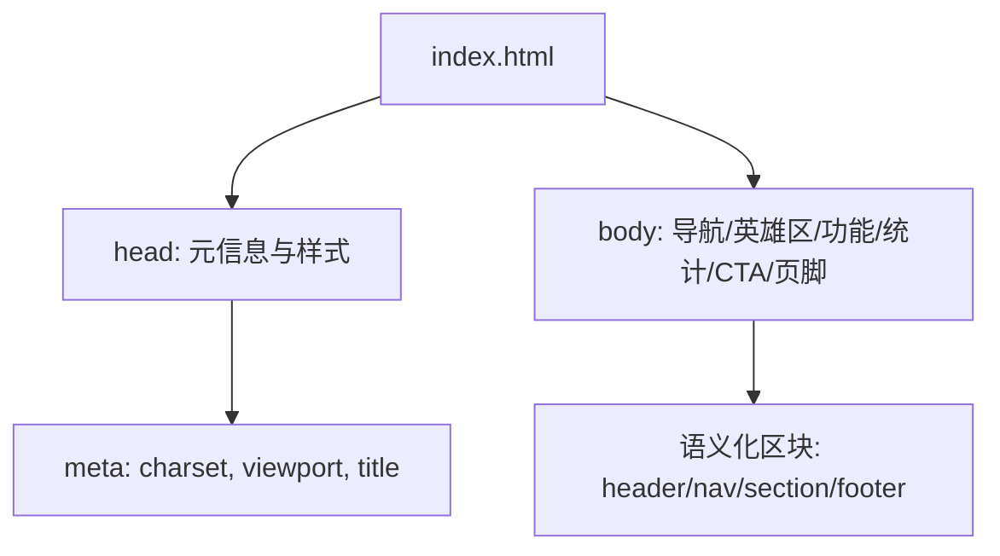
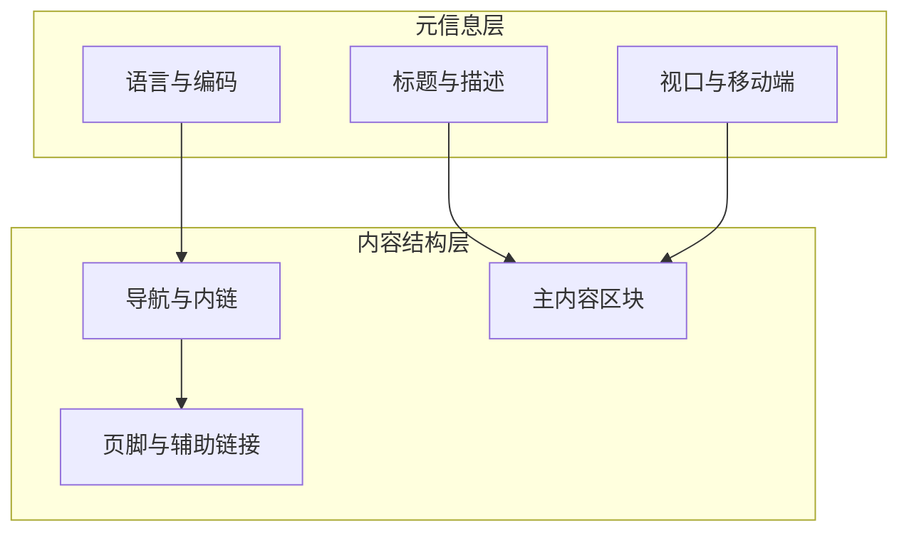
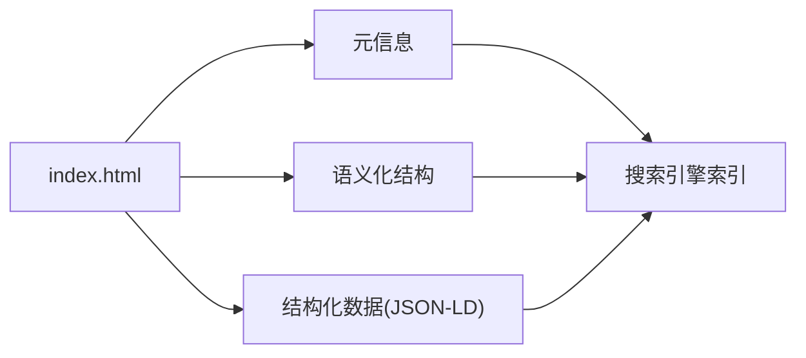

# SEO优化指南

<cite>
**本文引用的文件**
- [index.html](file://index.html)
</cite>

## 目录
1. [简介](#简介)
2. [项目结构](#项目结构)
3. [核心组件](#核心组件)
4. [架构总览](#架构总览)
5. [详细组件分析](#详细组件分析)
6. [依赖关系分析](#依赖关系分析)
7. [性能考量](#性能考量)
8. [故障排查指南](#故障排查指南)
9. [结论](#结论)
10. [附录](#附录)

## 简介
本指南面向落地页的SEO优化，目标是通过规范的元信息、语义化HTML、结构化数据、URL与内链策略、社交媒体分享配置以及持续的SEO分析与监控，提升页面在搜索引擎中的可见性与排名。文档将结合当前仓库中的单页示例（index.html），给出可落地的优化清单与实施步骤，帮助你在不改变整体设计的前提下快速提升SEO效果。

## 项目结构
当前仓库为单页应用结构，核心文件如下：
- index.html：包含页面头部元信息、样式与主体内容（导航、Hero、功能、统计、CTA、页脚等）

图表来源
- [index.html:1-287](file://index.html#L1-L287)

章节来源
- [index.html:1-287](file://index.html#L1-L287)

## 核心组件
围绕SEO的关键实现点集中在以下位置：
- 页面语言与字符集设置：确保正确的语言与编码声明
- 标题标签：控制搜索结果的标题展示
- 视口与移动端适配：影响移动友好度与排名
- 语义化结构：header、nav、section、footer 等有助于理解页面层次
- 内部链接：导航与页脚提供站点内跳转路径
- 图片与图标：需补充alt与加载策略以提升可访问性与性能

章节来源
- [index.html:1-287](file://index.html#L1-L287)

## 架构总览
从SEO视角看，该落地页由“元信息层”和“内容结构层”组成：
- 元信息层：负责向搜索引擎传达页面主题、语言、移动端适配等信息
- 内容结构层：通过语义化标签组织内容，便于爬虫抓取与用户阅读

图表来源
- [index.html:1-287](file://index.html#L1-L287)

## 详细组件分析

### Meta标签优化（标题、描述、关键词）
- 标题（title）：应简洁明确，包含品牌与核心价值主张，长度建议控制在合理范围内，避免截断
- 描述（description）：用于搜索结果摘要，突出卖点与行动号召，长度适中，自然融入关键词
- 关键词（keywords）：现代搜索引擎权重较低，但仍可作为内部参考；不建议堆砌
- 其他元信息：如 robots、canonical、author、theme-color 等可按需添加

实施要点
- 在 head 中设置合适的 lang、charset、viewport
- 为每个页面定制唯一的 title 与 description
- 保持标题与描述的一致性与相关性

章节来源
- [index.html:1-20](file://index.html#L1-L20)

### 语义化HTML与可访问性
- 使用 header、nav、main、section、article、aside、footer 等语义标签组织页面结构
- 为图片与图标提供 alt 文本，增强可访问性与索引质量
- 合理使用 heading 层级（h1-h6），确保每页只有一个 h1，且与标题一致
- 为交互元素提供足够的对比度与键盘可达性

实施要点
- 将导航放入 nav，主要内容放入 main 或 section
- 为所有非装饰性图片添加有意义的 alt
- 检查 heading 层级是否清晰、无跳跃

章节来源
- [index.html:145-283](file://index.html#L145-L283)

### 结构化数据标记（JSON-LD）
- 使用 JSON-LD 在 head 中添加结构化数据，帮助搜索引擎理解页面实体与上下文
- 常见类型：Organization、WebPage、Product、Service、BreadcrumbList、FAQPage 等
- 放置位置：建议在 head 中尽早加载，便于爬虫优先解析

实施要点
- 选择与页面最匹配的类型，填充必要字段
- 验证结构化数据有效性（可使用在线工具校验）
- 避免重复或冲突的数据定义

章节来源
- [index.html:1-287](file://index.html#L1-L287)

### URL结构与内部链接策略
- URL设计：短小、可读、包含关键词，避免过长参数与动态片段
- 规范化：使用 canonical 指定首选URL，避免重复内容
- 内链布局：在导航、正文与页脚建立合理的内部链接网络，提升重要页面的权重
- 锚点与跳转：对长页面使用锚点链接提升用户体验与停留时长

实施要点
- 为关键页面创建独立URL并维护内链
- 在页脚与导航中增加相关资源链接
- 使用相对路径或规范路径，减少死链

章节来源
- [index.html:145-283](file://index.html#L145-L283)

### 社交媒体分享优化
- Open Graph（OG）：设置 og:title、og:description、og:image、og:url、og:type 等，提升社交平台预览质量
- Twitter Cards：设置 twitter:card、twitter:title、twitter:description、twitter:image 等
- 社交图标与分享按钮：便于用户传播，间接带来外链与流量

实施要点
- 为每个页面生成唯一且高质量的分享图与描述
- 在不同平台测试预览效果
- 保持OG与Twitter字段与页面内容一致

章节来源
- [index.html:1-287](file://index.html#L1-L287)

### SEO分析与监控工具
- Google Search Console：提交站点地图、检查索引状态、查看点击与展示数据
- Google Analytics：追踪流量来源、行为路径与转化
- Lighthouse/Pagespeed Insights：评估性能、可访问性与SEO指标
- 第三方SEO工具：如Ahrefs、SEMrush、Moz等用于关键词研究与竞品分析

实施要点
- 定期查看索引覆盖率与错误报告
- 基于数据调整内容与内链策略
- 持续优化性能与可访问性

章节来源
- [index.html:1-287](file://index.html#L1-L287)

## 依赖关系分析
该页面为静态单页，主要依赖浏览器渲染引擎与搜索引擎爬虫。SEO相关的“依赖”包括：
- 元信息依赖：lang、charset、viewport、title、description
- 语义结构依赖：header、nav、section、footer 等标签
- 结构化数据依赖：JSON-LD 脚本块
- 外部工具依赖：Search Console、Analytics、Lighthouse 等

图表来源
- [index.html:1-287](file://index.html#L1-L287)

章节来源
- [index.html:1-287](file://index.html#L1-L287)

## 性能考量
- 首屏渲染：尽量减少阻塞资源，压缩CSS/JS，延迟加载非关键资源
- 图片优化：使用合适格式与尺寸，启用懒加载
- 缓存策略：合理设置HTTP缓存头，提升重复访问速度
- 移动端体验：确保触控友好与响应式布局

[本节为通用指导，不直接分析具体文件]

## 故障排查指南
常见问题与处理建议：
- 标题被截断或描述缺失：检查 title 与 description 的长度与内容
- 移动端显示异常：确认 viewport 设置与响应式样式
- 结构化数据无效：使用在线校验工具定位错误字段
- 内链失效：检查链接路径与服务器路由配置
- 索引问题：在Search Console中查看抓取与索引状态

章节来源
- [index.html:1-287](file://index.html#L1-L287)

## 结论
通过对元信息、语义化结构、结构化数据、URL与内链、社交媒体分享以及SEO分析的全面优化，可以显著提升落地页在搜索引擎中的可见性与排名。建议按本指南逐项落实，并结合数据分析持续迭代优化。

## 附录
- 推荐实践清单
  - 为每个页面定制 title 与 description
  - 使用语义化标签组织内容
  - 添加JSON-LD结构化数据
  - 优化URL与内链结构
  - 配置Open Graph与Twitter Cards
  - 使用Search Console与Analytics进行监控
  - 定期执行Lighthouse审计并修复问题

[本节为通用指导，不直接分析具体文件]