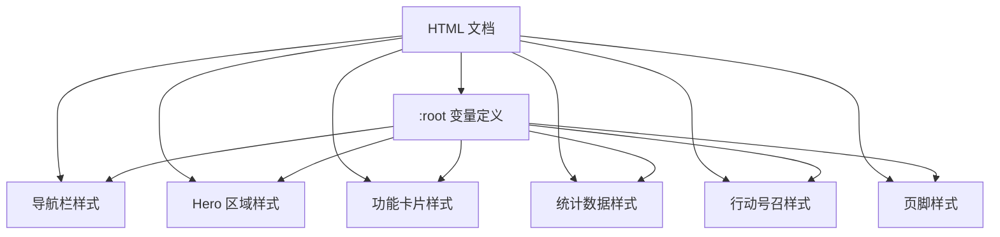
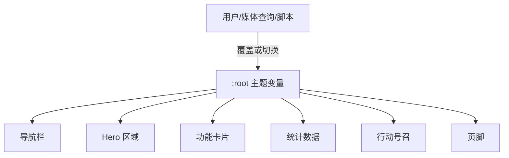
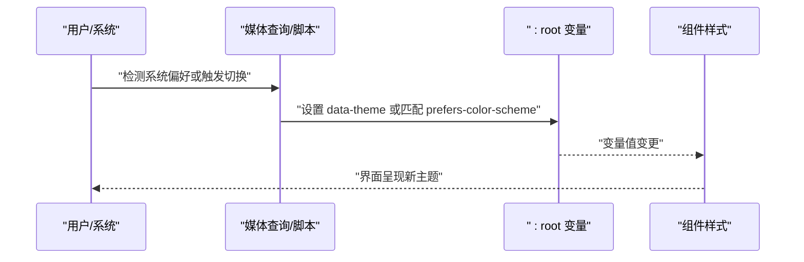
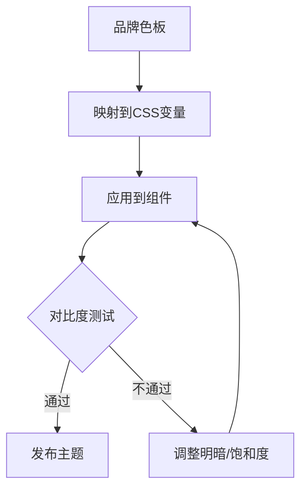
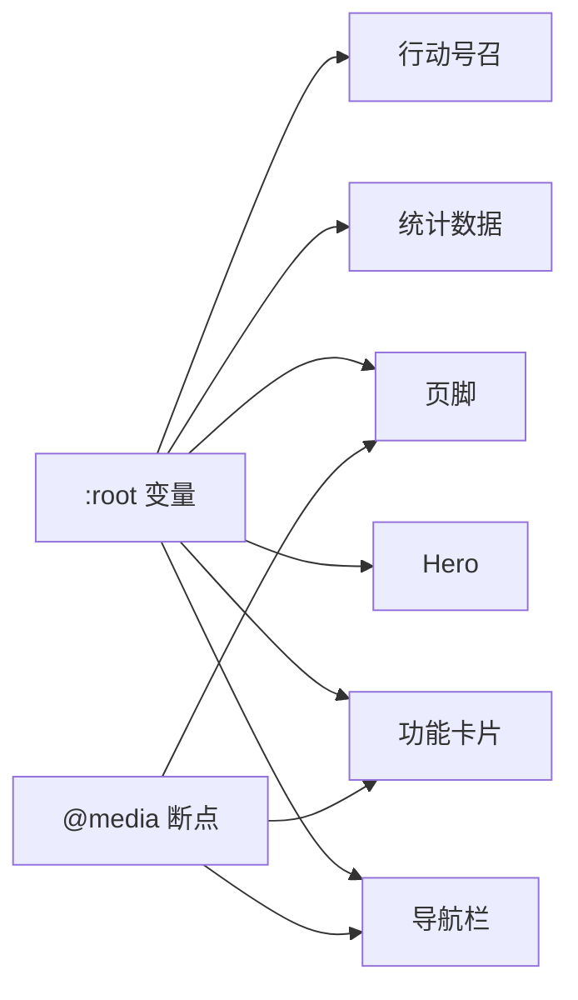

# 主题定制指南

<cite>
**本文引用的文件**
- [index.html](file://index.html)
</cite>

## 目录
1. [简介](#简介)
2. [项目结构](#项目结构)
3. [核心组件](#核心组件)
4. [架构总览](#架构总览)
5. [详细组件分析](#详细组件分析)
6. [依赖关系分析](#依赖关系分析)
7. [性能考虑](#性能考虑)
8. [故障排查指南](#故障排查指南)
9. [结论](#结论)
10. [附录](#附录)

## 简介
本指南面向希望自定义页面颜色主题与视觉样式的开发者与设计师。基于当前单页实现，我们将系统讲解：
- CSS 变量系统的组织与使用方式
- 如何修改主色调、辅助色、背景色与文本颜色
- 如何创建新的配色方案与品牌色彩体系
- 如何调整字体大小、间距与布局参数
- 如何实现深色模式（含示例思路）
- 浏览器兼容性与回退方案

## 项目结构
本项目为单页 HTML，样式通过内嵌 <style> 集中管理，并通过 :root 下的 CSS 自定义属性（变量）驱动全局主题。主要区域包括导航栏、Hero、功能卡片、数据统计、行动号召与页脚。

图表来源
- [index.html:10-19](file://index.html#L10-L19)
- [index.html:27-140](file://index.html#L27-L140)

章节来源
- [index.html:1-287](file://index.html#L1-L287)

## 核心组件
- 主题变量中心：位于 :root，集中声明主色、深色主色、文本色、浅色文本、背景、次级背景、边框圆角等。
- 组件样式：各区块通过引用上述变量统一外观，便于一键换肤。
- 交互与过渡：按钮与卡片具备 hover 过渡效果，提升体验一致性。

关键要点
- 所有可定制的颜色均通过 CSS 变量暴露，避免硬编码颜色值。
- 圆角、行高、字号等基础排版参数集中在 :root，便于全局调整。

章节来源
- [index.html:10-19](file://index.html#L10-L19)
- [index.html:21-24](file://index.html#L21-L24)
- [index.html:41-49](file://index.html#L41-L49)
- [index.html:63-87](file://index.html#L63-L87)
- [index.html:90-97](file://index.html#L90-L97)
- [index.html:100-109](file://index.html#L100-L109)
- [index.html:112-133](file://index.html#L112-L133)

## 架构总览
整体采用“变量驱动”的主题架构：在根节点定义主题变量，各组件样式仅消费这些变量。切换主题即替换 :root 中的变量值，无需改动组件样式。

图表来源
- [index.html:10-19](file://index.html#L10-L19)
- [index.html:27-140](file://index.html#L27-L140)

## 详细组件分析

### 颜色与主题变量
- 主色与强调色：用于按钮、链接悬停、标题强调等。
- 文本色与浅色文本：正文与次要信息。
- 背景与次级背景：页面底色与分区底色。
- 边框与圆角：统一视觉边界与圆角风格。

操作建议
- 修改 :root 中对应变量即可全局生效。
- 保持对比度符合无障碍标准，尤其是文本与背景的组合。

章节来源
- [index.html:10-19](file://index.html#L10-L19)
- [index.html:41-49](file://index.html#L41-L49)
- [index.html:63-87](file://index.html#L63-L87)
- [index.html:90-97](file://index.html#L90-L97)
- [index.html:100-109](file://index.html#L100-L109)
- [index.html:112-133](file://index.html#L112-L133)

### 字体、字号与行高
- 全局字体族：系统字体栈，保证跨平台一致渲染。
- 行高：统一阅读节奏。
- 字号层级：标题、正文、说明文字形成清晰层级。

调整方法
- 在 :root 或 body 层统一调整字体族与行高。
- 通过语义化标签（h1-h4、p）控制字号层级，必要时在 :root 提供字号变量以便集中管理。

章节来源
- [index.html:21-24](file://index.html#L21-L24)
- [index.html:57-66](file://index.html#L57-L66)
- [index.html:86-87](file://index.html#L86-L87)
- [index.html:96-97](file://index.html#L96-L97)
- [index.html:106-108](file://index.html#L106-L108)
- [index.html:123-126](file://index.html#L123-L126)

### 间距与布局
- 容器宽度与边距：限制最大宽度并居中，确保可读性。
- 网格布局：功能卡片与统计项使用自适应网格，自动换行。
- 响应式断点：在小屏隐藏导航菜单、调整网格列数。

调整方法
- 修改 .container 的 max-width 与 padding 以改变内容区密度。
- 调整网格 gap 与 minmax 阈值以改变卡片密度与换行行为。
- 在 @media 中调整断点与布局策略。

章节来源
- [index.html:24](file://index.html#L24)
- [index.html:67-71](file://index.html#L67-L71)
- [index.html:91-95](file://index.html#L91-L95)
- [index.html:117-122](file://index.html#L117-L122)
- [index.html:135-140](file://index.html#L135-L140)

### 按钮与交互状态
- 主按钮与轮廓按钮：通过变量控制填充与描边。
- Hover 态：背景色变化与轻微位移，增强反馈。

调整方法
- 直接修改 :root 中的主色与深色主色，即可更新按钮主题。
- 如需更丰富的交互，可在按钮类中添加更多伪类与过渡。

章节来源
- [index.html:41-49](file://index.html#L41-L49)
- [index.html:100-109](file://index.html#L100-L109)

### 卡片与图标
- 卡片背景与边框：使用变量统一边框与背景。
- 图标容器：背景与图标色通过变量关联主色。

调整方法
- 调整 :root 中的边框与背景变量，可快速刷新卡片风格。
- 图标色跟随主色，便于品牌联动。

章节来源
- [index.html:72-87](file://index.html#L72-L87)

### 页脚与底部信息
- 页脚背景与文本色：与主题变量保持一致。
- 链接悬停：提升可发现性。

调整方法
- 通过 :root 变量统一控制页脚配色。
- 如需独立主题，可为页脚增加专属变量集。

章节来源
- [index.html:112-133](file://index.html#L112-L133)

### 深色模式实现（示例思路）
目标：根据系统偏好或用户选择，切换至深色主题。

实现步骤
- 在 :root 下定义默认浅色变量。
- 新增一个数据属性或类名（例如 data-theme="dark"），在其下重新声明同名变量，覆盖浅色值。
- 使用媒体查询 prefers-color-scheme 自动应用深色主题；或通过 JS 监听用户切换。
- 将页面中所有颜色引用改为变量，确保切换时全局生效。

图表来源
- [index.html:10-19](file://index.html#L10-L19)
- [index.html:27-140](file://index.html#L27-L140)

章节来源
- [index.html:10-19](file://index.html#L10-L19)
- [index.html:27-140](file://index.html#L27-L140)

### 创建新的配色方案与品牌色彩
- 建立品牌色板：确定主色、辅助色、中性色、成功/警告/错误等语义色。
- 映射到变量：将品牌色映射到 :root 变量，如主色、文本、背景、边框等。
- 验证对比度：确保文本与背景对比度满足 WCAG 要求。
- 扩展变量：为不同场景（如 CTA、卡片、页脚）引入语义化变量，便于维护。

图表来源
- [index.html:10-19](file://index.html#L10-L19)
- [index.html:41-49](file://index.html#L41-L49)
- [index.html:63-87](file://index.html#L63-L87)
- [index.html:100-109](file://index.html#L100-L109)
- [index.html:112-133](file://index.html#L112-L133)

## 依赖关系分析
- 组件对变量的强依赖：所有颜色、圆角、边框均来自 :root。
- 无外部样式依赖：样式完全内联，便于主题迁移与维护。
- 响应式依赖：@media 断点影响布局与可见性。

图表来源
- [index.html:10-19](file://index.html#L10-L19)
- [index.html:27-140](file://index.html#L27-L140)
- [index.html:135-140](file://index.html#L135-L140)

章节来源
- [index.html:10-19](file://index.html#L10-L19)
- [index.html:27-140](file://index.html#L27-L140)
- [index.html:135-140](file://index.html#L135-L140)

## 性能考虑
- 减少重绘：主题切换仅修改变量值，浏览器可高效增量更新。
- 避免过度嵌套：当前样式扁平且模块化，利于缓存与解析。
- 合理使用 backdrop-filter：导航栏使用了模糊背景，注意低端设备性能。
- 图片与资源：当前无外部资源，加载速度快。

## 故障排查指南
常见问题与解决思路
- 主题未生效
  - 检查是否覆盖了 :root 变量，确认作用域优先级。
  - 确认组件样式确实引用了变量而非硬编码颜色。
- 对比度不足
  - 调整文本与背景变量组合，确保可读性。
- 移动端布局异常
  - 检查 @media 断点与网格布局参数，必要时调整 gap 与 minmax。
- 深色模式不工作
  - 确认媒体查询或 data-theme 是否正确设置。
  - 检查变量覆盖顺序与继承关系。

章节来源
- [index.html:10-19](file://index.html#L10-L19)
- [index.html:27-140](file://index.html#L27-L140)
- [index.html:135-140](file://index.html#L135-L140)

## 结论
通过 :root 变量驱动的单一主题源，配合清晰的组件样式分层，可实现低成本、高一致性的主题定制。遵循本文的步骤与最佳实践，可快速完成品牌换肤、深色模式与响应式优化，并确保良好的可访问性与性能表现。

## 附录

### 常用变量清单与用途
- 主色与深色主色：按钮、链接悬停、强调元素
- 文本与浅色文本：正文与次要信息
- 背景与次级背景：页面与分区底色
- 边框与圆角：统一边界与圆角风格

章节来源
- [index.html:10-19](file://index.html#L10-L19)
- [index.html:41-49](file://index.html#L41-L49)
- [index.html:63-87](file://index.html#L63-L87)
- [index.html:90-97](file://index.html#L90-L97)
- [index.html:100-109](file://index.html#L100-L109)
- [index.html:112-133](file://index.html#L112-L133)

### 浏览器兼容性与回退方案
- CSS 变量支持：现代浏览器普遍支持，旧版 IE 不支持。
- 回退策略
  - 为关键颜色提供静态 fallback 值（在变量前定义或使用工具生成）。
  - 针对不支持 backdrop-filter 的设备，降级为纯色背景。
  - 使用特性检测或 polyfill 处理高级特性缺失。
- 渐进增强
  - 优先保证基本可读性与可用性，再叠加动画与特效。

章节来源
- [index.html:27-32](file://index.html#L27-L32)
- [index.html:10-19](file://index.html#L10-L19)