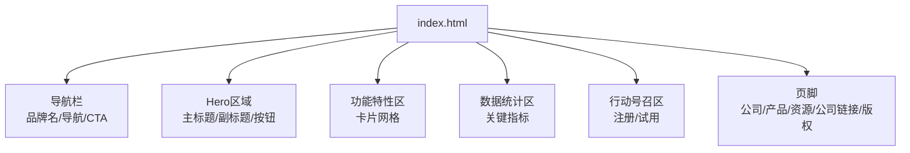
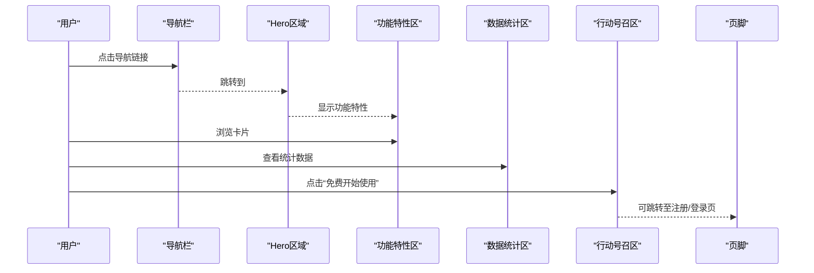
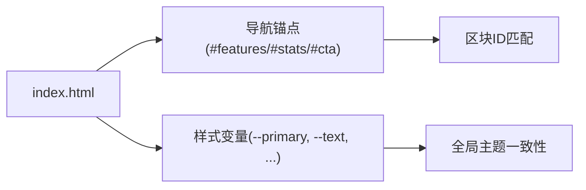

# 内容修改指南

<cite>
**本文引用的文件**
- [index.html](file://index.html)
</cite>

## 目录
1. [简介](#简介)
2. [项目结构](#项目结构)
3. [核心组件](#核心组件)
4. [架构总览](#架构总览)
5. [详细组件分析与修改指南](#详细组件分析与修改指南)
6. [依赖关系分析](#依赖关系分析)
7. [性能与SEO优化建议](#性能与seo优化建议)
8. [故障排查指南](#故障排查指南)
9. [结论](#结论)
10. [附录：多语言支持实现指导](#附录：多语言支持实现指导)

## 简介
本指南面向需要在落地页中自定义文本内容与链接的编辑者，提供从品牌名称、标语、描述文案到导航菜单、功能特性、行动号召按钮、统计数据、页脚信息与外部链接的系统化修改方法。同时给出HTML标签的正确使用方式、SEO友好的内容编写建议，以及为不同语言版本用户实现多语言支持的实践指导。

## 项目结构
本项目为单页落地页，所有结构与样式均集中在一个HTML文件中，便于快速定位与修改。页面包含以下主要区域：
- 导航栏（品牌Logo、导航链接、CTA按钮）
- Hero区域（主标题、副标题、操作按钮）
- 功能特性区（卡片网格）
- 数据统计区（关键指标展示）
- 行动号召区（注册/试用入口）
- 页脚（公司信息、产品/资源/公司链接、版权信息）

图表来源
- [index.html:145-157](file://index.html#L145-L157)
- [index.html:159-169](file://index.html#L159-L169)
- [index.html:171-211](file://index.html#L171-L211)
- [index.html:213-235](file://index.html#L213-L235)
- [index.html:237-244](file://index.html#L237-L244)
- [index.html:246-283](file://index.html#L246-L283)

章节来源
- [index.html:1-287](file://index.html#L1-L287)

## 核心组件
- 导航栏：品牌标识、锚点导航、顶部CTA按钮
- Hero区域：主标题、副标题、双按钮（开始/了解更多）
- 功能特性：六张卡片，分别展示性能、安全、部署、设计、数据、支持
- 数据统计：四组关键指标（用户数、可用性、覆盖地区、企业客户）
- 行动号召：引导注册或试用的区块
- 页脚：品牌介绍、产品/资源/公司三列链接、版权行

章节来源
- [index.html:145-157](file://index.html#L145-L157)
- [index.html:159-169](file://index.html#L159-L169)
- [index.html:171-211](file://index.html#L171-L211)
- [index.html:213-235](file://index.html#L213-L235)
- [index.html:237-244](file://index.html#L237-L244)
- [index.html:246-283](file://index.html#L246-L283)

## 架构总览
页面采用“单文件+内联样式”的轻量架构，通过语义化HTML区块组织内容，便于搜索引擎抓取与无障碍访问。各区块之间通过锚点链接进行平滑滚动跳转，提升用户体验。

图表来源
- [index.html:145-157](file://index.html#L145-L157)
- [index.html:159-169](file://index.html#L159-L169)
- [index.html:171-211](file://index.html#L171-L211)
- [index.html:213-235](file://index.html#L213-L235)
- [index.html:237-244](file://index.html#L237-L244)
- [index.html:246-283](file://index.html#L246-L283)

## 详细组件分析与修改指南

### 品牌名称、标语与描述文案
- 品牌名称
  - 位置：导航栏Logo处
  - 修改方法：在导航栏的品牌链接文本处替换为实际品牌名
  - SEO建议：保持简洁、易读；避免过长导致移动端换行影响体验
- 页面标题
  - 位置：文档头部标题标签
  - 修改方法：将占位标题替换为“品牌名 - 核心价值主张”
  - SEO建议：控制在60字符以内，包含核心关键词
- 主标题与副标题
  - 位置：Hero区域的主标题与段落
  - 修改方法：更新主标题中的强调词与副标题的描述文案
  - SEO建议：主标题突出价值主张，副标题补充说明目标人群与收益
- 行动按钮文案
  - 位置：Hero区域的两个按钮
  - 修改方法：根据业务阶段调整“立即开始/了解更多”等文案
  - SEO建议：动词开头、明确结果，如“免费试用”“获取方案”

章节来源
- [index.html:145-157](file://index.html#L145-L157)
- [index.html:159-169](file://index.html#L159-L169)

### 导航菜单链接
- 内部锚点
  - 位置：导航栏内的“功能/数据/方案”等链接
  - 修改方法：确保href指向对应区块的id（如#features、#stats、#cta）
  - 注意事项：若新增区块，需同步添加id并更新导航链接
- 外部链接
  - 位置：导航栏或页脚中的外部链接
  - 修改方法：将占位符链接替换为目标URL；必要时添加target="_blank"和rel="noopener noreferrer"以提升安全性
- 无障碍与SEO
  - 使用有意义的链接文本，避免“点击这里”
  - 为图片链接提供alt属性（如有）

章节来源
- [index.html:145-157](file://index.html#L145-L157)
- [index.html:246-283](file://index.html#L246-L283)

### 功能特性描述
- 卡片标题与描述
  - 位置：功能区的每张卡片
  - 修改方法：按业务需求更新标题与描述文案，突出差异化优势
  - SEO建议：每段描述控制在2-3句，包含1个核心关键词
- 图标与视觉
  - 位置：卡片图标容器
  - 修改方法：如需更换图标，可使用SVG或Unicode符号；保持尺寸一致
- 布局与响应式
  - 位置：CSS网格布局
  - 修改方法：增减卡片时注意栅格自适应；移动端自动折行无需额外处理

章节来源
- [index.html:171-211](file://index.html#L171-L211)

### 统计数据展示
- 指标项
  - 位置：数据统计区的四个指标
  - 修改方法：更新数值与单位（如用户数、可用性、覆盖地区、企业客户）
  - 建议：数据来源需可靠，定期维护；避免夸大宣传
- 可读性
  - 位置：统计数字与说明文字
  - 修改方法：数字与单位清晰对齐；中文场景下使用千分位分隔符更友好

章节来源
- [index.html:213-235](file://index.html#L213-L235)

### 行动号召按钮与文案
- 文案
  - 位置：行动号召区的主按钮与提示文案
  - 修改方法：根据转化目标调整文案，如“免费开始使用”“预约演示”
- 链接
  - 位置：主按钮的href
  - 修改方法：指向注册/登录/表单页面；确保移动端加载速度
- 视觉
  - 位置：按钮样式类
  - 修改方法：如需高亮，可复用现有按钮类；避免引入过多新样式

章节来源
- [index.html:237-244](file://index.html#L237-L244)

### 页脚信息与外部链接
- 品牌介绍
  - 位置：页脚左侧品牌介绍段落
  - 修改方法：更新公司愿景、使命或简短介绍
- 链接分组
  - 位置：产品/资源/公司三列链接
  - 修改方法：按需增删链接；确保链接有效且分类清晰
- 版权信息
  - 位置：页脚底部版权行
  - 修改方法：更新年份与品牌名；保留必要的法律声明

章节来源
- [index.html:246-283](file://index.html#L246-L283)

### HTML标签的正确使用方式
- 语义化结构
  - 使用header、nav、section、footer等语义标签提升可访问性与SEO
- 标题层级
  - 每个页面仅一个h1；后续内容使用h2/h3有序层级
- 链接与图像
  - 链接文本应具描述性；图片添加alt属性
- 元信息
  - 设置合适的title、meta description（可在head中添加）以增强SEO

章节来源
- [index.html:1-287](file://index.html#L1-L287)

### SEO友好的内容编写建议
- 标题与描述
  - 标题包含核心关键词，长度适中；描述准确概括页面价值
- 关键词密度
  - 自然融入关键词，避免堆砌
- 结构化数据
  - 可为产品或服务添加JSON-LD（可选）
- 性能与可访问性
  - 减少阻塞资源；确保键盘可导航与屏幕阅读器友好

章节来源
- [index.html:1-287](file://index.html#L1-L287)

## 依赖关系分析
- 单文件依赖：所有结构与样式集中于index.html，无外部JS/CSS依赖
- 锚点依赖：导航链接依赖对应区块的id，修改时需保持一致
- 样式变量：颜色、圆角等通过CSS变量统一管理，便于全局主题调整

图表来源
- [index.html:145-157](file://index.html#L145-L157)
- [index.html:10-24](file://index.html#L10-L24)
- [index.html:171-211](file://index.html#L171-L211)
- [index.html:213-235](file://index.html#L213-L235)
- [index.html:237-244](file://index.html#L237-L244)

章节来源
- [index.html:10-24](file://index.html#L10-L24)
- [index.html:145-157](file://index.html#L145-L157)
- [index.html:171-211](file://index.html#L171-L211)
- [index.html:213-235](file://index.html#L213-L235)
- [index.html:237-244](file://index.html#L237-L244)

## 性能与SEO优化建议
- 性能
  - 保持单文件轻量；避免引入大体积资源
  - 图片使用现代格式并压缩（如有）
- SEO
  - 完善title与meta description
  - 使用语义化标签与合理的标题层级
  - 外链添加rel="noopener noreferrer"提升安全
- 可访问性
  - 确保对比度足够；为交互元素提供焦点状态

[本节为通用建议，不直接分析具体文件]

## 故障排查指南
- 导航无法跳转
  - 检查导航href是否与区块id一致
  - 确认区块存在且未被隐藏
- 链接无效
  - 外部链接是否拼写正确；内部链接路径是否正确
- 样式异常
  - CSS变量是否被误改；类名是否拼写错误
- 移动端显示问题
  - 检查媒体查询与栅格布局；确保内容不换行错位

章节来源
- [index.html:135-141](file://index.html#L135-L141)
- [index.html:145-157](file://index.html#L145-L157)
- [index.html:246-283](file://index.html#L246-L283)

## 结论
通过本指南，您可以系统性地修改落地页中的品牌信息、文案、链接与统计数据，并遵循HTML最佳实践与SEO原则，确保内容既美观又利于搜索与可访问性。对于多语言需求，可参考附录中的实现指导逐步扩展。

[本节为总结性内容，不直接分析具体文件]

## 附录：多语言支持实现指导
- 方案一：基于data属性的前端切换
  - 为需要翻译的元素添加data-i18n键值
  - 使用小型脚本在页面加载时根据lang属性替换文本
  - 优点：改动小、无需后端；缺点：不利于SEO与爬虫索引
- 方案二：多页面路由
  - 为每种语言创建独立页面（如/index-zh-CN.html、/index-en.html）
  - 通过href与lang属性区分语言；有利于SEO与缓存
- 方案三：服务端渲染
  - 根据请求头Accept-Language返回对应语言版本
  - 适合大型站点与复杂业务逻辑
- 实施要点
  - 统一文案管理：将文案抽离为JSON文件便于维护
  - 日期与数字格式化：根据语言环境调整格式
  - 测试验证：在不同浏览器与设备上验证显示效果

[本节为概念性指导，不直接分析具体文件]