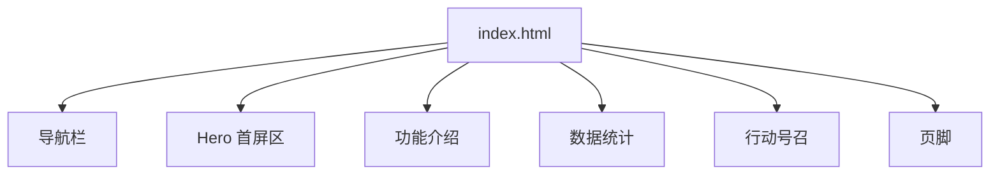
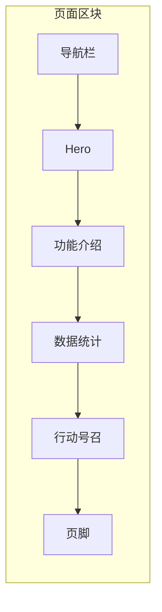
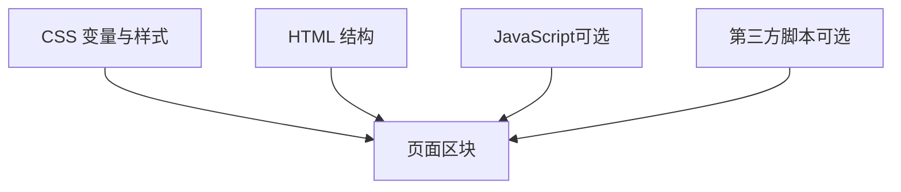

# 功能扩展指南

<cite>
**本文引用的文件**
- [index.html](file://index.html)
</cite>

## 目录
1. [简介](#简介)
2. [项目结构](#项目结构)
3. [核心组件](#核心组件)
4. [架构总览](#架构总览)
5. [详细组件分析](#详细组件分析)
6. [依赖关系分析](#依赖关系分析)
7. [性能注意事项](#性能注意事项)
8. [故障排查指南](#故障排查指南)
9. [结论](#结论)
10. [附录](#附录)

## 简介
本指南面向希望在不破坏现有样式与布局的前提下，为当前单页网站添加新功能、新特性卡片、统计数据项、页脚信息列以及第三方服务集成的开发者。你将学到：
- 如何复制并复用现有“功能卡片”模板来创建新的特性展示
- 如何在“数据统计”区域新增统计项和展示模块
- 如何扩展“页脚”区域，增加更多链接与信息列
- 如何集成第三方服务（如分析工具、聊天机器人）
- 如何添加 JavaScript 交互功能并遵循最佳实践

本指南以仓库中的单一入口文件为基础进行说明，确保所有步骤可直接落地实施。

## 项目结构
当前仓库采用极简的单页结构，所有样式与内容集中在一个 HTML 文件中，便于快速迭代与维护。页面包含以下主要区块：
- 导航栏（Navbar）
- Hero 首屏区
- 功能介绍（Features）
- 数据统计（Stats）
- 行动号召（CTA）
- 页脚（Footer）

图表来源
- [index.html:145-157](file://index.html#L145-L157)
- [index.html:159-169](file://index.html#L159-L169)
- [index.html:171-211](file://index.html#L171-L211)
- [index.html:213-235](file://index.html#L213-L235)
- [index.html:237-244](file://index.html#L237-L244)
- [index.html:246-283](file://index.html#L246-L283)

章节来源
- [index.html:1-287](file://index.html#L1-L287)

## 核心组件
- 导航栏：提供站点内锚点跳转与品牌标识
- Hero：主标题、副标题与行动按钮
- 功能介绍：网格化的功能卡片集合，用于展示产品能力
- 数据统计：数字指标展示区，增强信任感
- 行动号召：引导用户注册或试用
- 页脚：多列链接与版权信息

这些组件通过 CSS 变量统一主题色与圆角等视觉风格，保证一致性。

章节来源
- [index.html:27-50](file://index.html#L27-L50)
- [index.html:52-61](file://index.html#L52-L61)
- [index.html:62-88](file://index.html#L62-L88)
- [index.html:89-98](file://index.html#L89-L98)
- [index.html:99-109](file://index.html#L99-L109)
- [index.html:111-133](file://index.html#L111-L133)

## 架构总览
从结构与职责角度，页面由若干独立区块组成，每个区块具备清晰的语义化标签与类名，便于定位与扩展。样式通过 CSS 变量集中管理，响应式断点控制移动端布局。

图表来源
- [index.html:145-157](file://index.html#L145-L157)
- [index.html:159-169](file://index.html#L159-L169)
- [index.html:171-211](file://index.html#L171-L211)
- [index.html:213-235](file://index.html#L213-L235)
- [index.html:237-244](file://index.html#L237-L244)
- [index.html:246-283](file://index.html#L246-L283)

## 详细组件分析

### 如何复制现有功能卡片模板创建新特性
目标：在“功能介绍”区域新增一张或多张功能卡片，保持与现有卡片一致的视觉与交互。

操作步骤
- 定位“功能介绍”容器与网格布局，找到现有卡片的结构模式
- 复制任意一张现有卡片节点，粘贴到网格容器中
- 修改图标、标题与描述文案，必要时替换图标字符或引入图标资源
- 如需调整间距或尺寸，优先复用已有类名与 CSS 变量，避免新增全局样式
- 验证响应式表现，确保在小屏幕下仍保持良好可读性

参考位置
- 功能网格与卡片样式定义
- 功能卡片节点示例

章节来源
- [index.html:67-88](file://index.html#L67-L88)
- [index.html:178-209](file://index.html#L178-L209)

### 如何添加新的统计数据项与展示模块
目标：在“数据统计”区域新增统计项，或扩展为更丰富的数据展示模块。

操作步骤
- 定位“数据统计”网格容器，找到现有统计项的结构
- 复制现有统计项节点，粘贴到网格中
- 更新数值与描述文案；如需动画效果，可在后续通过 JavaScript 实现计数动画
- 若需新增展示模块（如图表、进度条），建议在同一 section 内新增子区块，并使用与现有一致的栅格布局
- 检查移动端适配，必要时调整栅格列数或字体大小

参考位置
- 数据统计网格与统计项样式
- 统计项节点示例

章节来源
- [index.html:89-98](file://index.html#L89-L98)
- [index.html:213-235](file://index.html#L213-L235)

### 如何扩展页脚区域，添加更多链接和信息列
目标：在页脚中新增一列或多列链接，或丰富公司信息、合作伙伴、社交媒体等板块。

操作步骤
- 定位页脚网格容器，查看当前列数与布局
- 新增一个列容器，设置合适的标题与链接列表
- 使用已有的链接列表样式类，保持一致的排版与悬停效果
- 如需新增信息块（如订阅表单、二维码），可新增子区块并保持与现有风格一致
- 验证响应式布局，确保在窄屏下列数合理折行

参考位置
- 页脚网格与链接列表样式
- 页脚各列节点示例

章节来源
- [index.html:111-133](file://index.html#L111-L133)
- [index.html:246-283](file://index.html#L246-L283)

### 如何集成第三方服务（分析工具、聊天机器人）
目标：在不侵入现有样式的前提下，安全地接入第三方脚本或服务。

操作步骤
- 在 <head> 末尾或 <body> 开头插入第三方提供的初始化脚本（例如分析 SDK、聊天机器人 SDK）
- 根据服务商文档配置必要的参数（如站点 ID、API Key、语言、主题等）
- 对于需要用户同意才能加载的服务，建议在页面底部添加“同意/拒绝”提示，并在用户同意后动态加载脚本
- 将第三方脚本置于合适的位置，避免阻塞关键渲染路径
- 测试在不同浏览器与设备上的行为，确认无控制台报错与样式冲突

注意
- 尽量使用异步加载策略，减少首屏阻塞
- 对敏感配置使用环境变量或后端注入方式，避免硬编码在前端

章节来源
- [index.html:1-6](file://index.html#L1-L6)
- [index.html:285-286](file://index.html#L285-L286)

### 如何添加 JavaScript 交互功能与最佳实践
目标：为页面添加交互逻辑（如滚动监听、计数动画、弹窗、埋点等），同时保持代码整洁与可维护。

推荐做法
- 将 JS 放在 </body> 前或按需异步加载，避免阻塞首屏渲染
- 使用事件委托与最小 DOM 操作，提升性能
- 对动画与重排重绘进行节流/防抖处理
- 使用 CSS 变量与现有类名，避免新增全局样式污染
- 对第三方脚本进行封装，提供开关与错误重试机制

常见交互场景
- 滚动时高亮导航项
- 进入视口时触发数字递增动画
- 点击按钮弹出反馈或跳转到注册流程
- 收集埋点数据上报

章节来源
- [index.html:285-286](file://index.html#L285-L286)

## 依赖关系分析
当前项目为单文件结构，内部依赖主要体现在：
- 样式依赖 CSS 变量与媒体查询，影响全局外观与响应式行为
- 结构依赖语义化标签与类名，便于定位与扩展
- 可选的 JavaScript 依赖外部脚本与服务

图表来源
- [index.html:10-24](file://index.html#L10-L24)
- [index.html:145-283](file://index.html#L145-L283)

章节来源
- [index.html:1-287](file://index.html#L1-L287)

## 性能注意事项
- 尽量减少不必要的重排与重绘，批量更新 DOM
- 图片与图标资源按需加载，避免阻塞首屏
- 第三方脚本使用异步加载，并考虑失败回退
- 合理使用 CSS 变量与复用类名，降低样式体积
- 在移动端优化字体大小与间距，提升可读性与触控体验

[本节为通用指导，不直接分析具体文件]

## 故障排查指南
常见问题与解决思路
- 新增卡片错位或溢出：检查网格容器与卡片宽度约束，确保未破坏栅格布局
- 统计项显示异常：核对数值格式与单位，必要时增加占位文本
- 页脚列数过多导致换行异常：调整栅格列数或在小屏幕下隐藏次要列
- 第三方脚本不生效：检查网络请求是否被拦截、参数是否正确、是否在用户同意后才加载
- 交互无响应：确认事件绑定时机与选择器正确，避免重复绑定

章节来源
- [index.html:67-98](file://index.html#L67-L98)
- [index.html:111-133](file://index.html#L111-L133)
- [index.html:213-235](file://index.html#L213-L235)
- [index.html:246-283](file://index.html#L246-L283)

## 结论
通过在现有单页结构中按模块扩展，你可以高效地添加新功能、统计数据、页脚信息与第三方服务。遵循统一的样式变量与栅格布局，能够保证整体一致性与可维护性。结合合理的 JavaScript 交互与性能优化策略，可以进一步提升用户体验与系统稳定性。

[本节为总结性内容，不直接分析具体文件]

## 附录

### 快速清单
- 新增功能卡片：复制现有卡片节点 → 修改文案与图标 → 验证响应式
- 新增统计项：复制统计项节点 → 更新数值与描述 → 可选添加计数动画
- 扩展页脚：新增列容器 → 添加链接列表 → 验证小屏布局
- 集成第三方服务：插入脚本 → 配置参数 → 异步加载与容错
- 添加交互：定位目标元素 → 绑定事件 → 优化性能与兼容性

[本节为操作清单，不直接分析具体文件]