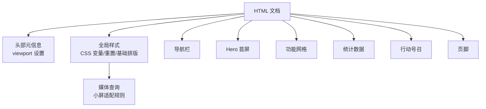
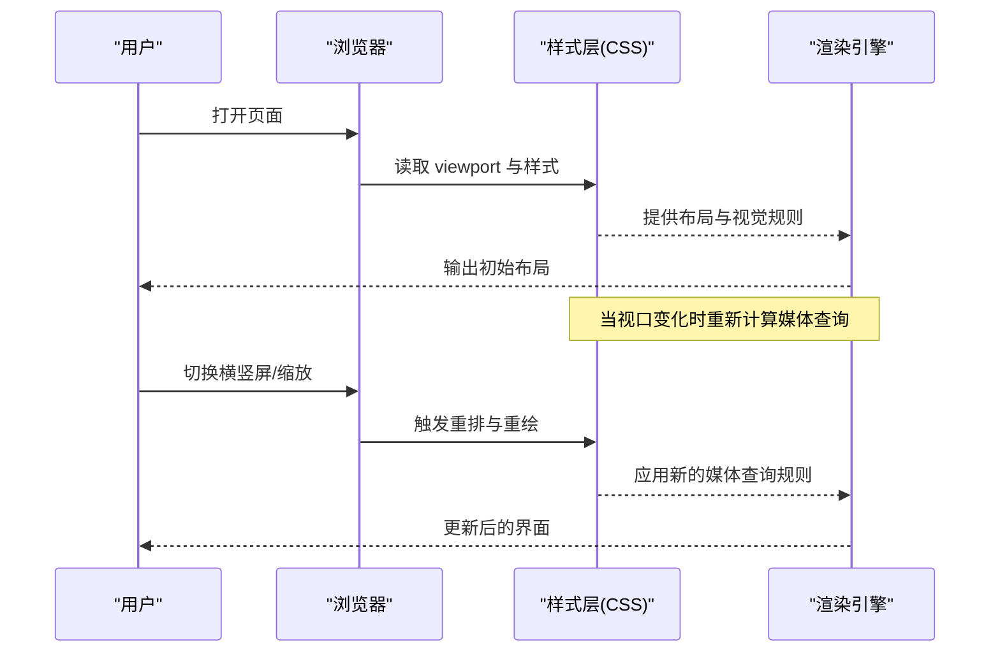
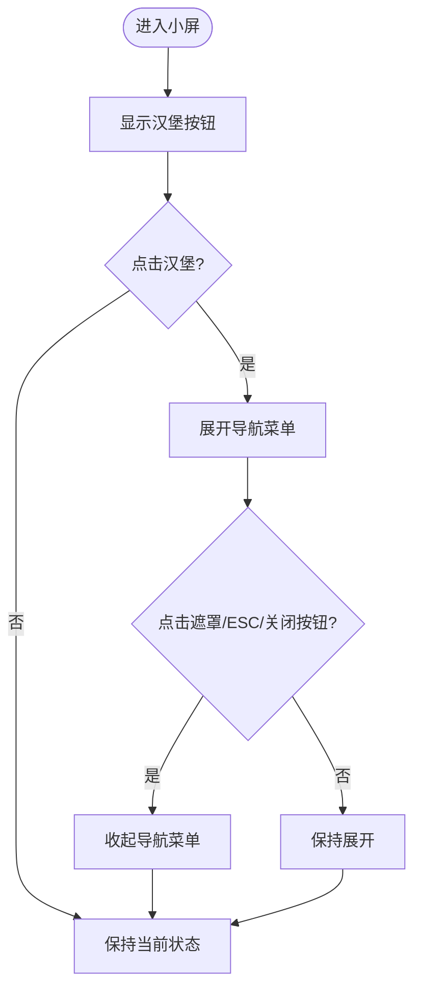
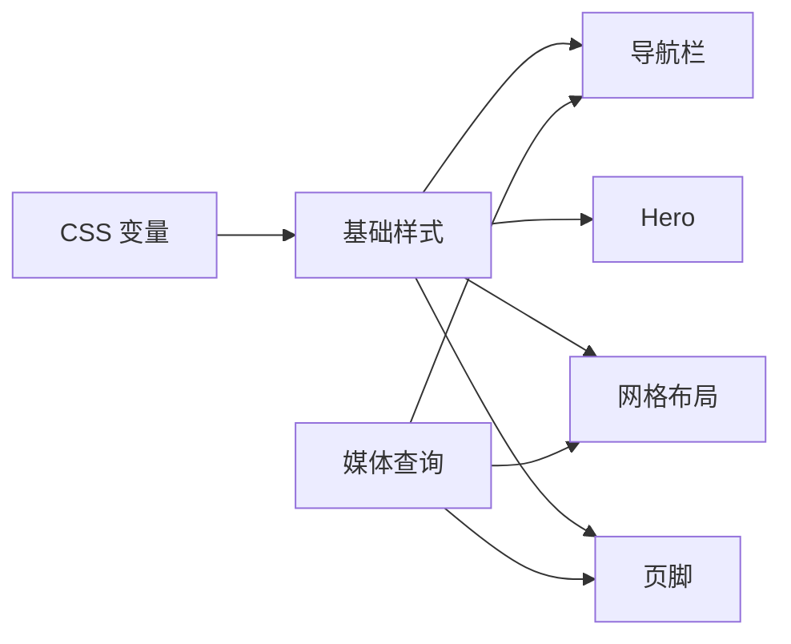

# 响应式适配指南

<cite>
**本文引用的文件**
- [index.html](file://index.html)
</cite>

## 目录
1. [简介](#简介)
2. [项目结构](#项目结构)
3. [核心组件](#核心组件)
4. [架构总览](#架构总览)
5. [详细组件分析](#详细组件分析)
6. [依赖关系分析](#依赖关系分析)
7. [性能考量](#性能考量)
8. [故障排查指南](#故障排查指南)
9. [结论](#结论)
10. [附录](#附录)

## 简介
本指南面向需要在不同设备上获得一致、流畅体验的前端开发者与设计师。基于当前项目的单页 HTML 结构与内联样式，我们将系统讲解：
- 媒体查询的使用方法与断点设置策略
- 移动端用户体验优化步骤
- 网格布局、字体大小与间距在小屏上的调整方法
- 常见响应式问题的解决方案（导航菜单适配、图片缩放、触摸交互）
- 测试响应式效果的实用工具与技巧

## 项目结构
本项目为单页应用，所有结构与样式集中在一个 HTML 文件中，便于快速迭代与演示。页面包含以下主要区域：
- 导航栏（sticky 顶部固定）
- Hero 首屏区
- 功能特性网格
- 数据统计区
- 行动号召（CTA）
- 页脚（多列链接）

图表来源
- [index.html:1-287](file://index.html#L1-L287)

章节来源
- [index.html:1-287](file://index.html#L1-L287)

## 核心组件
- 视口与基础排版：通过 viewport meta 启用设备宽度自适应；使用 CSS 变量统一主题色、圆角等；基础排版采用系统字体栈，保证跨平台一致性。
- 导航栏：桌面端水平排列，小屏隐藏原生导航项，需配合交互实现折叠菜单。
- 网格布局：功能与统计区使用 CSS Grid，auto-fit + minmax 实现弹性列数；页脚在桌面端为多列，小屏自动折行。
- 图片与媒体：img 默认 max-width: 100% 防止溢出；可结合 srcset/picture 做更精细的媒体适配。
- 按钮与交互：按钮具备 hover/active 反馈；移动端建议增加触摸目标尺寸与点击反馈。

章节来源
- [index.html:1-287](file://index.html#L1-L287)

## 架构总览
从渲染到适配的关键链路如下：
- 浏览器根据 viewport 计算布局宽度
- 解析 CSS 变量与基础样式
- 按媒体查询条件应用不同样式（如隐藏导航、调整字号与网格列数）
- 用户交互触发状态变化（如展开/收起菜单）

图表来源
- [index.html:1-287](file://index.html#L1-L287)

## 详细组件分析

### 媒体查询与断点策略
- 当前已定义小屏断点：在最大宽度 768px 时，缩小标题字号、隐藏桌面导航、将页脚网格改为两列。
- 建议断点规划（以内容为中心，而非特定设备）：
  - 手机竖屏：≤ 480px（单列、紧凑间距、大触控目标）
  - 手机横屏/小平板：481–768px（适度双列或保留单列但增大留白）
  - 平板：769–1024px（三列网格、适度字号）
  - 桌面：≥ 1025px（四列及以上、更大留白）
- 实践要点：
  - 优先使用相对单位（rem/em/%），避免硬编码像素
  - 使用 min-width 渐进增强，减少覆盖冲突
  - 针对内容密度调整间距与字号，而非盲目跟随设备宽度

章节来源
- [index.html:135-141](file://index.html#L135-L141)

### 网格布局与小屏适配
- 功能网格：使用 auto-fit + minmax(300px, 1fr)，在小屏自动减少列数以保持可读性。
- 统计网格：minmax(200px, 1fr) 确保数字卡片在小屏仍具足够宽度。
- 页脚网格：桌面端四列，小屏切换为两列，进一步提升信息密度与可用性。
- 建议：
  - 在小屏上适当增大卡片内边距，提升可读性
  - 对复杂表格或长列表，考虑横向滚动容器或分页

章节来源
- [index.html:67-71](file://index.html#L67-L71)
- [index.html:91-95](file://index.html#L91-L95)
- [index.html:117-122](file://index.html#L117-L122)
- [index.html:135-141](file://index.html#L135-L141)

### 字体大小与间距优化
- 标题字号：在小屏下降低层级标题字号，避免换行过多导致阅读疲劳。
- 正文行高与字距：保持 1.5–1.8 的行高，提升移动端可读性。
- 间距：在小屏减少 section 上下内边距，使内容更紧凑；按钮与输入框高度不低于 44px，满足触控要求。
- 建议：
  - 使用 clamp() 或 rem 组合实现平滑缩放
  - 在大屏上增加留白，在小屏上压缩冗余空间

章节来源
- [index.html:57-60](file://index.html#L57-L60)
- [index.html:135-141](file://index.html#L135-L141)

### 导航菜单适配（常见问题与解法）
- 现状：小屏隐藏了桌面导航，需要补充移动端菜单入口与交互逻辑。
- 推荐方案：
  - 添加汉堡按钮，点击展开全屏或抽屉式菜单
  - 菜单项垂直堆叠，增大点击区域
  - 支持键盘 Tab 导航与 ESC 关闭
  - 使用 aria-expanded/aria-controls 提升无障碍体验
- 交互流程示意：

图表来源
- [index.html:135-141](file://index.html#L135-L141)

### 图片缩放与媒体适配
- 现状：img 设置了 max-width: 100%，避免溢出容器。
- 进阶优化：
  - 使用 srcset 与 sizes 提供不同分辨率图片
  - 使用 picture 元素按断点切换图片格式（如 webp）
  - 对背景图使用 background-size: cover/contain 并配合 media query
  - 懒加载与占位图提升首屏性能

章节来源
- [index.html:23](file://index.html#L23)

### 触摸交互优化
- 触控目标：按钮与链接最小 44×44px，间距不小于 8px
- 反馈：增加 active 态与过渡动画，避免仅依赖 hover
- 手势：避免在小屏上使用复杂手势；如需滑动，提供明确提示
- 滚动：禁用不必要的惯性滚动干扰；必要时使用 overscroll-behavior

章节来源
- [index.html:41-49](file://index.html#L41-L49)

## 依赖关系分析
- 样式依赖：全局 CSS 变量被多处引用，修改一处即可全局生效
- 布局依赖：Grid 与 Flexbox 组合使用，形成弹性布局体系
- 媒体查询依赖：小屏规则覆盖部分桌面样式，需注意优先级与继承
- 潜在风险：若后续引入外部库，需检查其默认样式是否与现有变量冲突

图表来源
- [index.html:10-24](file://index.html#L10-L24)
- [index.html:135-141](file://index.html#L135-L141)

章节来源
- [index.html:10-24](file://index.html#L10-L24)
- [index.html:135-141](file://index.html#L135-L141)

## 性能考量
- 首屏性能：减少不必要的样式与脚本；图片按需加载
- 重排与重绘：避免频繁改变布局属性；合并样式变更
- 资源体积：压缩图片与字体；按需加载第三方资源
- 可访问性：语义化标签、对比度、键盘可达性

[本节为通用指导，不直接分析具体文件]

## 故障排查指南
- 问题：小屏导航不可见且无法展开
  - 检查媒体查询是否隐藏了导航
  - 确认汉堡按钮可见性与 z-index
  - 验证事件绑定与 aria 属性
- 问题：图片溢出或变形
  - 检查 img 的 max-width 与父容器宽度
  - 确认是否使用了正确的 aspect-ratio 或 object-fit
- 问题：按钮太小难以点击
  - 调整 padding 与 font-size，确保触控目标 ≥ 44px
- 问题：网格在小屏拥挤
  - 调整 minmax 阈值或改用单列布局
  - 增加卡片内边距与行高

章节来源
- [index.html:135-141](file://index.html#L135-L141)
- [index.html:23](file://index.html#L23)
- [index.html:41-49](file://index.html#L41-L49)

## 结论
通过合理的断点策略、弹性网格与触控优化，可以在不同设备上提供一致且高效的浏览体验。建议在开发中坚持“移动优先”和“内容驱动”的原则，持续用真实设备与工具进行验证，逐步完善细节。

[本节为总结性内容，不直接分析具体文件]

## 附录

### 常用断点参考（可按需调整）
- ≤ 480px：手机竖屏
- 481–768px：手机横屏/小平板
- 769–1024px：平板
- ≥ 1025px：桌面

[本节为通用参考，不直接分析具体文件]

### 测试工具与技巧
- 浏览器开发者工具：设备模拟、网络节流、性能面板
- 真机测试：iOS Safari、Android Chrome、微信内置浏览器
- 自动化：Lighthouse、WebPageTest、Responsive Design Checker
- 可访问性：axe DevTools、WAVE、Keyboard-only 测试

[本节为通用参考，不直接分析具体文件]