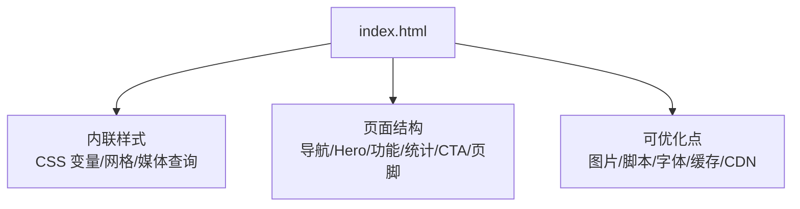
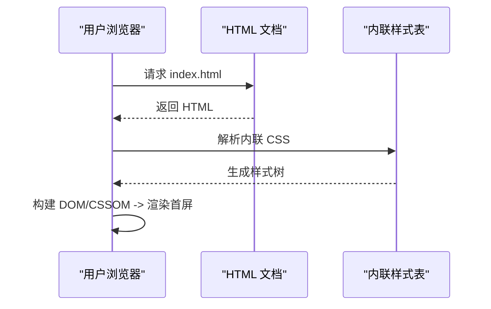
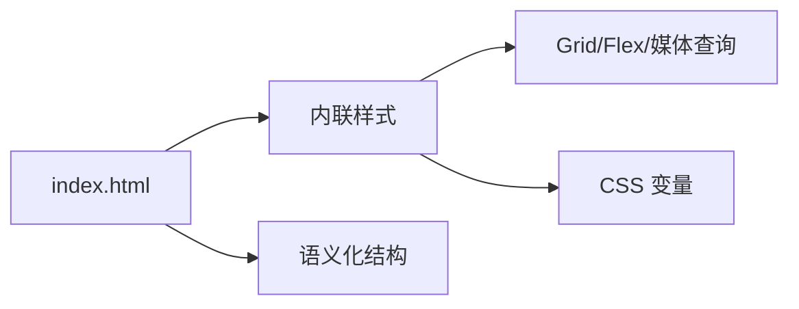

# 性能优化指南

<cite>
**本文引用的文件**
- [index.html](file://index.html)
</cite>

## 目录
1. [简介](#简介)
2. [项目结构](#项目结构)
3. [核心组件](#核心组件)
4. [架构总览](#架构总览)
5. [详细组件分析](#详细组件分析)
6. [依赖分析](#依赖分析)
7. [性能考虑](#性能考虑)
8. [故障排查指南](#故障排查指南)
9. [结论](#结论)
10. [附录](#附录)

## 简介
本指南面向落地页的性能优化，目标是提升首屏加载速度、降低交互延迟并改善整体用户体验。内容覆盖图片资源优化（格式选择、尺寸压缩、懒加载）、CSS/HTML 代码优化（减少重复、使用现代特性）、HTTP 请求与资源加载顺序优化、页面速度测试与监控方法，以及 CDN 部署与缓存配置建议。所有建议均结合当前落地页的实际结构与实现进行说明。

## 项目结构
当前仓库为单页落地页，包含一个 HTML 文件，内联 CSS 样式，无外部脚本与图片资源。页面由导航栏、Hero、功能介绍、数据统计、CTA、页脚等区块组成，采用响应式布局与现代 CSS 变量。

图表来源
- [index.html:1-287](file://index.html#L1-L287)

章节来源
- [index.html:1-287](file://index.html#L1-L287)

## 核心组件
- 导航栏：粘性定位、毛玻璃背景、移动端隐藏导航链接。
- Hero：大标题与行动按钮，渐变背景。
- 功能介绍：网格卡片，悬停动效。
- 数据统计：数字展示区。
- CTA：高对比度背景与主按钮。
- 页脚：多列链接与版权信息。

这些组件均为纯 HTML/CSS 实现，未引入第三方库，有利于减少 HTTP 请求与解析开销。

章节来源
- [index.html:27-141](file://index.html#L27-L141)
- [index.html:145-283](file://index.html#L145-L283)

## 架构总览
从渲染角度，页面遵循“HTML 结构 + 内联 CSS”的轻量架构。由于没有外部资源，关键路径较短，但仍有进一步优化的空间，如：
- 将关键 CSS 保留在头部，非关键样式按需拆分或延迟加载（若未来扩展）。
- 避免阻塞渲染的内联脚本；当前无脚本，已满足最佳实践。
- 通过语义化标签与合理的 DOM 层级，提升可访问性与渲染效率。

图表来源
- [index.html:1-287](file://index.html#L1-L287)

## 详细组件分析

### 图片资源优化
现状：页面未使用图片，全部以文本与 CSS 图形为主，这本身就是一种高效的优化策略。

建议（当需要引入图片时）：
- 格式选择
  - 照片类优先 WebP/AVIF，兼顾兼容性时可回退到 JPEG/PNG。
  - 图标/矢量图优先 SVG，便于缩放与主题色控制。
- 尺寸与压缩
  - 按显示尺寸提供多分辨率版本，或使用 srcset/sizes 让浏览器自动选择合适尺寸。
  - 使用有损/无损压缩工具对图片进行体积优化，去除元数据。
- 懒加载
  - 对首屏外的图片使用 loading="lazy" 或 IntersectionObserver 实现懒加载。
  - 为视频/大图设置占位符，避免布局抖动。
- 预加载与优先级
  - 首屏关键图片使用 rel="preload" 提高优先级。
  - 非关键图片使用 rel="prefetch" 或按需加载。

章节来源
- [index.html:23-23](file://index.html#L23-L23)

### CSS/HTML 代码优化
现状：
- 使用 CSS 变量统一管理颜色与圆角，利于维护与主题切换。
- 使用 Grid/Flexbox 布局，具备良好响应式能力。
- 内联样式避免了额外请求，但存在重复定义与可复用性不足的问题。

优化建议：
- 减少重复代码
  - 将通用样式抽取为独立样式块或组件级样式，避免多处重复定义。
  - 使用原子化或设计系统思路组织样式，确保一致性。
- 使用现代 CSS 特性
  - 使用 :has()、:is()、:where() 简化选择器与层叠逻辑。
  - 使用 container queries 替代部分媒体查询，提升组件级响应式能力。
  - 使用 backdrop-filter 等视觉特性时注意性能影响，必要时降级。
- 可访问性与语义化
  - 保持语义化标签（header/nav/section/footer），提升可访问性与 SEO。
  - 为交互元素提供足够的对比度与焦点状态。

章节来源
- [index.html:10-19](file://index.html#L10-L19)
- [index.html:67-87](file://index.html#L67-L87)
- [index.html:135-141](file://index.html#L135-L141)

### 减少 HTTP 请求与优化资源加载顺序
现状：无外部 CSS/JS/图片/字体，关键路径极短，已具备优秀的基础性能。

建议（随项目演进）：
- 资源拆分与优先级
  - 关键 CSS 内联或尽早加载，非关键样式延迟加载。
  - 脚本按需加载，避免阻塞首屏渲染。
- 合并与压缩
  - 合并小资源以减少请求数；启用 Gzip/Brotli 压缩。
- 缓存策略
  - 静态资源开启强缓存与协商缓存，合理设置 Cache-Control/ETag。
- 字体优化
  - 使用 font-display: swap 避免 FOIT；仅加载必要字重与字符集。
- 预连接与预取
  - 对关键第三方域名使用 rel="preconnect"/dns-prefetch。
  - 对即将使用的资源使用 rel="prefetch"。

章节来源
- [index.html:1-287](file://index.html#L1-L287)

### 页面速度测试与性能监控
- 测试工具
  - Lighthouse：评估性能、可访问性、SEO 与最佳实践。
  - WebPageTest：深入分析瀑布流、首字节时间、可交互时间等指标。
  - Chrome DevTools Performance/Network：录制性能轨迹与网络请求。
- 监控方法
  - 前端埋点上报 Core Web Vitals（LCP、FID/INP、CLS）。
  - 建立性能基线与告警阈值，持续跟踪趋势变化。
  - 在 CI/CD 中集成性能回归检测，防止性能退化。

[本节为通用指导，不直接分析具体文件]

### CDN 部署与资源缓存配置
- CDN 部署
  - 将静态资源托管至 CDN，就近分发，降低延迟。
  - 启用 HTTP/2 或 HTTP/3，提升并发与传输效率。
- 缓存配置
  - 静态资源设置长期缓存（如一年），配合文件名哈希或版本号更新。
  - HTML 文件设置短期缓存或禁用缓存，确保及时更新。
  - 合理使用 ETag/Last-Modified 进行协商缓存。
- 安全与可用性
  - 启用 HTTPS，强制跳转。
  - 配置 CORS 与安全头（如 CSP、X-Frame-Options）。

[本节为通用指导，不直接分析具体文件]

## 依赖分析
当前页面为自包含的单文件，无外部依赖，耦合度低、内聚度高，适合快速迭代与部署。

图表来源
- [index.html:10-19](file://index.html#L10-L19)
- [index.html:67-87](file://index.html#L67-L87)
- [index.html:135-141](file://index.html#L135-L141)

章节来源
- [index.html:1-287](file://index.html#L1-L287)

## 性能考虑
- 首屏渲染
  - 保持关键路径最短；当前无外部资源，已具备优势。
  - 避免阻塞渲染的脚本；当前无脚本，符合最佳实践。
- 内存与计算
  - 减少不必要的重排与重绘；当前样式简洁，动画较少。
  - 谨慎使用复杂滤镜与阴影；当前仅在少量元素上使用。
- 可访问性与体验
  - 保证键盘可达与焦点可见；当前基础样式支持默认焦点态。
  - 提供合适的对比度与文案可读性；当前配色与字号较为清晰。

[本节为通用指导，不直接分析具体文件]

## 故障排查指南
- 首屏慢
  - 检查是否存在未发现的阻塞资源；当前无外部资源，重点观察本地环境差异。
  - 使用 Lighthouse/DevTools 定位瓶颈。
- 布局抖动
  - 为图片/视频预留尺寸或使用占位符；当前无图片，暂无此问题。
- 样式冲突
  - 使用 CSS 变量与设计系统统一样式；当前已使用变量，建议继续收敛样式。
- 缓存失效
  - 确认 CDN 与服务器缓存策略是否正确；HTML 应短缓存，静态资源长缓存。

[本节为通用指导，不直接分析具体文件]

## 结论
当前落地页采用单文件、内联样式的轻量架构，天然具备较短的关键路径与较少的 HTTP 请求，已具备良好的性能基础。随着功能扩展，建议逐步引入图片懒加载、资源拆分、缓存与 CDN 等优化手段，并通过测试与监控持续保障性能指标。

[本节为总结性内容，不直接分析具体文件]

## 附录
- 术语
  - LCP：最大内容绘制，衡量主要内容加载完成时间。
  - INP：输入到下一次绘制，衡量交互响应性。
  - CLS：累积布局偏移，衡量视觉稳定性。
- 参考实践
  - 使用 WebP/AVIF 与 SVG 优化图片体积。
  - 使用容器查询与 CSS 变量提升样式可维护性。
  - 通过 CDN 与缓存策略提升全球访问速度与稳定性。

[本节为补充信息，不直接分析具体文件]