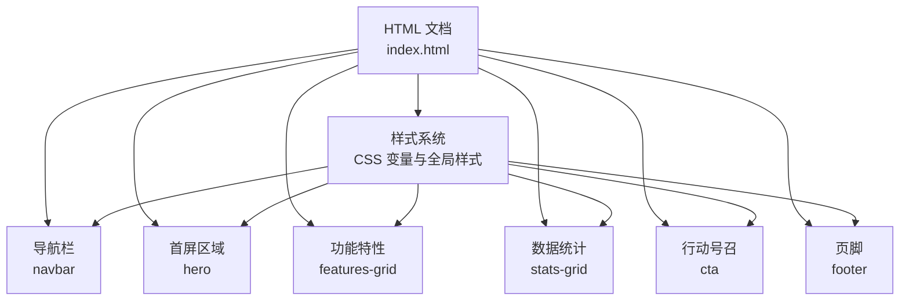
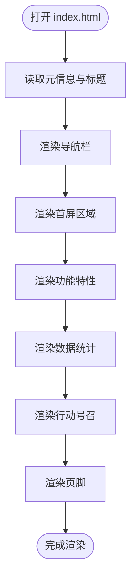
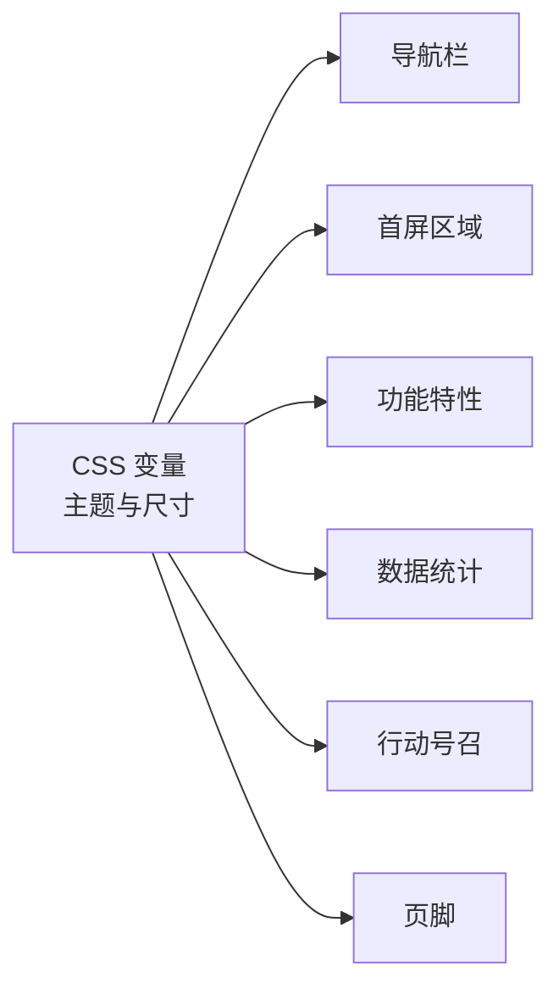

# 自定义和扩展指南

<cite>
**本文引用的文件**
- [index.html](file://index.html)
</cite>

## 目录
1. [简介](#简介)
2. [项目结构](#项目结构)
3. [核心组件](#核心组件)
4. [架构总览](#架构总览)
5. [详细组件分析](#详细组件分析)
6. [依赖关系分析](#依赖关系分析)
7. [性能优化建议](#性能优化建议)
8. [故障排查指南](#故障排查指南)
9. [结论](#结论)
10. [附录](#附录)

## 简介
本指南面向不同技能水平的用户，提供从基础修改到高级定制的完整路径，帮助你基于现有落地页进行品牌化、内容定制、主题配色、响应式适配、功能扩展、SEO 与性能优化。所有说明均围绕当前单文件落地页实现，便于快速上手与迭代。

## 项目结构
本项目为单文件落地页，包含 HTML 结构与内联 CSS 样式，无外部依赖。页面由导航栏、首屏 Hero、功能特性区、数据统计区、行动号召区与页脚组成，并通过 CSS 变量统一管理主题色与间距等设计令牌。

图表来源
- [index.html:1-287](file://index.html#L1-L287)

章节来源
- [index.html:1-287](file://index.html#L1-L287)

## 核心组件
- 导航栏：包含品牌标识、主导航链接与行动按钮，支持粘性定位与毛玻璃背景效果。
- 首屏区域：展示核心价值主张、副标题与双按钮（主要/次要）。
- 功能特性：网格布局卡片，图标+标题+描述，悬停动效。
- 数据统计：四列统计项，强调数字与文案对比。
- 行动号召：高对比背景区块，引导注册或试用。
- 页脚：多列链接分组与版权信息。

章节来源
- [index.html:145-283](file://index.html#L145-L283)

## 架构总览
该落地页采用“单文件 + 内联样式”的轻量架构，通过 CSS 变量集中管理主题与尺寸，使用语义化标签组织内容，利用 CSS Grid/Flexbox 实现响应式布局。整体可维护性良好，适合快速定制与二次开发。

图表来源
- [index.html:1-287](file://index.html#L1-L287)

## 详细组件分析

### 品牌信息与文案内容
- 品牌名称与标题
  - 在页面头部设置文档语言、视口与页面标题，便于 SEO 与国际化。
  - 导航栏的品牌标识用于快速识别品牌。
- 文案位置
  - 首屏区域的主标题、副标题与按钮文案。
  - 功能特性区的标题与描述。
  - 数据统计区的数值与单位文案。
  - 行动号召区的标题、说明与按钮文案。
  - 页脚的公司介绍与各列链接文案。
- 修改建议
  - 保持文案简洁有力，突出价值点与行动指令。
  - 统一术语与语气风格，确保跨设备一致阅读体验。

章节来源
- [index.html:3-6](file://index.html#L3-L6)
- [index.html:145-157](file://index.html#L145-L157)
- [index.html:159-169](file://index.html#L159-L169)
- [index.html:171-211](file://index.html#L171-L211)
- [index.html:213-235](file://index.html#L213-L235)
- [index.html:237-244](file://index.html#L237-L244)
- [index.html:246-283](file://index.html#L246-L283)

### 链接地址配置
- 导航链接：指向功能、数据、方案与文档锚点或外部资源。
- 首屏按钮：分别跳转到行动号召区与功能特性区。
- 页脚链接：产品、资源、公司相关页面的入口。
- 修改建议
  - 将占位链接替换为真实 URL；内部跳转建议使用锚点以增强用户体验。
  - 对外部链接考虑添加目标属性与 rel 属性以提升安全性与 SEO。

章节来源
- [index.html:145-157](file://index.html#L145-L157)
- [index.html:159-169](file://index.html#L159-L169)
- [index.html:246-283](file://index.html#L246-L283)

### 颜色主题自定义
- 主题变量
  - 主色调与深色变体用于按钮、强调文本与交互反馈。
  - 文本颜色与浅色文本用于层级区分。
  - 背景与替代背景用于分区视觉层次。
  - 边框与圆角用于统一控件外观。
- 调整方法
  - 在根级样式块中修改对应变量值即可全局生效。
  - 注意保持对比度，确保可读性与无障碍访问。
- 常见场景
  - 更换品牌主色：更新主色调与深色变体。
  - 暗色模式：调整文本与背景变量，必要时增加媒体查询切换。

章节来源
- [index.html:10-19](file://index.html#L10-L19)
- [index.html:27-49](file://index.html#L27-L49)
- [index.html:52-109](file://index.html#L52-L109)
- [index.html:111-133](file://index.html#L111-L133)

### 响应式适配与断点
- 当前断点
  - 在小屏幕下隐藏导航菜单，调整首屏标题字号与页脚网格列数。
- 调整建议
  - 根据业务需求新增断点，优化移动端布局与触控体验。
  - 针对小屏优化字体大小、行高与间距，提升可读性。
  - 如需保留移动端导航，可增加汉堡菜单与展开逻辑。

章节来源
- [index.html:135-141](file://index.html#L135-L141)

### 添加新的功能特性卡片
- 结构参考
  - 每个特性卡片包含图标容器、标题与描述段落。
  - 使用统一的网格类名以保持对齐与间距。
- 操作步骤
  - 复制现有卡片结构并修改图标、标题与描述。
  - 保持语义化标签与可访问性（如 alt、aria 等）要求。
  - 若需更多列，可在网格容器中继续添加卡片，布局会自动适应。
- 注意事项
  - 控制卡片内容长度，避免破坏网格对齐。
  - 图标可使用字符实体或 SVG，保持一致的尺寸与色彩。

章节来源
- [index.html:67-87](file://index.html#L67-L87)
- [index.html:171-211](file://index.html#L171-L211)

### 添加统计数据项
- 结构参考
  - 统计项由数值与描述组成，使用网格布局自动排列。
- 操作步骤
  - 复制统计项结构并更新数值与文案。
  - 保持数值与单位的可读性与一致性。
- 注意事项
  - 数值过大时注意字号与换行处理。
  - 如需动画计数，可在后续引入脚本实现。

章节来源
- [index.html:89-97](file://index.html#L89-L97)
- [index.html:213-235](file://index.html#L213-L235)

### 页脚链接扩展
- 结构参考
  - 页脚分为多列，每列包含标题与链接列表。
- 操作步骤
  - 在对应列中添加新的链接项，保持语义化与可访问性。
  - 合理分组链接，提升导航效率。
- 注意事项
  - 链接文案应明确表达目的地。
  - 对重要链接进行优先级排序。

章节来源
- [index.html:111-133](file://index.html#L111-L133)
- [index.html:246-283](file://index.html#L246-L283)

### 行动号召区定制
- 内容定制
  - 修改标题、说明与按钮文案，突出限时优惠或关键卖点。
- 样式定制
  - 可通过主题变量调整背景与文字颜色，保持高对比度。
- 行为定制
  - 按钮可链接至注册表单、预约演示或下载资料。

章节来源
- [index.html:99-109](file://index.html#L99-L109)
- [index.html:237-244](file://index.html#L237-L244)

## 依赖关系分析
- 无外部依赖：样式与结构全部内联，便于部署与维护。
- 样式依赖
  - 全局重置与基础样式为各组件提供一致的基线。
  - CSS 变量被多处引用，形成主题联动。
- 结构依赖
  - 网格与弹性布局依赖浏览器现代特性，兼容性良好。

图表来源
- [index.html:10-19](file://index.html#L10-L19)
- [index.html:27-133](file://index.html#L27-L133)

章节来源
- [index.html:1-287](file://index.html#L1-L287)

## 性能优化建议
- 图片优化
  - 使用合适的格式与尺寸，启用懒加载以减少首屏负载。
  - 为图片提供 alt 文本，提升可访问性与 SEO。
- CSS 优化
  - 压缩与合并样式文件（当前为内联样式，生产环境可提取并压缩）。
  - 移除未使用的样式规则，减少体积。
- 加载速度提升
  - 启用浏览器缓存策略（HTTP 头）。
  - 使用 CDN 托管静态资源（如未来引入外部资源）。
  - 最小化重排与重绘，避免复杂动画。
- 可访问性
  - 保证足够的对比度与键盘可达性。
  - 为交互元素提供清晰的焦点状态。

[本节为通用指导，不直接分析具体代码文件]

## 故障排查指南
- 样式冲突
  - 检查是否重复定义相同选择器或变量，优先使用 CSS 变量统一管理。
- 响应式异常
  - 确认媒体查询断点与内容宽度匹配，避免溢出或错位。
- 链接失效
  - 核对所有 href 是否为有效 URL 或锚点，避免空链接。
- 可访问性问题
  - 检查语义化标签是否正确，确保屏幕阅读器可识别。
- 性能问题
  - 使用浏览器开发者工具分析首屏加载与渲染瓶颈，逐步优化。

[本节为通用指导，不直接分析具体代码文件]

## 结论
本落地页采用轻量、易维护的单文件架构，通过 CSS 变量与语义化结构实现了良好的可扩展性与可定制性。按照本指南，你可以快速完成品牌化、内容更新、主题定制、响应式优化与功能扩展，并在 SEO 与性能方面持续提升用户体验。

[本节为总结性内容，不直接分析具体代码文件]

## 附录

### SEO 优化清单
- Meta 标签
  - 设置合适的标题、描述与关键词，确保唯一且准确。
  - 添加 Open Graph 与 Twitter Card 以提升社交分享效果。
- 语义化标签
  - 使用 header、nav、section、article、footer 等语义标签组织内容。
  - 合理使用 h1-h6 层级，确保内容结构清晰。
- 结构化数据
  - 添加 JSON-LD 结构化数据，标注组织、产品或服务信息。
  - 使用 schema.org 标准提升搜索引擎理解能力。
- 可访问性
  - 为图片提供 alt 文本，为表单提供 label。
  - 确保键盘导航与焦点可见。

[本节为通用指导，不直接分析具体代码文件]

### 快速修改对照表
- 品牌名称与标题
  - 修改页面标题与导航品牌标识。
- 文案内容
  - 更新首屏、功能、数据、行动号召与页脚的文案。
- 链接地址
  - 替换占位链接为真实 URL。
- 颜色主题
  - 调整 CSS 变量中的主色、文本与背景色。
- 响应式
  - 根据需要新增或调整媒体查询断点。
- 功能扩展
  - 复制现有卡片或统计项结构，按需增删改。

[本节为通用指导，不直接分析具体代码文件]