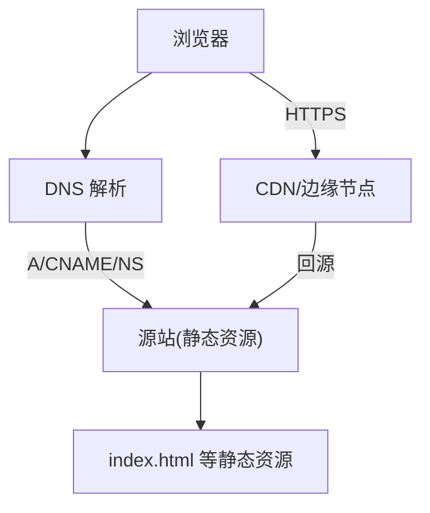
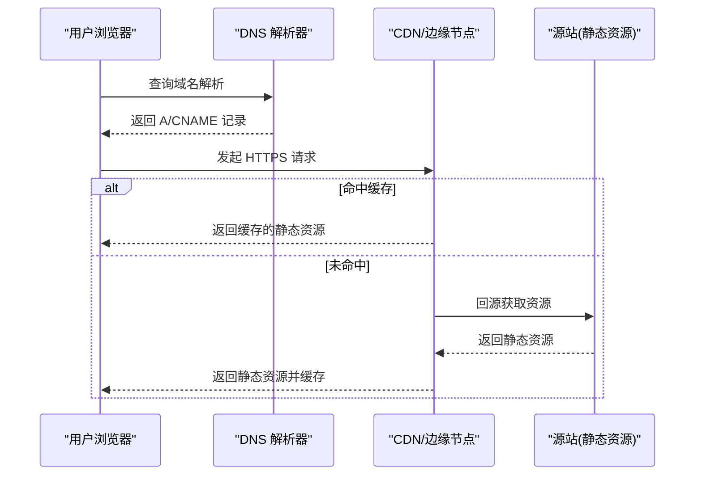
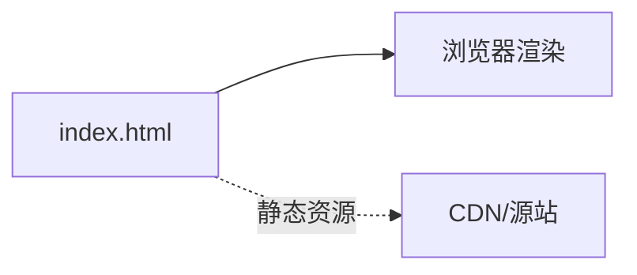

# 域名和HTTPS配置

<cite>
**本文引用的文件**
- [index.html](file://index.html)
</cite>

## 目录
1. [简介](#简介)
2. [项目结构](#项目结构)
3. [核心组件](#核心组件)
4. [架构总览](#架构总览)
5. [详细组件分析](#详细组件分析)
6. [依赖关系分析](#依赖关系分析)
7. [性能考虑](#性能考虑)
8. [故障排查指南](#故障排查指南)
9. [结论](#结论)
10. [附录](#附录)

## 简介
本技术文档面向运维与前端工程团队，提供为静态页面配置自定义域名与安全连接（HTTPS）的完整实践指南。内容涵盖：
- DNS 记录配置：A 记录、CNAME 记录、NS 记录的设置方法与适用场景
- SSL 证书申请与安装：Let's Encrypt 免费证书与商业证书的配置流程
- CDN 加速集成：Cloudflare、阿里云 CDN 等主流服务商的配置步骤
- HTTP 强制重定向到 HTTPS 的配置示例
- 混合内容问题的排查与解决
- 生产环境安全配置最佳实践与性能优化建议

本仓库包含一个静态 HTML 页面，作为演示站点用于验证域名解析、HTTPS 访问、CDN 缓存与性能指标。

## 项目结构
当前仓库仅包含一个静态入口页面 index.html，用于承载品牌展示与功能介绍。该页面不包含后端逻辑，因此所有域名绑定、HTTPS 与 CDN 相关能力均由外部服务（DNS 提供商、Web 服务器/反向代理、CDN）提供。

图表来源
- [index.html:1-287](file://index.html#L1-L287)

章节来源
- [index.html:1-287](file://index.html#L1-L287)

## 核心组件
- 静态资源：index.html 作为唯一入口，浏览器通过域名访问后由 Web 服务器或 CDN 直接返回。
- DNS 解析：负责将域名指向源站 IP 或通过 CNAME 指向 CDN 厂商提供的别名。
- 反向代理/服务器：可选 Nginx/Apache/Traefik 等，用于终止 TLS、HTTP→HTTPS 重定向、缓存控制、安全头设置。
- CDN：提供全球加速、缓存、WAF、TLS 卸载与自动证书管理等功能。
- 监控与日志：用于观测访问质量、错误率与性能指标。

章节来源
- [index.html:1-287](file://index.html#L1-L287)

## 架构总览
下图展示了从用户请求到静态资源返回的整体链路，包括 DNS、CDN、源站与浏览器之间的交互。

图表来源
- [index.html:1-287](file://index.html#L1-L287)

## 详细组件分析

### DNS 记录配置
- A 记录：将域名直接解析到源站 IPv4 地址。适用于自建服务器或云主机直出。
- AAAA 记录：将域名解析到 IPv6 地址（如源站支持）。
- CNAME 记录：将域名指向 CDN 或托管平台提供的别名。便于统一管理与弹性扩容。
- NS 记录：将域名的权威解析委托给第三方 DNS 服务商（如 Cloudflare DNS），实现更强大的解析与防护能力。

配置要点
- 首次上线建议先使用 A 记录直连源站进行验证，再切换至 CNAME 接入 CDN。
- 多地域或多环境可结合子域名与不同记录类型组合使用。
- 注意 TTL 设置：变更期间适当降低 TTL 以加快生效；稳定后提高 TTL 减少查询压力。

章节来源
- [index.html:1-287](file://index.html#L1-L287)

### SSL 证书申请与安装
- Let's Encrypt 免费证书
  - 申请方式：通过 ACME 客户端（如 certbot）在源站或反向代理上自动化申请与续期。
  - 部署位置：建议在反向代理层（Nginx/Traefik）或 CDN 层启用 TLS，避免源站暴露私钥。
  - 自动化续期：配置定时任务或系统服务自动更新证书。
- 商业证书
  - 购买与签发：从 CA 机构购买并签发证书，通常提供 .crt/.key 或 PFX 格式。
  - 部署位置：同样推荐在反向代理或 CDN 层部署，便于集中管理与轮换。
  - 证书链：确保上传完整的中间证书链，避免部分客户端校验失败。

注意事项
- 优先启用 HSTS（严格传输安全）以提升安全性。
- 合理选择加密套件与协议版本（如 TLS1.2/1.3）。
- 定期巡检证书有效期，避免过期导致服务中断。

章节来源
- [index.html:1-287](file://index.html#L1-L287)

### CDN 加速集成（Cloudflare、阿里云 CDN）
- Cloudflare
  - 接入方式：将域名 NS 记录指向 Cloudflare，或使用 CNAME 接入其托管模式。
  - 功能：自动 HTTPS、缓存策略、WAF、Bot 防护、性能优化（压缩、图片优化）。
  - 建议：开启“始终使用 HTTPS”、“最小 TLS 版本”、“HSTS”等安全选项。
- 阿里云 CDN
  - 接入方式：创建加速域名并配置 CNAME，将业务域名指向阿里云分配的名称。
  - 功能：HTTPS 证书上传或托管、缓存规则、防盗链、带宽峰值保障。
  - 建议：根据业务热点配置缓存键与过期时间，结合源站回源策略提升命中率。

章节来源
- [index.html:1-287](file://index.html#L1-L287)

### HTTP 强制重定向到 HTTPS
- 反向代理层（Nginx/Traefik）
  - 监听 80 端口并将所有请求 301 重定向到 443（HTTPS）。
  - 配合 HSTS 与证书链配置，确保首屏即走安全通道。
- CDN 层
  - 多数 CDN 提供“强制 HTTPS”开关，可在控制台一键启用。
  - 若同时使用反向代理，建议仅在 CDN 层处理重定向，减轻源站压力。

章节来源
- [index.html:1-287](file://index.html#L1-L287)

### 混合内容问题排查与解决
- 现象：页面通过 HTTPS 加载但包含 http:// 的资源（脚本、样式、图片、iframe），导致浏览器警告或阻止加载。
- 排查方法
  - 打开浏览器开发者工具，查看控制台中的混合内容警告。
  - 检查页面中硬编码的绝对 URL 是否使用了 http 协议。
- 解决方法
  - 将所有资源引用改为 https 或相对路径。
  - 使用 CDN 时，确保 CDN 已正确配置 HTTPS 且资源可通过 https 访问。
  - 对第三方资源，确认其支持 HTTPS；必要时通过镜像或代理替换。

章节来源
- [index.html:1-287](file://index.html#L1-L287)

### 生产环境安全配置最佳实践
- 强制 HTTPS：全站启用 HTTPS，并在反向代理或 CDN 层配置 301 重定向。
- HSTS：启用严格传输安全，指定最大存活时间与包含子域。
- 安全响应头：设置 X-Content-Type-Options、X-Frame-Options、Referrer-Policy、Permissions-Policy 等。
- 最小化暴露面：关闭不必要的端口与服务，限制回源白名单。
- 证书管理：自动化申请与续期，建立告警机制。
- 访问控制：结合 WAF 与 IP 白名单，限制敏感接口访问。
- 日志与审计：集中收集访问日志与安全事件，定期审计。

章节来源
- [index.html:1-287](file://index.html#L1-L287)

### 性能优化建议
- 缓存策略：对静态资源设置合理的 Cache-Control 与 ETag，利用 CDN 缓存提升命中率。
- 压缩与合并：启用 Gzip/Brotli 压缩，减少资源体积。
- 图片优化：使用现代格式（WebP/AVIF）、按需裁剪与懒加载。
- 资源预取：合理使用 Preload/Prefetch，提升关键路径加载速度。
- 网络优化：启用 HTTP/2 或 HTTP/3，缩短握手与传输延迟。
- 监控与度量：关注 LCP、FID、CLS 等核心指标，持续优化用户体验。

章节来源
- [index.html:1-287](file://index.html#L1-L287)

## 依赖关系分析
- 本仓库仅包含静态资源，不引入任何后端依赖。
- 域名解析与 HTTPS 能力完全由外部服务（DNS、CDN、反向代理）提供。
- 页面本身无外部脚本或样式外链，因此不存在跨域或混合内容风险（除非后续引入第三方资源）。

图表来源
- [index.html:1-287](file://index.html#L1-L287)

章节来源
- [index.html:1-287](file://index.html#L1-L287)

## 性能考虑
- 首屏加载：确保 index.html 体积小、无阻塞资源，启用 CDN 缓存。
- 缓存命中：合理设置静态资源的缓存策略，减少重复下载。
- 带宽优化：启用压缩与现代图片格式，降低带宽占用。
- 可用性：通过多地域 CDN 与高可用源站保障服务连续性。
- 监控：建立性能与错误率监控，及时发现问题并定位瓶颈。

[本节为通用指导，无需特定文件来源]

## 故障排查指南
- 域名无法解析
  - 检查 DNS 记录是否正确（A/CNAME/NS），TTL 是否生效。
  - 使用 dig/nslookup 验证解析结果。
- HTTPS 报错
  - 检查证书是否有效、是否包含完整证书链。
  - 确认反向代理或 CDN 已正确配置 TLS 与 HSTS。
- 混合内容警告
  - 在开发者工具中定位 http 资源，替换为 https 或相对路径。
- 缓存不生效
  - 检查 Cache-Control、ETag、CDN 缓存键与过期策略。
  - 清理 CDN 缓存后复测。
- 性能不达标
  - 分析 LCP/FID/CLS，优化关键资源与渲染路径。
  - 启用压缩、图片优化与 HTTP/2/3。

章节来源
- [index.html:1-287](file://index.html#L1-L287)

## 结论
通过将静态页面与 DNS、CDN、反向代理协同配置，可实现高性能、高可用的自定义域名与 HTTPS 访问。建议在生产环境中采用 CDN 统一管理证书与缓存，并结合安全头与 HSTS 提升安全性。持续监控与优化是保障用户体验的关键。

[本节为总结性内容，无需特定文件来源]

## 附录
- 常用命令与工具
  - 解析测试：dig、nslookup
  - 证书检测：openssl s_client、SSL Labs 在线检测
  - 性能测试：Lighthouse、WebPageTest
- 参考清单
  - DNS 记录类型说明（A/AAAA/CNAME/NS）
  - TLS 协议与加密套件建议
  - CDN 厂商控制台操作指引

[本节为补充信息，无需特定文件来源]