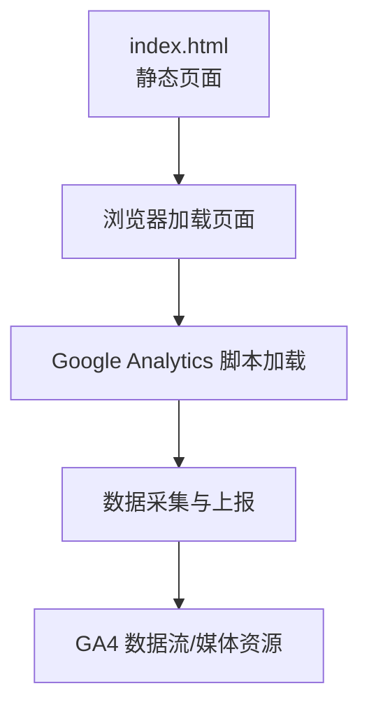
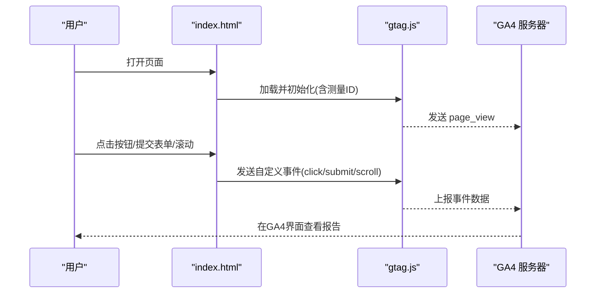
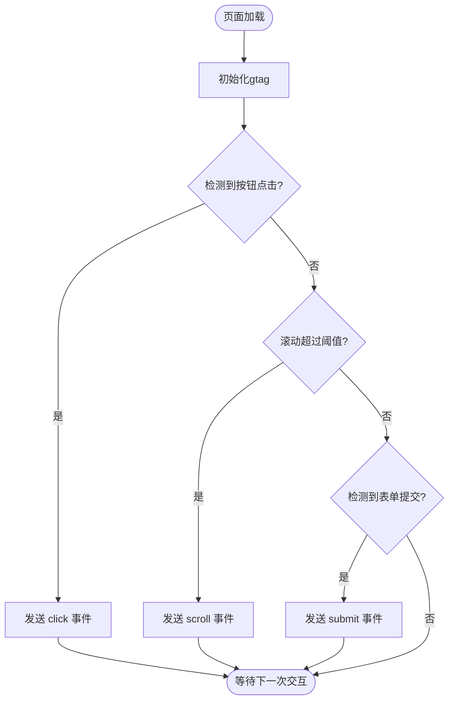
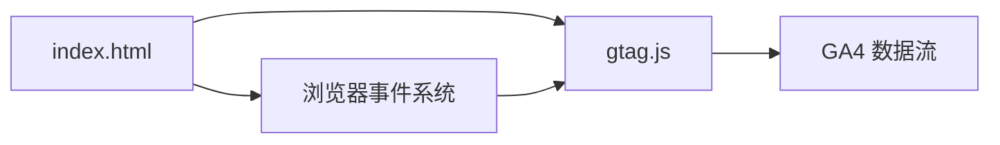

# Google Analytics集成

<cite>
**本文引用的文件**
- [index.html](file://index.html)
</cite>

## 目录
1. [简介](#简介)
2. [项目结构](#项目结构)
3. [核心组件](#核心组件)
4. [架构总览](#架构总览)
5. [详细组件分析](#详细组件分析)
6. [依赖关系分析](#依赖关系分析)
7. [性能考虑](#性能考虑)
8. [故障排查指南](#故障排查指南)
9. [结论](#结论)
10. [附录](#附录)

## 简介
本指南面向在静态HTML页面中集成Google Analytics（GA4）的产品与开发团队，提供从创建GA4属性、获取跟踪ID、插入分析代码到事件追踪、页面浏览统计、用户行为分析与数据验证的完整实施方案。文档同时给出基于GA数据的优化建议与决策支持方法，帮助团队用数据驱动产品增长。

## 项目结构
当前仓库包含一个静态HTML页面，作为GA集成的目标站点。该页面具备导航栏、功能介绍、数据统计展示、行动号召区域和页脚等常见模块，适合用于演示按钮点击、表单提交、页面滚动等事件的埋点位置。

图表来源
- [index.html:1-287](file://index.html#L1-L287)

章节来源
- [index.html:1-287](file://index.html#L1-L287)

## 核心组件
- GA4 媒体资源与数据流：用于接收来自页面的事件与页面浏览数据。
- 全局站点标识 gtag.js：负责初始化、发送页面浏览与自定义事件。
- 页面元素埋点：对按钮、链接、表单、滚动等行为进行事件采集。
- 调试工具：浏览器开发者工具、Google Tag Assistant、GA实时视图等。

章节来源
- [index.html:1-287](file://index.html#L1-L287)

## 架构总览
下图展示了从页面加载到数据上报的整体流程，以及关键配置点的位置。

图表来源
- [index.html:1-287](file://index.html#L1-L287)

## 详细组件分析

### 安装与配置步骤（GA4）
- 创建GA4属性与数据流
  - 登录Google Analytics，创建GA4属性，选择“网页”数据流。
  - 记录测量ID（格式通常为 G-XXXXXXXXXX）。
- 在页面中插入分析代码
  - 将gtag.js脚本插入到<head>或<body>起始处，使用测量ID完成初始化。
  - 确保在页面首次加载时触发page_view事件。
- 验证安装
  - 使用浏览器开发者工具的Network面板检查是否发出相关请求。
  - 使用GA4“实时”报告确认数据流入。

章节来源
- [index.html:1-287](file://index.html#L1-L287)

### 事件追踪实现
- 按钮点击
  - 为关键按钮添加事件监听，触发click事件并携带参数（如按钮名称、所在区域）。
  - 建议在导航栏CTA、Hero区按钮、底部CTA等位置埋点。
- 表单提交
  - 监听表单提交事件，触发submit事件并记录字段类型、提交结果等。
  - 注意避免重复上报与敏感信息泄露。
- 页面滚动
  - 监听滚动事件，按阈值（如25%、50%、75%、100%）触发scroll事件，便于衡量内容阅读深度。
- 链接点击
  - 对重要外链或内部跳转链接进行点击事件埋点，便于分析流量去向。

图表来源
- [index.html:1-287](file://index.html#L1-L287)

章节来源
- [index.html:1-287](file://index.html#L1-L287)

### 页面浏览统计与扩展
- 自定义维度与用户属性
  - 定义必要的自定义维度（如页面类别、内容类型）和用户属性（如用户等级、注册来源），在相应时机设置。
  - 通过事件参数或会话级参数传递上下文信息，增强数据分析能力。
- 会话参数
  - 在URL中添加UTM参数或使用referral信息，便于归因分析。
- 页面标题与路径
  - 确保每个页面的title与URL清晰明确，便于报表筛选与对比。

章节来源
- [index.html:1-287](file://index.html#L1-L287)

### 用户行为分析方案
- 用户路径分析
  - 利用“探索”中的“用户流”或“路径”图，观察用户在首页、功能介绍、CTA之间的流转情况。
- 转化漏斗
  - 定义关键转化步骤（如访问→点击CTA→提交表单→成功），在GA4中构建漏斗以识别流失环节。
- 用户分群
  - 基于来源、设备、地区、行为等条件创建分群，比较不同群体的转化与留存差异。

章节来源
- [index.html:1-287](file://index.html#L1-L287)

### 数据验证与调试
- 浏览器开发者工具
  - 在Network面板过滤analytics相关请求，确认page_view与自定义事件是否正确发送。
- Google Tag Assistant / GA调试模式
  - 启用调试模式查看事件详情与参数，定位缺失或错误的数据。
- GA4实时报告
  - 在“实时”视图中观察当前活跃用户与最近事件，快速验证埋点生效。

章节来源
- [index.html:1-287](file://index.html#L1-L287)

## 依赖关系分析
- 页面与脚本
  - index.html承载页面结构与交互，gtag.js作为外部依赖负责数据采集。
- 事件与数据流
  - 页面交互触发事件，经gtag.js上报至GA4数据流，最终在GA4界面呈现。

图表来源
- [index.html:1-287](file://index.html#L1-L287)

章节来源
- [index.html:1-287](file://index.html#L1-L287)

## 性能考虑
- 异步加载与分析脚本
  - 将gtag.js置于合适位置以减少首屏阻塞，必要时采用异步加载策略。
- 事件节流与防抖
  - 对高频事件（如滚动）进行节流或防抖，降低上报频率与网络开销。
- 最小化参数体积
  - 仅上报必要参数，避免过大payload影响性能。
- 缓存与CDN
  - 使用CDN托管gtag.js，提升加载速度。

[本节为通用性能建议，不直接分析具体文件]

## 故障排查指南
- 无数据上报
  - 检查测量ID是否正确；确认脚本已加载且未报错；查看Network面板是否有analytics请求。
- 事件参数缺失
  - 核对事件触发逻辑与参数命名；使用调试模式查看事件详情。
- 重复上报
  - 检查事件绑定是否重复；确保在SPA或多路由场景下正确去重。
- 隐私与合规
  - 避免上报敏感信息；根据业务需求配置数据保留与匿名化策略。

章节来源
- [index.html:1-287](file://index.html#L1-L287)

## 结论
通过在静态HTML页面中正确安装与配置GA4，并结合事件追踪、页面浏览统计与用户行为分析，团队可以全面掌握用户行为与转化路径，持续优化产品体验与业务指标。建议建立规范的埋点文档与数据验收流程，确保数据采集的一致性与准确性。

[本节为总结性内容，不直接分析具体文件]

## 附录
- 推荐埋点清单（示例）
  - 导航栏CTA点击
  - Hero区“立即开始”点击
  - 功能卡片点击（用于兴趣偏好分析）
  - 表单提交（注册/试用申请）
  - 滚动深度（25%/50%/75%/100%）
  - 外链点击（帮助文档、开发者API等）
- 常用事件参数
  - event_name: 事件名称（如 click/submit/scroll）
  - button_id/button_text: 按钮标识与文本
  - section: 所在区域（如 hero/features/cta）
  - form_type: 表单类型（如 trial_signup）
  - scroll_depth: 滚动百分比
- 数据验收要点
  - 实时报告可见最新事件
  - 自定义维度/属性在报告中可筛选
  - 事件参数完整且命名规范

[本节为补充说明，不直接分析具体文件]