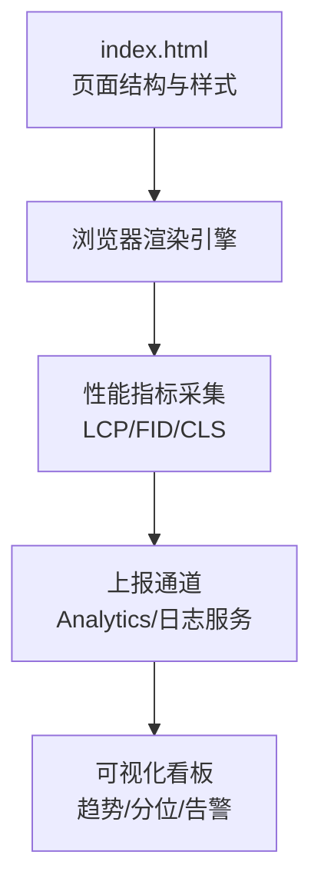
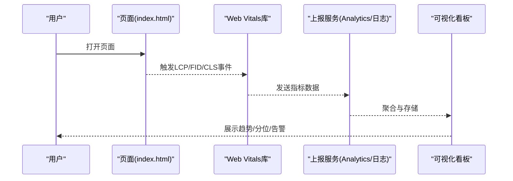
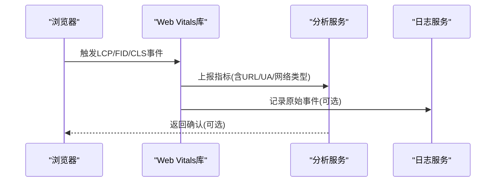
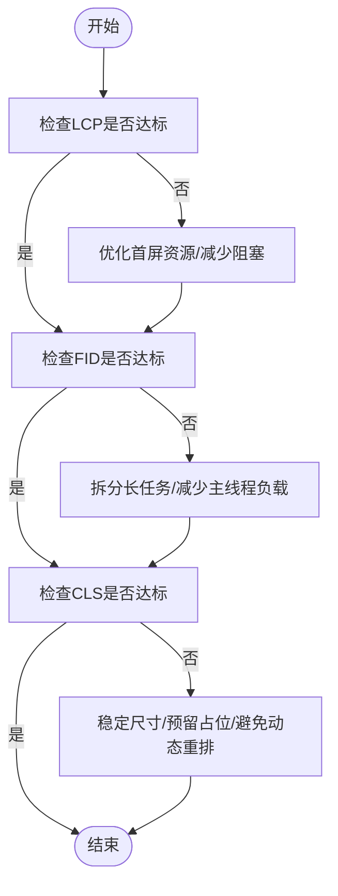

# Web Vitals监控

<cite>
**本文引用的文件**
- [index.html](file://index.html)
</cite>

## 目录
1. [简介](#简介)
2. [项目结构](#项目结构)
3. [核心组件](#核心组件)
4. [架构总览](#架构总览)
5. [详细组件分析](#详细组件分析)
6. [依赖关系分析](#依赖关系分析)
7. [性能考量](#性能考量)
8. [故障排查指南](#故障排查指南)
9. [结论](#结论)
10. [附录](#附录)

## 简介
本指南面向开发团队，系统化阐述如何对Web页面进行Core Web Vitals（LCP、FID、CLS）的监控与优化。内容涵盖：
- 三大指标的含义、测量方法与优化策略
- 在项目中集成Web Vitals库并实现自动采集与上报
- 使用Lighthouse与PageSpeed Insights进行性能审计、问题诊断与建议解读
- 实时性能监控实施方案（可视化与告警）
- 多设备与多网络环境下的测试方法
- 最佳实践与常见问题解决方案

## 项目结构
当前仓库包含一个单页HTML文件，作为演示站点的基础骨架。该页面具备导航、首屏Hero区域、功能卡片、数据统计、CTA与页脚等常见模块，适合作为性能监控与优化的载体。

图表来源
- [index.html:1-287](file://index.html#L1-L287)

章节来源
- [index.html:1-287](file://index.html#L1-L287)

## 核心组件
- 页面主体与关键元素
  - 首屏可见区域（Hero区）是LCP的主要候选目标
  - 交互热点（按钮、链接）影响FID
  - 布局稳定性受图片尺寸、广告占位、动态插入内容影响，关联CLS
- 样式与布局
  - 响应式栅格与媒体查询可能在不同视口下触发重排，需关注CLS
  - 固定高度或aspect-ratio可避免图片加载导致的抖动
- 脚本与资源
  - 第三方脚本加载顺序与阻塞行为会影响FID与LCP
  - 大体积资源（图片、字体、视频）需要懒加载与压缩

章节来源
- [index.html:1-287](file://index.html#L1-L287)

## 架构总览
下图展示从页面加载到指标采集、上报与可视化的端到端流程。

图表来源
- [index.html:1-287](file://index.html#L1-L287)

## 详细组件分析

### LCP（最大内容绘制）
- 含义：首屏最大内容绘制完成的时间，衡量主内容可见速度
- 测量方法
  - 使用Performance API与LCP相关API获取首个最大内容绘制时间
  - 结合Web Vitals库统一上报，便于跨页面对比
- 优化策略
  - 优先加载首屏关键资源，减少阻塞；对非关键资源延迟加载
  - 图片采用现代格式与合理尺寸，启用缓存与CDN
  - 预连接与预加载关键资源，减少DNS/TLS握手开销
  - 控制首屏JS/CSS体积，内联必要CSS，异步加载非关键脚本
- 在本项目中的关注点
  - Hero区域的标题与文案通常是LCP候选，应确保其尽早可用
  - 背景渐变与大图需评估是否影响首屏渲染

章节来源
- [index.html:1-287](file://index.html#L1-L287)

### FID（首次输入延迟）
- 含义：用户首次交互到浏览器响应的时延，衡量交互即时性
- 测量方法
  - 通过Input Timing API捕获首次点击/按键到处理完成的时延
  - 使用Web Vitals库统一采集与上报
- 优化策略
  - 拆分长任务，避免主线程阻塞；将计算密集型逻辑移至Web Worker
  - 减少第三方脚本对主线程的影响，按需加载与去抖
  - 优化事件监听器，避免重复绑定与过度计算
- 在本项目中的关注点
  - 导航栏按钮、CTA按钮的点击响应需保持低延迟
  - 避免在首屏执行重型初始化逻辑

章节来源
- [index.html:1-287](file://index.html#L1-L287)

### CLS（累积布局偏移）
- 含义：页面在生命周期内的意外布局移动总和，衡量视觉稳定性
- 测量方法
  - 基于Layout Shift API累计各次布局偏移得分
  - 使用Web Vitals库统一采集与上报
- 优化策略
  - 为图片、视频、嵌入内容设置明确的宽高或aspect-ratio
  - 避免在内容加载后动态插入大块内容导致重排
  - 广告与懒加载内容预留占位空间，防止抖动
- 在本项目中的关注点
  - 响应式网格在不同视口切换时可能引发重排，需稳定容器尺寸
  - 图标与图片加载前后应保持位置稳定

章节来源
- [index.html:1-287](file://index.html#L1-L287)

### 指标采集与上报流程（序列图）

图表来源
- [index.html:1-287](file://index.html#L1-L287)

### 复杂逻辑流程图（优化决策）

图表来源
- [index.html:1-287](file://index.html#L1-L287)

## 依赖关系分析
- 页面与渲染
  - HTML结构与CSS样式决定首屏内容与布局稳定性
  - 脚本加载时机影响FID与LCP
- 外部工具与服务
  - Web Vitals库负责指标采集
  - 分析/日志服务用于存储与聚合
  - 可视化平台用于展示与告警
- 风险与耦合
  - 第三方脚本过多会引入不可控的阻塞与抖动
  - 上报链路异常可能导致数据缺失，需具备降级与重试机制

章节来源
- [index.html:1-287](file://index.html#L1-L287)

## 性能考量
- 首屏性能
  - 控制关键资源体积，启用HTTP/2与CDN缓存
  - 使用预连接、预加载提升关键路径效率
- 交互性能
  - 避免长任务，拆分计算，使用Web Worker
  - 防抖/节流高频事件，减少不必要的重绘重排
- 稳定性
  - 为媒体与嵌入内容设置尺寸约束
  - 避免在滚动过程中插入大块内容
- 可观测性
  - 统一指标口径，按页面/路由维度聚合
  - 建立基线与阈值，支持分位统计与趋势分析

[本节为通用指导，不直接分析具体文件]

## 故障排查指南
- 指标异常定位
  - 使用浏览器开发者工具的Performance面板录制关键路径，识别长任务与阻塞点
  - 使用Network面板检查资源加载耗时与失败情况
  - 使用Coverage面板分析未使用的代码与资源
- 常见问题与解决
  - LCP偏慢：检查首屏资源大小、请求数、缓存命中；优化图片与字体；减少阻塞脚本
  - FID偏高：定位长任务，拆分逻辑；减少第三方脚本；优化事件处理
  - CLS过高：为图片/广告设置占位；避免动态插入导致重排；稳定容器尺寸
- 上报与可视化
  - 校验上报接口连通性与错误码
  - 核对指标字段完整性（URL、UA、网络类型、设备类型）
  - 配置告警规则（如P95超过阈值），及时通知

[本节为通用指导，不直接分析具体文件]

## 结论
通过对LCP、FID、CLS的系统化监控与持续优化，可以显著提升首屏体验、交互响应与视觉稳定性。建议将Web Vitals纳入日常研发流程，结合Lighthouse与PageSpeed Insights进行定期审计，并建立可视化看板与告警机制，形成闭环的性能治理体系。

[本节为总结性内容，不直接分析具体文件]

## 附录

### 如何在项目中集成Web Vitals并自动上报
- 引入Web Vitals库
  - 通过CDN或包管理器引入库文件
  - 在页面初始化时注册LCP、FID、CLS的回调
- 采集与上报
  - 在回调中收集指标值及上下文信息（页面URL、用户代理、网络类型）
  - 通过Beacon或Fetch将数据发送至分析服务或日志系统
  - 实现重试与降级策略，保证数据可靠性
- 注意事项
  - 避免在回调中执行重型逻辑，保持上报轻量
  - 对敏感信息进行脱敏处理
  - 设置合理的采样率以平衡精度与成本

[本节为通用指导，不直接分析具体文件]

### Lighthouse与PageSpeed Insights使用方法
- Lighthouse
  - 在Chrome DevTools中运行性能审计，查看LCP、FID、CLS评分与建议
  - 导出报告并跟踪历史变化，定位回归问题
- PageSpeed Insights
  - 输入页面URL，获取移动端与桌面端的综合评分与优化建议
  - 关注“机会”与“诊断”，逐项验证与修复
- 解读建议
  - 优先处理高影响项（如首屏资源过大、阻塞脚本）
  - 结合业务场景权衡改动成本与收益

[本节为通用指导，不直接分析具体文件]

### 实时性能监控实施方案
- 数据采集
  - 使用Web Vitals库采集指标，附带页面元数据
  - 通过可靠的上报通道（Beacon/Fetch）发送到后端
- 存储与聚合
  - 使用时序数据库或日志平台存储原始数据
  - 按页面、设备、网络类型进行聚合与分位统计
- 可视化与告警
  - 构建仪表盘展示趋势、分布与异常点
  - 配置阈值告警（如P95超过阈值），通过邮件/IM通知
- 回滚与应急
  - 当指标突增时快速定位变更并回滚
  - 提供热修复与灰度发布能力

[本节为通用指导，不直接分析具体文件]

### 多设备与多网络环境测试方法
- 设备类型
  - 使用不同分辨率与DPR的设备进行测试，关注移动端首屏与交互
  - 模拟弱CPU与内存受限设备，评估性能瓶颈
- 网络环境
  - 使用网络限速模拟3G/4G/弱网，观察LCP与FID变化
  - 验证缓存策略与离线能力
- 自动化
  - 在CI中集成性能测试用例，设定阈值门禁
  - 定期生成性能报告并与基线对比

[本节为通用指导，不直接分析具体文件]

### 最佳实践与常见问题
- 最佳实践
  - 首屏最小化：只加载必要资源，延迟非关键资源
  - 资源优化：压缩、合并、CDN缓存、现代格式
  - 交互优化：拆分长任务，避免主线程阻塞
  - 稳定性保障：固定尺寸、预留占位、避免动态重排
- 常见问题
  - 指标波动：增加采样与分位统计，排除异常流量
  - 上报丢失：完善重试与降级，监控上报链路健康
  - 误报与漏报：校准阈值与采样策略，定期复盘

[本节为通用指导，不直接分析具体文件]