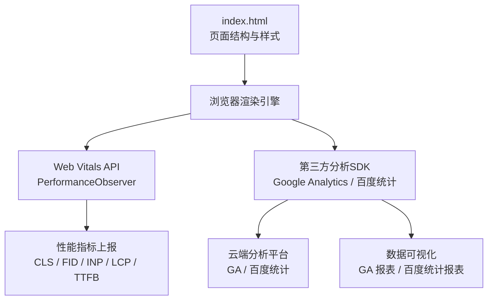
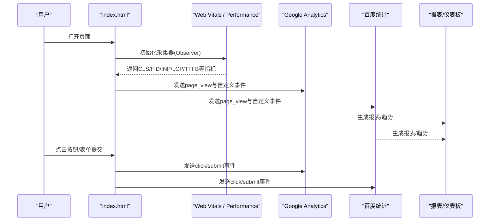
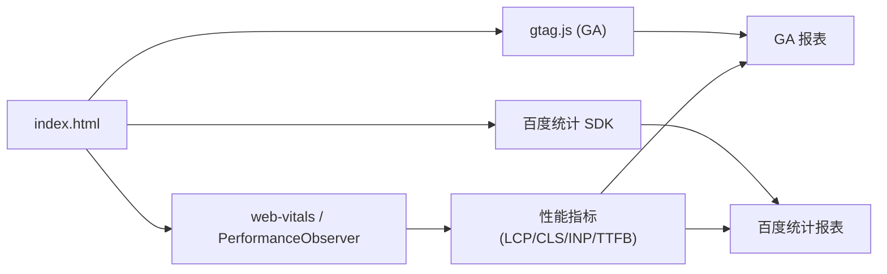

# 性能监控和分析

<cite>
**本文引用的文件**
- [index.html](file://index.html)
</cite>

## 目录
1. [简介](#简介)
2. [项目结构](#项目结构)
3. [核心组件](#核心组件)
4. [架构总览](#架构总览)
5. [详细组件分析](#详细组件分析)
6. [依赖关系分析](#依赖关系分析)
7. [性能考量](#性能考量)
8. [故障排查指南](#故障排查指南)
9. [结论](#结论)
10. [附录](#附录)

## 简介
本指南面向希望在现有静态页面中落地“性能监控与用户分析”的开发者与产品团队。内容覆盖：
- Google Analytics（GA）安装与配置、事件追踪、页面浏览统计、用户行为分析
- 百度统计集成步骤，服务中国市场本地化需求
- Web Vitals 指标监控与优化（Lighthouse、PageSpeed Insights 等工具）
- 实时性能监控方案（错误追踪、加载时间监控、用户体验指标收集）
- 数据可视化仪表板搭建方法与关键指标解读
- 基于数据分析的优化建议与决策支持

## 项目结构
当前仓库包含一个单页 HTML 文件，作为落地页/营销页的基础骨架。该页面具备导航、功能介绍、数据统计展示和行动号召等常见模块，便于在后续接入埋点与监控脚本。

图表来源
- [index.html:1-287](file://index.html#L1-L287)

章节来源
- [index.html:1-287](file://index.html#L1-L287)

## 核心组件
- 页面容器与交互元素：导航、按钮、卡片、统计区块、CTA 区域等，是事件埋点的主要目标。
- 性能采集：通过浏览器原生 API（PerformanceObserver、Navigation Timing、Resource Timing）采集 Web Vitals 与资源加载时序。
- 分析上报：将页面浏览、用户交互事件与性能指标上报至 GA 或百度统计。
- 可视化与洞察：利用各平台的报表能力构建仪表板，结合业务指标进行持续优化。

章节来源
- [index.html:1-287](file://index.html#L1-L287)

## 架构总览
下图展示了从页面渲染到数据采集、上报与可视化的端到端流程。

图表来源
- [index.html:1-287](file://index.html#L1-L287)

## 详细组件分析

### 1) Google Analytics（GA）安装与配置
- 创建 GA 属性并获取测量 ID（Measurement ID）。
- 在页面 <head> 或 <body> 顶部插入官方 gtag.js 初始化代码片段（替换测量 ID）。
- 启用增强型网站测量（Enhanced Measurement），自动捕获滚动、出站链接、文件下载、站点内搜索等。
- 配置自定义维度/指标以扩展业务语义（如用户类型、渠道来源）。
- 设置数据过滤与隐私合规（IP 匿名化、同意模式）。

事件追踪要点
- 为关键交互添加事件：按钮点击、表单提交、卡片点击、导航跳转等。
- 使用统一的事件命名规范（action/category/label/value）。
- 对复杂交互（如下拉选择、模态框关闭）使用 data-* 属性标记，配合通用事件处理器上报。

页面浏览统计
- 确保 SPA 路由变化时触发 page_view（若采用前端路由）。
- 对多语言/多地区页面设置 page_title/page_location 等字段。

用户行为分析
- 结合 GA 受众群体（Audiences）与漏斗（Funnels）分析转化路径。
- 使用探索报告（Explorations）进行多维交叉分析。

章节来源
- [index.html:1-287](file://index.html#L1-L287)

### 2) 百度统计集成（中国市场）
- 注册百度统计账号，获取站点 ID。
- 在页面头部插入百度统计 JS 代码片段（替换站点 ID）。
- 开启“全站加速/CDN 兼容”、“跨域统计”等选项以提升准确性。
- 针对移动端与小程序场景，按官方指引补充适配代码。

事件与页面统计
- 使用 _hmt.push 或对应 SDK 方法上报自定义事件。
- 对关键按钮、表单、弹窗等交互进行埋点，统一事件名与参数。

隐私与合规
- 遵循国内法规要求，提供隐私政策与用户同意机制。
- 必要时对敏感数据进行脱敏处理。

章节来源
- [index.html:1-287](file://index.html#L1-L287)

### 3) Web Vitals 指标监控与优化
可采集的核心指标
- CLS（累积布局偏移）：衡量视觉稳定性
- FID（首次输入延迟）/ INP（交互到下一次绘制）：衡量交互响应性
- LCP（最大内容绘制）：衡量主内容加载速度
- TTFB（首字节时间）：衡量网络与服务器响应

采集方式
- 使用 web-vitals 库或浏览器 PerformanceObserver 直接采集。
- 将指标与页面上下文（URL、设备、UA、渠道）一起上报至 GA/百度统计。

优化建议
- 图片与媒体：压缩、懒加载、使用现代格式（WebP/AVIF）、合理尺寸与 CDN。
- 资源体积：Tree-shaking、代码分割、按需加载、缓存策略。
- 渲染路径：减少阻塞脚本、预加载关键资源、避免强制同步布局。
- 网络层：HTTP/2、Keep-Alive、合理的缓存头与版本化文件名。

工具链
- Lighthouse：离线/CI 中自动化审计，输出改进建议与分数。
- PageSpeed Insights：在线/API 检测，提供移动端与桌面端评分与建议。
- Chrome DevTools：Performance、Network、Coverage 面板定位瓶颈。
- WebPageTest：真实环境复现与瀑布图分析。

章节来源
- [index.html:1-287](file://index.html#L1-L287)

### 4) 实时性能监控实施方案
错误追踪
- 前端错误：window.onerror、unhandledrejection、try/catch 包裹异步任务。
- 接口错误：拦截 fetch/XMLHttpRequest，记录状态码、耗时、请求体摘要（脱敏）。
- 上报通道：优先走分析 SDK（GA/百度统计），必要时自建日志服务。

加载时间监控
- 关键时间点：FCP、FID/INP、LCP、TTFB、DOMContentLoaded、load。
- 资源级监控：Resource Timing 统计每个资源的请求时长、大小、缓存命中情况。
- 告警阈值：当指标超过基线（如 LCP > 2.5s）触发告警。

用户体验指标收集
- 会话质量：崩溃率、白屏率、卡顿比例（长任务占比）。
- 地域/设备分层：不同网络、机型、系统版本的差异对比。

章节来源
- [index.html:1-287](file://index.html#L1-L287)

### 5) 数据可视化仪表板搭建与指标解读
仪表板建议
- 流量概览：UV/PV、来源分布、新访客占比、跳出率。
- 转化漏斗：首页 -> 功能页 -> 注册/登录 -> 付费/试用。
- 性能看板：LCP/CLS/INP 分位数（p50/p75/p90）、错误率、慢请求 Top N。
- 地域/设备：国家/城市、操作系统、浏览器、屏幕分辨率。

指标解读
- LCP：关注首屏大资源与关键渲染路径；目标通常 < 2.5s。
- CLS：避免动态插入导致重排；目标 < 0.1。
- INP：减少长任务与阻塞；目标 < 200ms。
- TTFB：优化 DNS/连接/首包；目标 < 0.8s。

章节来源
- [index.html:1-287](file://index.html#L1-L287)

### 6) 面向产品的优化建议与决策支持
- 以 LCP/CLS/INP 为核心体验指标，纳入发布准入标准。
- 建立灰度发布与回滚机制，结合 A/B 实验评估改动影响。
- 将性能与转化率关联分析，识别高价值优化点（如首屏图片、关键按钮）。
- 定期输出性能健康报告，驱动工程与设计协同优化。

章节来源
- [index.html:1-287](file://index.html#L1-L287)

## 依赖关系分析
- 页面与脚本：index.html 作为入口，后续可引入 web-vitals、gtag.js、百度统计 SDK 等外部脚本。
- 浏览器 API：PerformanceObserver、Navigation Timing、Resource Timing、Fetch/XHR 拦截。
- 第三方平台：GA、百度统计、Lighthouse/PSI（离线或在线工具）。

图表来源
- [index.html:1-287](file://index.html#L1-L287)

章节来源
- [index.html:1-287](file://index.html#L1-L287)

## 性能考量
- 最小化分析脚本对首屏的影响：延迟加载、异步加载、按需引入。
- 控制事件上报频率与批量发送，避免拥塞。
- 对敏感信息脱敏后再上报，遵守隐私合规。
- 在 CI 中加入 Lighthouse 门禁，防止性能退化上线。

[本节为通用指导，不直接分析具体文件]

## 故障排查指南
常见问题与定位思路
- 未收到 page_view：检查 SDK 初始化顺序、测量 ID/站点 ID、广告拦截器。
- 事件未上报：确认事件绑定是否生效、数据属性是否正确、上报函数是否被调用。
- 指标异常：核对采集时机（如 LCP 需在可见且稳定后上报）、排除测试流量。
- 性能回归：使用 Lighthouse/PSI 复测，结合 Network/Performance 面板定位瓶颈。

章节来源
- [index.html:1-287](file://index.html#L1-L287)

## 结论
通过在现有页面中系统化接入 GA/百度统计与 Web Vitals 监控，可以形成“采集—上报—可视化—优化”的闭环。建议以 LCP/CLS/INP 为核心体验指标，结合业务转化漏斗，持续迭代优化，最终实现性能与增长的双赢。

[本节为总结性内容，不直接分析具体文件]

## 附录
- 推荐实践清单
  - 统一事件命名规范与数据字典
  - 建立性能基线与告警阈值
  - 将 Lighthouse 纳入发布流水线
  - 定期复盘报表，沉淀优化案例
- 参考工具
  - Lighthouse、PageSpeed Insights、Chrome DevTools、WebPageTest
  - GA 探索报表、百度统计自定义报表

[本节为补充信息，不直接分析具体文件]