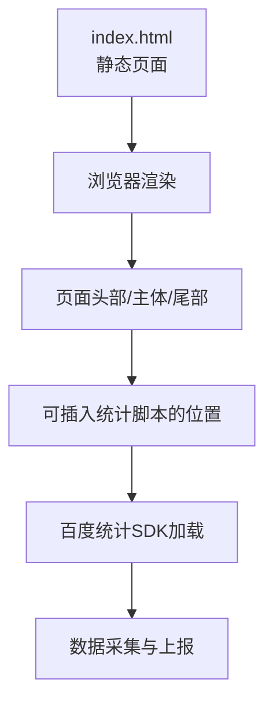
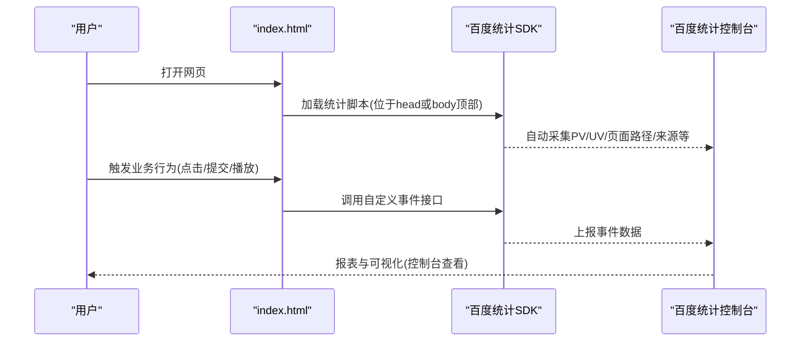
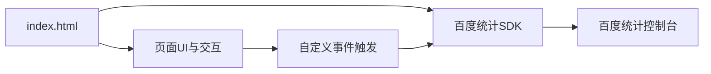

# 百度统计配置

<cite>
**本文引用的文件**   
- [index.html](file://index.html)
</cite>

## 目录
1. [简介](#简介)
2. [项目结构](#项目结构)
3. [核心组件](#核心组件)
4. [架构总览](#架构总览)
5. [详细组件分析](#详细组件分析)
6. [依赖关系分析](#依赖关系分析)
7. [性能考虑](#性能考虑)
8. [故障排查指南](#故障排查指南)
9. [结论](#结论)
10. [附录](#附录)

## 简介
本指南面向中国市场用户，提供在静态HTML页面中集成百度统计的完整配置与使用方案。内容涵盖：在百度统计平台注册账号、创建站点并获取统计代码；将统计代码正确嵌入到HTML页面（位置选择与加载优化）；理解流量分析、页面分析、来源分析与用户画像等核心模块；实现自定义事件以追踪关键业务指标；数据导出与分析报告生成；以及隐私合规与数据安全注意事项。

## 项目结构
当前仓库包含一个用于演示的静态HTML页面，适合作为集成百度统计的目标页面。该页面采用响应式布局，包含导航、功能介绍、数据统计展示、行动号召和页脚等常见区块，便于在实际项目中定位统计代码注入点与埋点触发区域。

图表来源
- [index.html:1-287](file://index.html#L1-L287)

章节来源
- [index.html:1-287](file://index.html#L1-L287)

## 核心组件
- 站点与账号：在百度统计平台完成注册与站点创建，获得唯一统计ID与统计代码片段。
- 页面集成：将统计代码添加到目标页面的合适位置，确保首屏加载不受影响且能捕获全量访问。
- 事件埋点：通过API调用记录自定义事件（如按钮点击、表单提交、视频播放等），用于衡量业务转化。
- 数据看板：利用百度统计控制台查看流量、页面、来源与用户画像等报表，支撑运营决策。
- 数据导出：按周期导出原始或聚合数据，结合BI工具进行深度分析。

章节来源
- [index.html:1-287](file://index.html#L1-L287)

## 架构总览
下图展示了从用户访问到数据采集与上报的整体流程，以及与静态页面的集成关系。

图表来源
- [index.html:1-287](file://index.html#L1-L287)

## 详细组件分析

### 站点注册与统计代码获取
- 注册账号：访问百度统计官网并完成企业或个人账号注册。
- 创建站点：在控制台新增站点，填写域名与网站名称，系统会生成统计ID与一段统计代码片段。
- 下载代码：复制统计代码片段，准备嵌入到目标页面。

提示
- 若有多环境（开发/测试/生产），建议分别创建站点或使用过滤规则区分流量。
- 如需跨域或子域名统计，请在站点设置中开启相应选项。

章节来源
- [index.html:1-287](file://index.html#L1-L287)

### 在静态HTML中集成统计代码
- 推荐位置：将统计代码放置在<head>标签内靠上位置，或在<body>最顶部尽早加载，以减少对首屏渲染的影响并确保尽可能多的访问被记录。
- 最小化阻塞：优先使用异步加载方式，避免阻塞页面解析；若需严格顺序控制，可使用defer或async属性。
- 多页面复用：将统计代码放入公共模板或引入的公共脚本中，保证全站一致性。
- 验证接入：发布后通过控制台“实时”或“概览”确认是否收到访问数据。

注意
- 不要重复添加多个统计代码实例，避免重复计数。
- 若使用CDN或缓存策略，请确保统计脚本版本稳定并可缓存。

章节来源
- [index.html:1-287](file://index.html#L1-L287)

### 核心功能与使用方法
- 流量分析：查看访问量、访客数、平均访问时长、跳出率等趋势，识别高峰时段与异常波动。
- 页面分析：分析各页面PV/UV、停留时长、入口与出口页，定位高价值与低效页面。
- 来源分析：了解搜索引擎、直接访问、外链跳转、社交媒体等渠道贡献，评估投放效果。
- 用户画像：基于地域、设备、浏览器、操作系统等维度洞察用户群体特征，指导产品与运营策略。

实践建议
- 结合业务目标设定关键指标（如转化率、留存率）。
- 建立定期复盘机制，对比活动前后数据变化。

章节来源
- [index.html:1-287](file://index.html#L1-L287)

### 自定义事件：追踪特定用户行为
- 适用场景：按钮点击、表单提交、视频播放、弹窗关闭、加入购物车、支付成功等关键转化节点。
- 实现要点：
  - 在对应DOM元素的事件回调中调用百度统计的事件上报接口。
  - 为事件命名清晰、分类明确，便于后续报表筛选与归因。
  - 为重要事件附加必要参数（如商品ID、渠道来源、金额等），增强分析颗粒度。
- 验证方法：在控制台“事件”或“自定义事件”报表中观察数据是否出现；必要时使用浏览器开发者工具检查网络请求。

最佳实践
- 统一封装埋点函数，集中管理事件名与参数，降低重复与遗漏风险。
- 对高频事件做节流或合并上报，减少网络开销。
- 对敏感信息（如手机号、身份证）进行脱敏后再上报。

章节来源
- [index.html:1-287](file://index.html#L1-L287)

### 数据导出与分析报告
- 数据导出：在控制台支持按时间范围导出CSV/Excel等格式，便于离线分析与建模。
- 报告生成：结合导出数据制作周报/月报，聚焦核心KPI与趋势变化，形成可执行改进建议。
- 自动化：可通过定时任务拉取数据并生成固定模板报告，提升团队效率。

章节来源
- [index.html:1-287](file://index.html#L1-L287)

### 隐私合规与数据安全
- 合规要求：遵循《网络安全法》《数据安全法》《个人信息保护法》等相关法规，确保数据采集合法、正当、必要。
- 最小化采集：仅采集达成业务目标所需的数据，避免过度收集。
- 用户同意：在涉及个人信息的场景中，提供清晰的隐私政策与用户同意机制。
- 数据脱敏：对可能识别到个人的信息进行匿名化或去标识化处理。
- 传输安全：确保HTTPS部署，防止中间人攻击与数据泄露。
- 存储与访问控制：限制数据访问权限，定期审计日志，保障数据安全。

章节来源
- [index.html:1-287](file://index.html#L1-L287)

## 依赖关系分析
- 页面与SDK：index.html作为宿主页面，负责在合适时机加载百度统计SDK并触发事件上报。
- SDK与控制台：SDK负责采集与上报数据，控制台提供可视化报表与导出能力。
- 外部资源：页面样式与交互逻辑不依赖第三方分析库，保持轻量与可控。

图表来源
- [index.html:1-287](file://index.html#L1-L287)

章节来源
- [index.html:1-287](file://index.html#L1-L287)

## 性能考虑
- 首屏优化：将统计脚本置于<head>或<body>顶部并使用异步加载，避免阻塞渲染。
- 缓存策略：合理设置缓存头，减少重复下载。
- 事件频率：对高频事件进行节流或批量上报，降低网络压力。
- 资源体积：尽量精简自定义事件参数，避免过大负载。
- 监控与回滚：上线前进行灰度验证，出现问题快速回滚。

[本节为通用性能建议，不直接分析具体文件]

## 故障排查指南
常见问题与处理步骤
- 无数据或数据偏低
  - 检查统计代码是否正确嵌入且未被拦截（广告插件、隐私模式）。
  - 确认域名与站点设置一致，跨域/子域名是否已配置。
  - 在控制台“实时”查看是否有访问进入。
- 重复计数
  - 检查是否存在多处重复引入统计代码。
  - 确认SPA路由切换时未重复初始化SDK。
- 事件未上报
  - 检查事件触发条件与DOM生命周期。
  - 使用浏览器开发者工具的网络面板查看上报请求。
  - 核对事件名与参数是否符合规范。
- 隐私与合规问题
  - 确认已提供隐私政策与用户同意机制。
  - 检查是否采集了敏感信息并进行脱敏。

章节来源
- [index.html:1-287](file://index.html#L1-L287)

## 结论
通过在静态HTML页面中正确集成百度统计，并结合自定义事件与数据导出能力，可以构建一套完整的本地化数据分析解决方案。建议在上线前完成接入验证与合规审查，持续优化性能与埋点质量，用数据驱动产品与运营增长。

[本节为总结性内容，不直接分析具体文件]

## 附录
- 术语说明
  - PV：页面浏览量
  - UV：独立访客数
  - SPA：单页应用
  - API：应用程序接口
- 参考路径
  - 页面结构参考：[index.html:1-287](file://index.html#L1-L287)

[本节为补充信息，不直接分析具体文件]