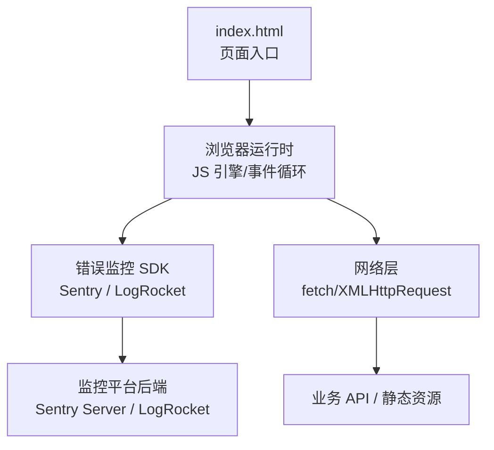
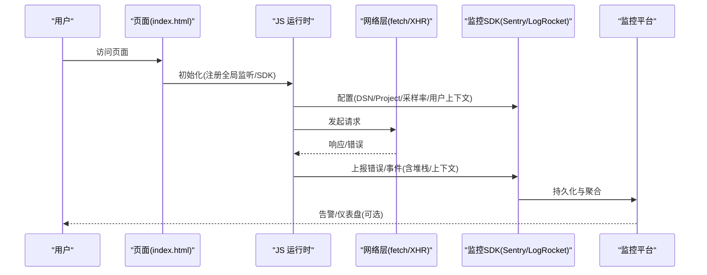
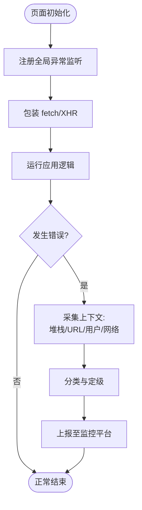
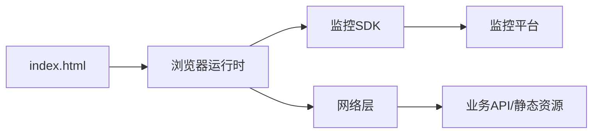

# 错误追踪和调试

<cite>
**本文引用的文件**
- [index.html](file://index.html)
</cite>

## 目录
1. [简介](#简介)
2. [项目结构](#项目结构)
3. [核心组件](#核心组件)
4. [架构总览](#架构总览)
5. [详细组件分析](#详细组件分析)
6. [依赖关系分析](#依赖关系分析)
7. [性能考虑](#性能考虑)
8. [故障排查指南](#故障排查指南)
9. [结论](#结论)
10. [附录](#附录)

## 简介
本方案面向当前前端页面（单页 HTML），提供一套可落地的错误追踪与调试实施方案，覆盖：
- 集成主流错误监控服务（如 Sentry、LogRocket）并实现 JavaScript 错误的自动捕获与上报
- 系统化采集错误上下文：堆栈跟踪、用户信息、浏览器环境、网络请求等
- 错误分类与优先级策略，帮助团队快速定位关键问题
- 调试工具与技巧：浏览器开发者工具高级用法、断点调试、性能分析
- 日志记录最佳实践：结构化日志、日志级别管理、敏感信息过滤
- 建立完善的错误处理流程与故障排查方法论

目标是在不侵入业务逻辑的前提下，提升线上问题的可见性、可复现性与修复效率。

## 项目结构
当前仓库为单页应用，入口文件为 index.html，包含样式与页面内容。由于尚未引入任何 JS 或第三方 SDK，错误追踪能力需通过后续集成实现。

图表来源
- [index.html:1-287](file://index.html#L1-L287)

章节来源
- [index.html:1-287](file://index.html#L1-L287)

## 核心组件
- 错误捕获与上报模块
  - 全局异常捕获：window.onerror、window.onunhandledrejection
  - 资源加载失败捕获：onerror（图片、脚本、样式等）
  - 网络请求拦截：基于 fetch/XHR 的包装器，收集请求/响应元数据
- 上下文采集模块
  - 堆栈跟踪：Error.stack 解析与规范化
  - 用户信息：匿名化用户标识、角色、设备信息等
  - 浏览器环境：UA、屏幕分辨率、语言、时区、内存/CPU 指标（可用时）
  - 路由与状态：当前 URL、查询参数、SPA 路由、关键状态快照
- 分类与优先级模块
  - 错误类型分类：JS 异常、资源加载失败、网络错误、业务错误码
  - 严重等级：P0/P1/P2/P3，结合影响面、频率、用户数等维度
- 日志记录模块
  - 结构化日志：时间戳、级别、模块、消息、上下文键值对
  - 日志级别：debug/info/warn/error/fatal，按环境与功能开关控制
  - 敏感信息过滤：PII、令牌、密码、手机号、邮箱等脱敏规则
- 调试与诊断模块
  - 本地开发：Source Map、断点、条件断点、性能面板、网络面板
  - 线上诊断：会话重放（LogRocket）、错误聚合（Sentry）、告警与通知

章节来源
- [index.html:1-287](file://index.html#L1-L287)

## 架构总览
下图展示从页面运行到错误上报的整体链路，以及关键采集点与外部系统交互。

图表来源
- [index.html:1-287](file://index.html#L1-L287)

## 详细组件分析

### 错误捕获与上报
- 全局异常捕获
  - 使用 window.onerror 捕获同步/异步未处理异常
  - 使用 window.onunhandledrejection 捕获 Promise 未拒绝处理
  - 在页面初始化阶段尽早注册，确保覆盖尽可能多的执行路径
- 资源加载失败
  - 监听 document 的 error 事件，捕获 img/script/link 等资源加载失败
  - 区分资源类型与 URL，便于后续分类与告警
- 网络请求拦截
  - 包装 fetch：在 beforeSend 中注入请求头、记录耗时、状态码、错误信息
  - 包装 XMLHttpRequest：重写 open/send/onreadystatechange，收集请求/响应元数据
  - 对超时、跨域、DNS 解析失败等常见错误进行归类

图表来源
- [index.html:1-287](file://index.html#L1-L287)

章节来源
- [index.html:1-287](file://index.html#L1-L287)

### 上下文数据采集
- 堆栈跟踪
  - 统一格式化 Error.stack，去除无关框架内部帧，保留业务相关调用链
  - 配合 Source Map 将压缩代码映射回源码位置
- 用户信息
  - 仅采集必要且已脱敏的信息：匿名 ID、设备型号、操作系统、浏览器版本、语言、时区
  - 禁止采集明文密码、令牌、身份证号、手机号、邮箱等敏感字段
- 浏览器环境
  - UA、屏幕尺寸、DPR、内存/CPU（若可用）、是否离线、是否移动端
- 网络请求
  - 方法、URL、状态码、耗时、错误类型、重试次数、是否跨域
- 路由与状态
  - 当前 URL、查询参数、哈希片段、SPA 路由变化
  - 关键业务状态快照（如购物车项数、登录态、权限范围）

章节来源
- [index.html:1-287](file://index.html#L1-L287)

### 错误分类与优先级
- 分类维度
  - 技术类型：JS 异常、资源加载失败、网络错误、业务错误码
  - 模块/页面：导航、表单、支付、搜索等
  - 影响范围：用户数、地域、设备类型、浏览器版本
- 优先级定义
  - P0：核心流程阻断（如登录、支付），影响大量用户
  - P1：重要功能降级或频繁报错
  - P2：非核心功能偶发错误
  - P3：体验类问题（UI 错位、轻微卡顿）
- 动态调整
  - 根据错误频率、影响用户数、业务时段自动升级/降级
  - 支持白名单忽略已知无害错误

章节来源
- [index.html:1-287](file://index.html#L1-L287)

### 日志记录最佳实践
- 结构化日志
  - 每条日志包含：时间戳、级别、模块、消息、trace_id、用户ID（匿名）、上下文键值对
  - 避免拼接字符串，使用对象序列化输出
- 日志级别管理
  - 开发环境：debug+info；测试环境：info+warn；生产环境：warn+error
  - 通过环境变量或特性开关控制不同模块的日志粒度
- 敏感信息过滤
  - 内置脱敏规则：掩码手机号、邮箱、身份证、银行卡号、Token
  - 自定义过滤器：针对特定字段名或正则匹配进行替换
- 采样与限流
  - 高频日志采样（如 1%~10%），避免风暴
  - 同一错误在短时间内去重与合并

章节来源
- [index.html:1-287](file://index.html#L1-L287)

### 调试工具与技巧
- 浏览器开发者工具
  - Sources 面板：设置断点、条件断点、函数断点、Xpath 断点
  - Console 面板：表达式求值、变量监视、日志过滤
  - Network 面板：请求/响应详情、缓存、带宽、性能瀑布图
  - Performance 面板：录制性能、识别长任务、内存泄漏
  - Memory 面板：堆快照对比、Allocation instrumentation on JS 分配
- 断点调试
  - 条件断点：仅在满足业务条件时中断
  - 异步断点：Promise 断点、XHR/Fetch 断点、DOM 变更断点
  - 日志断点：在不中断的情况下打印上下文
- 性能分析
  - 识别主线程阻塞、布局抖动、重绘重排
  - 资源加载优化：懒加载、预加载、缓存策略
- 远程调试
  - Chrome DevTools Remote Debugging、Android WebView 调试
  - 移动端真机调试与抓包（Charles/Fiddler）

章节来源
- [index.html:1-287](file://index.html#L1-L287)

### 集成示例指引（以 Sentry/LogRocket 为例）
- Sentry
  - 初始化：配置 DSN、环境、版本、采样率
  - 捕获：try/catch + 手动捕获 Promise 拒绝
  - 上下文：设置用户、标签、度量、事务（Tracing）
  - 资源：启用 Source Map 上传与解析
- LogRocket
  - 初始化：配置 Project ID、会话录制选项
  - 事件：标记关键用户操作、错误、网络请求
  - 回放：结合错误事件回放用户会话，定位复现步骤
- 通用要点
  - 尽早初始化，确保覆盖首屏与关键路径
  - 合理采样，平衡成本与覆盖率
  - 严格脱敏，遵循隐私合规要求

章节来源
- [index.html:1-287](file://index.html#L1-L287)

## 依赖关系分析
- 页面与运行时
  - index.html 作为入口，承载样式与 DOM 结构
  - 浏览器 JS 引擎负责执行脚本、调度事件、处理异常
- 监控 SDK
  - 与页面强耦合：需在页面初始化阶段注入并配置
  - 与监控平台通信：HTTP 上报，受网络与 CORS 策略影响
- 网络层
  - 业务 API 与静态资源：错误可能来源于服务端、CDN、DNS、跨域等
- 外部依赖
  - Sentry/LogRocket 等平台：提供错误聚合、会话回放、告警与可视化

图表来源
- [index.html:1-287](file://index.html#L1-L287)

章节来源
- [index.html:1-287](file://index.html#L1-L287)

## 性能考虑
- 监控开销
  - 采样率与去重：降低上报量，避免拖慢主线程
  - 批量上报：合并多条日志/错误后一次性发送
- 资源与网络
  - Source Map 体积控制：按需上传、分片上传
  - CDN 缓存：提高 SDK 与资源加载速度
- 用户体验
  - 错误上报失败时的降级策略：本地队列、延迟重试
  - 避免在关键渲染路径执行重型日志写入

[本节为通用指导，无需具体文件引用]

## 故障排查指南
- 常见问题定位
  - 资源 404/5xx：检查 CDN、域名、CORS、鉴权
  - 跨域错误：核对允许源、方法、头部、凭证
  - 内存泄漏：使用 Memory 面板对比快照，查找未释放引用
  - 长任务：Performance 面板识别阻塞点，拆分任务或使用 Web Worker
- 复现与验证
  - 利用 LogRocket 回放定位操作步骤
  - 使用条件断点与日志断点缩小范围
  - 构造最小复现场景，隔离第三方依赖
- 协作与闭环
  - 在监控平台创建工单，关联提交与分支
  - 标注优先级、影响范围、修复计划与回归用例
  - 复盘根因，补充监控与防护

章节来源
- [index.html:1-287](file://index.html#L1-L287)

## 结论
通过在单页应用中系统化集成错误监控与调试能力，可实现：
- 全链路错误可见：从 JS 异常到网络错误，从资源加载到业务逻辑
- 高价值上下文：堆栈、用户、环境、网络、路由与状态
- 高效分类与优先级：聚焦关键问题，缩短 MTTR
- 完善调试手段：本地与线上联动，快速复现与修复
- 规范日志体系：结构化、可控、安全

建议优先落地全局异常捕获、网络拦截、上下文采集与 Source Map 解析，再逐步完善分类、告警与回放能力。

[本节为总结性内容，无需具体文件引用]

## 附录
- 实施清单
  - 选择并接入监控 SDK（Sentry/LogRocket）
  - 初始化配置与环境区分
  - 全局异常与资源错误捕获
  - 网络层拦截与上下文采集
  - Source Map 上传与解析
  - 日志级别与脱敏规则
  - 错误分类与优先级策略
  - 告警与通知机制
  - 文档与培训：团队规范与最佳实践
- 参考实践
  - 浏览器开发者工具官方文档
  - Sentry/LogRocket 官方指南
  - 企业隐私与合规要求

[本节为附加信息，无需具体文件引用]