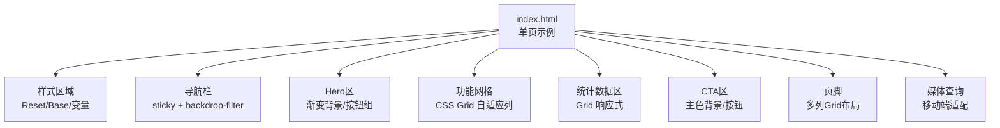
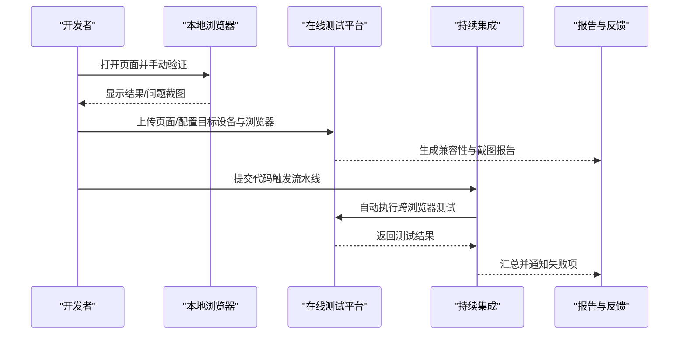
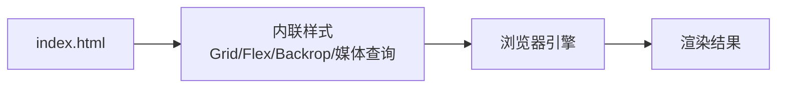

# 浏览器兼容性测试

<cite>
**本文引用的文件**
- [index.html](file://index.html)
</cite>

## 目录
1. [简介](#简介)
2. [项目结构](#项目结构)
3. [核心组件](#核心组件)
4. [架构总览](#架构总览)
5. [详细组件分析](#详细组件分析)
6. [依赖分析](#依赖分析)
7. [性能考量](#性能考量)
8. [故障排查指南](#故障排查指南)
9. [结论](#结论)
10. [附录](#附录)

## 简介
本指南面向前端开发者，提供一套系统化的“静态页面跨浏览器/跨设备兼容性测试”方法论与实践。结合当前仓库中的单页示例（包含现代CSS特性），我们将：
- 梳理现代CSS特性的兼容性现状与检查方法（如Grid、Flexbox、backdrop-filter等）
- 给出在线测试平台（BrowserStack、Sauce Labs等）的操作步骤
- 说明移动端适配测试要点（不同屏幕尺寸、移动浏览器差异）
- 总结常见问题诊断与解决方案（CSS前缀、特性检测、降级策略）
- 提供自动化测试集成与持续集成流程建议

## 项目结构
当前仓库为单页HTML示例，所有样式内联在页面中，便于快速验证布局与现代CSS特性在不同环境下的表现。

图表来源
- [index.html:1-287](file://index.html#L1-L287)

章节来源
- [index.html:1-287](file://index.html#L1-L287)

## 核心组件
- 导航栏：使用粘性定位与毛玻璃效果，涉及现代CSS的视觉特性
- Hero区：渐变背景与按钮交互，关注基础渲染与动画过渡
- 功能网格与统计区：基于CSS Grid的自适应布局，重点验证Grid在各浏览器下的行为一致性
- 页脚：多列Grid布局，需验证在小屏下的重排与可读性
- 媒体查询：针对小屏设备的隐藏与重排逻辑，需覆盖常见断点

章节来源
- [index.html:27-32](file://index.html#L27-L32)
- [index.html:52-60](file://index.html#L52-L60)
- [index.html:67-71](file://index.html#L67-L71)
- [index.html:91-95](file://index.html#L91-L95)
- [index.html:117-122](file://index.html#L117-L122)
- [index.html:136-140](file://index.html#L136-L140)

## 架构总览
从“开发—本地验证—在线测试—CI集成”的角度，构建端到端的兼容性保障体系。

[此图为概念流程图，不直接映射具体源码文件]

## 详细组件分析

### CSS Grid 与 Flexbox 兼容性
- 关键用法
  - 功能网格与统计区使用Grid的自适应列（auto-fit/minmax），用于在不同视口下自动调整列数
  - 导航栏内部使用Flexbox进行对齐与间距控制
- 兼容性关注点
  - 旧版IE对Grid支持有限，需要降级方案或Polyfill
  - Safari早期版本对某些Grid属性存在差异，需验证gap、minmax等行为
  - Flexbox在iOS Safari上需注意基线对齐与换行行为
- 验证方法
  - 使用Can I Use查询Grid/Flexbox支持矩阵
  - 在真实设备或模拟器上观察布局是否错位、内容溢出
  - 通过控制台查看计算后的布局值，确认期望的列数与间距

章节来源
- [index.html:67-71](file://index.html#L67-L71)
- [index.html:91-95](file://index.html#L91-L95)
- [index.html:33-36](file://index.html#L33-L36)

### backdrop-filter 与粘性定位
- 关键用法
  - 导航栏使用backdrop-filter实现毛玻璃效果，提升视觉层次
  - 导航栏使用sticky定位，滚动时固定在顶部
- 兼容性关注点
  - 部分旧版浏览器不支持backdrop-filter，需准备降级背景色
  - iOS Safari对backdrop-filter的性能与渲染有差异，需实测
  - sticky在低版本Android WebView可能表现异常
- 验证方法
  - 在Chrome DevTools中模拟不支持该特性的环境，确认降级生效
  - 在移动端设备上滚动验证sticky行为与毛玻璃效果

章节来源
- [index.html:27-32](file://index.html#L27-L32)

### 媒体查询与移动端适配
- 关键用法
  - 针对最大宽度768px的设备，隐藏导航菜单、调整页脚列数
- 兼容性关注点
  - 不同厂商浏览器对媒体查询解析可能存在细微差异
  - 移动端缩放、虚拟键盘弹出时的布局变化需关注
- 验证方法
  - 使用设备模拟器与真机交叉验证
  - 检查断点处元素是否按预期重排、文本是否可读

章节来源
- [index.html:136-140](file://index.html#L136-L140)

### 颜色、渐变与阴影
- 关键用法
  - Hero区使用线性渐变背景；卡片悬停使用阴影与变换
- 兼容性关注点
  - 渐变在旧版IE需前缀或替代方案
  - 阴影与变换在低端设备上可能影响性能
- 验证方法
  - 在低性能设备上观察滚动与交互流畅度
  - 对比不同浏览器的渐变渲染差异

章节来源
- [index.html:52-60](file://index.html#L52-L60)
- [index.html:72-79](file://index.html#L72-L79)

### 字体与排版
- 关键用法
  - 使用系统字体栈，确保跨平台一致性与加载速度
- 兼容性关注点
  - 不同操作系统字体回退顺序会影响阅读体验
  - 中文排版需关注字重与行高
- 验证方法
  - 在Windows/macOS/iOS/Android上对比显示效果
  - 检查长段落的可读性与行距

章节来源
- [index.html:21-24](file://index.html#L21-L24)

## 依赖分析
- 无外部资源依赖：页面样式内联，减少网络请求与第三方库带来的兼容性问题
- 仅依赖浏览器原生能力：CSS Grid、Flexbox、backdrop-filter、sticky、媒体查询等
- 风险点：若未来引入外部字体、图标或脚本，需评估其兼容性影响

图表来源
- [index.html:1-287](file://index.html#L1-L287)

章节来源
- [index.html:1-287](file://index.html#L1-L287)

## 性能考量
- 避免过度使用昂贵的视觉效果（如多层阴影、复杂滤镜），尤其在低端设备
- 合理使用媒体查询，减少不必要的重绘与回流
- 图片与资源按需加载，保证首屏性能
- 在移动端开启硬件加速需谨慎，避免内存占用过高

[本节为通用指导，不直接分析具体文件]

## 故障排查指南
- 现象：Grid布局错乱或列数不符合预期
  - 排查：检查minmax与auto-fit参数；在旧版浏览器中确认是否回退到块级堆叠
  - 解决：添加备用布局或使用JS检测后切换类名
- 现象：导航栏毛玻璃无效或闪烁
  - 排查：确认浏览器是否支持backdrop-filter；检查父容器是否有透明背景
  - 解决：提供纯色背景降级；限制滤镜强度以提升性能
- 现象：移动端菜单未正确隐藏或显示
  - 排查：检查媒体查询断点是否与设备像素比匹配；确认z-index层级
  - 解决：统一断点策略；增加触摸友好的点击区域
- 现象：渐变背景在某些浏览器显示异常
  - 排查：确认方向与角度写法；检查旧版浏览器是否需要前缀
  - 解决：提供降级背景色；必要时使用图片替代

章节来源
- [index.html:27-32](file://index.html#L27-L32)
- [index.html:67-71](file://index.html#L67-L71)
- [index.html:136-140](file://index.html#L136-L140)
- [index.html:52-60](file://index.html#L52-L60)

## 结论
通过对单页示例中现代CSS特性的系统性验证与测试，可以建立稳定的兼容性保障机制。建议在开发流程中：
- 将特性检测与降级策略纳入规范
- 使用在线平台与CI流水线进行自动化回归
- 以真实设备与主流浏览器组合覆盖关键场景
- 持续跟踪浏览器更新与特性支持变化

[本节为总结性内容，不直接分析具体文件]

## 附录

### 现代CSS特性兼容性检查清单
- CSS Grid
  - 关注点：grid-template-columns、gap、auto-fit/minmax
  - 工具：Can I Use、浏览器控制台Computed视图
- Flexbox
  - 关注点：align-items、justify-content、flex-wrap
  - 工具：DevTools布局面板、移动端模拟器
- backdrop-filter
  - 关注点：blur、saturate、brightness
  - 工具：特性检测API、降级背景色
- 粘性定位（sticky）
  - 关注点：滚动上下文、父容器高度
  - 工具：滚动事件监听、调试器断点

[本节为通用清单，不直接分析具体文件]

### 在线测试平台操作步骤（概览）
- BrowserStack
  - 注册账号并安装CLI或集成插件
  - 上传页面或配置URL
  - 选择目标设备与浏览器矩阵
  - 运行测试并下载截图/视频
- Sauce Labs
  - 创建项目并配置desired capabilities
  - 启动远程会话或执行自动化脚本
  - 查看日志与录制回放
- CrossBrowserTesting / LambdaTest
  - 类似流程：上传/配置URL、选择设备矩阵、执行并导出报告

[本节为通用操作指南，不直接分析具体文件]

### 移动端适配测试要点
- 屏幕尺寸与密度
  - 覆盖常见断点（如320px、375px、768px、1024px）
  - 检查高分屏下的清晰度与缩放比例
- 移动浏览器差异
  - iOS Safari与Android Chrome的渲染差异
  - 虚拟键盘弹出时的布局变化
- 交互与可访问性
  - 触摸目标大小、手势冲突
  - 焦点管理与键盘导航

[本节为通用指导，不直接分析具体文件]

### 自动化测试与持续集成
- 本地自动化
  - 使用Puppeteer/Playwright进行截图与布局比对
  - 编写断言校验关键元素的可见性与位置
- CI集成
  - 在GitHub Actions/GitLab CI中定义矩阵任务
  - 并行执行多浏览器/多设备测试
  - 失败时发送通知并归档报告
- 质量门禁
  - 将兼容性通过率作为合并条件
  - 定期回顾失败用例并优化

[本节为通用实践，不直接分析具体文件]