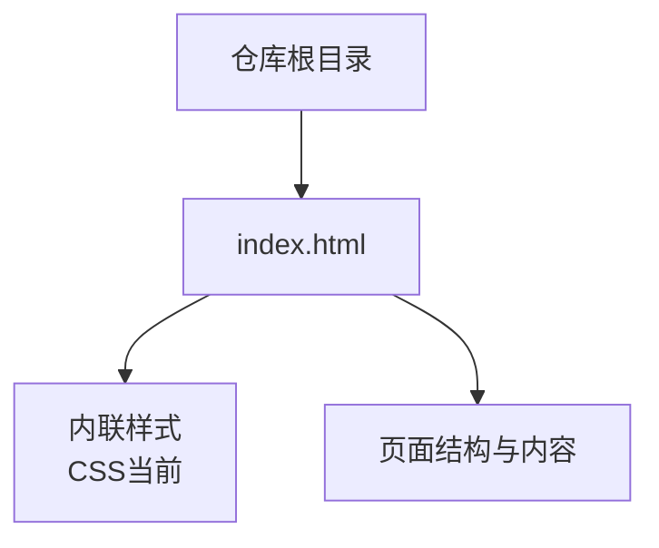
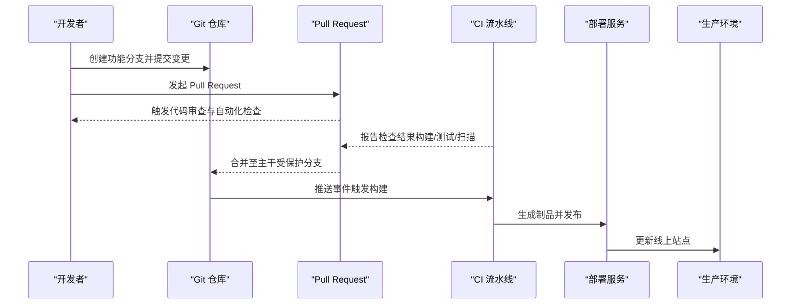
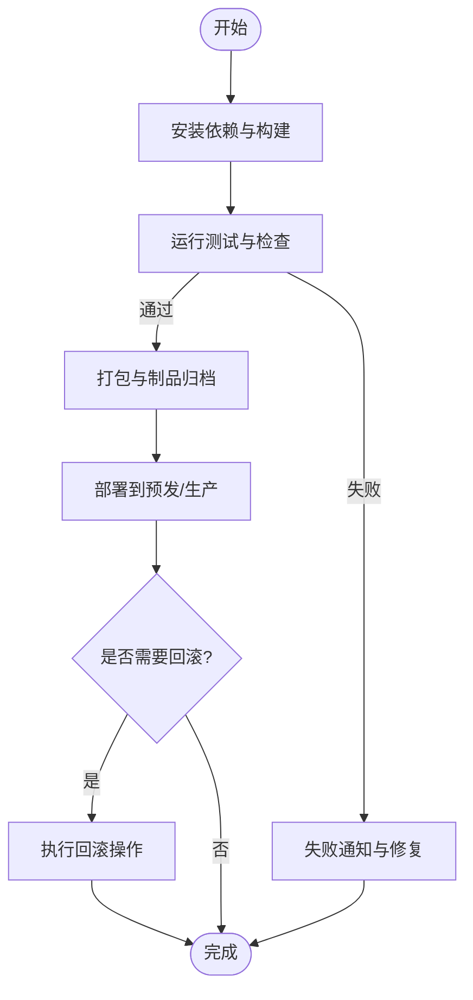
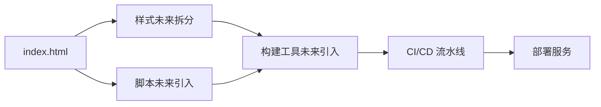

# 版本控制和团队协作

<cite>
**本文引用的文件**
- [index.html](file://index.html)
</cite>

## 目录
1. [简介](#简介)
2. [项目结构](#项目结构)
3. [核心组件](#核心组件)
4. [架构总览](#架构总览)
5. [详细组件分析](#详细组件分析)
6. [依赖分析](#依赖分析)
7. [性能考虑](#性能考虑)
8. [故障排查指南](#故障排查指南)
9. [结论](#结论)
10. [附录](#附录)

## 简介
本指南面向静态页面项目的团队开发与协作，目标是建立一套可落地的版本控制与协作规范，覆盖分支策略、提交规范、代码审查流程、Issue 跟踪、Pull Request 流程、CI/CD 集成、自动化部署、冲突解决与回滚机制，以及从开发到生产的完整 DevOps 流程。通过统一规范与自动化手段，降低沟通成本、提升交付质量与效率。

## 项目结构
当前仓库为单页静态站点，根目录下包含一个入口 HTML 文件，样式内联在页面中，便于快速启动与演示。随着功能扩展，建议逐步拆分 CSS/JS 资源并引入构建工具与包管理。

**图表来源**
- [index.html:1-287](file://index.html#L1-L287)

**章节来源**
- [index.html:1-287](file://index.html#L1-L287)

## 核心组件
- 页面入口：index.html，承载导航、Hero、特性展示、数据统计、行动号召与页脚等模块。
- 样式组织：当前以内联方式存在，后续建议拆分为独立样式文件并按模块划分，配合命名约定与工具链进行优化。
- 交互脚本：当前未包含 JS，后续可按需引入模块化脚本，并通过构建工具打包。

**章节来源**
- [index.html:1-287](file://index.html#L1-L287)

## 架构总览
下图展示了从开发者本地到生产环境的端到端流程，包括分支工作流、代码审查、CI 流水线与自动部署。

[此图为概念性流程图，不直接映射具体源码文件]

## 详细组件分析

### 分支策略与协作规范
- 分支模型
  - main：稳定发布分支，仅接受来自 develop 或 release/* 的合并，禁止直接推送。
  - develop：日常集成分支，所有功能先合并到此，再从中切出功能分支。
  - feature/*：按任务或需求切分的功能分支，完成后合并回 develop。
  - release/*：预发布分支，用于修复与打标签，最终合并到 main 与 develop。
  - hotfix/*：紧急修复分支，直接从 main 切出，修复后同时合并回 main 与 develop。
- 分支命名
  - 小写短横线分隔，语义清晰，如 feature/add-hero-section、hotfix/fix-navbar-z-index。
- 权限与保护
  - main 启用分支保护规则：要求至少一名维护者审批、通过 CI 检查、禁止强制推送。
  - develop 同样启用保护规则，确保集成质量。

**章节来源**
- [index.html:1-287](file://index.html#L1-L287)

### 提交规范（Commit Message）
- 格式建议
  - <类型>: <简述>
  - 类型可选：feat、fix、docs、style、refactor、test、chore、revert
  - 示例：feat: 添加 Hero 区域与响应式布局
- 最佳实践
  - 每次提交聚焦单一职责，避免混合改动。
  - 使用祈使句描述变更目的，保持简洁明确。
  - 关联 Issue 编号，便于追溯。

**章节来源**
- [index.html:1-287](file://index.html#L1-L287)

### 代码审查流程（Review）
- 评审清单
  - 功能正确性与边界条件
  - 可读性与一致性（命名、结构、注释）
  - 性能影响与兼容性
  - 安全与可访问性
- 流程步骤
  - 开发者自测通过后发起 PR。
  - 指定至少一名 reviewer。
  - 自动化检查通过后进入人工评审。
  - 根据反馈迭代修改，直至获得批准。
- 工具建议
  - GitHub/GitLab 内置 PR 评审、评论与状态检查。
  - 结合 Lint/格式化与静态扫描，减少低级错误。

**章节来源**
- [index.html:1-287](file://index.html#L1-L287)

### Issue 跟踪与需求管理
- 模板化 Issue
  - Bug：复现步骤、期望行为、实际行为、环境信息。
  - 功能请求：背景、目标、验收标准。
- 标签与里程碑
  - 使用标签区分优先级、模块、状态；用里程碑规划版本节奏。
- 关联 PR
  - 在 PR 描述中引用 Issue，实现双向追踪。

**章节来源**
- [index.html:1-287](file://index.html#L1-L287)

### Pull Request 流程
- 前置条件
  - 分支最新且无冲突。
  - 通过本地构建与基础检查。
- PR 描述模板
  - 变更概述、影响范围、测试方法、注意事项。
- 合并策略
  - Squash Merge 或 Rebase + Merge，保持历史整洁。
  - 合并前必须通过 CI 与至少一名 reviewer 批准。

**章节来源**
- [index.html:1-287](file://index.html#L1-L287)

### CI/CD 集成与自动化部署
- 触发时机
  - Push 到 develop/main/release/hotfix 分支时触发相应流水线。
- 流水线阶段
  - 安装依赖、构建产物、运行测试、静态检查、安全扫描、生成制品。
- 部署策略
  - 构建静态站点并上传至对象存储或 CDN。
  - 灰度发布与回滚：通过别名/版本切换实现零停机发布。
- 关键配置要点
  - 缓存依赖加速构建。
  - 并行任务缩短流水线时长。
  - 环境变量与密钥安全管理。

[此图为概念性流程图，不直接映射具体源码文件]

### 冲突解决策略
- 预防优先
  - 频繁同步上游分支，减少大跨度合并。
  - 小步提交，粒度更细，冲突面更小。
- 解决步骤
  - 拉取最新分支，尝试合并或 rebase。
  - 定位冲突文件，逐段解析并保留正确逻辑。
  - 补充测试用例验证修复结果。
  - 重新提交并推动 PR 继续评审。

**章节来源**
- [index.html:1-287](file://index.html#L1-L287)

### 回滚机制
- 版本标记
  - 使用语义化版本（SemVer）打标签，便于回溯。
- 快速回滚
  - 通过部署平台一键回退到上一个稳定版本。
- 数据与配置
  - 配置外置化管理，变更可审计与回滚。
- 事故复盘
  - 记录回滚原因、影响范围与改进措施。

**章节来源**
- [index.html:1-287](file://index.html#L1-L287)

### 多人协作的开发规范
- 命名约定
  - 文件名与类名采用小驼峰或短横线分隔，语义清晰。
  - 变量与函数名表达意图，避免缩写滥用。
- 文件组织
  - 按功能域划分目录，遵循“高内聚、低耦合”。
  - 公共资源集中管理，避免重复定义。
- 代码风格
  - 统一使用 Lint 与格式化规则，提交前自动校验。
  - 注释解释复杂逻辑与决策依据。

**章节来源**
- [index.html:1-287](file://index.html#L1-L287)

## 依赖分析
当前项目为单文件静态页面，无外部依赖。随着演进，将引入样式、脚本与构建工具，建议在仓库中增加配置文件以固化依赖与流程。

[此图为概念性依赖图，不直接映射具体源码文件]

## 性能考虑
- 构建优化
  - 启用依赖缓存与增量构建，缩短流水线时间。
  - 对静态资源进行压缩与合并，减少请求数量。
- 运行时优化
  - 图片懒加载与按需加载脚本。
  - 使用 CDN 分发静态资源，提升全球访问速度。
- 监控与度量
  - 接入性能监控与错误上报，持续优化用户体验。

[本节提供通用指导，无需特定文件来源]

## 故障排查指南
- 常见问题
  - 合并冲突：检查分支差异，必要时使用交互式 rebase。
  - 构建失败：查看日志定位依赖或语法问题。
  - 部署失败：核对环境变量与权限配置。
- 诊断步骤
  - 复现问题，最小化变更定位根因。
  - 利用断点与日志输出辅助分析。
  - 回滚到上一稳定版本，保障业务连续性。
- 预防措施
  - 完善单元测试与集成测试。
  - 引入静态检查与安全扫描，提前发现隐患。

[本节提供通用指导，无需特定文件来源]

## 结论
通过统一的分支策略、提交规范、代码审查流程与自动化流水线，团队可以在静态页面项目中高效协作，降低风险、提升质量与交付速度。建议逐步引入构建工具与监控体系，持续优化工程效能与用户体验。

## 附录
- 推荐工具
  - 版本托管：GitHub / GitLab
  - 代码检查：ESLint / Stylelint / Prettier
  - 构建与部署：Vite / Webpack / Netlify / Vercel / Cloudflare Pages
  - 流水线：GitHub Actions / GitLab CI
- 参考模板
  - Issue 模板、PR 模板、README 与贡献指南
- 学习资源
  - 语义化版本规范、Git 工作流最佳实践、CI/CD 入门指南

[本节提供通用指导，无需特定文件来源]