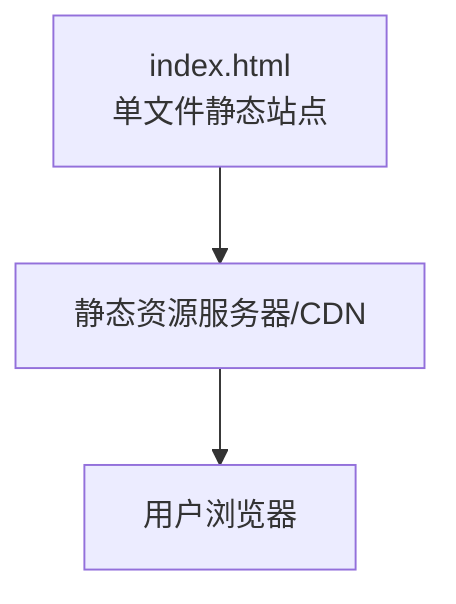
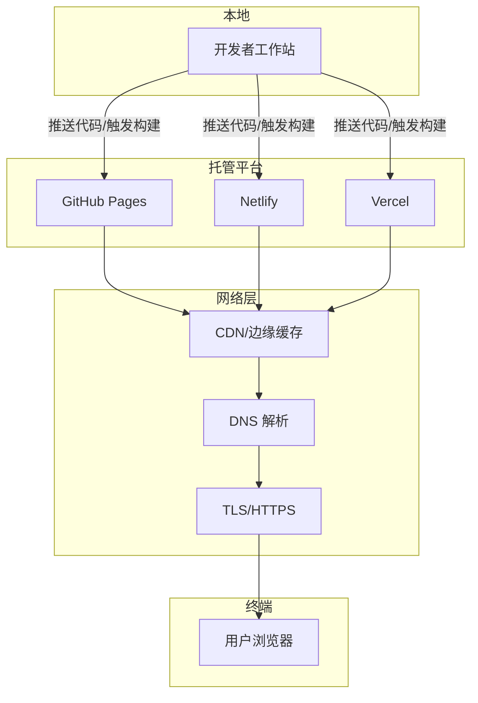

# 部署和发布

<cite>
**本文引用的文件**
- [index.html](file://index.html)
</cite>

## 目录
1. [简介](#简介)
2. [项目结构](#项目结构)
3. [核心组件](#核心组件)
4. [架构总览](#架构总览)
5. [详细组件分析](#详细组件分析)
6. [依赖分析](#依赖分析)
7. [性能考虑](#性能考虑)
8. [故障排查指南](#故障排查指南)
9. [结论](#结论)
10. [附录](#附录)

## 简介
本指南面向开发者和运维人员，提供从本地开发到生产环境部署的完整操作说明。本项目为纯静态页面（单页 HTML），可直接托管于任意静态网站托管平台。文档涵盖：
- 在 GitHub Pages、Netlify、Vercel 等平台的一键部署步骤
- 域名绑定、HTTPS 与 CDN 加速配置
- 浏览器兼容性检查与测试方法
- 性能监控与分析工具集成（Google Analytics、百度统计）
- 版本管理与团队协作最佳实践（Git 工作流、代码审查）

## 项目结构
当前仓库仅包含一个入口文件 index.html，内联样式与内容均位于该文件中，适合快速上线与最小化维护。

**图表来源**
- [index.html:1-287](file://index.html#L1-L287)

**章节来源**
- [index.html:1-287](file://index.html#L1-L287)

## 核心组件
- 入口文件：index.html，包含完整的页面结构与内联样式，无需构建即可直接部署。
- 响应式布局：通过 CSS 媒体查询适配移动端与桌面端。
- 交互元素：导航锚点链接与按钮跳转至页面内部区域。

**章节来源**
- [index.html:1-287](file://index.html#L1-L287)

## 架构总览
由于是纯静态站点，部署架构非常简单：将 index.html 上传至静态托管服务后，由平台提供的 CDN 进行全球分发，浏览器直接请求并渲染页面。

[此图为概念性架构图，不直接映射具体源码文件]

## 详细组件分析

### 平台部署指南

#### GitHub Pages
- 准备工作
  - 将仓库推送到 GitHub，确保根目录包含 index.html。
  - 在仓库设置中启用 Pages，选择分支（如 main）与目录（根目录）。
- 自定义域名与 HTTPS
  - 在 Pages 设置中添加自定义域名，按提示添加 DNS 记录。
  - 启用“强制 HTTPS”。
- 版本与协作
  - 使用分支策略（main 为稳定版，develop 为开发版）。
  - 通过 Pull Request 进行代码审查后再合并。

**章节来源**
- [index.html:1-287](file://index.html#L1-L287)

#### Netlify
- 准备工作
  - 将仓库连接到 Netlify，或直接将包含 index.html 的文件夹拖拽到 Netlify 控制台完成部署。
  - 默认发布目录为根目录。
- 自定义域名与 HTTPS
  - 在 Domains 中添加自定义域名，根据指引配置 DNS。
  - 自动签发并启用 HTTPS。
- 环境变量与重定向
  - 如需后续扩展，可在 Site settings > Environment variables 中配置变量。
  - 可通过 _redirects 文件实现路由重定向（可选）。

**章节来源**
- [index.html:1-287](file://index.html#L1-L287)

#### Vercel
- 准备工作
  - 将仓库导入 Vercel，框架检测为“其他”，直接部署根目录。
  - 首次部署成功后获得临时域名。
- 自定义域名与 HTTPS
  - 在 Project Settings > Domains 添加自定义域名，按提示配置 DNS。
  - 自动启用 HTTPS。
- 预览与环境
  - 每个 PR 都会生成预览部署，便于团队评审。

**章节来源**
- [index.html:1-287](file://index.html#L1-L287)

### 域名绑定、HTTPS 与 CDN 加速
- 域名绑定
  - 在托管平台添加自定义域名，并在 DNS 服务商处添加 CNAME 或 A 记录指向平台提供的地址。
  - 验证通过后生效。
- HTTPS 配置
  - GitHub Pages、Netlify、Vercel 均支持自动证书申请与续期，建议开启“强制 HTTPS”。
- CDN 加速
  - 上述平台均内置全球 CDN；如需更细粒度控制，可接入第三方 CDN（如 Cloudflare），并将 DNS 切至其名下。

[本节为通用流程说明，不直接引用具体源码文件]

### 浏览器兼容性与测试
- 兼容性要点
  - 页面使用现代 CSS（如 :root 变量、backdrop-filter、grid），建议在目标市场主流浏览器上验证。
  - 针对旧版浏览器，可考虑引入 polyfill 或降级方案（按需）。
- 测试方法
  - 本地多浏览器打开 index.html 进行基础验证。
  - 使用在线工具（如 BrowserStack、Sauce Labs）进行跨设备/浏览器测试。
  - 使用 Lighthouse 进行性能与可访问性审计。

[本节为通用流程说明，不直接引用具体源码文件]

### 性能监控与分析集成
- Google Analytics
  - 在托管平台启用 HTTPS 后，在 index.html 的 head 中插入官方提供的跟踪脚本片段（替换为你的测量 ID）。
  - 注意隐私合规与数据收集策略。
- 百度统计
  - 在 index.html 的 head 中插入百度统计提供的 JS 代码片段（替换为你的站点 ID）。
  - 确认统计面板数据正常上报。
- 性能指标
  - 结合 Web Vitals（LCP、FID、CLS）与平台自带分析面板持续优化。

[本节为通用流程说明，不直接引用具体源码文件]

### 版本管理与团队协作最佳实践
- Git 工作流
  - 分支模型：main（生产）、develop（集成）、feature/*（功能分支）。
  - 提交规范：语义化提交信息，便于自动生成变更日志。
- 代码审查
  - 所有变更通过 Pull Request 审查，至少一名成员批准后方可合并。
  - 自动化检查：CI 可执行语法校验、Lighthouse 基线等。
- 发布流程
  - 合并到 main 后触发自动部署（GitHub Actions / Netlify / Vercel）。
  - 发布前进行预发环境验证，再灰度发布至生产。

[本节为通用流程说明，不直接引用具体源码文件]

## 依赖分析
- 外部依赖
  - 无外部 JS/CSS 库依赖，全部样式与逻辑内联在 index.html 中，利于快速加载与简化部署。
- 运行时依赖
  - 仅需 HTTP/HTTPS 静态资源服务与 CDN。
- 潜在风险
  - 若未来引入第三方脚本（统计、广告等），需评估加载顺序、错误处理与隐私合规。

**章节来源**
- [index.html:1-287](file://index.html#L1-L287)

## 性能考虑
- 首屏优化
  - 保持单文件精简，避免不必要的 DOM 节点与样式。
  - 图片等资源建议使用 CDN 并启用压缩与缓存。
- 缓存策略
  - 利用平台 CDN 缓存静态资源，合理设置 Cache-Control。
- 监控与度量
  - 接入 Google Analytics/百度统计，关注 PV/UV、跳出率、关键路径耗时。
  - 定期运行 Lighthouse 审计，定位性能瓶颈。

[本节为通用指导，不直接引用具体源码文件]

## 故障排查指南
- 常见问题
  - 404 错误：确认部署目录为根目录且 index.html 存在。
  - 域名解析失败：检查 DNS 记录是否正确，CNAME/A 记录是否生效。
  - HTTPS 报错：确认已启用强制 HTTPS 且证书有效。
- 调试手段
  - 浏览器开发者工具查看网络请求与错误日志。
  - 使用 curl 或在线工具检查返回状态码与头部信息。
  - 在托管平台查看构建/部署日志定位问题。

[本节为通用指导，不直接引用具体源码文件]

## 结论
本项目为极简静态站点，适合快速上线与低成本运维。推荐优先使用 GitHub Pages、Netlify 或 Vercel 进行托管，并结合自定义域名、HTTPS 与 CDN 提升访问体验。配合完善的版本管理、代码审查与监控体系，可实现稳定可靠的发布流程。

[本节为总结性内容，不直接引用具体源码文件]

## 附录

### 快速部署清单
- 本地验证
  - 双击打开 index.html，确认页面显示与交互正常。
- 选择平台
  - GitHub Pages：仓库设置启用 Pages，选择分支与目录。
  - Netlify：连接仓库或直接拖拽文件夹部署。
  - Vercel：导入仓库并一键部署。
- 域名与 HTTPS
  - 添加自定义域名，配置 DNS，启用强制 HTTPS。
- 分析与监控
  - 插入 Google Analytics/百度统计代码片段。
  - 配置 Lighthouse 与平台分析面板。
- 协作与发布
  - 建立分支策略与 PR 审查流程。
  - 合并到 main 触发自动部署。

[本节为操作清单，不直接引用具体源码文件]