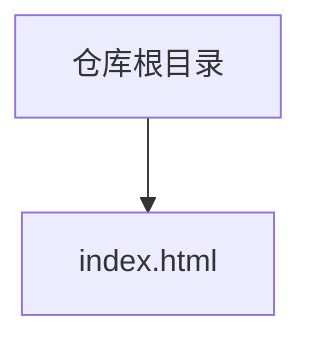
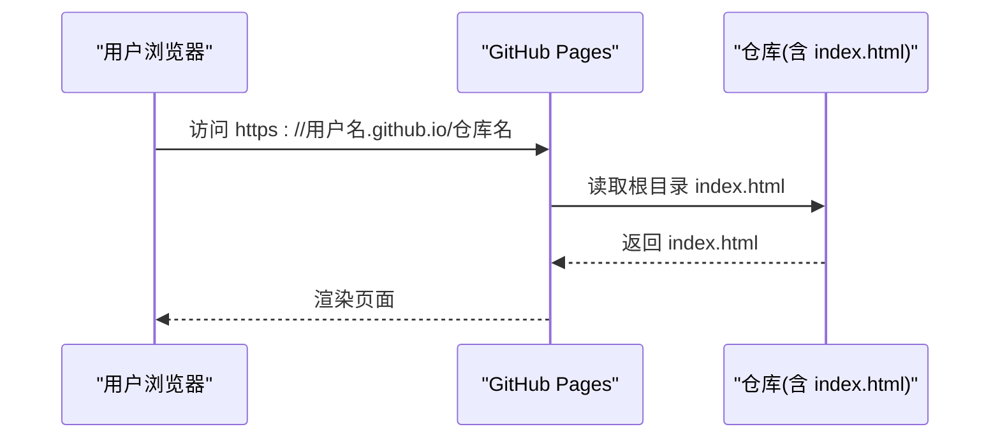
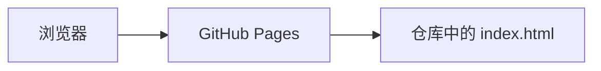

# GitHub Pages部署指南

<cite>
**本文引用的文件**
- [index.html](file://index.html)
</cite>

## 目录
1. [简介](#简介)
2. [项目结构](#项目结构)
3. [核心组件](#核心组件)
4. [架构总览](#架构总览)
5. [详细组件分析](#详细组件分析)
6. [依赖分析](#依赖分析)
7. [性能考虑](#性能考虑)
8. [故障排查指南](#故障排查指南)
9. [结论](#结论)
10. [附录](#附录)

## 简介
本指南面向初学者，详细说明如何将一个单文件HTML项目（当前仓库根目录包含 index.html）完整部署到GitHub Pages。内容涵盖：创建并配置仓库、上传文件、启用Pages服务、选择分支与根目录、绑定自定义域名与SSL、使用GitHub Actions实现自动化部署、部署后验证与缓存清理、常见问题解决方案等。

## 项目结构
当前项目为极简静态站点，仅包含一个入口文件：
- 根目录下的 index.html：完整的页面结构与样式，可直接作为GitHub Pages的默认首页。

**图表来源**
- [index.html:1-287](file://index.html#L1-L287)

**章节来源**
- [index.html:1-287](file://index.html#L1-L287)

## 核心组件
- 入口文件 index.html：作为GitHub Pages的默认首页，无需额外构建或服务器配置即可直接发布。
- 无外部依赖：页面内联CSS，不依赖第三方CDN或框架，便于快速部署与稳定访问。

**章节来源**
- [index.html:1-287](file://index.html#L1-L287)

## 架构总览
GitHub Pages将托管静态资源，浏览器通过HTTP/HTTPS请求获取 index.html 并渲染页面。对于单页应用，所有路由由前端处理；对于纯静态页面，直接返回 index.html。

[此图为概念性流程，不映射具体代码文件]

## 详细组件分析

### 步骤一：准备并上传 index.html
- 确保 index.html 位于仓库根目录。
- 若本地未初始化Git，请在项目根目录执行初始化并提交。
- 将本地仓库推送到远程GitHub仓库。

提示：由于本项目只有一个 index.html，无需构建工具链，直接提交即可。

**章节来源**
- [index.html:1-287](file://index.html#L1-L287)

### 步骤二：在GitHub上创建仓库并启用Pages
1. 登录GitHub，新建仓库（可设为Public以便免费使用Pages）。
2. 将本地代码推送至该仓库。
3. 进入仓库的 Settings -> Pages。
4. Source 选择 Deploy from a branch。
5. Branch 选择 main 或 master，并设置目录为 / (root)。
6. 保存后等待构建完成，访问 https://用户名.github.io/仓库名 查看效果。

注意：首次构建可能需要几分钟。

**章节来源**
- [index.html:1-287](file://index.html#L1-L287)

### 步骤三：自定义域名与SSL证书
1. 在 Settings -> Pages 中点击 Custom domain，输入你的域名（如 www.example.com）。
2. 在DNS服务商处添加记录：
   - CNAME：www 指向 用户名.github.io
   - 如需裸域（example.com），需使用ALIAS/ANAME或Cloudflare等支持的服务
3. 勾选 Enforce HTTPS，等待GitHub签发并启用SSL。
4. 若出现证书错误，检查CNAME是否正确、是否已生效、是否启用了强制HTTPS。

提示：部分DNS服务商对裸域CNAME有限制，建议使用子域名或支持ALIAS/ANAME的解析服务。

**章节来源**
- [index.html:1-287](file://index.html#L1-L287)

### 步骤四：使用GitHub Actions实现自动化部署
对于单文件HTML项目，每次推送都会自动触发Pages构建，无需额外Actions。但如果你希望增加校验、预览或通知等功能，可参考以下思路：
- 在 .github/workflows 下创建工作流，监听 push 事件。
- 使用 actions/checkout 检出代码。
- 可选：运行lint或格式化工具。
- 可选：发送通知（邮件/Slack/Discord）。
- 由于Pages会自动构建，无需手动部署步骤。

示例要点（以描述为主，避免粘贴代码）：
- 触发条件：push 到 main 或 master。
- 任务：检出代码、可选校验、结束。
- 输出：由GitHub Pages负责构建与发布。

**章节来源**
- [index.html:1-287](file://index.html#L1-L287)

### 步骤五：部署后验证
- 访问 https://用户名.github.io/仓库名 确认页面正常显示。
- 若绑定了自定义域名，访问 https://www.yourdomain.com 验证SSL与重定向。
- 在不同设备与浏览器测试响应式布局与交互。
- 检查控制台是否有跨域或资源加载错误。

**章节来源**
- [index.html:1-287](file://index.html#L1-L287)

### 步骤六：缓存清理方法
- 浏览器缓存：硬刷新（Ctrl+F5 或 Cmd+Shift+R），或使用无痕模式。
- CDN缓存：若使用Cloudflare等CDN，可在对应面板清除缓存。
- GitHub Pages缓存：通常由平台管理，可通过重新推送空提交或等待自动刷新。
- 自定义域名：若DNS变更未生效，耐心等待TTL过期或手动刷新DNS缓存。

**章节来源**
- [index.html:1-287](file://index.html#L1-L287)

### 步骤七：常见问题与解决
- 404 Not Found：确认 index.html 在仓库根目录且分支设置为 root。
- 页面样式错乱：检查是否被其他同名文件覆盖；确保没有错误的相对路径。
- SSL证书失败：检查CNAME记录是否正确，是否启用了Enforce HTTPS。
- 更新不生效：尝试硬刷新或等待构建完成；必要时重新推送提交。
- 自定义域名无法访问：检查DNS解析是否生效，是否使用了支持的解析类型。

**章节来源**
- [index.html:1-287](file://index.html#L1-L287)

## 依赖分析
本项目为纯静态页面，无外部依赖，适合直接托管于GitHub Pages。

[此图为概念性依赖关系，不映射具体代码文件]

## 性能考虑
- 单文件HTML减少请求次数，利于首屏加载。
- 内联CSS避免额外请求，提升渲染速度。
- 图片与资源建议压缩与懒加载（如有扩展需求）。
- 使用现代浏览器特性时注意兼容性。

[本节提供通用指导，不引用具体文件]

## 故障排查指南
- 页面空白：检查浏览器控制台错误，确认资源路径正确。
- 样式丢失：确认未引入不存在的外部资源；保持内联CSS。
- 移动端异常：检查媒体查询与容器宽度设置。
- 自定义域名问题：核对CNAME、SSL状态与DNS TTL。

**章节来源**
- [index.html:1-287](file://index.html#L1-L287)

## 结论
对于单文件HTML项目，GitHub Pages是最简单高效的托管方案。只需将 index.html 放入仓库根目录，启用Pages并选择合适分支与目录，即可快速上线。结合自定义域名与SSL，可获得专业级访问体验。若需要自动化流程，可基于GitHub Actions扩展校验与通知能力。

[本节总结性内容，不引用具体文件]

## 附录
- 最佳实践
  - 保持 index.html 简洁清晰，便于维护。
  - 定期备份与版本控制，利用Git历史追踪变更。
  - 使用语义化标签与无障碍属性，提升可访问性。
- 参考路径
  - 入口文件位置：仓库根目录/index.html

**章节来源**
- [index.html:1-287](file://index.html#L1-L287)