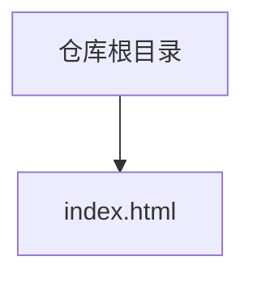
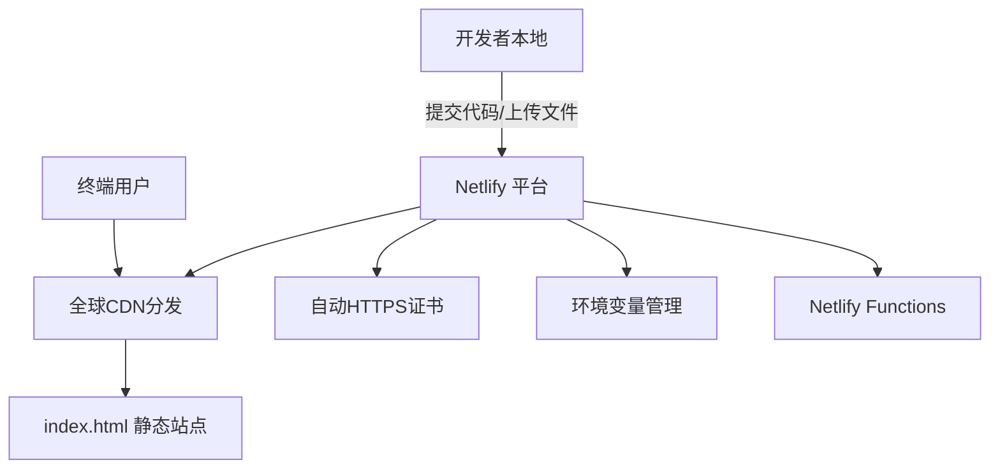
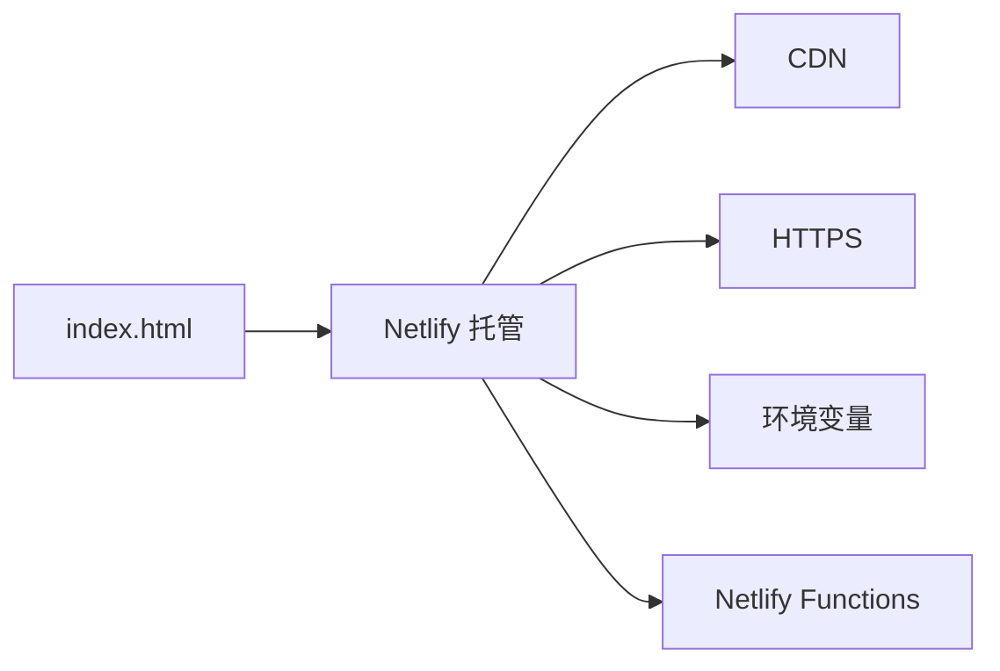
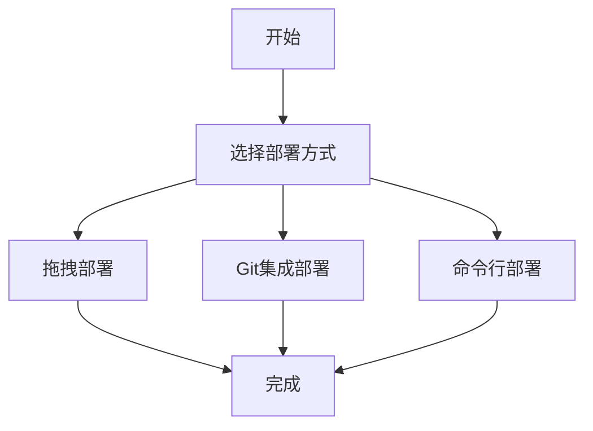

# Netlify部署指南

<cite>
**本文引用的文件**
- [index.html](file://index.html)
</cite>

## 目录
1. [简介](#简介)
2. [项目结构](#项目结构)
3. [核心组件](#核心组件)
4. [架构总览](#架构总览)
5. [详细组件分析](#详细组件分析)
6. [依赖关系分析](#依赖关系分析)
7. [性能考虑](#性能考虑)
8. [故障排除指南](#故障排除指南)
9. [结论](#结论)
10. [附录](#附录)

## 简介
本指南面向初学者与进阶用户，详细说明如何将当前单文件HTML项目（仅包含一个首页）完整部署到Netlify平台。内容涵盖三种部署方式：拖拽部署、Git集成部署、命令行部署；构建配置选项（构建命令、发布目录、环境变量）；自定义域名绑定、HTTPS证书与CDN优化；以及使用Netlify Functions为静态页面添加后端能力。同时提供部署预览、版本管理与回滚的最佳实践与操作步骤。

## 项目结构
当前仓库为极简静态站点，根目录下仅包含一个首页文件：
- index.html：完整的单页应用，包含内联样式与页面结构，可直接作为静态资源被Netlify托管。

**图表来源**
- [index.html:1-287](file://index.html#L1-L287)

**章节来源**
- [index.html:1-287](file://index.html#L1-L287)

## 核心组件
- 静态入口：index.html 是唯一的静态资源，无需构建工具或服务器端渲染即可直接发布。
- 样式与交互：所有样式以 <style> 内联在头部，页面行为由浏览器原生支持，无外部依赖。
- 可访问性与响应式：包含 viewport 设置与基础媒体查询，适配移动端。

由于本项目为纯静态HTML，部署时不需要额外的构建步骤，Netlify将直接托管该文件并自动启用CDN与HTTPS。

**章节来源**
- [index.html:1-287](file://index.html#L1-L287)

## 架构总览
下图展示从开发者到最终用户的端到端流程，包括三种部署路径与Netlify提供的服务（CDN、HTTPS、函数、环境变量等）。

[此图为概念性架构图，不直接映射具体源码文件]

## 详细组件分析

### 一、拖拽部署（最快上手）
适用场景：快速验证、个人演示、临时分享。

操作步骤
- 登录Netlify控制台，新建站点。
- 将 index.html 文件直接拖入Netlify的“拖放区域”。
- 等待部署完成，即可获得一个 *.netlify.app 子域链接。
- 如需自定义域名，可在站点设置中绑定域名并完成DNS解析。

注意事项
- 确保文件名正确且位于根目录。
- 若后续需要添加更多静态资源（图片、CSS、JS），建议迁移至Git工作流以便版本管理。

**章节来源**
- [index.html:1-287](file://index.html#L1-L287)

### 二、Git集成部署（推荐用于团队协作）
适用场景：持续集成、多人协作、自动化流水线。

操作步骤
- 将项目推送到GitHub/GitLab/Bitbucket等Git仓库。
- 在Netlify中选择“从Git导入”，授权并选择对应仓库与分支。
- 配置构建参数：
  - 构建命令：留空（静态站点无需构建）。
  - 发布目录：留空（默认即为仓库根目录）。
- 保存后，每次推送都会触发自动部署。

高级配置
- 环境变量：在Netlify控制台的“Site settings > Environment variables”中添加键值对，供前端脚本或Functions读取。
- 重定向与路由：通过 netlify.toml 或 _redirects 文件定义URL重写、SPA路由或API代理。
- 构建缓存：可通过 .netlify/cache 目录提升重复构建速度（本静态项目通常不需要）。

**章节来源**
- [index.html:1-287](file://index.html#L1-L287)

### 三、命令行部署（CI/CD友好）
适用场景：本地一键部署、集成到CI/CD管道。

前置准备
- 安装Node.js与npm。
- 全局安装Netlify CLI：npm install -g netlify-cli。
- 登录：netlify login。

常用命令
- 初始化项目：netlify init（按提示创建或关联站点）。
- 本地开发：netlify dev（可选，用于测试Functions与代理）。
- 部署：netlify deploy --prod（生产环境）或 netlify deploy（预览环境）。
- 指定发布目录：netlify deploy --prod --dir=.（当前目录即根目录）。

环境变量与配置
- 可在 netlify.toml 中声明环境变量、构建命令与发布目录。
- 也可在CLI中使用 --env 传递变量（谨慎处理敏感信息）。

**章节来源**
- [index.html:1-287](file://index.html#L1-L287)

### 四、构建配置选项
- 构建命令：对于纯静态HTML，无需设置构建命令。
- 发布目录：设置为仓库根目录（默认），Netlify会托管 index.html。
- 环境变量：通过控制台或配置文件注入，供前端或Functions使用。
- 重定向与路由：使用 netlify.toml 或 _redirects 实现URL重写、SPA路由、API代理等。

示例说明（概念性）
- 在 netlify.toml 中声明环境变量与重定向规则，便于版本化管理。
- 在Functions中读取环境变量，实现动态功能（如表单提交、数据获取）。

**章节来源**
- [index.html:1-287](file://index.html#L1-L287)

### 五、自定义域名与HTTPS
- 自定义域名：在站点设置中添加域名，并按提示完成DNS记录（CNAME或A记录）。
- HTTPS证书：Netlify自动为所有域名签发并续期HTTPS证书，无需手动配置。
- 强制HTTPS：可在站点设置中开启“强制HTTPS”，确保所有流量走安全通道。
- 多域名与子域：支持为主域名和多个子域分别配置。

**章节来源**
- [index.html:1-287](file://index.html#L1-L287)

### 六、CDN优化设置
- 全球CDN：Netlify自动将静态资源缓存至全球边缘节点，提升加载速度。
- 缓存策略：静态HTML默认具备合适的缓存头，可按需通过 netlify.toml 或 _headers 自定义。
- 压缩与合并：Netlify自动启用Gzip/Brotli压缩，减少传输体积。
- 预取与预连接：可通过HTTP头或HTML标签优化首屏体验（例如 preconnect、prefetch）。

**章节来源**
- [index.html:1-287](file://index.html#L1-L287)

### 七、Netlify Functions：为静态页面添加后端能力
适用场景：表单处理、邮件发送、第三方API调用、鉴权逻辑等。

基本流程
- 在项目中创建 functions 目录（例如 netlify/functions）。
- 编写函数文件（例如 submit-form.js），导出处理逻辑。
- 在 index.html 中通过 fetch 调用 /api/submit-form 等函数端点。
- 部署后，Netlify会自动识别并暴露函数端点。

环境变量使用
- 在函数中读取环境变量（如 API_KEY、SMTP_HOST），避免硬编码敏感信息。
- 通过控制台或配置文件统一管理，不同环境（开发/生产）可独立配置。

安全性与限流
- 使用Netlify Identity或自定义鉴权保护敏感函数。
- 结合Rate Limiting限制请求频率，防止滥用。

**章节来源**
- [index.html:1-287](file://index.html#L1-L287)

### 八、部署预览、版本管理与回滚
- 部署预览：每次PR或推送都会生成唯一预览链接，便于团队评审与测试。
- 版本管理：每个部署都有版本号与时间戳，可在控制台查看历史部署。
- 回滚：在控制台选择任意历史部署进行“重新部署”，快速回退到稳定版本。
- 分支策略：为不同分支配置不同的部署目标（如 develop 指向预览，main 指向生产）。

最佳实践
- 使用语义化版本与变更日志，配合部署备注说明变更内容。
- 在关键部署前执行自动化检查（lint、测试、构建），确保质量。

**章节来源**
- [index.html:1-287](file://index.html#L1-L287)

## 依赖关系分析
本项目为纯静态HTML，无外部库或框架依赖，部署链路简单清晰：
- 输入：index.html
- 输出：Netlify托管的静态站点（含CDN与HTTPS）
- 扩展：可通过Functions与环境变量增加后端能力

[此图为概念性依赖图，不直接映射具体源码文件]

**章节来源**
- [index.html:1-287](file://index.html#L1-L287)

## 性能考虑
- 首屏优化：保持HTML精简，避免阻塞渲染的脚本；合理使用图片与字体。
- 缓存策略：为静态资源设置合理的缓存头，利用浏览器缓存与CDN缓存。
- 资源压缩：启用Gzip/Brotli，减少传输体积。
- 网络优化：使用HTTP/2、预连接与预取，降低延迟。
- 监控与分析：接入性能监控与错误追踪，持续优化用户体验。

[本节为通用性能建议，不直接分析具体文件]

## 故障排除指南
常见问题与解决方案
- 404错误：确认index.html位于发布目录根路径；检查URL路径与重定向规则。
- 样式未生效：确认浏览器缓存已清理；检查资源路径是否正确。
- 环境变量未生效：确认已在控制台或配置文件中正确设置；重启部署使变量生效。
- Functions报错：检查函数日志；确认权限与密钥配置；验证请求格式与跨域设置。
- 自定义域名无法访问：核对DNS记录是否生效；检查CNAME或A记录是否正确；确认域名已验证。

调试技巧
- 使用浏览器开发者工具查看网络请求与错误。
- 在Netlify控制台查看构建日志与函数日志。
- 使用 netlify dev 本地模拟环境与函数调用。

**章节来源**
- [index.html:1-287](file://index.html#L1-L287)

## 结论
本项目为极简静态站点，适合通过Netlify快速上线与迭代。推荐使用Git集成部署以实现自动化与团队协作；通过环境变量与Functions扩展后端能力；借助自定义域名、HTTPS与CDN获得专业级托管体验。结合部署预览、版本管理与回滚机制，可保障发布质量与稳定性。

[本节为总结性内容，不直接分析具体文件]

## 附录

### A. 快速开始清单
- 拖拽部署：将 index.html 拖入Netlify控制台。
- Git部署：推送代码到仓库，并在Netlify中连接仓库。
- CLI部署：安装并登录Netlify CLI，执行部署命令。
- 自定义域名：在站点设置中添加域名并完成DNS解析。
- 环境变量：在控制台或配置文件中添加键值对。
- Functions：创建函数目录与文件，调用API端点。

### B. 参考流程图（概念性）

[此图为概念性流程图，不直接映射具体源码文件]