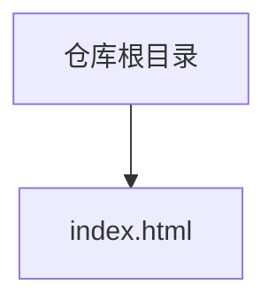
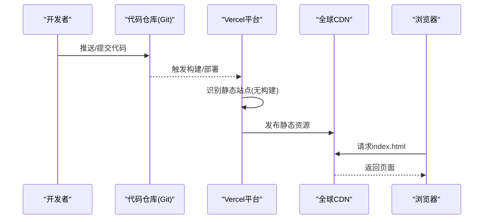

# Vercel部署指南

<cite>
**本文引用的文件**
- [index.html](file://index.html)
</cite>

## 目录
1. [简介](#简介)
2. [项目结构](#项目结构)
3. [核心组件](#核心组件)
4. [架构总览](#架构总览)
5. [详细组件分析](#详细组件分析)
6. [依赖关系分析](#依赖关系分析)
7. [性能考量](#性能考量)
8. [故障排查指南](#故障排查指南)
9. [结论](#结论)
10. [附录](#附录)

## 简介
本指南面向初学者，提供将当前单文件HTML项目完整部署到Vercel平台的实操步骤。内容涵盖：
- 快速部署流程：通过Git集成自动部署、手动上传与CLI工具部署
- 项目初始化配置：vercel.json的作用与常用选项
- 环境变量管理、构建流程与输出目录配置
- 自定义域名绑定、SSL证书与全球CDN加速
- Preview Deployments（预览部署）在开发测试中的使用
- 性能监控、访问日志分析与错误追踪
- 最佳实践建议

本项目为纯静态站点，仅包含一个入口HTML文件，无需构建工具或后端服务，因此部署过程非常简单。

## 项目结构
当前仓库根目录仅包含一个首页文件：
- index.html：页面结构与内联样式，作为站点唯一入口

**图表来源**
- [index.html:1-287](file://index.html#L1-L287)

**章节来源**
- [index.html:1-287](file://index.html#L1-L287)

## 核心组件
- 入口资源：index.html（浏览器直接加载的静态页面）
- 部署目标：Vercel平台（自动识别静态站点并启用CDN与HTTPS）

由于是纯静态项目，不存在复杂模块或运行时依赖，所有功能由浏览器原生能力实现。

**章节来源**
- [index.html:1-287](file://index.html#L1-L287)

## 架构总览
下图展示从开发者到最终用户的数据流与托管关系：

**图表来源**
- [index.html:1-287](file://index.html#L1-L287)

## 详细组件分析

### 通过Git集成自动部署（推荐）
- 准备工作
  - 将项目推送到支持的平台（如GitHub/GitLab/Bitbucket）
  - 在Vercel中创建新项目并选择对应代码仓库
- 部署流程
  - Vercel检测到静态站点后，自动完成部署并分配临时域名
  - 每次push都会触发新的Preview Deployment；合并到主分支可触发Production部署
- 注意事项
  - 入口文件需为index.html（当前项目已满足）
  - 若后续引入构建脚本，可在“设置”中配置构建命令与输出目录

**章节来源**
- [index.html:1-287](file://index.html#L1-L287)

### 手动上传文件部署
- 登录Vercel控制台，新建项目
- 选择“Upload”方式，将包含index.html的文件夹整体上传
- 等待部署完成后即可通过分配的域名访问

**章节来源**
- [index.html:1-287](file://index.html#L1-L287)

### 使用CLI工具部署
- 安装Vercel CLI
- 在项目根目录执行初始化命令，按提示选择框架（静态站点）
- 首次部署成功后，可通过CLI进行本地预览与持续部署
- 适合需要脚本化或CI集成的场景

**章节来源**
- [index.html:1-287](file://index.html#L1-L287)

### vercel.json配置文件与作用
- 作用
  - 声明项目的构建与路由规则
  - 定义环境变量、重定向、重写、缓存策略等
- 常见选项（适用于静态站点）
  - buildCommand：构建命令（本例为空）
  - outputDirectory：构建产物目录（本例为空，默认使用根目录）
  - routes：用于重定向、重写、响应头等规则
  - env：注入环境变量（也可在Vercel控制台设置）
- 何时需要
  - 当需要自定义路由、缓存策略或接入外部API时添加

**章节来源**
- [index.html:1-287](file://index.html#L1-L287)

### 环境变量管理
- 在Vercel控制台的“Settings > Environment Variables”中添加键值对
- 支持不同环境（Development/Preview/Production）隔离
- 前端应用可通过运行时API读取（注意避免泄露敏感信息）

**章节来源**
- [index.html:1-287](file://index.html#L1-L287)

### 构建流程与输出目录配置
- 当前项目无需构建，Vercel会直接托管根目录下的静态文件
- 若未来引入构建工具（如打包器），请在“构建命令”与“输出目录”中正确配置
- 确保入口文件位于输出目录根路径且命名为index.html

**章节来源**
- [index.html:1-287](file://index.html#L1-L287)

### 自定义域名绑定与SSL证书
- 在“Domains”中添加自定义域名
- 根据提示配置DNS解析记录（通常为CNAME或A记录）
- SSL证书由Vercel自动签发与管理，无需手动配置

**章节来源**
- [index.html:1-287](file://index.html#L1-L287)

### 全球CDN加速
- Vercel默认启用全球边缘网络，自动缓存静态资源
- 可通过routes配置缓存策略与Header（如Cache-Control）
- 对于图片等资源，建议使用对象存储+CDN以提升性能

**章节来源**
- [index.html:1-287](file://index.html#L1-L287)

### Preview Deployments（预览部署）
- 每次PR或分支push都会生成独立预览链接
- 便于团队协作评审与演示
- 可在控制台查看历史部署并进行回滚

**章节来源**
- [index.html:1-287](file://index.html#L1-L287)

### 性能监控、访问日志与错误追踪
- 性能监控
  - 使用Vercel Analytics或第三方方案（如GA/UMami）收集页面指标
  - 关注首屏时间、交互延迟与资源体积
- 访问日志
  - 在控制台查看访问统计与地域分布
  - 结合CDN日志进行深度分析
- 错误追踪
  - 前端错误可通过Sentry等工具上报
  - 服务端错误（如有）可使用Vercel Logs或集中式日志系统

**章节来源**
- [index.html:1-287](file://index.html#L1-L287)

## 依赖关系分析
当前项目为纯静态HTML，无外部依赖与模块引用，部署链路简单清晰：

**图表来源**
- [index.html:1-287](file://index.html#L1-L287)

**章节来源**
- [index.html:1-287](file://index.html#L1-L287)

## 性能考量
- 资源优化
  - 压缩HTML/CSS/JS，移除无用样式
  - 图片采用现代格式与懒加载
- 缓存策略
  - 为静态资源设置长期缓存与版本化文件名
  - 利用Vercel的缓存与HTTP头控制
- 首屏体验
  - 减少阻塞渲染的资源
  - 关键CSS内联，非关键资源异步加载
- 监控与迭代
  - 基于真实用户数据持续优化

[本节为通用指导，不直接分析具体文件]

## 故障排查指南
- 常见问题
  - 404错误：确认入口文件名为index.html且位于根目录
  - 样式未生效：检查路径与缓存，必要时强制刷新
  - 环境变量未生效：核对环境分组与变量名大小写
- 调试方法
  - 使用浏览器开发者工具查看网络请求与错误
  - 在Vercel控制台查看部署日志与构建输出
  - 通过Preview链接验证分支变更

**章节来源**
- [index.html:1-287](file://index.html#L1-L287)

## 结论
本项目为纯静态单页应用，部署到Vercel极为简便。推荐优先使用Git集成实现自动化部署，并结合Preview Deployments提升协作效率。通过合理配置环境变量、路由与缓存策略，可获得良好的性能与可维护性。

[本节为总结性内容，不直接分析具体文件]

## 附录
- 快速开始清单
  - 将项目推送到Git仓库
  - 在Vercel创建项目并连接仓库
  - 确认入口文件为index.html
  - 配置自定义域名与DNS
  - 开启Analytics与错误追踪
- 最佳实践
  - 使用分支与PR进行变更管理
  - 为静态资源启用强缓存与版本化
  - 定期审查性能指标并优化

[本节为补充说明，不直接分析具体文件]