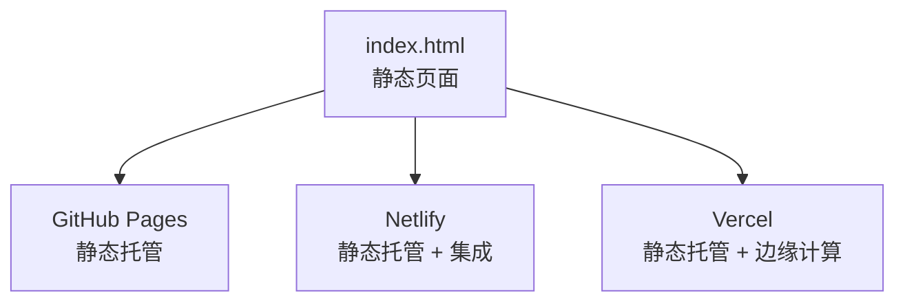
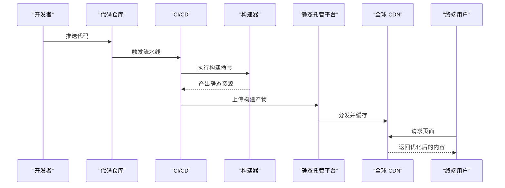
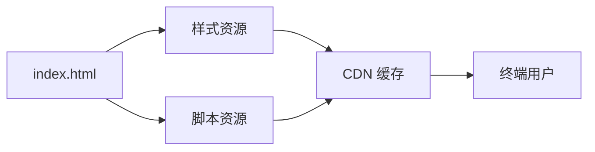
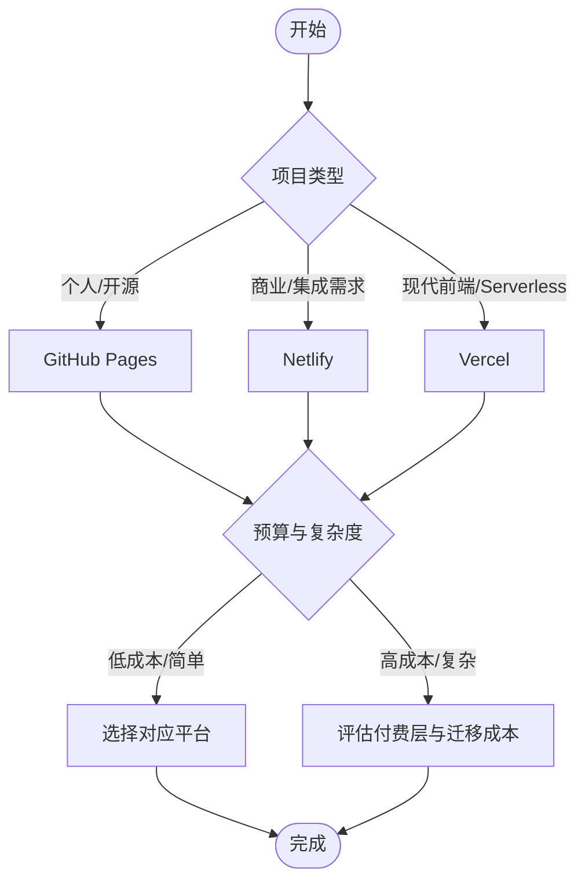

# 平台对比与选择建议

<cite>
**本文引用的文件**
- [index.html](file://index.html)
</cite>

## 目录
1. [简介](#简介)
2. [项目结构](#项目结构)
3. [核心组件](#核心组件)
4. [架构总览](#架构总览)
5. [详细组件分析](#详细组件分析)
6. [依赖分析](#依赖分析)
7. [性能考量](#性能考量)
8. [故障排查指南](#故障排查指南)
9. [结论](#结论)
10. [附录](#附录)

## 简介
本文件面向需要部署静态网站或前端应用的团队与个人，提供对主流静态托管平台的系统化对比与选择建议。重点覆盖 GitHub Pages、Netlify、Vercel 三大平台，从免费额度限制、部署速度、自定义域名支持、CI/CD 能力、全球 CDN 分布、开发者体验等维度进行横向比较，并结合成本效益分析与迁移策略，帮助决策者做出客观、可落地的选择。

为便于理解，文档以仓库中的示例页面作为“待部署产物”的参考载体，说明各平台在构建、缓存、预览、回滚等方面的差异与最佳实践。

## 项目结构
当前仓库包含一个单页 HTML 示例，适合作为静态站点直接发布到任意静态托管平台。该页面具备响应式布局与基础交互样式，可作为验证不同平台渲染、缓存、SEO、HTTPS、自定义域名等功能的最小可用样例。

图表来源
- [index.html:1-287](file://index.html#L1-L287)

章节来源
- [index.html:1-287](file://index.html#L1-L287)

## 核心组件
- 静态资源：HTML/CSS/JS 等可直接由 CDN 分发的资源。
- 构建产物（可选）：若使用框架或工具链，需先构建生成静态文件再发布。
- 配置项：自定义域名、环境变量、重定向规则、缓存策略、构建命令等。
- 集成服务：表单处理、函数/边缘函数、分析、A/B 测试、预览环境等。

章节来源
- [index.html:1-287](file://index.html#L1-L287)

## 架构总览
下图展示三类典型部署路径：纯静态直发、带构建流程的 CI/CD、以及结合函数/集成的现代前端应用。

[此图为概念性流程图，不直接映射具体源码文件]

## 详细组件分析

### GitHub Pages
- 适用场景
  - 个人博客、开源项目文档、简单营销落地页。
  - 与 GitHub 生态深度绑定，适合已有 GitHub 工作流的团队。
- 免费额度与限制
  - 免费计划通常包含每月带宽与构建时长限制；公共仓库可免费使用 Pages。
  - 不支持服务端逻辑（无服务器端运行环境），仅静态资源。
- 部署速度与构建
  - 基于 GitHub Actions 的构建与发布，速度受队列与资源影响。
  - 支持分支级 Pages（如 gh-pages、main）。
- 自定义域名与 HTTPS
  - 支持自定义域名与自动 HTTPS。
- CI/CD 能力
  - 通过 Actions 实现自动化构建与部署；可配置缓存加速。
- 全球 CDN
  - 由 GitHub 基础设施提供全球分发，延迟表现良好。
- 开发者体验
  - 与仓库无缝集成，PR 预览可通过第三方工具实现。
- 成本与升级
  - 免费足够大多数个人/开源项目；企业版按需扩展。
- 优缺点
  - 优点：零成本、与 Git 工作流天然契合、易于协作。
  - 缺点：功能相对基础，复杂集成与高级特性有限。

章节来源
- [index.html:1-287](file://index.html#L1-L287)

### Netlify
- 适用场景
  - 需要丰富集成的商业项目：表单、身份认证、边函数、A/B 测试、分析等。
  - 多环境预览、快速回滚、团队协作友好。
- 免费额度与限制
  - 免费计划包含一定月用量与构建分钟数；超出后按量计费或升级。
- 部署速度与构建
  - 增量构建与缓存优化，构建与部署速度快；支持并行任务。
- 自定义域名与 HTTPS
  - 一键配置自定义域名与自动 HTTPS；支持证书管理。
- CI/CD 能力
  - 内置 CI/CD，支持分支预览、PR 预览、回滚、环境变量管理。
- 全球 CDN
  - 全球边缘网络，低延迟高可用。
- 开发者体验
  - 可视化控制台强大；插件生态完善；本地开发体验好。
- 成本与升级
  - 免费起步，随业务增长平滑升级到 Pro/Business 等层级。
- 优缺点
  - 优点：生态丰富、集成能力强、开发者体验优秀。
  - 缺点：高级功能需付费；复杂场景可能产生额外费用。

章节来源
- [index.html:1-287](file://index.html#L1-L287)

### Vercel
- 适用场景
  - 现代化前端框架（Next.js、React、Vue、Svelte 等）与 Serverless/Edge 函数。
  - 强调极速构建、即时预览、边缘部署与全栈能力。
- 免费额度与限制
  - 免费计划包含构建分钟与带宽配额；超出后按量或升级。
- 部署速度与构建
  - 针对前端框架深度优化，构建与部署极快；支持增量编译与缓存。
- 自定义域名与 HTTPS
  - 支持自定义域名与自动 HTTPS；证书管理便捷。
- CI/CD 能力
  - 内置 CI/CD，支持分支预览、回滚、环境变量、安全扫描等。
- 全球 CDN
  - 依托边缘网络，全球低延迟访问。
- 开发者体验
  - 命令行与 UI 双驱动；与主流框架集成度高；调试与分析工具完善。
- 成本与升级
  - 免费起步，Pro/Hobby/Enterprise 等多层级满足不同规模需求。
- 优缺点
  - 优点：前端生态最佳、构建与部署速度领先、边缘能力突出。
  - 缺点：非 Vercel 原生框架需适配；高级功能需付费。

章节来源
- [index.html:1-287](file://index.html#L1-L287)

### 多维度对比要点
- 免费额度与限制
  - GitHub Pages：适合轻量静态站点；公共仓库免费。
  - Netlify：免费层较宽裕，适合中小型项目与原型验证。
  - Vercel：免费层对前端框架友好，适合现代 Web 应用。
- 部署速度
  - Vercel 与 Netlify 在构建缓存与增量构建方面优势明显；GitHub Pages 依赖 Actions 队列。
- 自定义域名与 HTTPS
  - 三者均支持；Netlify/Vercel 在证书管理与自动化上更顺滑。
- CI/CD 能力
  - Netlify/Vercel 内置且易用；GitHub Pages 借助 Actions，灵活但需自行编排。
- 全球 CDN
  - 三者均提供全球分发；Vercel/Netlify 在边缘计算与缓存策略上更灵活。
- 开发者体验
  - Netlify/Vercel 提供丰富的可视化控制台与插件生态；GitHub Pages 与 Git 工作流紧密集成。

[本节为概念性对比总结，不直接引用具体源码文件]

## 依赖分析
- 静态资源依赖
  - 页面本身无外部强依赖，便于在各平台快速上线。
- 构建与工具链
  - 若引入框架或打包工具，需在目标平台配置构建命令与环境变量。
- 集成与扩展
  - Netlify/Vercel 提供丰富的集成（表单、鉴权、分析、函数等）；GitHub Pages 需借助第三方或自研方案。

[此图为概念性依赖图，不直接映射具体源码文件]

章节来源
- [index.html:1-287](file://index.html#L1-L287)

## 性能考量
- 构建与缓存
  - 优先启用增量构建与依赖缓存，缩短构建时间。
- 资源优化
  - 压缩图片、合并与懒加载脚本、启用 Gzip/Brotli。
- 缓存策略
  - 合理设置静态资源缓存头，提升二次访问速度。
- 边缘与 CDN
  - 利用平台边缘节点就近分发，降低首屏延迟。
- 监控与诊断
  - 开启访问日志与性能指标，定位瓶颈并持续优化。

[本节提供通用性能建议，不直接引用具体源码文件]

## 故障排查指南
- 常见问题
  - 构建失败：检查构建命令、依赖版本、环境变量。
  - 部署失败：确认权限、分支规则、构建产物路径。
  - 自定义域名解析：检查 DNS 记录、CNAME/A 记录、HTTPS 证书状态。
  - 缓存问题：清理 CDN 缓存、强制刷新、调整缓存策略。
- 诊断步骤
  - 查看平台构建日志与错误堆栈。
  - 使用浏览器开发者工具检查网络请求与资源加载。
  - 逐步缩小范围，最小化复现问题。
- 回滚与恢复
  - 利用平台版本历史快速回滚到稳定版本。
  - 保持多环境（开发/预发/生产）隔离，降低风险。

[本节为通用排障建议，不直接引用具体源码文件]

## 结论
- 选择建议
  - 个人项目与开源文档：优先考虑 GitHub Pages，零成本、与 Git 工作流无缝衔接。
  - 需要丰富集成与团队协作的商业项目：优先 Netlify，生态完善、开发者体验佳。
  - 现代化前端框架与 Serverless/Edge 应用：优先 Vercel，构建与部署速度领先、边缘能力突出。
- 成本效益
  - 免费层足以覆盖多数个人与小型项目；随着流量与功能增长，评估升级至付费层的 ROI。
- 迁移策略
  - 优先采用声明式配置与标准化构建脚本，降低平台锁定风险。
  - 使用环境变量与配置文件解耦平台差异，便于切换。
  - 建立统一的 CI/CD 模板，确保多平台一致性。

[本节为总结性内容，不直接引用具体源码文件]

## 附录

### 平台选择决策树

[此图为概念性决策图，不直接映射具体源码文件]

### 迁移指南（跨平台切换）
- 准备阶段
  - 统一构建脚本与输出目录；抽象环境变量与敏感信息。
  - 制定命名规范与分支策略，确保多环境一致。
- 实施阶段
  - 在新平台配置构建命令、环境变量与自定义域名。
  - 导入历史版本与配置，验证构建与部署流程。
- 验证与回滚
  - 使用预览环境进行端到端测试；灰度发布并监控指标。
  - 保留旧版本以便快速回滚。
- 优化与收尾
  - 根据平台特性优化缓存与构建策略；关闭冗余集成。
  - 更新文档与团队培训，确保后续维护顺畅。

[本节为通用迁移建议，不直接引用具体源码文件]