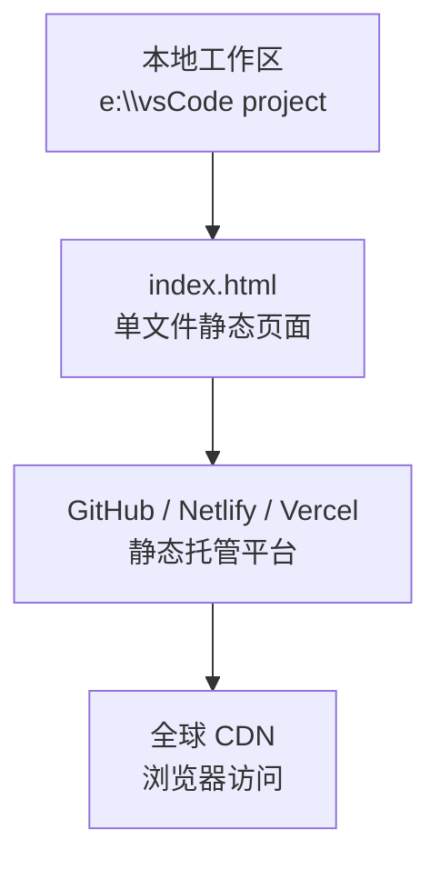
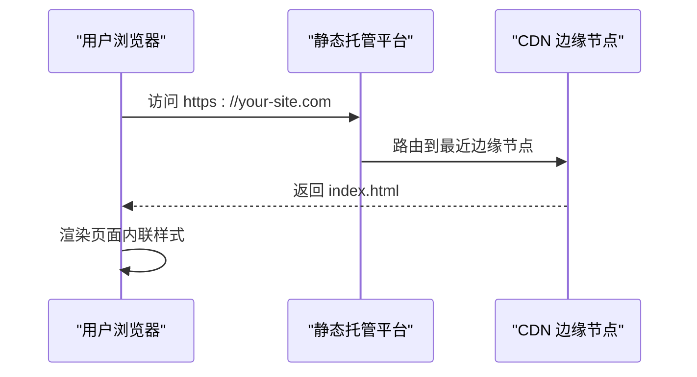

# 静态托管服务部署

<cite>
**本文引用的文件**
- [index.html](file://index.html)
</cite>

## 目录
1. [简介](#简介)
2. [项目结构](#项目结构)
3. [核心组件](#核心组件)
4. [架构总览](#架构总览)
5. [详细组件分析](#详细组件分析)
6. [依赖分析](#依赖分析)
7. [性能考虑](#性能考虑)
8. [故障排查指南](#故障排查指南)
9. [结论](#结论)
10. [附录：各平台部署步骤与对比](#附录各平台部署步骤与对比)

## 简介
本指南面向初学者，提供将当前单文件 HTML 项目（仅包含一个 index.html）部署到主流静态网站托管平台的完整流程。重点覆盖 GitHub Pages、Netlify、Vercel 三大平台，包括仓库设置、分支配置、自定义域名绑定、环境变量、预览部署等。同时给出各平台优缺点对比、部署后验证步骤与常见问题解决方案，帮助你快速完成上线并稳定运行。

## 项目结构
本项目为极简静态站点，根目录下仅包含一个入口文件 index.html，内嵌样式与页面内容，无需构建工具或后端服务即可直接由静态托管平台提供服务。

**图表来源**
- [index.html:1-287](file://index.html#L1-L287)

**章节来源**
- [index.html:1-287](file://index.html#L1-L287)

## 核心组件
- 入口文件 index.html：包含完整的页面结构与内联样式，可直接被静态服务器解析并返回给浏览器。
- 无外部依赖：未引入第三方 CSS/JS 库，减少网络请求与缓存复杂度，利于快速加载与部署。

**章节来源**
- [index.html:1-287](file://index.html#L1-L287)

## 架构总览
静态站点由浏览器直接请求托管平台的静态资源服务器，通过 CDN 分发至用户。由于没有服务端逻辑，部署过程主要关注“如何把 index.html 正确发布到平台”。

[此图为概念性流程图，不映射具体源码文件]

## 详细组件分析
本节聚焦于 index.html 的构成与可部署性要点，帮助理解为何该文件可以直接作为静态站点发布。

- 文档类型与编码：使用标准 HTML5 声明与 UTF-8 编码，确保跨浏览器兼容。
- 视口与响应式：设置了 viewport meta 标签与媒体查询，适配移动端。
- 样式组织：采用 CSS 变量与模块化类名，便于维护；所有样式内联在 <style> 中，避免额外请求。
- 语义化结构：使用 header、section、footer 等语义标签，提升可访问性与 SEO 友好度。
- 交互元素：按钮与导航链接均为纯前端跳转，不涉及后端接口。

这些特性使得 index.html 满足静态托管的基本要求：单一入口、无服务端依赖、可被任何静态服务器直接提供。

**章节来源**
- [index.html:1-287](file://index.html#L1-L287)

## 依赖分析
- 内部依赖：无外部 CSS/JS 库，零运行时依赖。
- 外部依赖：无外链资源引用，降低部署失败风险。
- 平台兼容性：现代浏览器均可正常渲染；如需支持旧版 IE，需额外 polyfill（本项目未涉及）。

**章节来源**
- [index.html:1-287](file://index.html#L1-L287)

## 性能考虑
- 首屏加载：单文件 + 内联样式，减少 HTTP 请求数，有利于首屏速度。
- 缓存策略：静态托管平台通常默认启用强缓存与 CDN 缓存，建议配合版本化文件名或开启增量更新策略。
- 体积优化：若后续扩展，建议使用压缩与按需加载；当前单文件已足够轻量。
- 可访问性：语义化标签与合理的标题层级有助于屏幕阅读器与搜索引擎。

[本节为通用性能建议，不直接分析具体文件]

## 故障排查指南
- 404 Not Found：确认入口文件名为 index.html，且位于仓库根目录或平台配置的“发布目录”下。
- 样式未生效：检查是否误删 <style> 块或路径错误；当前项目样式内联，应无路径问题。
- 移动端显示异常：确认 viewport 设置存在且未被覆盖；检查媒体查询断点。
- 自定义域名无法访问：检查 DNS 解析记录是否正确指向平台提供的地址；等待 DNS 生效可能需要几分钟到几小时。
- HTTPS 证书问题：大多数平台自动签发证书；如仍报错，检查域名绑定状态与 DNS 配置。

[本节为通用排错建议，不直接分析具体文件]

## 结论
本项目为极简静态站点，适合快速部署到任意静态托管平台。推荐优先选择 GitHub Pages（免费、与代码仓库集成）、Netlify（拖拽与 Git 集成便捷、功能丰富）、Vercel（开发者体验好、预览部署强大）。根据团队需求与习惯选择合适的平台，并按本指南完成部署与验证。

[本节为总结性内容，不直接分析具体文件]

## 附录：各平台部署步骤与对比

### GitHub Pages
- 适用场景：已有 GitHub 仓库，希望以最小成本发布静态站点。
- 部署方式
  - 将 index.html 推送到 GitHub 仓库根目录。
  - 进入仓库 Settings → Pages，选择分支（通常为 main 或 gh-pages），保存。
  - 等待构建完成后访问 https://username.github.io/repo-name。
- 自定义域名
  - 在 Settings → Pages 中添加自定义域名，按提示添加 DNS 记录（CNAME/A 记录）。
  - 可选：启用强制 HTTPS。
- 优点
  - 完全免费，与 GitHub 生态无缝集成。
  - 支持 Actions 自动化构建与部署。
- 缺点
  - 自定义域名需手动配置 DNS。
  - 高级功能（如函数、边车）有限。
- 验证步骤
  - 访问 Pages URL，确认页面内容与样式正常。
  - 打开浏览器开发者工具，检查 Network 面板，确认仅请求 index.html。
  - 测试移动端响应式布局是否正常。

[本节为操作指导，不直接分析具体文件]

### Netlify
- 适用场景：追求易用性与强大功能的静态站点托管。
- 部署方式
  - 拖拽部署：直接将包含 index.html 的文件夹拖入 Netlify 控制台，自动生成站点。
  - Git 集成：连接 GitHub/GitLab 仓库，选择分支（main/master），自动构建并发布。
  - 构建配置：对于纯静态站点，无需构建命令；如有需要可在 Netlify 设置中指定发布目录（通常为 . 或 dist）。
- 自定义域名
  - 在 Site settings → Domain management 中添加域名，按提示配置 DNS。
  - 自动启用 HTTPS。
- 环境变量
  - 在 Site settings → Environment variables 中添加键值对，供前端脚本读取（注意：仅暴露公开信息）。
- 预览部署
  - 每次 Pull Request 都会生成预览链接，便于团队协作审查。
- 优点
  - 界面友好，部署简单，功能全面（表单、重定向、函数等）。
  - 强大的预览与分支部署能力。
- 缺点
  - 免费版有带宽与构建时长限制。
- 验证步骤
  - 访问站点 URL，检查页面与样式。
  - 打开 Console 与 Network，确认无 404 或跨域错误。
  - 测试环境变量是否按预期注入（仅用于公开数据）。

[本节为操作指导，不直接分析具体文件]

### Vercel
- 适用场景：注重开发者体验与预览部署的团队或个人项目。
- 部署方式
  - 初始化：在 Vercel 中导入 GitHub/GitLab 仓库，选择框架（Static Sites），自动检测并发布。
  - 环境变量：在项目设置中添加环境变量，可在前端通过 process.env.* 或 Vite/Next 等方式读取（静态站点可直接在构建时替换）。
  - 构建配置：静态站点无需构建命令；如有需要可设置输出目录。
- 自定义域名
  - 在 Domains 中添加域名，按提示配置 DNS。
  - 自动启用 HTTPS。
- 预览部署
  - 每个提交与 PR 都会生成预览 URL，便于快速验证变更。
- 优点
  - 极佳的 DX，自动检测与预览能力强。
  - 与 Git 深度集成，CI/CD 开箱即用。
- 缺点
  - 免费版有并发与构建时长限制。
- 验证步骤
  - 访问预览/生产 URL，确认页面渲染正常。
  - 检查环境变量是否生效（仅公开字段）。
  - 使用 Lighthouse 或 WebPageTest 评估性能。

[本节为操作指导，不直接分析具体文件]

### 平台对比与选择建议
- GitHub Pages
  - 优势：免费、与代码仓库一体化、简单可靠。
  - 劣势：高级功能有限，自定义域名需手动 DNS。
  - 适合：个人博客、产品落地页、开源项目文档。
- Netlify
  - 优势：易用性强、功能丰富、预览部署完善。
  - 劣势：免费版有配额限制。
  - 适合：团队协作、需要表单/函数/重定向等能力的站点。
- Vercel
  - 优势：开发者体验优秀、预览部署强大、与 Git 集成紧密。
  - 劣势：免费版有配额限制。
  - 适合：前端工程化项目、需要快速迭代与预览的团队。

[本节为概念性对比，不直接分析具体文件]

### 部署后的验证清单
- 基础访问
  - 在桌面与移动端分别访问站点 URL，确认页面完整加载。
- 资源加载
  - 打开浏览器开发者工具 → Network，确认仅请求 index.html，无 404。
- 样式与交互
  - 检查导航、按钮点击、滚动行为是否正常。
- 性能与可访问性
  - 使用 Lighthouse 评估性能、可访问性与最佳实践。
- 自定义域名
  - 确认 DNS 解析生效，HTTPS 正常，无安全警告。
- 环境变量（如使用）
  - 仅在公开数据场景下验证；敏感信息不应暴露在前端。

[本节为通用验证步骤，不直接分析具体文件]