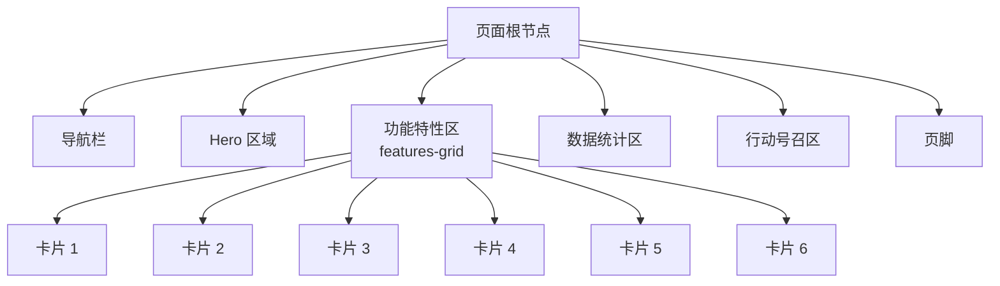
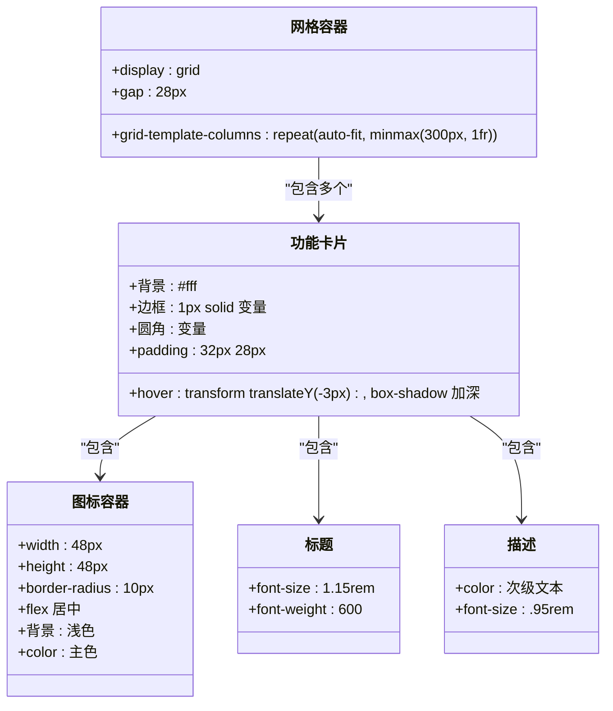
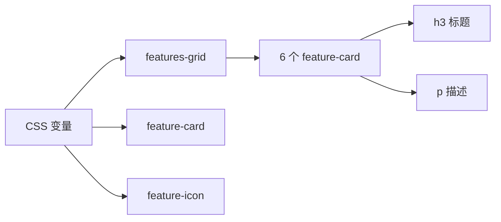

# 功能特性网格

<cite>
**本文引用的文件**
- [index.html](file://index.html)
</cite>

## 目录
1. [简介](#简介)
2. [项目结构](#项目结构)
3. [核心组件](#核心组件)
4. [架构总览](#架构总览)
5. [详细组件分析](#详细组件分析)
6. [依赖关系分析](#依赖关系分析)
7. [性能考量](#性能考量)
8. [故障排查指南](#故障排查指南)
9. [结论](#结论)
10. [附录](#附录)

## 简介
本文件聚焦“功能特性网格”组件，围绕 CSS Grid 的 auto-fit 与 minmax() 实现响应式布局的原理、6 个功能卡片的统一结构与语义化 HTML、卡片悬停交互（transform 与阴影）、图标容器圆形设计与背景色处理、标题与描述的排版规范、新增卡片的步骤与最佳实践、网格间距/卡片尺寸/响应式断点的配置方法，以及如何自定义样式以匹配品牌设计系统进行全面说明。所有技术细节均基于当前仓库中的实现进行解读。

## 项目结构
该页面为单文件实现，HTML 与 CSS 内联在同一文件中，便于快速查看与调整。功能特性网格位于页面中部的 features 区域，使用 grid 布局组织 6 张功能卡片。

图表来源
- [index.html:172-211](file://index.html#L172-L211)

章节来源
- [index.html:1-287](file://index.html#L1-L287)

## 核心组件
- 网格容器：使用 CSS Grid 的 repeat(auto-fit, minmax(...)) 实现自适应列数与最小宽度约束，无需媒体查询即可在不同屏幕下自动换行与等分。
- 功能卡片：统一的卡片结构包含图标容器、标题、描述文本；具备悬停时的 transform 上移与 box-shadow 加深效果。
- 图标容器：固定宽高、圆角矩形、居中显示图标字符，使用浅色背景与主题主色文字。
- 排版规范：标题加粗适中字号，描述使用较浅颜色与略小字号，保证层级清晰与可读性。

章节来源
- [index.html:67-87](file://index.html#L67-L87)
- [index.html:178-209](file://index.html#L178-L209)

## 架构总览
从组件视角看，功能特性网格由“网格容器 + 卡片项”构成，卡片内部遵循一致的 DOM 结构。整体通过 CSS 变量统一管理色彩与圆角，确保风格一致与易于定制。

图表来源
- [index.html:67-87](file://index.html#L67-L87)
- [index.html:178-209](file://index.html#L178-L209)

## 详细组件分析

### 1) CSS Grid 的 auto-fit 与 minmax() 原理
- 作用机制：repeat(auto-fit, minmax(300px, 1fr)) 表示“尽可能多地放置列”，每列最小宽度为 300px，剩余空间按 1fr 等分。当容器宽度不足以容纳下一列时，自动换行到下一行，从而实现无媒体查询的响应式布局。
- 行为特征：
  - 在宽屏下多列并排；在窄屏下自动减少列数并换行。
  - 卡片宽度随可用空间伸缩，保持最小宽度以保证可读性。
- 适用场景：内容块数量不固定或需要自适应排列的列表/网格。

章节来源
- [index.html:67-71](file://index.html#L67-L71)

### 2) 6 个功能卡片的统一结构与语义化标记
- 外层容器：section.features 包裹整个功能区，提供背景与内边距。
- 网格容器：div.features-grid 作为 grid 容器，承载 6 个卡片。
- 卡片结构：每个 feature-card 包含：
  - 图标容器 div.feature-icon（用于展示图标字符）
  - 标题 h3.feature-card h3
  - 描述 p.feature-card p
- 语义化要点：
  - 使用 section 标识区块，h2 作为区域标题，h3 作为卡片标题，p 作为描述文本，层次清晰且利于无障碍访问。
  - 图标容器仅用于装饰，不改变文档语义。

章节来源
- [index.html:172-211](file://index.html#L172-L211)

### 3) 卡片悬停效果的变换与阴影
- 变换：hover 时 transform: translateY(-3px)，使卡片轻微上浮，增强交互反馈。
- 阴影：hover 时 box-shadow 加深，营造悬浮感。
- 过渡：transition 同时作用于阴影与变换，使动画平滑自然。
- 可访问性建议：确保键盘焦点可见，必要时为卡片添加 tabindex 或按钮语义以提升可操作性与可扫描性。

章节来源
- [index.html:72-79](file://index.html#L72-L79)

### 4) 图标容器的圆形设计与背景色处理
- 形状：当前实现为圆角矩形（border-radius: 10px），并非正圆。若需正圆，可将 border-radius 设为 50% 并确保宽高相等。
- 尺寸：固定宽高 48px，配合 flex 居中，使图标字符视觉居中。
- 背景与前景：背景采用浅色（如淡蓝灰），前景色使用主题主色，形成柔和对比。
- 扩展建议：如需更强烈的品牌识别，可替换为 SVG 图标或图片，并保持相同容器尺寸与对齐方式。

章节来源
- [index.html:80-85](file://index.html#L80-L85)

### 5) 标题与描述文本的排版规范
- 标题：字号约 1.15rem，字重中等偏强，突出卡片主题。
- 描述：字号约 0.95rem，颜色较浅，降低视觉权重，避免喧宾夺主。
- 行高与间距：通过默认行高与 margin/padding 控制阅读节奏，确保信息密度适中。
- 一致性：所有卡片保持一致的字体族、字号与颜色体系，提升整体协调性。

章节来源
- [index.html:86-87](file://index.html#L86-L87)

### 6) 添加新功能卡片的步骤与最佳实践
- 步骤：
  1) 在 features-grid 容器内新增一个 div.feature-card。
  2) 在卡片内添加 div.feature-icon（可替换为图标字符或图标元素）。
  3) 添加 h3 标题与 p 描述文本。
  4) 保持与其他卡片相同的结构与类名，以确保样式一致。
- 最佳实践：
  - 文案简洁明确，标题不超过一行，描述控制在 2-3 行以内。
  - 图标选择与业务相关，避免歧义。
  - 若新增卡片导致布局拥挤，可适当调整网格的最小宽度或 gap。
  - 保持语义化标签不变，便于 SEO 与无障碍支持。

章节来源
- [index.html:178-209](file://index.html#L178-L209)

### 7) 网格间距、卡片尺寸与响应式断点配置
- 网格间距：通过 gap 控制卡片之间的间距，当前为 28px。可根据设计稿微调。
- 卡片尺寸：由 minmax(300px, 1fr) 决定最小宽度与弹性伸缩；可通过修改最小宽度值来影响列数与卡片宽度。
- 响应式断点：当前未显式设置媒体查询断点，完全依赖 auto-fit 自适应；如需特殊适配，可在 @media 中覆盖布局或排版。
- 容器宽度：外层 container 限制最大宽度与左右内边距，保证在大屏下的可读性。

章节来源
- [index.html:24-24](file://index.html#L24-L24)
- [index.html:67-71](file://index.html#L67-L71)
- [index.html:136-140](file://index.html#L136-L140)

### 8) 自定义卡片样式以匹配品牌设计系统
- 色彩体系：通过 CSS 变量统一管理主色、文本色、背景色、边框色与圆角，便于全局替换。
- 圆角与阴影：调整 --radius 与 hover 阴影强度，匹配品牌质感。
- 字体与字号：统一字体族与字号层级，确保与品牌字体规范一致。
- 图标风格：将图标字符替换为品牌图标库（SVG/图片），保持容器尺寸与对齐方式。
- 交互反馈：可调整 transition 时长与缓动函数，使交互更符合品牌调性。

章节来源
- [index.html:10-19](file://index.html#L10-L19)
- [index.html:72-87](file://index.html#L72-L87)

## 依赖关系分析
- 样式依赖：CSS 变量定义在主样式块中，被网格、卡片、按钮等复用，形成松耦合的样式依赖。
- 结构依赖：features-grid 依赖其子元素 feature-card 的结构与类名；卡片内部依赖图标容器、标题、描述的类名与顺序。
- 响应式依赖：auto-fit 与 minmax 的组合决定了布局对容器宽度的依赖，无需额外 JS 或媒体查询。

图表来源
- [index.html:10-19](file://index.html#L10-L19)
- [index.html:67-87](file://index.html#L67-L87)
- [index.html:178-209](file://index.html#L178-L209)

## 性能考量
- 纯 CSS 响应式：使用 auto-fit 与 minmax 避免媒体查询与 JS 计算，渲染开销低。
- 动画性能：hover 的 transform 与 box-shadow 属于合成层友好属性，GPU 加速友好，注意不要过度叠加复杂滤镜。
- 图标渲染：优先使用矢量图标（SVG）以获得清晰缩放与较小体积；若使用字符图标，注意编码与字体加载。
- 可维护性：集中管理 CSS 变量，减少重复样式，便于优化与重构。

[本节为通用指导，不直接分析具体文件]

## 故障排查指南
- 卡片重叠或溢出：检查父容器是否有不当的 overflow 或 padding；确认 grid 的 gap 与 minmax 值是否合理。
- 图标未居中：确认图标容器使用 flex 布局且宽高固定；检查内部字符或图标的对齐方式。
- 悬停无效果：确认 hover 伪类未被其他样式覆盖；检查 transition 是否被禁用。
- 移动端布局异常：若出现列过宽或过窄，调整 minmax 的最小宽度或增加媒体查询覆盖。
- 语义与可访问性：确保标题层级正确，避免跳过 h2/h3；为交互元素提供合适的角色与状态。

章节来源
- [index.html:67-87](file://index.html#L67-L87)
- [index.html:178-209](file://index.html#L178-L209)

## 结论
该功能特性网格通过 CSS Grid 的 auto-fit 与 minmax() 实现了简洁而强大的响应式布局，配合统一的卡片结构与悬停交互，提供了良好的用户体验与可维护性。通过 CSS 变量与一致的排版规范，能够快速适配品牌设计系统并扩展新卡片。建议在保持语义化与可访问性的前提下，按需调整尺寸、间距与视觉风格以满足不同业务需求。

[本节为总结性内容，不直接分析具体文件]

## 附录
- 关键样式位置参考：
  - 网格容器与卡片基础样式：[index.html:67-87](file://index.html#L67-L87)
  - 功能卡片 HTML 结构（6 个卡片）：[index.html:178-209](file://index.html#L178-L209)
  - 全局 CSS 变量与基础重置：[index.html:9-24](file://index.html#L9-L24)
  - 响应式断点示例（导航隐藏与页脚列数调整）：[index.html:136-140](file://index.html#L136-L140)