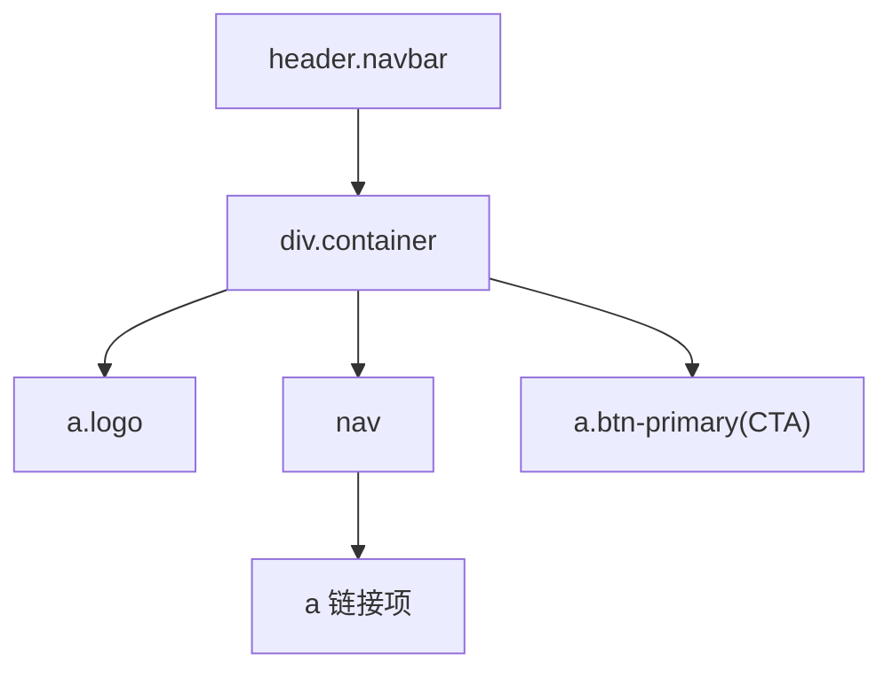
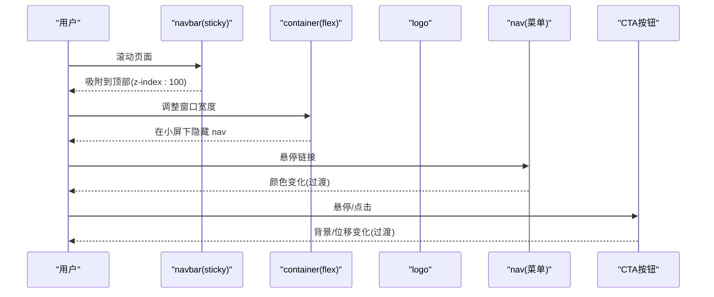
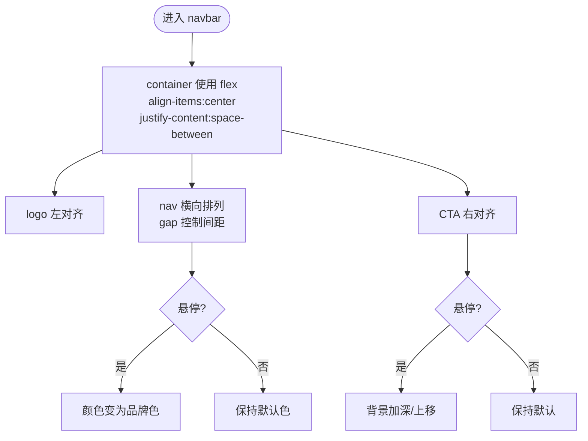
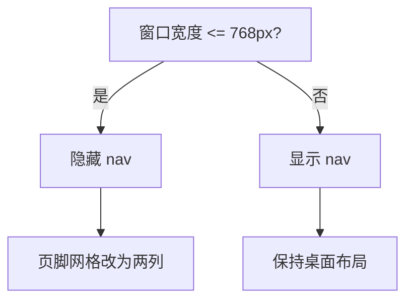
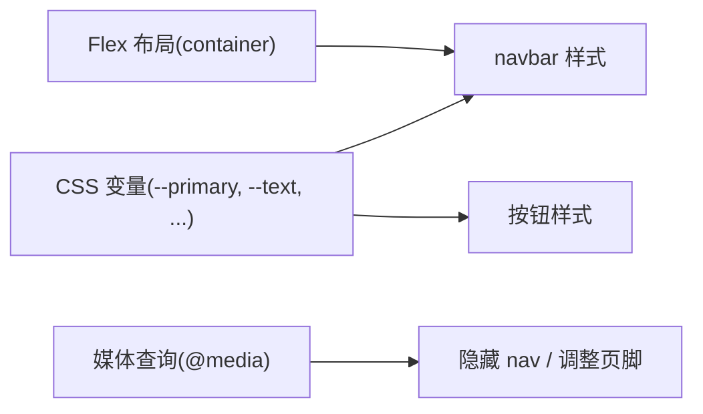

# 导航栏组件

<cite>
**本文引用的文件**
- [index.html](file://index.html)
</cite>

## 目录
1. [简介](#简介)
2. [项目结构](#项目结构)
3. [核心组件](#核心组件)
4. [架构总览](#架构总览)
5. [详细组件分析](#详细组件分析)
6. [依赖关系分析](#依赖关系分析)
7. [性能考量](#性能考量)
8. [故障排查指南](#故障排查指南)
9. [结论](#结论)
10. [附录](#附录)

## 简介
本文件针对仓库中的导航栏组件进行系统化文档化，覆盖以下主题：
- 固定定位（sticky）的实现原理与 z-index 层级管理
- 毛玻璃效果（backdrop-filter: blur）的 CSS 实现与兼容性处理
- Flexbox 布局结构：logo、nav 菜单与 CTA 按钮的对齐方式
- 响应式设计中移动端导航隐藏逻辑
- 完整 HTML 结构与 CSS 样式说明（含悬停效果与过渡动画）
- 自定义品牌颜色、字体大小与间距的方法
- 移动端适配最佳实践与性能优化建议

## 项目结构
该页面为单文件实现，HTML 与 CSS 内联在同一文件中。导航栏位于页面顶部，使用语义化的 header 元素包裹，内部通过容器 div 组织 logo、nav 和 CTA 按钮。

图表来源
- [index.html:145-157](file://index.html#L145-L157)

章节来源
- [index.html:1-287](file://index.html#L1-L287)

## 核心组件
- 导航容器：使用 sticky 定位固定在视口顶部，配合半透明背景与模糊滤镜营造毛玻璃质感。
- 内容容器：Flex 布局，垂直居中，左右分布（logo 左、nav 中、CTA 右）。
- 品牌标识：左侧 logo，强调品牌色与字号。
- 导航菜单：水平排列的链接列表，带悬停变色与过渡。
- CTA 按钮：右侧主按钮，具备悬停与轻微位移动效。

章节来源
- [index.html:27-49](file://index.html#L27-L49)
- [index.html:145-157](file://index.html#L145-L157)

## 架构总览
导航栏由“定位 + 背景 + 布局”三部分构成：
- 定位：position: sticky; top: 0; 使其在滚动到顶部时吸附。
- 背景：rgba 半透明白底 + backdrop-filter: blur(12px) 产生毛玻璃。
- 布局：container 使用 flex 对齐，确保三列均衡分布。

图表来源
- [index.html:27-49](file://index.html#L27-L49)
- [index.html:136-140](file://index.html#L136-L140)

## 详细组件分析

### Sticky 定位与 z-index 层级管理
- 实现要点
  - 使用 position: sticky; top: 0; 使导航在滚动至视口顶部时固定。
  - 设置 z-index: 100，保证导航浮于页面其他内容之上。
  - 背景采用 rgba 半透明，避免遮挡下方内容；结合 backdrop-filter 增强层次。
- 注意事项
  - 父级不应设置 overflow: hidden/auto/scroll，否则 sticky 可能失效。
  - 若页面存在更高 z-index 的元素，需评估层级冲突并适当调整。

章节来源
- [index.html:27-32](file://index.html#L27-L32)

### 毛玻璃效果（backdrop-filter: blur）与兼容性
- 实现要点
  - 使用 backdrop-filter: blur(12px) 对背景区域进行模糊，形成毛玻璃。
  - 配合半透明背景 rgba(255,255,255,.85) 提升可读性与视觉层次。
- 兼容性处理
  - 现代浏览器支持良好；旧版 Safari 需要前缀 -webkit-backdrop-filter。
  - 不支持的环境会回退为纯色或半透明背景，不影响基本可用性。
- 性能提示
  - 模糊滤镜会带来一定渲染开销，建议在移动端谨慎使用或降低模糊强度。

章节来源
- [index.html:27-32](file://index.html#L27-L32)

### Flexbox 布局结构（logo、nav、CTA）
- 容器布局
  - container 使用 display: flex; align-items: center; justify-content: space-between; 实现三列等距分布与垂直居中。
  - 高度固定为 64px，保证导航栏统一尺寸。
- 子元素
  - logo：左侧品牌标识，字号与品牌色突出。
  - nav：flex 横向排列，gap 控制间距，链接默认浅色，悬停变为主色。
  - CTA：右侧按钮，具备主样式与悬停动效。
- 可访问性
  - 语义化标签 header/nav/a，利于屏幕阅读器识别。

图表来源
- [index.html:33-49](file://index.html#L33-L49)

章节来源
- [index.html:33-49](file://index.html#L33-L49)

### 响应式设计与移动端导航隐藏
- 断点策略
  - 在 max-width: 768px 时隐藏 nav，释放空间给 logo 与 CTA。
- 交互建议
  - 可在移动端添加汉堡菜单按钮，展开/收起导航列表，提升可用性。
- 布局回退
  - 页脚网格在小屏下切换为两列，保证信息密度与可读性。

图表来源
- [index.html:136-140](file://index.html#L136-L140)

章节来源
- [index.html:136-140](file://index.html#L136-L140)

### 悬停效果与过渡动画
- 链接悬停：颜色平滑过渡到品牌色，提升交互反馈。
- 按钮悬停：背景色加深与轻微上移，增强点击欲望。
- 卡片悬停（非导航但相关）：阴影与位移，提升层次感。
- 过渡时长：普遍使用 .2s 左右的过渡，兼顾流畅与即时性。

章节来源
- [index.html:39-49](file://index.html#L39-L49)
- [index.html:72-79](file://index.html#L72-L79)

### 自定义指南（品牌色、字号、间距）
- 品牌色
  - 通过 CSS 变量 --primary 与 --primary-dark 集中管理主色与深色态。
- 字号与行高
  - 全局字体栈与行高在 body 定义，导航链接字号略小于正文，保持层级。
- 间距
  - 导航链接间距通过 gap 控制；容器 padding 统一页面边距。
- 圆角与边框
  - 按钮与卡片使用统一圆角变量，保持一致的设计语言。

章节来源
- [index.html:10-24](file://index.html#L10-L24)
- [index.html:37-49](file://index.html#L37-L49)

### 完整的 HTML 结构与 CSS 样式说明
- HTML 结构
  - 使用 header.navbar 包裹导航内容，内部包含 logo、nav 与 CTA 按钮。
  - 各区块使用语义化 section/footer 组织，便于 SEO 与无障碍。
- CSS 要点
  - 重置与基础样式：统一 box-sizing、字体、链接样式。
  - 导航栏：sticky 定位、z-index、毛玻璃背景、flex 布局。
  - 按钮：主样式与轮廓样式，悬停动效。
  - 响应式：小屏隐藏导航，页脚网格自适应。

章节来源
- [index.html:145-157](file://index.html#L145-L157)
- [index.html:27-49](file://index.html#L27-L49)
- [index.html:136-140](file://index.html#L136-L140)

## 依赖关系分析
- 样式依赖
  - 导航栏样式依赖于根变量（颜色、圆角等），便于主题定制。
  - 响应式规则依赖于媒体查询断点，影响布局与可见性。
- 结构依赖
  - 导航栏结构依赖容器与 flex 布局，任何结构调整都会影响对齐与间距。
- 外部依赖
  - 无外部 JS/CSS 依赖，纯原生实现，易于集成与维护。

图表来源
- [index.html:10-24](file://index.html#L10-L24)
- [index.html:27-49](file://index.html#L27-L49)
- [index.html:136-140](file://index.html#L136-L140)

章节来源
- [index.html:10-24](file://index.html#L10-L24)
- [index.html:27-49](file://index.html#L27-L49)
- [index.html:136-140](file://index.html#L136-L140)

## 性能考量
- 渲染性能
  - backdrop-filter 会触发合成层与模糊计算，建议在低端设备上降低模糊强度或禁用。
  - 避免在高频滚动场景中使用过重的滤镜或复杂阴影。
- 布局性能
  - 使用 transform 与 opacity 做动画，减少重排与重绘。
  - 合理设置 will-change（如按钮 hover 时使用 transform）需谨慎，避免滥用导致内存占用。
- 资源体积
  - 当前为内联样式，适合小型页面；大型项目建议拆分 CSS 并按需加载。
- 可访问性
  - 保持足够的对比度与键盘可达性；为交互元素提供清晰的焦点状态。

[本节为通用性能指导，不直接分析具体代码]

## 故障排查指南
- 导航未吸附
  - 检查父容器是否设置了 overflow 属性（hidden/auto/scroll），可能导致 sticky 失效。
  - 确认 top 值与 z-index 是否正确设置。
- 毛玻璃无效
  - 在不支持 backdrop-filter 的浏览器中会降级为半透明背景，属预期行为。
  - 如需兼容旧版 Safari，可考虑添加 -webkit-backdrop-filter 前缀。
- 移动端导航仍显示
  - 检查媒体查询断点是否与设备宽度匹配，确认选择器优先级未被覆盖。
- 按钮/链接无悬停效果
  - 确认 transition 属性已应用，且伪类 :hover 未被其他样式覆盖。

章节来源
- [index.html:27-32](file://index.html#L27-L32)
- [index.html:39-49](file://index.html#L39-L49)
- [index.html:136-140](file://index.html#L136-L140)

## 结论
该导航栏组件以极简的原生 HTML/CSS 实现了现代化的视觉效果与交互体验：
- 通过 sticky 与 z-index 确保导航始终置顶且不被遮挡。
- 使用 backdrop-filter 实现毛玻璃，兼顾美观与兼容性。
- 基于 Flexbox 的三列布局清晰直观，易于扩展。
- 响应式策略简洁有效，满足移动端基本需求。
- 通过 CSS 变量与过渡动画，提供了良好的可定制性与用户体验。

[本节为总结性内容，不直接分析具体代码]

## 附录
- 快速上手
  - 复制现有 HTML 结构与内联样式即可直接使用。
  - 修改 CSS 变量以快速更换品牌色与风格。
- 扩展建议
  - 增加移动端汉堡菜单与抽屉导航，提升小屏体验。
  - 将样式抽离为独立 CSS 文件，便于维护与缓存。
  - 引入无障碍增强（ARIA 属性、焦点管理）以提升可访问性。

[本节为概念性补充，不直接分析具体代码]