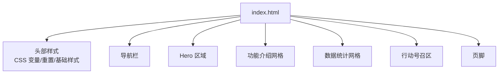
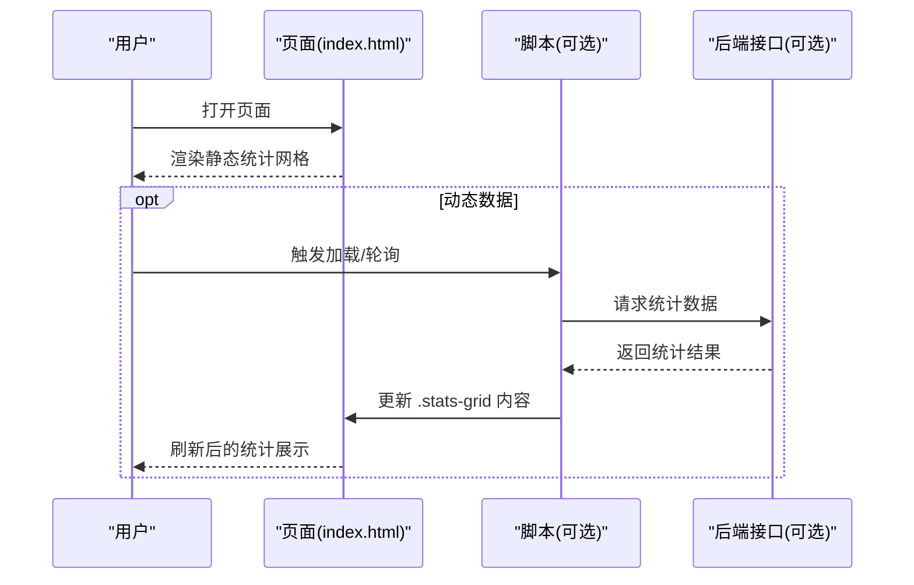
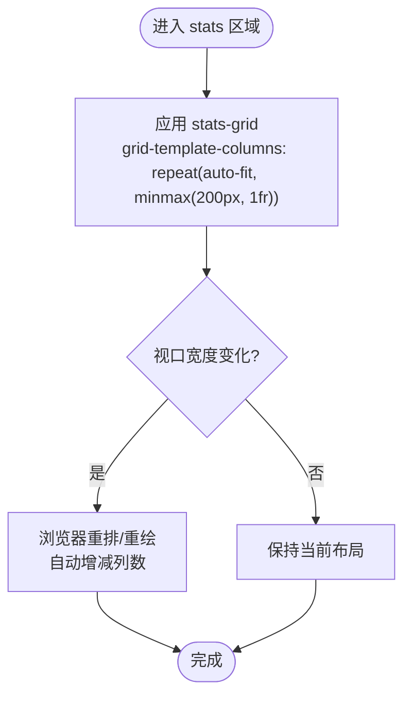
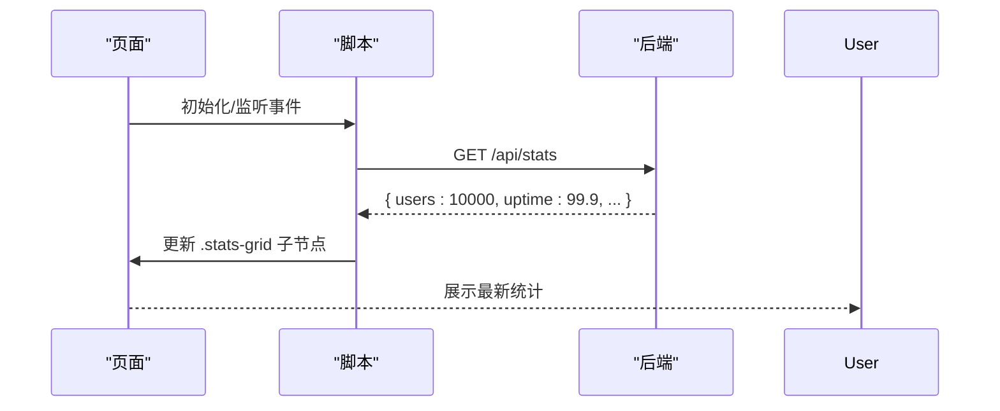
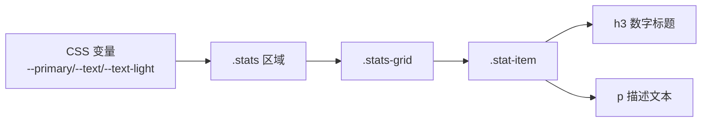

# 数据统计展示

<cite>
**本文引用的文件**
- [index.html](file://index.html)
</cite>

## 目录
1. [简介](#简介)
2. [项目结构](#项目结构)
3. [核心组件](#核心组件)
4. [架构总览](#架构总览)
5. [详细组件分析](#详细组件分析)
6. [依赖关系分析](#依赖关系分析)
7. [性能考虑](#性能考虑)
8. [故障排查指南](#故障排查指南)
9. [结论](#结论)
10. [附录](#附录)

## 简介
本文件面向“数据统计展示”组件，聚焦以下目标：
- 统计网格的 CSS Grid 布局实现与响应式适配策略
- 数字标题的大字号显示与主色调应用
- 统计项描述文本的样式与对齐方式
- 在不同屏幕尺寸下保持数据可读性与视觉平衡
- 新增统计项的步骤与 HTML 结构模板
- 数字格式化的最佳实践与国际化支持
- 数据更新的维护指南与性能优化建议
- 与后端数据集成以实现动态统计展示

## 项目结构
当前仓库为单页静态页面，所有样式与结构均内联在单一 HTML 文件中。统计区域位于页面中部的 section.stats 区块，使用 CSS Grid 构建自适应网格。

图表来源
- [index.html:1-287](file://index.html#L1-L287)

章节来源
- [index.html:1-287](file://index.html#L1-L287)

## 核心组件
- 统计网格容器：stats-grid，采用 CSS Grid 自动列宽与最小宽度约束，实现响应式排列
- 统计项：stat-item，包含大字号数字标题 h3 与描述文本 p
- 主题色：通过 CSS 变量 --primary 统一控制主色调，应用于数字标题、按钮等关键元素
- 响应式断点：针对移动端进行字体与布局调整，确保小屏可读性

章节来源
- [index.html:89-98](file://index.html#L89-L98)
- [index.html:213-235](file://index.html#L213-L235)
- [index.html:10-19](file://index.html#L10-L19)
- [index.html:135-141](file://index.html#L135-L141)

## 架构总览
统计模块由“结构 + 样式 + 可选脚本”三部分构成。当前实现为纯静态结构；后续可通过脚本注入数据并更新 DOM。

图表来源
- [index.html:213-235](file://index.html#L213-L235)

## 详细组件分析

### 统计网格布局与响应式
- 使用 CSS Grid 的 repeat(auto-fit, minmax(200px, 1fr)) 实现弹性列数：当容器宽度变化时，自动计算每行可容纳的列数，保证每个统计项至少 200px 宽度
- 设置 gap 为 24px，提供均匀间距
- text-align: center 使数字与描述文本居中对齐，提升视觉一致性
- 在小屏幕（≤768px）时，整体页面会缩小 Hero 标题字号并隐藏导航，间接让统计网格更紧凑且易读

图表来源
- [index.html:91-95](file://index.html#L91-L95)
- [index.html:135-141](file://index.html#L135-L141)

章节来源
- [index.html:91-95](file://index.html#L91-L95)
- [index.html:135-141](file://index.html#L135-L141)

### 数字标题与大字号、主色调
- 数字标题使用 h3 标签，字号 2.4rem，字重 800，颜色为主色 --primary，形成强视觉焦点
- 主色调通过 :root 中的 --primary 定义，便于全局统一与切换
- 在大屏与小屏上均保持高对比度与可读性

章节来源
- [index.html:96-97](file://index.html#L96-L97)
- [index.html:10-19](file://index.html#L10-L19)

### 描述文本样式与对齐
- 描述文本使用 p 标签，字号 0.95rem，颜色为 --text-light，与数字形成层级差异
- 通过父容器的 text-align: center 实现水平居中，配合上下边距营造呼吸感

章节来源
- [index.html:97](file://index.html#L97)

### 多屏幕尺寸下的可读性与视觉平衡
- 使用 auto-fit + minmax 实现自适应列数，避免横向滚动
- 在 ≤768px 时，Hero 标题字号减小，导航隐藏，减少视觉干扰，使统计网格成为信息重心
- 建议在极小屏设备下进一步检查数字是否换行或溢出，必要时微调 minmax 的最小值

章节来源
- [index.html:135-141](file://index.html#L135-L141)

### 添加新统计项的步骤与 HTML 结构模板
步骤
1. 在 stats-grid 容器内新增一个 stat-item 块
2. 在 h3 中填写数字标题（如“1,234”、“99.9%”），注意使用本地化分隔符
3. 在 p 中填写描述文本（如“活跃用户”）
4. 如需不同颜色或强调，可在 stat-item 上追加类名或使用内联样式（谨慎使用）

HTML 结构模板（以路径引用代替具体代码）
- 参考路径：[index.html:216-233](file://index.html#L216-L233)

章节来源
- [index.html:216-233](file://index.html#L216-L233)

### 数字格式化与国际化支持
最佳实践
- 使用 Intl.NumberFormat 对数字进行本地化格式化（千分位、小数位数、货币符号等）
- 根据语言环境选择合适的小数精度与单位后缀（如“万”、“K”、“M”）
- 百分比数值需保留合理小数位，避免过长影响排版
- 在数据源层面尽量提供原始数值，前端负责展示层格式化，便于复用与测试

示例流程（概念说明）
- 获取原始数值 → 创建 Intl.NumberFormat → format() → 写入 DOM
- 若需要单位换算（如 1234567 → “123.5 万”），先换算再格式化

章节来源
- [index.html:216-233](file://index.html#L216-L233)

### 数据更新的维护指南与性能优化建议
维护指南
- 将静态数据迁移至 JSON 文件或后端接口，集中管理统计指标
- 为每个统计项增加 data-key 或 id，便于脚本定位与更新
- 建立统一的更新函数，接收数据对象并按 key 映射到对应节点
- 对频繁更新的指标（如可用性、在线人数）采用增量更新而非整段替换

性能优化
- 使用 requestAnimationFrame 或节流/防抖控制高频更新
- 批量 DOM 操作：先构建文档片段，再一次性插入
- 避免在更新过程中触发重排重绘的昂贵操作（如读取布局属性）
- 对于超大数字列表，考虑虚拟滚动或分页加载（当前场景不适用但可作为扩展）

章节来源
- [index.html:213-235](file://index.html#L213-L235)

### 与后端数据集成实现动态统计展示
推荐方案
- 使用 fetch 或 XMLHttpRequest 调用后端 API，获取 JSON 格式的统计数据
- 解析数据后，遍历结果集，按规则生成或更新 .stats-grid 内的 .stat-item
- 错误处理：网络异常、数据缺失、格式不合法时提供降级展示（如“暂无数据”）
- 缓存策略：对不常变化的指标使用内存缓存或 localStorage，减少重复请求

交互时序（概念图）

图表来源
- [index.html:213-235](file://index.html#L213-L235)

## 依赖关系分析
- 样式依赖：CSS 变量 --primary、--text、--text-light、--bg 等，用于统一主题
- 结构依赖：stats-grid 作为容器，stat-item 作为子项，h3/p 作为内容
- 无外部库依赖：纯原生 HTML/CSS，易于维护与移植

图表来源
- [index.html:10-19](file://index.html#L10-L19)
- [index.html:91-97](file://index.html#L91-L97)

章节来源
- [index.html:10-19](file://index.html#L10-L19)
- [index.html:91-97](file://index.html#L91-L97)

## 性能考虑
- 布局性能：auto-fit 与 minmax 由浏览器高效计算，无需 JS 干预
- 渲染性能：避免在更新时频繁读取 layout 属性；优先批量写入
- 资源体积：当前为单文件，体积小、加载快；未来拆分样式/脚本时应启用压缩与缓存
- 无障碍：确保数字与描述语义正确（h3/p），便于屏幕阅读器识别

## 故障排查指南
常见问题与解决
- 数字溢出或换行异常：检查父容器宽度与 minmax 最小值，必要时增大最小宽度或调整字号
- 颜色不一致：确认 :root 中的 --primary 未被覆盖，检查就近样式优先级
- 移动端拥挤：在 ≤768px 断点下检查 Hero 与导航的隐藏逻辑是否影响布局
- 动态数据未更新：检查 API 返回结构与键名是否与脚本映射一致，查看控制台错误

章节来源
- [index.html:135-141](file://index.html#L135-L141)
- [index.html:91-97](file://index.html#L91-L97)

## 结论
该统计展示组件基于 CSS Grid 实现了简洁而强大的响应式布局，通过主色调与大字号突出关键指标，描述文本层次清晰。在当前静态实现基础上，可轻松接入后端数据，结合 Intl 本地化与性能优化策略，构建稳定、可扩展的动态统计面板。

## 附录
- 快速上手
  - 复制现有 stat-item 结构，修改数字与描述即可新增指标
  - 通过 CSS 变量统一管理主题色，确保全站风格一致
- 扩展方向
  - 引入图标或进度条增强可视化
  - 增加筛选/排序能力（适用于大量指标）
  - 接入埋点与 A/B 测试评估展示效果