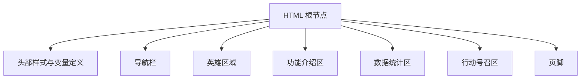
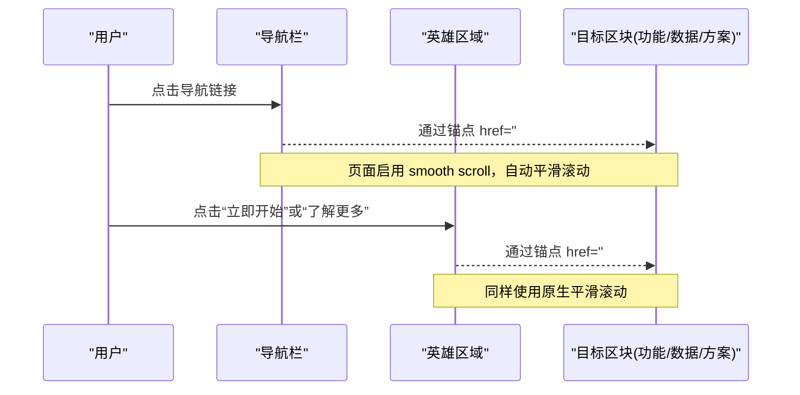
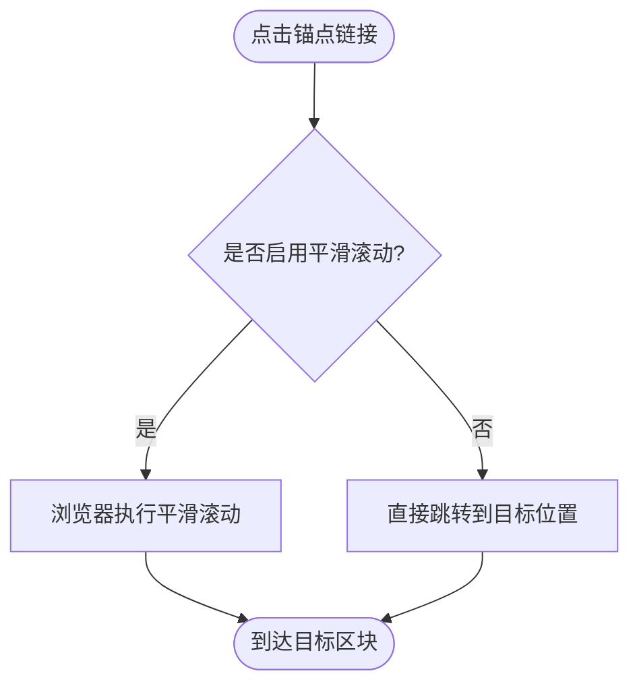
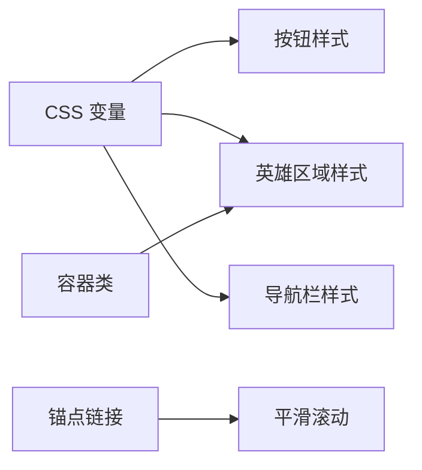

# 英雄区域组件

<cite>
**本文引用的文件**
- [index.html](file://index.html)
</cite>

## 目录
1. [简介](#简介)
2. [项目结构](#项目结构)
3. [核心组件](#核心组件)
4. [架构总览](#架构总览)
5. [详细组件分析](#详细组件分析)
6. [依赖关系分析](#依赖关系分析)
7. [性能考量](#性能考量)
8. [故障排查指南](#故障排查指南)
9. [结论](#结论)
10. [附录](#附录)

## 简介
本文件针对“英雄区域”（Hero）组件进行系统化文档化，覆盖渐变背景实现、视觉层次、标题排版策略、描述文本宽度与居中、行动号召按钮组的 Flexbox 布局与响应式换行、主要按钮与轮廓按钮的样式差异与交互、平滑滚动到目标区域的锚点链接实现，以及可访问性与 SEO 优化建议。所有技术细节均基于仓库中的实际代码进行分析与说明。

## 项目结构
该仓库为单页 HTML 文件，内嵌 CSS 样式与页面结构。英雄区域位于页面顶部导航之后，作为首屏主视觉与信息传达的核心区域。

图表来源
- [index.html:1-287](file://index.html#L1-L287)

章节来源
- [index.html:1-287](file://index.html#L1-L287)

## 核心组件
- 容器与基础重置：统一边距、盒模型、字体栈与全局颜色变量，确保跨浏览器一致性。
- 导航栏：粘性定位、毛玻璃背景、品牌标识与导航链接。
- 英雄区域：渐变背景、居中对齐、标题强调、描述文本最大宽度限制、双按钮组。
- 功能/数据/CTA/页脚：辅助信息区块与底部导航。

章节来源
- [index.html:8-24](file://index.html#L8-L24)
- [index.html:27-50](file://index.html#L27-L50)
- [index.html:52-61](file://index.html#L52-L61)
- [index.html:160-169](file://index.html#L160-L169)

## 架构总览
以下图展示了从用户进入页面到触发英雄区域交互的关键流程，包括平滑滚动与按钮点击跳转。

图表来源
- [index.html:20-21](file://index.html#L20-L21)
- [index.html:146-157](file://index.html#L146-L157)
- [index.html:160-169](file://index.html#L160-L169)
- [index.html:172-244](file://index.html#L172-L244)

## 详细组件分析

### 渐变背景与视觉层次
- 渐变背景：使用线性渐变，角度为 170 度，从浅蓝灰过渡到白色，营造柔和的视觉层次，突出中心内容。
- 视觉层次：通过大字号标题、强调色文字、适度留白与居中对齐，形成清晰的阅读动线。

章节来源
- [index.html:52-58](file://index.html#L52-L58)

### 标题文本排版策略
- 字体大小：标题采用较大字号以建立强视觉焦点。
- 行高：设置紧凑的行高以提升标题密度与可读性。
- 颜色强调：使用 span 标签对关键词进行强调，应用主题主色，增强语义与视觉重点。

章节来源
- [index.html:57-58](file://index.html#L57-L58)
- [index.html:162](file://index.html#L162)

### 描述文本的最大宽度与居中
- 最大宽度：为描述段落设置最大宽度，避免在宽屏上过度拉伸，提升阅读体验。
- 居中对齐：通过外边距自动居中与文本居中，使内容在容器中自然聚焦。

章节来源
- [index.html:59](file://index.html#L59)
- [index.html:163](file://index.html#L163)

### 行动号召按钮组的 Flexbox 布局与响应式换行
- Flexbox 布局：按钮组使用 flex 布局，设置间距与居中对齐，保证在不同屏幕尺寸下的对齐一致性。
- 响应式换行：允许按钮在小屏下自动换行，避免溢出与挤压。

章节来源
- [index.html:60](file://index.html#L60)
- [index.html:164-167](file://index.html#L164-L167)

### 主要按钮与轮廓按钮的样式差异与交互
- 主要按钮：实心填充主色，文字为白色；悬停时加深主色并轻微上移，提供明确的行动引导。
- 轮廓按钮：透明背景、主色边框与文字；悬停时填充主色并反转为白字，形成对比但不抢眼的次级行动。
- 通用交互：统一的圆角、字号、内边距与过渡动画，保持交互一致性。

章节来源
- [index.html:41-49](file://index.html#L41-L49)
- [index.html:165-166](file://index.html#L165-L166)

### 平滑滚动到目标区域的锚点链接
- 平滑滚动：在根元素启用平滑滚动，使得所有锚点链接具备平滑过渡效果。
- 锚点链接：导航栏与英雄区域按钮通过 href="#id" 指向目标区块 id，实现无 JS 的平滑跳转。

图表来源
- [index.html:20-21](file://index.html#L20-L21)
- [index.html:146-157](file://index.html#L146-L157)
- [index.html:160-169](file://index.html#L160-L169)

章节来源
- [index.html:20-21](file://index.html#L20-L21)
- [index.html:146-157](file://index.html#L146-L157)
- [index.html:160-169](file://index.html#L160-L169)

### 可访问性考虑
- 语义化结构：使用 section、header、footer 等语义标签，提升结构与意义表达。
- 语言属性：根元素声明中文语言，利于读屏与本地化。
- 链接可识别：按钮与导航链接使用有意义的文本，便于键盘操作与读屏。
- 颜色对比：主色与背景对比良好，确保可读性。
- 焦点可见：默认样式保留焦点指示，便于键盘导航。

章节来源
- [index.html:2-6](file://index.html#L2-L6)
- [index.html:146-169](file://index.html#L146-L169)

### SEO 优化建议
- 标题与元信息：页面标题简洁明确，包含品牌与价值主张。
- 结构化内容：使用合理的标题层级（h1/h2），帮助搜索引擎理解内容结构。
- 语义化标签：section、nav、footer 等有助于语义索引。
- 图片与图标：若引入图片，应添加 alt 文本；当前使用字符图标，注意其含义清晰。
- 内部链接：锚点链接改善站内导航与用户体验。

章节来源
- [index.html:2-6](file://index.html#L2-L6)
- [index.html:160-169](file://index.html#L160-L169)

## 依赖关系分析
- 样式依赖：CSS 变量集中管理颜色与圆角，被导航、按钮、英雄区域等多处复用，降低耦合。
- 结构依赖：英雄区域依赖容器类控制最大宽度与内边距，确保在不同视口下的表现一致。
- 行为依赖：平滑滚动由根元素样式驱动，所有锚点链接共享同一行为，无需额外脚本。

图表来源
- [index.html:10-19](file://index.html#L10-L19)
- [index.html:24-24](file://index.html#L24-L24)
- [index.html:41-49](file://index.html#L41-L49)
- [index.html:52-61](file://index.html#L52-L61)
- [index.html:20-21](file://index.html#L20-L21)

章节来源
- [index.html:10-19](file://index.html#L10-L19)
- [index.html:20-21](file://index.html#L20-L21)
- [index.html:24-24](file://index.html#L24-L24)
- [index.html:41-49](file://index.html#L41-L49)
- [index.html:52-61](file://index.html#L52-L61)

## 性能考量
- 纯 CSS 实现：渐变、Flexbox、平滑滚动均由浏览器原生能力处理，减少 JavaScript 开销。
- 最小重排重绘：悬停动画使用 transform 与 opacity，避免布局抖动。
- 资源精简：单文件结构，无外部依赖，加载速度快。

[本节为通用指导，不直接分析具体文件]

## 故障排查指南
- 平滑滚动无效：检查根元素是否启用平滑滚动；确认目标区块存在对应 id。
- 按钮未换行：检查按钮组是否设置了 flex-wrap；确认容器宽度与间距是否导致溢出。
- 文本过宽：确认描述段落是否设置了最大宽度；检查容器内边距是否影响居中。
- 颜色对比不足：调整主色或背景色，确保可读性符合无障碍标准。

章节来源
- [index.html:20-21](file://index.html#L20-L21)
- [index.html:59-60](file://index.html#L59-L60)
- [index.html:41-49](file://index.html#L41-L49)

## 结论
英雄区域通过简洁而现代的 CSS 实现，提供了良好的视觉层次与交互体验。渐变背景、标题强调、描述文本宽度控制与 Flexbox 按钮组共同构建了清晰的信息结构。平滑滚动与语义化结构提升了可访问性与 SEO。整体实现轻量、易维护，适合快速落地与扩展。

[本节为总结性内容，不直接分析具体文件]

## 附录
- 关键样式片段路径（用于定位实现）
  - 渐变背景与标题强调：[index.html:52-58](file://index.html#L52-L58)
  - 描述文本宽度与居中：[index.html:59](file://index.html#L59-L59)
  - 按钮组 Flexbox 与响应式：[index.html:60](file://index.html#L60-L60)
  - 按钮样式与交互：[index.html:41-49](file://index.html#L41-L49)
  - 平滑滚动与锚点链接：[index.html:20-21](file://index.html#L20-L21), [index.html:146-169](file://index.html#L146-L169)