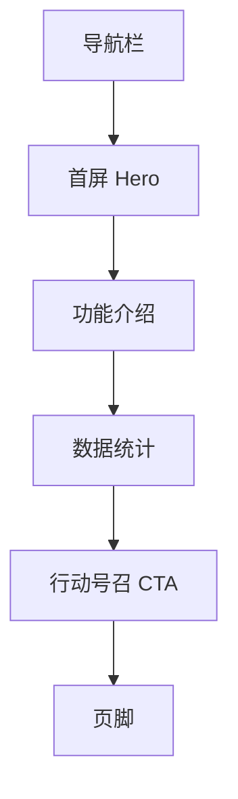
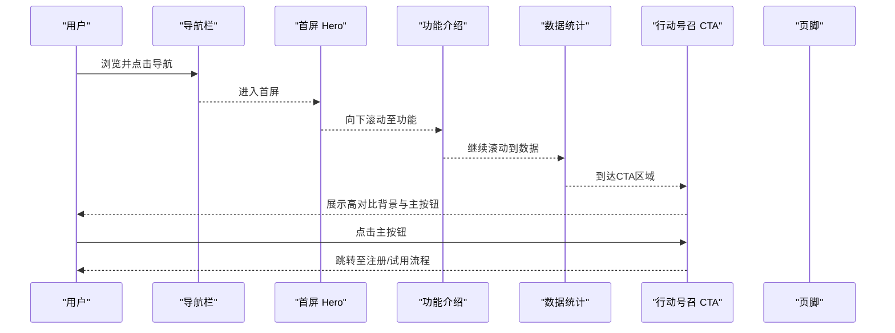
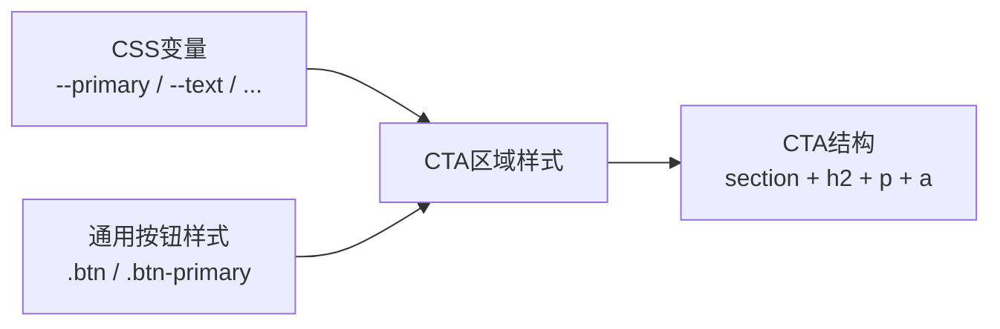

# 行动号召区域

<cite>
**本文引用的文件**
- [index.html](file://index.html)
</cite>

## 目录
1. [简介](#简介)
2. [项目结构](#项目结构)
3. [核心组件](#核心组件)
4. [架构总览](#架构总览)
5. [详细组件分析](#详细组件分析)
6. [依赖关系分析](#依赖关系分析)
7. [性能考量](#性能考量)
8. [故障排查指南](#故障排查指南)
9. [结论](#结论)
10. [附录](#附录)

## 简介
本章节聚焦“行动号召（CTA）区域”的设计与实现，围绕高对比度背景色选择、白色文字可读性保障、标题与描述的排版层次、主要按钮的反色样式与悬停效果、在转化漏斗中的位置策略、A/B测试建议与优化方向、可访问性要求（颜色对比度与键盘导航），以及按业务需求定制文案与按钮的实践进行系统化说明。所有分析与依据均来自当前代码库中的实现。

## 项目结构
该页面为单页落地页，包含导航栏、首屏Hero区、功能介绍、数据统计、行动号召区域与页脚。CTA区域位于数据统计之后、页脚之前，作为转化漏斗的收尾阶段，承担最终促成转化的职责。

图表来源
- [index.html:145-157](file://index.html#L145-L157)
- [index.html:159-169](file://index.html#L159-L169)
- [index.html:171-211](file://index.html#L171-L211)
- [index.html:213-235](file://index.html#L213-L235)
- [index.html:237-244](file://index.html#L237-L244)
- [index.html:246-283](file://index.html#L246-L283)

章节来源
- [index.html:145-283](file://index.html#L145-L283)

## 核心组件
- CTA容器：使用主色调背景，形成强视觉焦点，承载标题、描述与主按钮。
- 标题与描述：采用层级化排版，标题强调关键信息，描述提供动机与低门槛承诺。
- 主按钮：反色样式（浅色背景+品牌色文字），具备悬停反馈，引导用户完成注册/试用。
- 全局样式变量：通过CSS变量统一色彩与圆角等设计令牌，确保一致性。

章节来源
- [index.html:10-19](file://index.html#L10-L19)
- [index.html:100-109](file://index.html#L100-L109)
- [index.html:237-244](file://index.html#L237-L244)

## 架构总览
CTA区域在整体页面中处于转化漏斗末端，承接前序内容建立的价值感知与信任背书，以高对比度背景与明确按钮促使最终转化。其样式与交互由全局样式与局部样式共同决定。

图表来源
- [index.html:145-157](file://index.html#L145-L157)
- [index.html:159-169](file://index.html#L159-L169)
- [index.html:171-211](file://index.html#L171-L211)
- [index.html:213-235](file://index.html#L213-L235)
- [index.html:237-244](file://index.html#L237-L244)

## 详细组件分析

### 高对比度背景色的选择原则与实现
- 背景色选择：CTA区域使用品牌主色作为背景，形成强烈视觉对比，突出区域重要性。
- 文本颜色：区域内文本使用纯白，保证在深色背景上的可读性与对比度。
- 设计令牌：通过CSS变量统一管理主色，便于主题切换与一致性维护。

章节来源
- [index.html:10-19](file://index.html#L10-L19)
- [index.html:100-109](file://index.html#L100-L109)

### 白色文字在深色背景上的可读性保证
- 文本颜色：CTA区域文本设置为纯白，提升与深色背景的对比度。
- 透明度处理：描述文本使用轻微透明度，既保持可读又区分层级。
- 字号与行高：标题与描述采用合适的字号与行高，确保在不同屏幕尺寸下的阅读体验。

章节来源
- [index.html:100-109](file://index.html#L100-L109)
- [index.html:237-244](file://index.html#L237-L244)

### 标题与描述文本的排版层次与信息架构
- 标题层级：标题字号较大且加粗，用于传达核心诉求。
- 描述层级：描述字号略小，颜色稍浅，提供补充信息与动机。
- 间距与对齐：通过内边距与居中对齐营造呼吸感与聚焦感。

章节来源
- [index.html:100-109](file://index.html#L100-L109)
- [index.html:237-244](file://index.html#L237-L244)

### 主要按钮的反色样式与悬停效果
- 反色样式：在品牌背景上，主按钮采用浅色背景与品牌色文字，形成反色对比，强化可点击性。
- 悬停反馈：悬停时背景色变浅，提供微妙的交互提示。
- 通用按钮基类：复用基础按钮样式，保证全站一致性与可维护性。

章节来源
- [index.html:41-49](file://index.html#L41-L49)
- [index.html:100-109](file://index.html#L100-L109)
- [index.html:237-244](file://index.html#L237-L244)

### CTA在转化漏斗中的作用与位置策略
- 位置策略：置于数据统计之后、页脚之前，利用前文建立的价值与信任，推动最终转化。
- 作用定位：作为页面末端的“临门一脚”，集中呈现注册/试用的低门槛承诺与行动入口。
- 视觉聚焦：通过全宽背景与居中布局，将注意力集中在标题、描述与按钮上。

章节来源
- [index.html:213-235](file://index.html#L213-L235)
- [index.html:237-244](file://index.html#L237-L244)

### A/B测试建议与优化方向
- 文案A/B：测试不同标题与描述对转化率的影响，例如强调“免费试用”或“无需信用卡”。
- 按钮文案A/B：对比“立即开始”、“免费试用”、“免费注册”等文案的点击率。
- 布局A/B：尝试在CTA区域增加次要按钮（如“了解更多”），观察是否分流主目标。
- 视觉A/B：调整背景色深浅、按钮大小与间距，评估对点击行为的影响。
- 指标定义：以点击率、注册转化率、跳出率为核心指标，结合热力图与滚动深度分析。

[本节为概念性建议，不直接引用具体代码]

### 可访问性考虑
- 颜色对比度：确保白色文本与品牌背景满足WCAG对比度要求；必要时降低描述文本透明度或调整背景色。
- 键盘导航：按钮为原生链接元素，天然支持Tab键导航与Enter激活；避免使用无语义容器包裹导致焦点丢失。
- 语义标签：使用section与h2/p等语义化标签，提升屏幕阅读器识别度。
- 焦点可见性：保留浏览器默认焦点样式或自定义清晰焦点指示，确保键盘操作可见。

章节来源
- [index.html:100-109](file://index.html#L100-L109)
- [index.html:237-244](file://index.html#L237-L244)

### 根据业务需求定制文案与行动按钮
- 文案定制：替换标题与描述以匹配产品价值主张，例如强调行业解决方案、限时优惠或成功案例。
- 按钮定制：根据业务目标设置不同的链接地址（注册、试用、预约演示），并可添加UTM参数追踪来源。
- 多语言支持：通过外层容器与文案占位，便于后续接入国际化方案。
- 合规提示：如需展示隐私条款或免责声明，可在描述下方添加辅助链接。

章节来源
- [index.html:237-244](file://index.html#L237-L244)

## 依赖关系分析
CTA区域的样式依赖于全局CSS变量与通用按钮样式，结构上与其他区块相互独立但遵循统一的容器与栅格规范。

图表来源
- [index.html:10-19](file://index.html#L10-L19)
- [index.html:41-49](file://index.html#L41-L49)
- [index.html:100-109](file://index.html#L100-L109)
- [index.html:237-244](file://index.html#L237-L244)

章节来源
- [index.html:10-19](file://index.html#L10-L19)
- [index.html:41-49](file://index.html#L41-L49)
- [index.html:100-109](file://index.html#L100-L109)
- [index.html:237-244](file://index.html#L237-L244)

## 性能考量
- 样式开销：CTA区域仅使用少量内联样式与CSS变量，渲染成本低。
- 资源加载：无外部字体或图片依赖，减少网络请求。
- 响应式适配：通过媒体查询调整字号与布局，确保移动端体验。

章节来源
- [index.html:135-140](file://index.html#L135-L140)
- [index.html:100-109](file://index.html#L100-L109)

## 故障排查指南
- 背景色对比不足：若品牌主色过浅，可能导致白色文本对比度不达标。可加深背景色或降低描述文本透明度。
- 按钮不可见：检查按钮是否被其他层遮挡或z-index冲突；确认按钮颜色与背景对比足够。
- 移动端显示异常：检查媒体查询是否生效，确保字号与间距在小屏下可读。
- 链接未生效：确认按钮href指向正确的注册/试用页面，避免空链接。

章节来源
- [index.html:100-109](file://index.html#L100-L109)
- [index.html:135-140](file://index.html#L135-L140)
- [index.html:237-244](file://index.html#L237-L244)

## 结论
该CTA区域通过高对比度背景、清晰的排版层次与反色主按钮，有效聚焦用户注意力并促进转化。其在页面结构中处于转化漏斗末端，配合前序内容建立的价值与信任，最大化转化概率。建议持续进行A/B测试与可访问性优化，并根据业务需求灵活定制文案与按钮，以实现更高的注册与试用转化率。

## 附录
- 相关样式片段路径：
  - CSS变量定义：[index.html:10-19](file://index.html#L10-L19)
  - 通用按钮样式：[index.html:41-49](file://index.html#L41-L49)
  - CTA区域样式：[index.html:100-109](file://index.html#L100-L109)
  - CTA区域结构：[index.html:237-244](file://index.html#L237-L244)