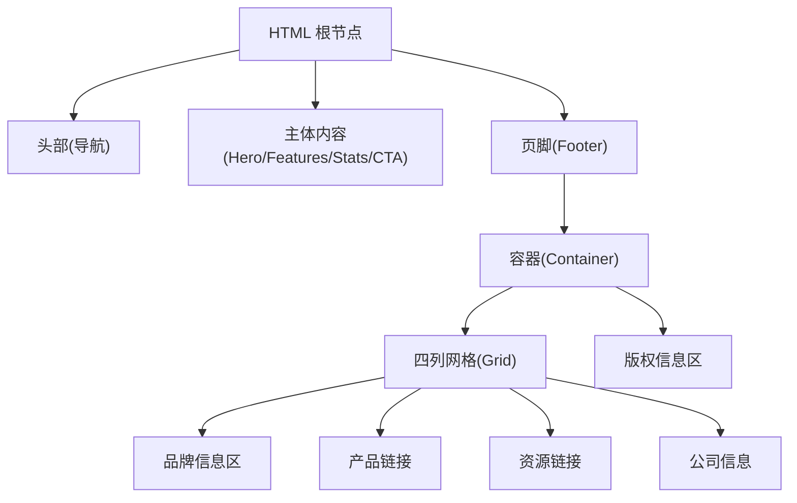
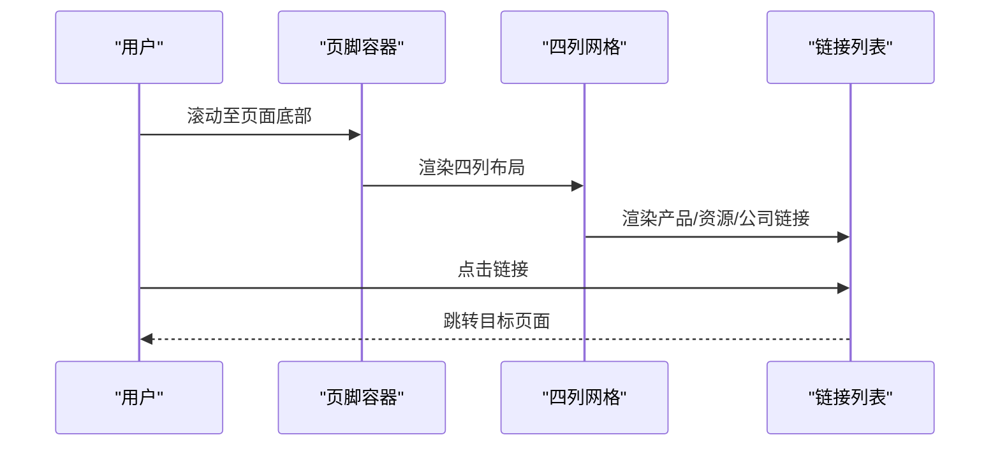
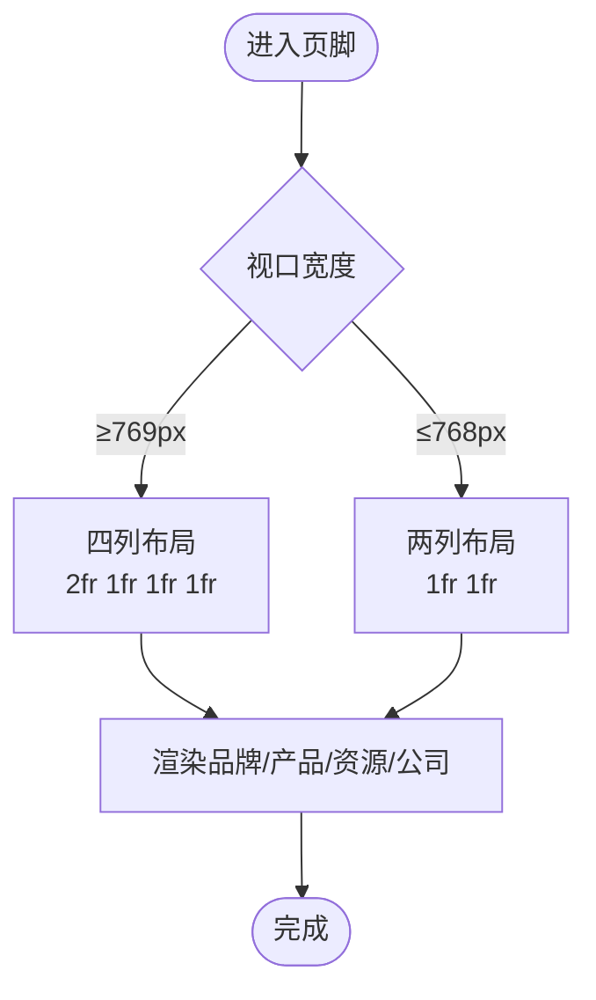
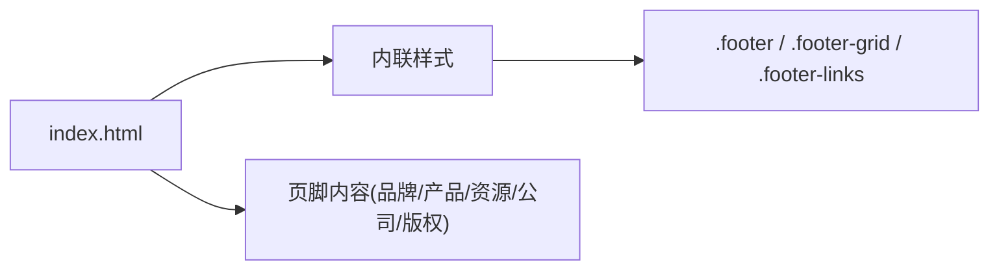

# 页脚组件

<cite>
**本文引用的文件**
- [index.html](file://index.html)
</cite>

## 目录
1. [简介](#简介)
2. [项目结构](#项目结构)
3. [核心组件](#核心组件)
4. [架构总览](#架构总览)
5. [详细组件分析](#详细组件分析)
6. [依赖关系分析](#依赖关系分析)
7. [性能考量](#性能考量)
8. [故障排查指南](#故障排查指南)
9. [结论](#结论)
10. [附录](#附录)

## 简介
本文件为“页脚组件”的完整技术文档，聚焦四列网格布局的 CSS Grid 实现与响应式适配、品牌信息区/产品链接/资源链接/公司信息的结构化组织、链接列表样式与悬停效果、版权信息区的分隔线与底部对齐、深色主题设计与文字对比度、新增或修改链接的步骤、SEO 优化建议与内部链接策略、多语言维护方式，以及页脚在网站信息架构中的作用与用户体验要点。

## 项目结构
该仓库包含一个单页 HTML 文件，内联样式定义了导航、主内容区与页脚等模块。页脚位于页面底部，采用容器包裹的四列网格布局，并在移动端进行两列自适应。

图表来源
- [index.html:111-133](file://index.html#L111-L133)
- [index.html:246-283](file://index.html#L246-L283)

章节来源
- [index.html:1-287](file://index.html#L1-L287)

## 核心组件
- 容器：统一最大宽度与左右内边距，保证内容居中与可读性。
- 四列网格：使用 CSS Grid 定义 2fr 1fr 1fr 1fr 的比例，使品牌信息区更宽，其余三列等宽；在移动端通过媒体查询切换为两列。
- 链接列表：无列表样式、纵向排列、行间距统一，便于阅读与点击。
- 版权信息区：顶部边框分隔、居中对齐、字号略小，形成视觉层次。

章节来源
- [index.html:111-133](file://index.html#L111-L133)
- [index.html:246-283](file://index.html#L246-L283)

## 架构总览
页脚作为站点底部信息枢纽，承担品牌展示、导航分流、合规声明与可访问性提示等职责。其结构清晰、语义化良好，便于搜索引擎抓取与用户快速定位关键信息。

图表来源
- [index.html:111-133](file://index.html#L111-L133)
- [index.html:246-283](file://index.html#L246-L283)

## 详细组件分析

### 四列网格布局与响应式适配
- 桌面端：grid-template-columns 设置为 2fr 1fr 1fr 1fr，品牌信息区占两份宽度，其他三列各一份，形成主次分明的信息密度。
- 移动端：在较小视口下切换为两列 grid-template-columns: 1fr 1fr，提升在小屏上的可读性与触控体验。
- 间距：gap 提供列间间距，避免内容拥挤。
- 容器：配合 max-width 与水平 padding，确保在不同屏幕下的留白一致。

图表来源
- [index.html:111-133](file://index.html#L111-L133)
- [index.html:135-141](file://index.html#L135-L141)

章节来源
- [index.html:111-133](file://index.html#L111-L133)
- [index.html:135-141](file://index.html#L135-L141)

### 品牌信息区、产品链接、资源链接与公司信息的结构化组织
- 品牌信息区：标题与描述文案用于传递品牌定位与价值主张。
- 产品链接：集中展示产品相关入口（如功能介绍、定价方案、更新日志）。
- 资源链接：面向开发者与用户的帮助与社区入口（如帮助文档、API、论坛）。
- 公司信息：企业对外窗口（如关于我们、招聘、联系方式）。
- 语义化：使用标题标签区分区块，链接以列表形式组织，利于无障碍与 SEO。

章节来源
- [index.html:246-283](file://index.html#L246-L283)

### 链接列表样式规范与悬停效果
- 列表样式：移除默认列表样式，纵向排列，行间距统一，提升可读性。
- 颜色与过渡：默认浅灰文本色，悬停时变为亮色，配合平滑过渡增强交互反馈。
- 字体大小：与正文相近，保持层级一致。

章节来源
- [index.html:111-133](file://index.html#L111-L133)
- [index.html:246-283](file://index.html#L246-L283)

### 版权信息区的分隔线与底部对齐
- 分隔线：顶部边框将版权信息与上方链接区域区分开，形成清晰的视觉边界。
- 对齐：文本居中对齐，字号略小，营造轻量化的收尾感。
- 背景与前景：深色背景搭配浅色文本，确保对比度满足可读性要求。

章节来源
- [index.html:111-133](file://index.html#L111-L133)
- [index.html:246-283](file://index.html#L246-L283)

### 深色主题的设计实现与文字颜色对比度
- 背景色：使用较深的中性色作为页脚背景，营造沉稳氛围。
- 文本色：默认文本为浅灰，悬停时变亮，保证足够的对比度与可访问性。
- 一致性：与全站设计系统保持一致的变量体系，便于后续主题扩展。

章节来源
- [index.html:111-133](file://index.html#L111-L133)

### 添加新链接或修改链接结构的步骤
- 新增链接：在对应区块的列表中增加新的列表项与链接，保持与其他链接一致的样式类名。
- 调整结构：如需新增分类，复制现有区块并修改标题与链接集合；必要时调整网格比例或换行策略。
- 响应式检查：在移动端断点下验证两列布局是否仍满足可读性与触控需求。
- 可访问性：确保每个链接有明确的文本含义，必要时补充 aria-label。

章节来源
- [index.html:246-283](file://index.html#L246-L283)

### SEO 优化建议与内部链接策略
- 语义化结构：使用合适的标题层级与列表元素，有助于搜索引擎理解内容结构。
- 链接质量：优先指向高价值页面（如核心产品、帮助中心），减少死链。
- 锚点与命名：链接文本应简洁明确，避免通用词如“点击这里”。
- 内部链接：构建从页脚到关键页面的稳定内链网络，提升权重流转与发现性。
- 元信息：结合页面标题与描述，强化页脚外链的目标语义。

章节来源
- [index.html:246-283](file://index.html#L246-L283)

### 多语言版本的页脚内容维护
- 内容分离：将文案抽离为独立的多语言资源文件，运行时根据语言环境注入。
- 结构复用：保持 HTML 结构与类名不变，仅替换文案，降低回归风险。
- 动态加载：通过脚本按需加载对应语言包，避免首屏冗余。
- 测试覆盖：对每种语言的排版与换行进行测试，确保在小屏下显示正常。

章节来源
- [index.html:246-283](file://index.html#L246-L283)

### 页脚在网站信息架构中的作用与用户体验考虑
- 导航分流：提供产品、资源、公司等关键入口，帮助用户快速找到所需信息。
- 品牌信任：品牌信息与版权声明增强可信度与专业感。
- 可访问性：合理的对比度、键盘可达性与语义化结构，提升包容性体验。
- 一致性：与全站风格统一，降低认知成本。

章节来源
- [index.html:111-133](file://index.html#L111-L133)
- [index.html:246-283](file://index.html#L246-L283)

## 依赖关系分析
页脚样式与结构完全由当前 HTML 文件内联样式驱动，不依赖外部样式表或脚本，耦合度低、易于维护。

图表来源
- [index.html:111-133](file://index.html#L111-L133)
- [index.html:246-283](file://index.html#L246-L283)

章节来源
- [index.html:111-133](file://index.html#L111-L133)
- [index.html:246-283](file://index.html#L246-L283)

## 性能考量
- 零外部依赖：无额外 CSS/JS 请求，减少网络开销。
- 简单布局：Grid 与 Flex 组合计算成本低，渲染高效。
- 可维护性：样式集中在单一文件，便于审查与优化。

[本节为通用指导，无需特定文件引用]

## 故障排查指南
- 链接不可见：检查链接颜色与背景对比度，确保在深色背景下可读。
- 移动端错位：确认媒体查询生效，必要时调整 gap 或字号。
- 悬停无反馈：检查 hover 样式是否被覆盖，确保过渡属性正确。
- 版权信息偏移：确认分隔线与对齐方式未被其他样式干扰。

章节来源
- [index.html:111-133](file://index.html#L111-L133)
- [index.html:246-283](file://index.html#L246-L283)

## 结论
该页脚组件以简洁的 CSS Grid 实现四列布局，具备优秀的响应式表现与良好的可访问性。通过清晰的结构划分、统一的样式规范与深色主题设计，既满足品牌展示与信息导航需求，又兼顾 SEO 与多语言扩展。建议在后续迭代中持续优化链接质量、完善多语言内容与无障碍细节，以提升整体用户体验。

[本节为总结性内容，无需特定文件引用]

## 附录
- 快速参考
  - 四列网格：适用于桌面端，品牌信息区更宽。
  - 两列网格：适用于移动端，提升可读性与触控体验。
  - 链接悬停：颜色变化与平滑过渡，增强交互反馈。
  - 版权信息：分隔线与居中对齐，形成清晰收尾。

[本节为补充说明，无需特定文件引用]