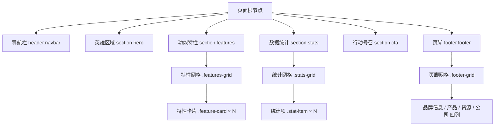
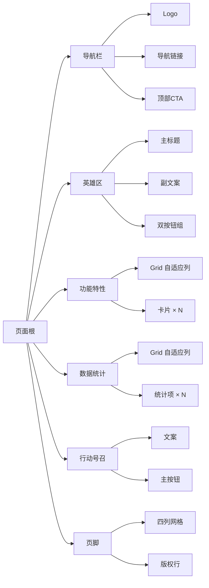
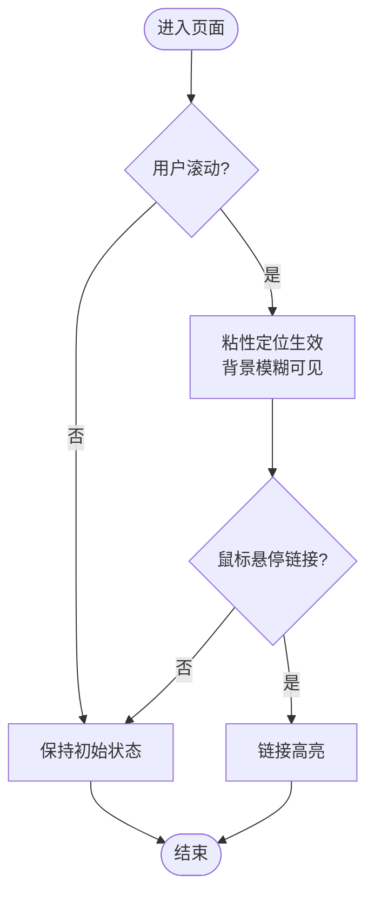
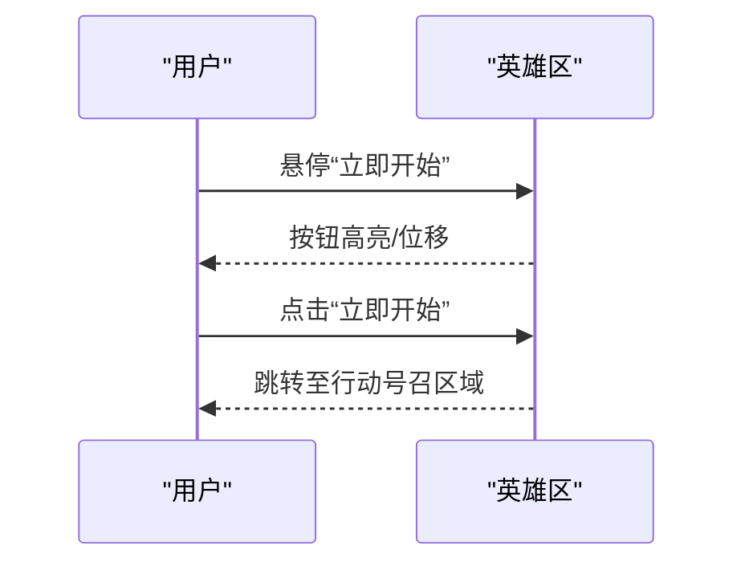
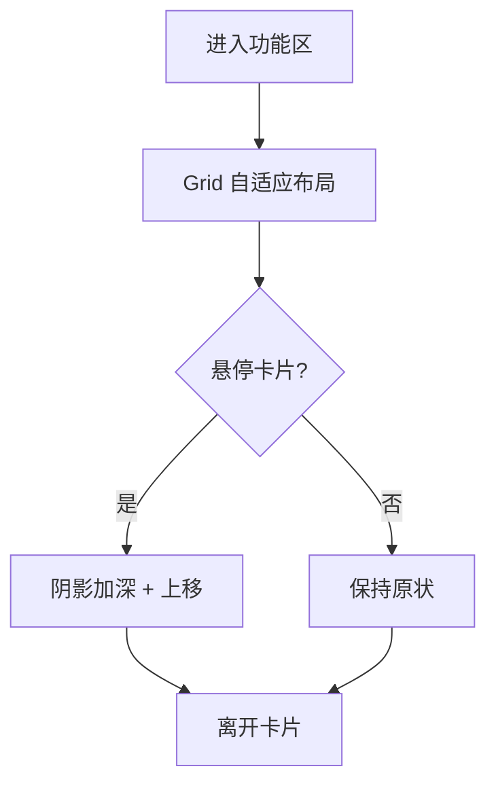
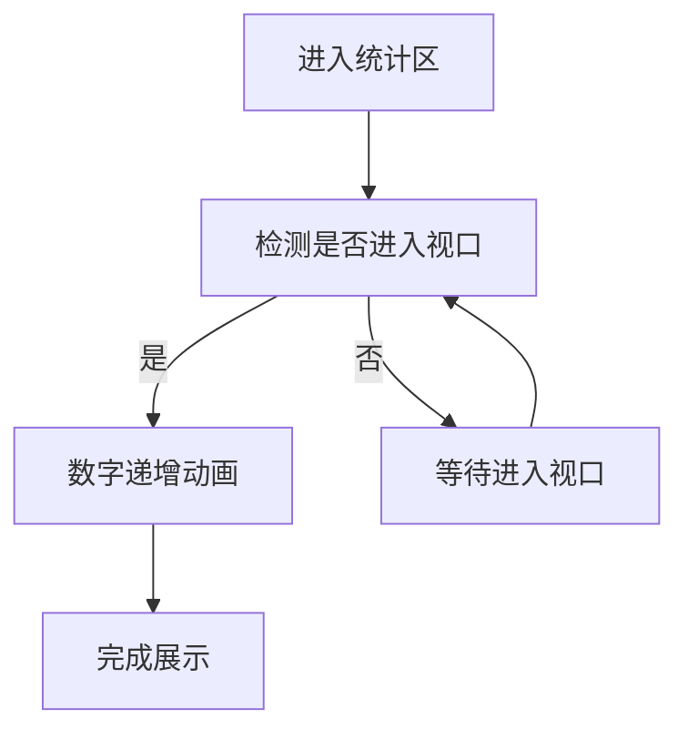
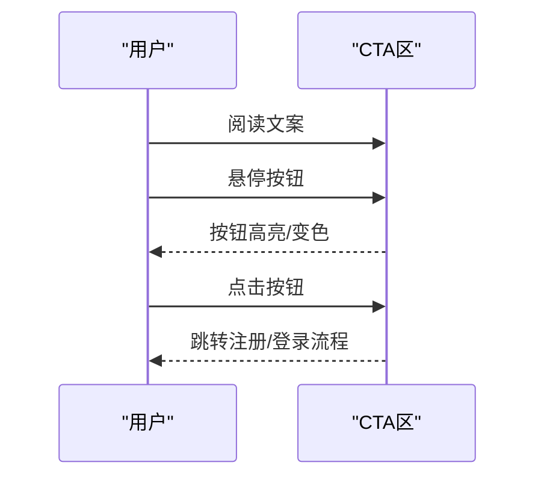
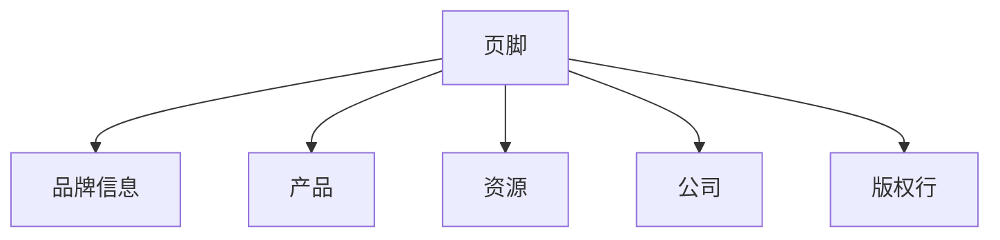

# 页面组件详解

<cite>
**本文引用的文件**
- [index.html](file://index.html)
</cite>

## 目录
1. [简介](#简介)
2. [项目结构](#项目结构)
3. [核心组件](#核心组件)
4. [架构总览](#架构总览)
5. [详细组件分析](#详细组件分析)
6. [依赖关系分析](#依赖关系分析)
7. [性能考量](#性能考量)
8. [故障排查指南](#故障排查指南)
9. [结论](#结论)
10. [附录](#附录)

## 简介
本文件面向前端开发者与产品/设计人员，系统化说明落地页各UI组件的结构、样式与交互行为。重点覆盖：导航栏的固定定位与毛玻璃效果、英雄区域的视觉层次与行动号召按钮、功能特性网格的CSS Grid布局与卡片悬停、数据统计区域的响应式网格与数字展示、行动号召区域的高对比度设计与转化优化、以及页脚的多列布局与信息架构。每个组件均提供HTML结构要点、CSS样式要点与可实现的自定义方法建议，便于二次开发与扩展。

## 项目结构
该页面采用单文件内联样式组织，所有结构与样式集中在一个HTML文件中，便于快速原型与演示。整体结构自上而下包含：
- 导航栏（header.navbar）
- 英雄区域（section.hero）
- 功能特性（section.features + .features-grid + .feature-card）
- 数据统计（section.stats + .stats-grid + .stat-item）
- 行动号召（section.cta）
- 页脚（footer.footer + .footer-grid）

图表来源
- [index.html:145-157](file://index.html#L145-L157)
- [index.html:159-169](file://index.html#L159-L169)
- [index.html:171-211](file://index.html#L171-L211)
- [index.html:213-235](file://index.html#L213-L235)
- [index.html:237-244](file://index.html#L237-L244)
- [index.html:246-283](file://index.html#L246-L283)

章节来源
- [index.html:1-287](file://index.html#L1-L287)

## 核心组件
- 导航栏：使用粘性定位与背景模糊实现“吸顶”和毛玻璃效果；桌面端显示导航链接与CTA按钮，移动端隐藏导航菜单以简化界面。
- 英雄区域：大标题+副文案+双按钮组合，强调主次行动；渐变背景营造视觉层次。
- 功能特性：基于CSS Grid的自适应多列布局，卡片带图标、标题与描述，悬停时提升阴影并轻微上移。
- 数据统计：响应式网格展示关键指标，数字加粗高亮，标签居中排版。
- 行动号召：主色背景+白色文字的高对比度区块，突出CTA按钮，引导注册转化。
- 页脚：四列网格信息架构，底部版权行；链接悬停高亮。

章节来源
- [index.html:26-50](file://index.html#L26-L50)
- [index.html:51-69](file://index.html#L51-L69)
- [index.html:62-88](file://index.html#L62-L88)
- [index.html:89-98](file://index.html#L89-L98)
- [index.html:99-110](file://index.html#L99-L110)
- [index.html:111-133](file://index.html#L111-L133)
- [index.html:135-141](file://index.html#L135-L141)

## 架构总览
页面采用“区块化”的语义化结构，通过容器类统一最大宽度与边距，保证在不同屏幕下的可读性。样式方面使用CSS变量管理主题色、文本色、背景与圆角等，便于全局替换与一致性维护。

图表来源
- [index.html:145-157](file://index.html#L145-L157)
- [index.html:159-169](file://index.html#L159-L169)
- [index.html:171-211](file://index.html#L171-L211)
- [index.html:213-235](file://index.html#L213-L235)
- [index.html:237-244](file://index.html#L237-L244)
- [index.html:246-283](file://index.html#L246-L283)

## 详细组件分析

### 导航栏（Navbar）
- HTML结构要点
  - 外层容器使用容器类限制最大宽度与左右留白。
  - 左侧为品牌Logo链接，中间为导航链接列表，右侧为“免费试用”按钮。
- CSS样式要点
  - 使用粘性定位使导航在滚动时固定在视口顶部。
  - 半透明背景配合背景模糊实现毛玻璃效果，并添加底部边框增强层级。
  - 导航链接默认浅色，悬停变为主题色；按钮具备基础过渡动效。
- 响应式行为
  - 在小屏下隐藏导航链接，避免拥挤，保留Logo与CTA按钮。
- 自定义方法建议
  - 增加移动端汉堡菜单：在小屏显示触发器，点击展开/收起导航列表。
  - 滚动监听：当滚动超过一定距离时切换为不透明背景或缩小高度。
  - 键盘可达性与焦点样式：为链接与按钮补充:focus-visible样式。

图表来源
- [index.html:26-50](file://index.html#L26-L50)
- [index.html:135-141](file://index.html#L135-L141)
- [index.html:145-157](file://index.html#L145-L157)

章节来源
- [index.html:26-50](file://index.html#L26-L50)
- [index.html:135-141](file://index.html#L135-L141)
- [index.html:145-157](file://index.html#L145-L157)

### 英雄区域（Hero）
- HTML结构要点
  - 标题使用强调词（主题色），副文案控制最大宽度确保可读性。
  - 操作区并列两个按钮：主要行动与次要了解。
- CSS样式要点
  - 垂直内边距较大，形成呼吸感；背景使用线性渐变营造柔和层次。
  - 按钮具备悬停过渡，提升微交互反馈。
- 交互效果
  - 按钮悬停时轻微上移与颜色变化，强化可点击性。
- 自定义方法建议
  - 添加入场动画：标题与按钮依次淡入上移。
  - 根据内容长度动态调整字号与行高，确保不同语言下的可读性。

图表来源
- [index.html:51-69](file://index.html#L51-L69)
- [index.html:159-169](file://index.html#L159-L169)

章节来源
- [index.html:51-69](file://index.html#L51-L69)
- [index.html:159-169](file://index.html#L159-L169)

### 功能特性网格（Features）
- HTML结构要点
  - 区块标题与描述居中；网格容器承载多个特性卡片。
  - 每张卡片包含图标、标题与描述。
- CSS样式要点
  - 使用CSS Grid的auto-fit与minmax实现自适应列数，无需媒体查询即可适配不同屏幕。
  - 卡片带边框与圆角，悬停时提升阴影并轻微上移，增强立体感。
- 交互效果
  - 卡片悬停反馈明确，提升探索意愿。
- 自定义方法建议
  - 为图标添加背景色块与尺寸约束，确保对齐一致。
  - 增加懒加载或IntersectionObserver触发的入场动画。
  - 支持键盘导航与焦点样式，提升无障碍体验。

图表来源
- [index.html:62-88](file://index.html#L62-L88)
- [index.html:171-211](file://index.html#L171-L211)

章节来源
- [index.html:62-88](file://index.html#L62-L88)
- [index.html:171-211](file://index.html#L171-L211)

### 数据统计区域（Stats）
- HTML结构要点
  - 网格容器承载多个统计项，每项包含数值与标签。
- CSS样式要点
  - 同样采用Grid自适应列，保证在不同屏幕下的合理分布。
  - 数值加粗且使用主题色，标签浅灰，形成清晰的数据层级。
- 展示方式
  - 数字与单位分离，便于本地化与格式化（如千分位）。
- 自定义方法建议
  - 数字计数动画：进入视口后从0递增到目标值。
  - 数据源对接：通过API获取真实数据并渲染。
  - 无障碍：为数值添加aria-label说明。

图表来源
- [index.html:89-98](file://index.html#L89-L98)
- [index.html:213-235](file://index.html#L213-L235)

章节来源
- [index.html:89-98](file://index.html#L89-L98)
- [index.html:213-235](file://index.html#L213-L235)

### 行动号召区域（CTA）
- HTML结构要点
  - 标题与简短文案居中，单个主按钮突出。
- CSS样式要点
  - 使用主题色背景与白色文字，形成高对比度，提高注意力与转化率。
  - 按钮反色处理（白底主题色字），悬停时轻微变灰，保持对比度。
- 转化优化
  - 文案强调“免费试用”“无需绑定信用卡”，降低决策门槛。
  - 单一主按钮减少选择干扰，聚焦转化路径。
- 自定义方法建议
  - 添加表单弹窗或跳转注册页。
  - 埋点统计点击率与转化率。
  - 针对深色模式提供替代配色方案。

图表来源
- [index.html:99-110](file://index.html#L99-L110)
- [index.html:237-244](file://index.html#L237-L244)

章节来源
- [index.html:99-110](file://index.html#L99-L110)
- [index.html:237-244](file://index.html#L237-L244)

### 页脚（Footer）
- HTML结构要点
  - 四列网格：品牌介绍、产品、资源、公司；底部版权行。
- CSS样式要点
  - 深色背景搭配浅色文字，链接悬停高亮；网格间距充足，信息层级清晰。
- 信息架构
  - 将导航分散到页脚，便于用户查找帮助、文档与公司信息。
- 自定义方法建议
  - 增加社交媒体图标与外链。
  - 添加订阅邮箱输入框与提交按钮。
  - 多语言切换与地区选择。

图表来源
- [index.html:111-133](file://index.html#L111-L133)
- [index.html:246-283](file://index.html#L246-L283)

章节来源
- [index.html:111-133](file://index.html#L111-L133)
- [index.html:246-283](file://index.html#L246-L283)

## 依赖关系分析
- 样式依赖
  - 全局CSS变量用于主题色、文本色、背景与圆角，贯穿导航、按钮、卡片与统计等组件，确保视觉一致性。
  - 容器类统一页面最大宽度与内边距，保证内容在不同屏幕下的可读性。
- 布局依赖
  - 多处使用CSS Grid的auto-fit与minmax实现响应式布局，减少对媒体查询的依赖。
- 交互依赖
  - 按钮与卡片的过渡动效依赖统一的transition属性，保持一致的微交互节奏。
- 潜在耦合点
  - 若修改主题变量，需验证全站对比度是否符合无障碍标准。
  - 若调整容器宽度，需检查小屏下的换行与间距。

章节来源
- [index.html:8-24](file://index.html#L8-L24)
- [index.html:26-50](file://index.html#L26-L50)
- [index.html:62-88](file://index.html#L62-L88)
- [index.html:89-98](file://index.html#L89-L98)
- [index.html:99-110](file://index.html#L99-L110)
- [index.html:111-133](file://index.html#L111-L133)
- [index.html:135-141](file://index.html#L135-L141)

## 性能考量
- 渲染性能
  - 使用CSS变量与Grid减少复杂计算与重排；避免过多JavaScript动画。
- 可访问性
  - 确保颜色对比度满足WCAG标准；为交互元素提供清晰的焦点样式。
- 移动端体验
  - 在小屏隐藏导航链接，减少不必要的DOM与事件；必要时用轻量脚本实现菜单切换。
- 可扩展性
  - 将样式抽离为独立文件便于缓存与维护；将重复样式抽象为通用类。

[本节为通用指导，不直接分析具体文件]

## 故障排查指南
- 导航栏未吸顶
  - 检查父级是否设置了transform或will-change导致脱离正常流；确认position设置为sticky。
- 毛玻璃效果不明显
  - 确认浏览器支持backdrop-filter；在不支持的环境下提供降级背景。
- 网格布局错乱
  - 检查容器宽度与gap设置；确认子项最小宽度与auto-fit策略匹配。
- 按钮无悬停反馈
  - 检查是否被其他层遮挡；确认z-index与pointer-events设置正确。
- 小屏导航不可见
  - 确认媒体查询断点与display:none规则；如需菜单，补充展开逻辑。

章节来源
- [index.html:26-50](file://index.html#L26-L50)
- [index.html:62-88](file://index.html#L62-L88)
- [index.html:135-141](file://index.html#L135-L141)

## 结论
该落地页通过简洁的HTML结构与内联CSS实现了完整的组件体系：导航栏的粘性定位与毛玻璃、英雄区的视觉层次与CTA、功能特性的自适应网格与悬停反馈、数据统计的响应式展示、高对比度的行动号召区域以及信息清晰的页脚。整体代码易于理解与扩展，适合快速迭代与二次开发。建议在后续版本中引入模块化样式、动画与无障碍优化，以提升性能与用户体验。

[本节为总结性内容，不直接分析具体文件]

## 附录
- 常用CSS变量
  - 主题色、深主题色、文本色、浅色文本、背景、交替背景、边框色、圆角半径。
- 关键布局技巧
  - 使用容器类统一内容宽度；使用Grid的auto-fit与minmax实现响应式列；使用flexbox对齐与间距。
- 推荐扩展
  - 加入暗色模式切换；为数字统计添加计数动画；为导航增加移动端菜单；为CTA添加表单弹窗与埋点。

[本节为补充信息，不直接分析具体文件]