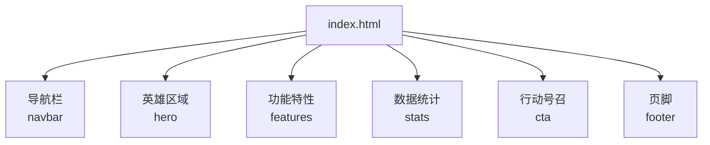
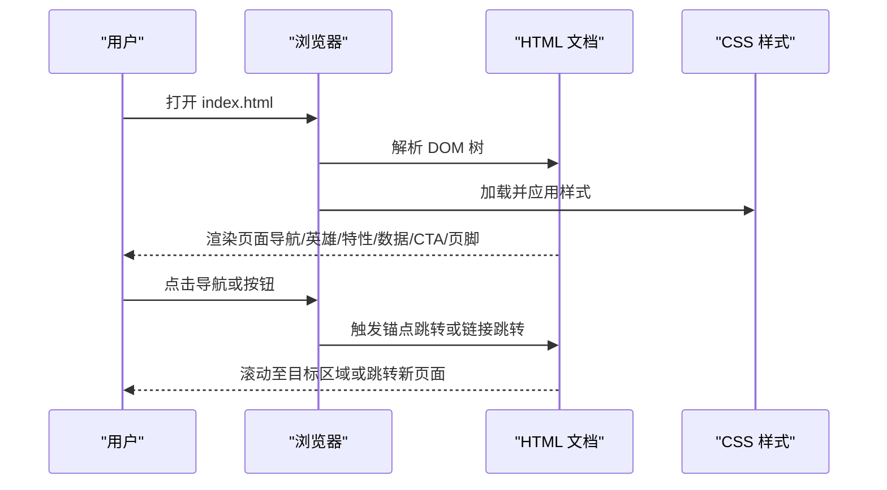
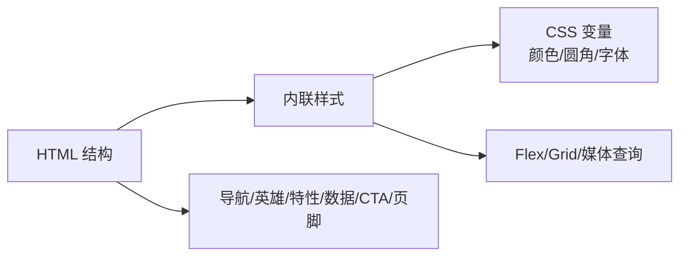

# 项目概述

<cite>
**本文引用的文件**
- [index.html](file://index.html)
</cite>

## 目录
1. [简介](#简介)
2. [项目结构](#项目结构)
3. [核心组件](#核心组件)
4. [架构总览](#架构总览)
5. [详细组件分析](#详细组件分析)
6. [依赖关系分析](#依赖关系分析)
7. [性能考量](#性能考量)
8. [故障排查指南](#故障排查指南)
9. [结论](#结论)
10. [附录](#附录)

## 简介
本项目是一个单文件 HTML5 品牌落地页，目标是通过简洁、现代的页面设计展示品牌价值与核心能力，并引导用户完成注册或试用等转化行为。页面采用纯 HTML5 + CSS3 实现，不依赖任何第三方框架或脚本，具备响应式布局与现代视觉风格，适合快速部署与二次定制。

业务目标：
- 清晰传达品牌定位与核心价值主张
- 通过功能特性与数据背书增强信任感
- 以明确的行动号召（CTA）驱动用户注册/试用

技术目标：
- 零依赖、易维护、可移植
- 使用现代 CSS 变量、网格与弹性布局提升可维护性与扩展性
- 提供移动端友好的响应式体验

## 项目结构
项目为单文件结构，所有样式与内容集中在一个 HTML 文件中，便于快速迭代与部署。

图表来源
- [index.html:145-157](file://index.html#L145-L157)
- [index.html:159-169](file://index.html#L159-L169)
- [index.html:171-211](file://index.html#L171-L211)
- [index.html:213-235](file://index.html#L213-L235)
- [index.html:237-244](file://index.html#L237-L244)
- [index.html:246-283](file://index.html#L246-L283)

章节来源
- [index.html:1-287](file://index.html#L1-L287)

## 核心组件
- 导航栏：固定顶部、毛玻璃背景、品牌标识与快捷入口，支持平滑滚动到对应区块。
- 英雄区域：主标题、副标题与双按钮（立即开始/了解更多），强调价值主张与行动导向。
- 功能特性：卡片网格展示六大能力点，配合图标与悬停动效，突出产品优势。
- 数据统计：关键指标展示（用户规模、可用性、覆盖地区、企业客户数），增强可信度。
- 行动号召：高对比色块与明确文案，推动用户注册或试用。
- 页脚：品牌介绍、产品/资源/公司链接与版权信息，完善站点导航与信息闭环。

章节来源
- [index.html:26-50](file://index.html#L26-L50)
- [index.html:51-69](file://index.html#L51-L69)
- [index.html:62-88](file://index.html#L62-L88)
- [index.html:89-98](file://index.html#L89-L98)
- [index.html:99-110](file://index.html#L99-L110)
- [index.html:111-133](file://index.html#L111-L133)

## 架构总览
该落地页采用“单文件 + 内联样式”的轻量架构，遵循语义化 HTML 结构与模块化 CSS 组织方式。整体流程如下：

图表来源
- [index.html:145-157](file://index.html#L145-L157)
- [index.html:159-169](file://index.html#L159-L169)
- [index.html:171-211](file://index.html#L171-L211)
- [index.html:213-235](file://index.html#L213-L235)
- [index.html:237-244](file://index.html#L237-L244)
- [index.html:246-283](file://index.html#L246-L283)

## 详细组件分析

### 导航栏（Navbar）
- 固定定位与毛玻璃效果，确保在滚动时始终可见且层次清晰。
- 包含品牌 Logo、导航链接与“免费试用”按钮，便于快速触达转化入口。
- 使用 CSS 变量统一色彩与圆角，便于主题切换与一致性维护。

章节来源
- [index.html:26-50](file://index.html#L26-L50)
- [index.html:145-157](file://index.html#L145-L157)

### 英雄区域（Hero）
- 大标题与副标题突出核心价值，双按钮分别承担“立即开始”和“了解更多”的转化路径。
- 渐变背景与居中对齐营造聚焦感，适配移动端字号调整。

章节来源
- [index.html:51-69](file://index.html#L51-L69)
- [index.html:159-169](file://index.html#L159-L169)

### 功能特性（Features）
- 使用 CSS Grid 自适应列宽，自动换行与间距控制，保证在不同屏幕下的可读性。
- 卡片悬停阴影与位移反馈，提升交互质感；图标与文案组合传递清晰的能力点。

章节来源
- [index.html:62-88](file://index.html#L62-L88)
- [index.html:171-211](file://index.html#L171-L211)

### 数据统计（Stats）
- 四宫格布局展示关键指标，数字强调与说明文字形成信息层级。
- 用于建立信任与社会证明，辅助后续转化。

章节来源
- [index.html:89-98](file://index.html#L89-L98)
- [index.html:213-235](file://index.html#L213-L235)

### 行动号召（CTA）
- 高对比背景与居中排版，文案强调“免费试用”、“无需绑定信用卡”，降低决策门槛。
- 按钮样式与导航区保持一致，强化品牌识别。

章节来源
- [index.html:99-110](file://index.html#L99-L110)
- [index.html:237-244](file://index.html#L237-L244)

### 页脚（Footer）
- 多列网格布局，包含品牌介绍、产品/资源/公司链接与版权信息。
- 深色背景与浅色文字形成对比，提升可读性与专业感。

章节来源
- [index.html:111-133](file://index.html#L111-L133)
- [index.html:246-283](file://index.html#L246-L283)

## 依赖关系分析
- 无外部依赖：未引入任何 JavaScript 库或第三方 CSS 框架，减少加载体积与维护成本。
- 内部样式组织：通过 CSS 变量集中管理颜色、圆角等主题属性，便于全局替换与主题扩展。
- 语义化标签：使用 header、section、footer 等语义元素，有利于可访问性与 SEO。

图表来源
- [index.html:10-24](file://index.html#L10-L24)
- [index.html:26-133](file://index.html#L26-L133)
- [index.html:145-283](file://index.html#L145-L283)

章节来源
- [index.html:10-24](file://index.html#L10-L24)
- [index.html:26-133](file://index.html#L26-L133)

## 性能考量
- 单文件结构：减少 HTTP 请求，利于缓存与快速首屏加载。
- 无脚本依赖：避免阻塞渲染与额外下载开销。
- 现代 CSS：使用 CSS 变量、Grid/Flexbox、backdrop-filter 等特性，兼顾性能与表现力。
- 响应式优化：通过媒体查询在小屏下隐藏次要导航，简化布局，提升移动端体验。

[本节为通用性能建议，不直接分析具体代码]

## 故障排查指南
- 导航无法跳转到对应区块：检查锚点 ID 与链接是否一致（如 #features、#stats、#cta）。
- 移动端导航不可见：当前设计在小屏下隐藏了导航菜单，如需保留需添加展开逻辑或调整媒体查询。
- 样式错乱或主题不一致：确认 CSS 变量定义未被覆盖，检查容器宽度与栅格间距是否被其他样式影响。
- 按钮点击无效：确认链接指向有效地址或目标区块存在。

章节来源
- [index.html:145-157](file://index.html#L145-L157)
- [index.html:171-211](file://index.html#L171-L211)
- [index.html:213-235](file://index.html#L213-L235)
- [index.html:237-244](file://index.html#L237-L244)

## 结论
该项目以极简的单文件架构实现了完整的品牌落地页，涵盖导航、英雄区、功能特性、数据统计与行动号召等关键模块。通过纯 HTML5 + CSS3 的现代实践，既保证了良好的可维护性与可移植性，也提供了清晰的转化路径与品牌表达。对于初学者而言，它是理解前端基础与响应式设计的优秀范例；对于有经验的开发者，它提供了易于扩展的主题系统与布局基线，便于快速定制与集成。

[本节为总结性内容，不直接分析具体代码]

## 附录

### 快速开始
- 本地预览：将 index.html 用浏览器直接打开即可预览完整页面。
- 自定义主题：修改 CSS 变量中的颜色与圆角值，即可快速更换主题风格。
- 内容替换：更新标题、文案与链接，以匹配实际品牌与业务需求。
- 部署上线：可直接将 index.html 部署到任意静态托管服务。

章节来源
- [index.html:10-24](file://index.html#L10-L24)
- [index.html:145-283](file://index.html#L145-L283)

### 主要功能一览
- 导航栏：品牌标识、快捷导航、CTA 按钮
- 英雄区域：主标题、副标题、双按钮
- 功能特性：六项能力卡片，网格自适应
- 数据统计：四项关键指标，社会证明
- 行动号召：高对比背景与明确文案
- 页脚：品牌介绍、链接与版权

章节来源
- [index.html:145-283](file://index.html#L145-L283)